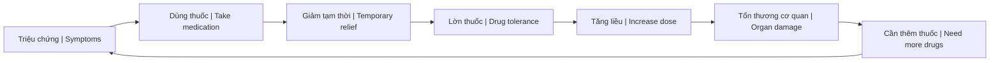
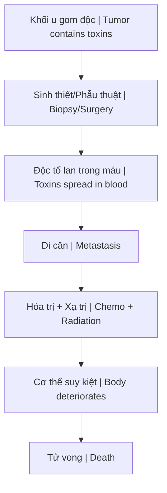
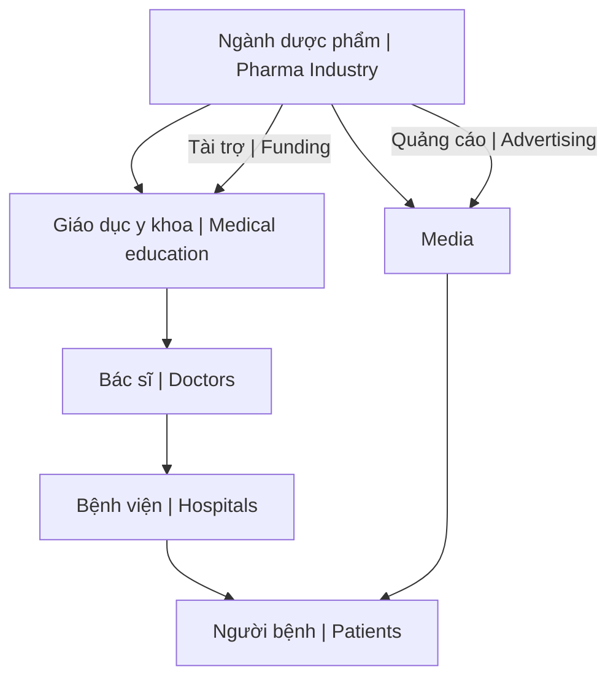

---
title: "Kính Chiếu Yêu — Nhìn Thấu Tây Y"
aliases: ["They Live Medicine", "Seeing Through Western Medicine"]
date: 2026-04-25
tags: [health]
status: refined
---
# Kính Chiếu Yêu — Nhìn Thấu Tây Y

Mọi thứ ban đầu dường như rất bình thường, cuộc sống cứ cuốn con người vào vòng xoáy của vật chất, danh vọng và bệnh tật. Cho đến một ngày, vô tình "nhặt được chiếc kính chiếu yêu", khi đeo vào, ta lại nhìn thấy một thế giới hoàn toàn khác.

*Everything seems normal at first — life pulls people into the vortex of materialism, fame, and illness. Until one day, you accidentally "pick up the demon-revealing glasses," and when you put them on, you see a completely different world.*

> Ẩn dụ "kính chiếu yêu" lấy cảm hứng từ phim *They Live* (1988) — cặp kính giúp nhìn thấy bộ mặt thật của hệ thống.
>
> *The "demon-revealing glasses" metaphor is inspired by the film They Live (1988) — glasses that reveal the true face of the system.*

---

## Vòng Lặp Lệ Thuộc / The Dependency Loop

Đây là pattern chung của hầu hết các loại thuốc Tây y: điều trị triệu chứng, không giải quyết nguyên nhân gốc, tạo vòng lặp phụ thuộc.

*This is the common pattern of most Western medications: treat symptoms, never address root causes, create dependency loops.*

---

## 1. Ghép Tạng — Ngành Công Nghiệp Tội Ác

**The Organ Transplant Industry — A Criminal Enterprise**

Trước đây ta từng nghĩ đó là đỉnh cao của y học, là biểu hiện của đạo đức và nhân văn. Nhưng khi nhìn qua "kính chiếu yêu", nó lại hiện ra như một ngành công nghiệp đầy tội ác.

*We once thought this was the pinnacle of medicine, a manifestation of ethics and humanity. But through the "demon-revealing glasses," it appears as a criminal industry.*

### Sự Thật Đen Tối / Dark Truths

| Vấn đề / Issue | Thực tế / Reality |
|----------------|-------------------|
| **Nguồn tạng** | Phải đến từ người còn sống (heart-beating donor) / Must come from living person |
| **"Chết não"** | Khái niệm ra đời để hợp thức hóa việc lấy tạng / Concept created to legalize organ harvesting |
| **Bắt cóc** | Đường dây buôn người để lấy nội tạng / Human trafficking for organs |
| **Bảo hành** | Không tồn tại / Non-existent |

### Tỷ Lệ Sống / Survival Rates

- **Ghép thận**: 5–10 năm (do còn cơ chế bù trừ) / 5-10 years (compensatory mechanism exists)
- **Ghép tim, gan nguyên lá, phổi**: Rất ngắn, nhiều tử vong trên bàn mổ / Very short, many die on operating table

### Cuộc Sống Sau Ghép / Life After Transplant

- Tái khám hàng tháng / Monthly check-ups
- 5–7 triệu tiền thuốc mỗi tháng / 5-7 million VND monthly medication
- Thuốc chống đào thải → bào mòn hệ miễn dịch / Anti-rejection drugs → destroy immune system
- Cuộc sống như địa ngục trần gian / Living hell

---

## 2. Ung Thư — Điều Trị Hay Giết Người?

**Cancer Treatment — Healing or Killing?**

Dòng máu đầy axit và độc tố chạy đến đâu sinh u đến đó. Khối u là nơi gom độc tố — cơ thể đang tự bảo vệ, không phải tự tấn công.

*Acidic, toxic blood creates tumors wherever it flows. The tumor is where toxins are collected — the body is protecting itself, not attacking itself.*

> Góc nhìn này align với [[Thuyết Vi Sinh Nội Sinh]] — terrain quyết định sức khỏe, không phải "kẻ xâm nhập".
>
> *This view aligns with [[Thuyết Vi Sinh Nội Sinh|Terrain Theory]] — the terrain determines health, not "invaders."*

### Khi Nào Khối U Nguy Hiểm? / When Is a Tumor Dangerous?

Chỉ khi phát triển lớn, chèn ép mạch máu hoặc đường thở.

*Only when it grows large enough to compress blood vessels or airways.*

### Điều Trị = Di Căn / Treatment = Metastasis

- **Sinh thiết/phẫu thuật**: Phá vỡ nơi gom độc → lan rộng / Breaks toxin container → spread
- **Hóa trị**: Giết tế bào khỏe mạnh lẫn ung thư / Kills healthy cells along with cancer
- **Xạ trị**: Đốt cháy mô, gây tổn thương vĩnh viễn / Burns tissue, permanent damage
- **Rụng tóc**: Không còn được nuôi dưỡng / No longer nourished

**Nguyên nhân tử vong thực sự là phương pháp điều trị, nhưng lại bị quy về ung thư.**

*The real cause of death is the treatment, but it's blamed on cancer.*

---

## 3. Tiểu Đường — Lừa Dối Về Đường

**Diabetes — The Sugar Deception**

### Vòng Lặp Thuốc / The Drug Loop

| Giai đoạn / Phase | Diễn biến / What happens |
|-------------------|-------------------------|
| **Dùng thuốc** | Đường huyết giảm nhanh / Blood sugar drops quickly |
| **Sau đó** | Đường huyết tăng cao trở lại / Blood sugar rebounds higher |
| **Tác dụng phụ** | Tổn thương tụy, gan, thận / Damages pancreas, liver, kidneys |

### Bản Chất Thực Sự / The Real Nature

Bệnh tiểu đường là "máu bẩn" — chứa nhiều ure, axit uric, kim loại nặng và các chất độc khác. Glucose chỉ là một dạng năng lượng chưa được đưa vào tế bào.

*Diabetes is "dirty blood" — containing urea, uric acid, heavy metals, and other toxins. Glucose is just energy that hasn't been delivered to cells.*

### Tội Ác Của Việc Kiêng Đường / The Crime of Sugar Restriction

Việc quy toàn bộ nguyên nhân do "đường" là một sai lầm nghiêm trọng:

*Blaming everything on "sugar" is a serious mistake:*

- Kiêng cả đường tự nhiên (trái cây, mật ong) / Avoiding natural sugars (fruit, honey)
- Thiếu hụt năng lượng cho tế bào / Energy deficiency for cells
- Dễ gây hoại tử chi / Leads to limb necrosis
- Suy yếu não bộ (não cần glucose) / Brain deterioration (brain needs glucose)

**Đây là một tội ác vô cùng lớn.**

*This is an enormous crime.*

---

## 4. Các Bệnh Khác — Cùng Pattern

**Other Diseases — Same Pattern**

### Viêm Gan B / Hepatitis B

- **Thuốc**: Tenofovir và tương tự / Tenofovir and similar
- **Nghịch lý**: Có thể tăng men gan, gây suy chức năng gan / May increase liver enzymes, cause liver dysfunction
- **Kết quả**: Thuốc điều trị lại gây tổn hại cơ quan cần bảo vệ / Treatment drug damages the organ it should protect

### Táo Bón / Constipation

- **Thuốc nhuận tràng**: Kích thích nhu động ruột / Stimulates bowel movement
- **Ban đầu**: Hiệu quả nhanh / Quick results
- **Lâu dài**: Ruột phụ thuộc, mất phản xạ tự nhiên / Bowel becomes dependent, loses natural reflex
- **Khi ngưng**: Táo bón nặng hơn / Worse constipation

### Suy Thận / Kidney Failure

- **Thuốc làm chậm tiến triển**: Gây mất nước, tụt huyết áp, rối loạn điện giải / Causes dehydration, low BP, electrolyte imbalance
- **Nghịch lý**: Tăng creatinine = chức năng thận suy thêm / Increased creatinine = worse kidney function

### Mất Ngủ / Insomnia

- **Thuốc an thần**: Giảm hoạt động thần kinh / Reduces neural activity
- **Vòng lặp**: Lờn thuốc → tăng liều → lệ thuộc / Tolerance → increase dose → dependence
- **Khi ngưng**: Mất ngủ nặng hơn / Worse insomnia

### Cao Huyết Áp / Hypertension

- **Thuốc**: Giãn mạch, giảm nhịp tim / Vasodilation, lower heart rate
- **Lâu dài**: Máu lưu thông kém, huyết áp dao động / Poor circulation, fluctuating BP
- **Hệ lụy**: Tăng nguy cơ tai biến / Increased stroke risk

### Mỡ Máu / High Cholesterol

- **Statin**: Ức chế tổng hợp cholesterol trong gan / Inhibits cholesterol synthesis in liver
- **Tác dụng phụ**: Đau cơ, yếu cơ, tiêu cơ, tăng men gan / Muscle pain, weakness, rhabdomyolysis, elevated liver enzymes
- **Vấn đề trí nhớ**: Cholesterol cần cho não / Memory issues — brain needs cholesterol
- **Khi ngưng**: Mỡ máu tăng trở lại / Cholesterol rebounds

> **Cholesterol không phải kẻ thù** — nó là cơ chế sửa chữa của cơ thể, như xe cứu hỏa tại hiện trường hỏa hoạn.
>
> *Cholesterol is not the enemy — it's the body's repair mechanism, like firefighters at a fire scene.*

---

## Kết Luận / Conclusion

**Đây không phải là y học. Đây là một tội ác có tổ chức trên thế giới, được cài cắm nhằm làm suy yếu thể chất và tâm thức con người.**

*This is not medicine. This is organized crime on a global scale, deliberately planted to weaken the physical body and consciousness of humanity.*

Hệ thống này được thiết kế để:
- Điều trị triệu chứng, không bao giờ chữa khỏi / Treat symptoms, never cure
- Tạo khách hàng suốt đời / Create lifelong customers
- Bào mòn sức khỏe và tài chính / Drain health and finances
- Kiểm soát dân số thông qua bệnh tật / Control population through illness

---

## Thay Thế / Alternative

Xem [[Y Tế Tự Nhiên]] để tìm hiểu các phương pháp chữa lành thực sự:

*See [[Y Tế Tự Nhiên]] to learn about real healing methods:*

- [[Thuyết Vi Sinh Nội Sinh]] — Terrain > Germ
- [[Cơ Chế Tự Bảo Vệ Của Cơ Thể]] — Trust your body
- [[Thuốc Hóa Dầu]] — Origin of modern medicine
- [[Công Thức Chữa Lành Tự Nhiên]] — Natural healing protocols

---

## Related

- [[Thuốc Hóa Dầu]] — Nguồn gốc y học hiện đại
- [[Thuyết Vi Sinh Nội Sinh]] — Terrain Theory
- [[Cơ Chế Tự Bảo Vệ Của Cơ Thể]] — Body's self-defense
- [[Y Tế Tự Nhiên]] — Alternative approaches
- [[Ma Trận]] — The bigger system
- [[Elite]] — Who benefits
