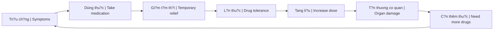
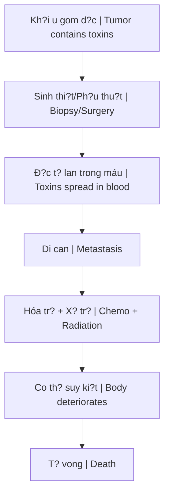
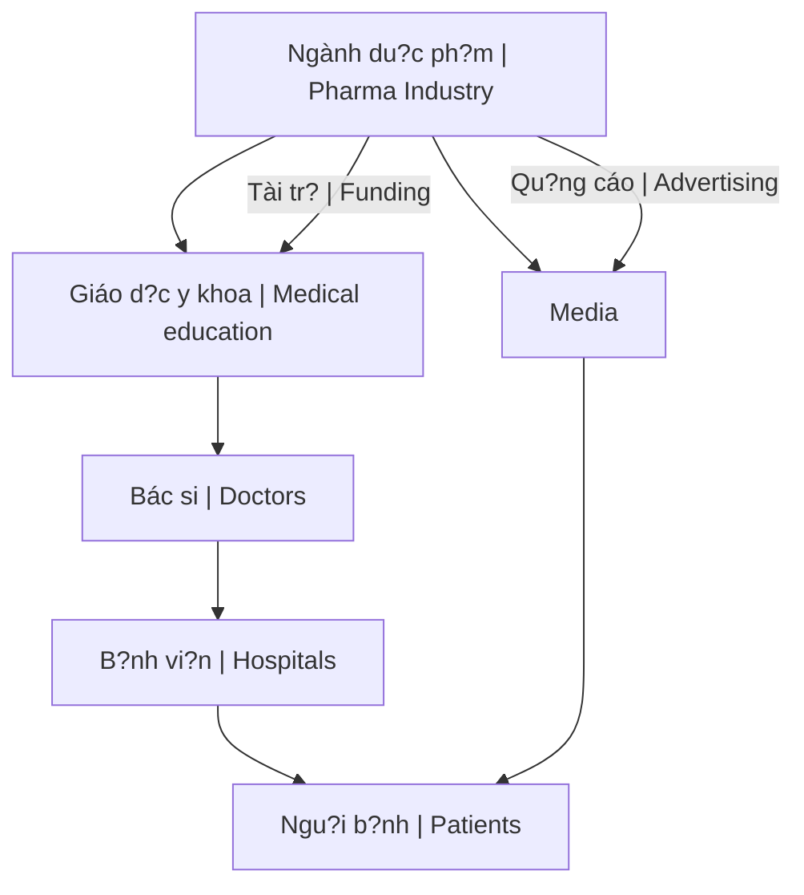

# Kính Chi?u Yêu - Nhìn Th?u Tây Y

M?i th? ban d?u du?ng nhu r?t bình thu?ng, cu?c s?ng c? cu?n con ngu?i vào vòng xoáy c?a v?t ch?t, danh v?ng và b?nh t?t. Cho d?n m?t ngày, vô tình "nh?t du?c chi?c kính chi?u yêu", khi deo vào, ta l?i nhìn th?y m?t th? gi?i hoàn toàn khác.

*Everything seems normal at first - life pulls people into the vortex of materialism, fame, and illness. Until one day, you accidentally "pick up the demon-revealing glasses," and when you put them on, you see a completely different world.*

> ?n d? "kính chi?u yêu" l?y c?m h?ng t? phim *They Live* (1988) - c?p kính giúp nhìn th?y b? m?t th?t c?a h? th?ng.
>
> *The "demon-revealing glasses" metaphor is inspired by the film They Live (1988) - glasses that reveal the true face of the system.*

---

## Vòng L?p L? Thu?c / The Dependency Loop

Ðây là pattern chung c?a h?u h?t các lo?i thu?c Tây y: di?u tr? tri?u ch?ng, không gi?i quy?t nguyên nhân g?c, t?o vòng l?p ph? thu?c.

*This is the common pattern of most Western medications: treat symptoms, never address root causes, create dependency loops.*

---

## 1. Ghép T?ng - Ngành Công Nghi?p T?i Ác

**The Organ Transplant Industry - A Criminal Enterprise**

Tru?c dây ta t?ng nghi dó là d?nh cao c?a y h?c, là bi?u hi?n c?a d?o d?c và nhân van. Nhung khi nhìn qua "kính chi?u yêu", nó l?i hi?n ra nhu m?t ngành công nghi?p d?y t?i ác.

*We once thought this was the pinnacle of medicine, a manifestation of ethics and humanity. But through the "demon-revealing glasses," it appears as a criminal industry.*

### S? Th?t Ðen T?i / Dark Truths

| V?n d? / Issue | Th?c t? / Reality |
|----------------|-------------------|
| **Ngu?n t?ng** | Ph?i d?n t? ngu?i còn s?ng (heart-beating donor) / Must come from living person |
| **"Ch?t não"** | Khái ni?m ra d?i d? h?p th?c hóa vi?c l?y t?ng / Concept created to legalize organ harvesting |
| **B?t cóc** | Ðu?ng dây buôn ngu?i d? l?y n?i t?ng / Human trafficking for organs |
| **B?o hành** | Không t?n t?i / Non-existent |

### T? L? S?ng / Survival Rates

- **Ghép th?n**: 5–10 nam (do còn co ch? bù tr?) / 5-10 years (compensatory mechanism exists)
- **Ghép tim, gan nguyên lá, ph?i**: R?t ng?n, nhi?u t? vong trên bàn m? / Very short, many die on operating table

### Cu?c S?ng Sau Ghép / Life After Transplant

- Tái khám hàng tháng / Monthly check-ups
- 5–7 tri?u ti?n thu?c m?i tháng / 5-7 million VND monthly medication
- Thu?c ch?ng dào th?i ? bào mòn h? mi?n d?ch / Anti-rejection drugs ? destroy immune system
- Cu?c s?ng nhu d?a ng?c tr?n gian / Living hell

---

## 2. Ung Thu - Ði?u Tr? Hay Gi?t Ngu?i?

**Cancer Treatment - Healing or Killing?**

Dòng máu d?y axit và d?c t? ch?y d?n dâu sinh u d?n dó. Kh?i u là noi gom d?c t? - co th? dang t? b?o v?, không ph?i t? t?n công.

*Acidic, toxic blood creates tumors wherever it flows. The tumor is where toxins are collected - the body is protecting itself, not attacking itself.*

> Góc nhìn này align v?i [[Thuy?t Vi Sinh N?i Sinh]] - terrain quy?t d?nh s?c kh?e, không ph?i "k? xâm nh?p".
>
> *This view aligns with [[Thuy?t Vi Sinh N?i Sinh|Terrain Theory]] - the terrain determines health, not "invaders."*

### Khi Nào Kh?i U Nguy Hi?m? / When Is a Tumor Dangerous?

Ch? khi phát tri?n l?n, chèn ép m?ch máu ho?c du?ng th?.

*Only when it grows large enough to compress blood vessels or airways.*

### Ði?u Tr? = Di Can / Treatment = Metastasis

- **Sinh thi?t/ph?u thu?t**: Phá v? noi gom d?c ? lan r?ng / Breaks toxin container ? spread
- **Hóa tr?**: Gi?t t? bào kh?e m?nh l?n ung thu / Kills healthy cells along with cancer
- **X? tr?**: Ð?t cháy mô, gây t?n thuong vinh vi?n / Burns tissue, permanent damage
- **R?ng tóc**: Không còn du?c nuôi du?ng / No longer nourished

**Nguyên nhân t? vong th?c s? là phuong pháp di?u tr?, nhung l?i b? quy v? ung thu.**

*The real cause of death is the treatment, but it's blamed on cancer.*

---

## 3. Ti?u Ðu?ng - L?a D?i V? Ðu?ng

**Diabetes - The Sugar Deception**

### Vòng L?p Thu?c / The Drug Loop

| Giai do?n / Phase | Di?n bi?n / What happens |
|-------------------|-------------------------|
| **Dùng thu?c** | Ðu?ng huy?t gi?m nhanh / Blood sugar drops quickly |
| **Sau dó** | Ðu?ng huy?t tang cao tr? l?i / Blood sugar rebounds higher |
| **Tác d?ng ph?** | T?n thuong t?y, gan, th?n / Damages pancreas, liver, kidneys |

### B?n Ch?t Th?c S? / The Real Nature

B?nh ti?u du?ng là "máu b?n" - ch?a nhi?u ure, axit uric, kim lo?i n?ng và các ch?t d?c khác. Glucose ch? là m?t d?ng nang lu?ng chua du?c dua vào t? bào.

*Diabetes is "dirty blood" - containing urea, uric acid, heavy metals, and other toxins. Glucose is just energy that hasn't been delivered to cells.*

### T?i Ác C?a Vi?c Kiêng Ðu?ng / The Crime of Sugar Restriction

Vi?c quy toàn b? nguyên nhân do "du?ng" là m?t sai l?m nghiêm tr?ng:

*Blaming everything on "sugar" is a serious mistake:*

- Kiêng c? du?ng t? nhiên (trái cây, m?t ong) / Avoiding natural sugars (fruit, honey)
- Thi?u h?t nang lu?ng cho t? bào / Energy deficiency for cells
- D? gây ho?i t? chi / Leads to limb necrosis
- Suy y?u não b? (não c?n glucose) / Brain deterioration (brain needs glucose)

**Ðây là m?t t?i ác vô cùng l?n.**

*This is an enormous crime.*

---

## 4. Các B?nh Khác - Cùng Pattern

**Other Diseases - Same Pattern**

### Viêm Gan B / Hepatitis B

- **Thu?c**: Tenofovir và tuong t? / Tenofovir and similar
- **Ngh?ch lý**: Có th? tang men gan, gây suy ch?c nang gan / May increase liver enzymes, cause liver dysfunction
- **K?t qu?**: Thu?c di?u tr? l?i gây t?n h?i co quan c?n b?o v? / Treatment drug damages the organ it should protect

### Táo Bón / Constipation

- **Thu?c nhu?n tràng**: Kích thích nhu d?ng ru?t / Stimulates bowel movement
- **Ban d?u**: Hi?u qu? nhanh / Quick results
- **Lâu dài**: Ru?t ph? thu?c, m?t ph?n x? t? nhiên / Bowel becomes dependent, loses natural reflex
- **Khi ngung**: Táo bón n?ng hon / Worse constipation

### Suy Th?n / Kidney Failure

- **Thu?c làm ch?m ti?n tri?n**: Gây m?t nu?c, t?t huy?t áp, r?i lo?n di?n gi?i / Causes dehydration, low BP, electrolyte imbalance
- **Ngh?ch lý**: Tang creatinine = ch?c nang th?n suy thêm / Increased creatinine = worse kidney function

### M?t Ng? / Insomnia

- **Thu?c an th?n**: Gi?m ho?t d?ng th?n kinh / Reduces neural activity
- **Vòng l?p**: L?n thu?c ? tang li?u ? l? thu?c / Tolerance ? increase dose ? dependence
- **Khi ngung**: M?t ng? n?ng hon / Worse insomnia

### Cao Huy?t Áp / Hypertension

- **Thu?c**: Giãn m?ch, gi?m nh?p tim / Vasodilation, lower heart rate
- **Lâu dài**: Máu luu thông kém, huy?t áp dao d?ng / Poor circulation, fluctuating BP
- **H? l?y**: Tang nguy co tai bi?n / Increased stroke risk

### M? Máu / High Cholesterol

- **Statin**: ?c ch? t?ng h?p cholesterol trong gan / Inhibits cholesterol synthesis in liver
- **Tác d?ng ph?**: Ðau co, y?u co, tiêu co, tang men gan / Muscle pain, weakness, rhabdomyolysis, elevated liver enzymes
- **V?n d? trí nh?**: Cholesterol c?n cho não / Memory issues - brain needs cholesterol
- **Khi ngung**: M? máu tang tr? l?i / Cholesterol rebounds

> **Cholesterol không ph?i k? thù** - nó là co ch? s?a ch?a c?a co th?, nhu xe c?u h?a t?i hi?n tru?ng h?a ho?n.
>
> *Cholesterol is not the enemy - it's the body's repair mechanism, like firefighters at a fire scene.*

---

## K?t Lu?n / Conclusion

**Ðây không ph?i là y h?c. Ðây là m?t t?i ác có t? ch?c trên th? gi?i, du?c cài c?m nh?m làm suy y?u th? ch?t và tâm th?c con ngu?i.**

*This is not medicine. This is organized crime on a global scale, deliberately planted to weaken the physical body and consciousness of humanity.*

H? th?ng này du?c thi?t k? d?:
- Ði?u tr? tri?u ch?ng, không bao gi? ch?a kh?i / Treat symptoms, never cure
- T?o khách hàng su?t d?i / Create lifelong customers
- Bào mòn s?c kh?e và tài chính / Drain health and finances
- Ki?m soát dân s? thông qua b?nh t?t / Control population through illness

---

## Thay Th? / Alternative

Xem [[Y T? T? Nhiên]] d? tìm hi?u các phuong pháp ch?a lành th?c s?:

*See [[Y T? T? Nhiên]] to learn about real healing methods:*

- [[Thuy?t Vi Sinh N?i Sinh]] - Terrain > Germ
- [[Co Ch? T? B?o V? C?a Co Th?]] - Trust your body
- [[Thu?c Hóa D?u]] - Origin of modern medicine
- [[Công Th?c Ch?a Lành T? Nhiên]] - Natural healing protocols

---

## Related

- [[Thu?c Hóa D?u]] - Ngu?n g?c y h?c hi?n d?i
- [[Thuy?t Vi Sinh N?i Sinh]] - Terrain Theory
- [[Co Ch? T? B?o V? C?a Co Th?]] - Body's self-defense
- [[Y T? T? Nhiên]] - Alternative approaches
- [[Ma Tr?n]] - The bigger system
- [[Elite]] - Who benefits
