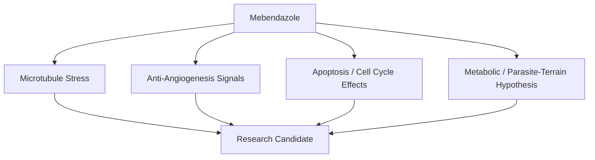

# Mebendazole — Thuốc Tẩy Giun Chống Ung Thư

**Mebendazole (MBZ) là thuốc tẩy giun cũ, rẻ, hết patent, đang được nghiên cứu như một candidate trong drug repurposing chống ung thư. Điểm đáng chú ý không phải “thuốc tẩy giun chữa ung thư” theo kiểu headline, mà là pattern: nhiều thuốc antiparasitic/antimicrobial có tác động lên microtubule, metabolism, angiogenesis, immune signaling và tumor microenvironment.**

*Mebendazole is an old, cheap, off-patent deworming drug being studied as a cancer drug-repurposing candidate. The important point is not the simplistic headline “dewormer cures cancer,” but the pattern: many antiparasitic/antimicrobial drugs affect microtubules, metabolism, angiogenesis, immune signaling, and the tumor microenvironment.*

---

## Medical Caution / Cẩn Trọng

Bài này là knowledge-vault synthesis, không phải medical advice. Mebendazole không được phê duyệt như standard cancer treatment. Không tự ý dùng liều cao/kéo dài, đặc biệt nếu đang hóa trị, xạ trị, dùng thuốc gan, thuốc chống đông, hoặc có bệnh nền. Cần bác sĩ/người có chuyên môn theo dõi nếu dùng ngoài chỉ định.

> Drug repurposing đáng nghiên cứu. Nhưng “rẻ và bị bỏ quên” không đồng nghĩa tự động an toàn hoặc chữa được mọi thứ.

---

## Evidence Discipline / Cách Đọc Bài Này

| Tầng | Cách đọc | Ví dụ |
|---|---|---|
| **Fact / documentable** | MBZ là thuốc anti-helminthic; có cơ chế gắn tubulin; có nghiên cứu in vitro/in vivo | microtubule disruption, anti-angiogenesis signals |
| **Research / emerging** | case reports, small trials, preclinical cancer models | glioblastoma, melanoma, GI cancer studies |
| **Pattern / systems reading** | thuốc off-patent ít incentive quảng bá | drug repurposing vs pharma profit model |
| **Vault synthesis** | parasite/metabolic terrain, antiparasitic-cancer pattern | MBZ, [[Suramin]], terrain theory |

Cách đọc đúng: MBZ là **candidate** trong một terrain/metabolic/repurposing framework, không phải magic bullet.

---

## Claim-Layer Register / Sổ Phân Tầng Claim

| Claim | Tầng đọc đúng | Điều cần đối chiếu |
|---|---|---|
| MBZ là thuốc trị giun nhóm benzimidazole | **Fact / documentable** | drug label / pharmacology reference |
| MBZ ảnh hưởng tubulin, angiogenesis, apoptosis trong cancer models | **Research / preclinical** | PubMed/PMC reviews, cell/animal studies |
| Case reports hoặc small trials cho một số cancer type | **Research / early clinical** | case report, trial registry, protocol details |
| MBZ có thể nằm trong metabolic cancer stack | **Speculative adjunct synthesis** | phải tách khỏi standard-of-care |
| Thuốc off-patent bị thiếu incentive phát triển | **Pattern / systems reading** | patent, trial funding, pharma economics |
| MBZ "chữa ung thư" | **Không được xem là fact trong bài này** | cần RCT/clinical guideline; hiện không được trình bày như cure |

---

## Vault Position / Vị Trí Trong Vault

Trong redpill.wiki, Mebendazole nằm ở giao điểm của:

- [[Ung Thư - Metabolic Protocol]] — cancer như terrain/metabolic problem
- [[Kính Chiếu Yêu - Nhìn Thấu Tây Y]] — medical-industrial incentives
- [[Thuyết Vi Sinh Nội Sinh]] — terrain quyết định biểu hiện bệnh
- [[Suramin]] — antiparasitic/repurposed drug pattern
- [[Ketogenic Diet]] và [[Prolonged Fasting]] — metabolic pressure tools

Nó là một case study tốt cho câu hỏi lớn hơn:

> Có bao nhiêu thuốc cũ, rẻ, hết patent bị bỏ qua không phải vì vô dụng, mà vì chúng không fit profit model?

---

## 1. Mebendazole Là Gì?

Mebendazole là thuốc nhóm benzimidazole, dùng phổ biến để trị giun/ký sinh trùng đường ruột. Nó hoạt động bằng cách can thiệp vào tubulin/microtubule của ký sinh, khiến ký sinh không hấp thụ glucose hiệu quả và chết.

Điều khiến MBZ được chú ý trong cancer research: tế bào ung thư cũng phụ thuộc mạnh vào cytoskeleton, microtubule dynamics, division machinery và metabolic adaptation.

| Tầng | MBZ làm gì? |
|---|---|
| Parasite | phá rối tubulin, làm ký sinh mất năng lượng |
| Cancer research | nghiên cứu tác động lên microtubule, apoptosis, angiogenesis |
| Systems lens | thuốc rẻ/off-patent, ít incentive phát triển thành blockbuster |

---

## 2. Cơ Chế Được Nghiên Cứu

### Microtubule Disruption

Microtubule là cấu trúc quan trọng cho phân chia tế bào. Nhiều thuốc hóa trị nổi tiếng cũng nhắm vào microtubule. MBZ được nghiên cứu vì có thể can thiệp tubulin dynamics ở tế bào ung thư.

### Anti-Angiogenesis

Khối u cần mạch máu để phát triển. Một số nghiên cứu preclinical gợi ý MBZ có thể ảnh hưởng các pathway liên quan tạo mạch như VEGF/VEGFR signaling.

### Apoptosis & Cell Cycle Stress

Một số model cho thấy MBZ có thể kích hoạt apoptosis/cell-cycle arrest ở một số dòng tế bào ung thư.

### Immune / Tumor Microenvironment

Có hướng nghiên cứu xem MBZ ảnh hưởng tumor microenvironment và immune signaling như thế nào, nhưng đây vẫn là vùng cần thêm data.

---

## 3. Research Level: Mạnh Ở Đâu, Yếu Ở Đâu?

| Evidence type | Ý nghĩa | Giới hạn |
|---|---|---|
| In vitro | thấy cơ chế trên cell lines | không tự động translate sang người |
| Animal studies | thấy tín hiệu trong organism | dose/metabolism khác người |
| Case reports | gợi ý đáng chú ý | không chứng minh causality |
| Small trials | bắt đầu kiểm tra safety/efficacy | cần larger trials |
| Anecdotes | tạo hypothesis | dễ bị survivorship bias |

Đây là chỗ cần tỉnh táo: nhiều chất “giết cancer cells in vitro” nhưng không thành therapy hiệu quả ở người. MBZ đáng nghiên cứu vì nhiều signal hội tụ, không phải vì đã được chứng minh như cure.

---

## 4. Parasite Hypothesis / Ký Sinh Và Terrain

Một nhánh đọc trong vault: cancer terrain có thể liên quan parasite/fungal/toxin load ở một số context. Đây là tầng speculative/terrain synthesis, không phải consensus oncology.

Điểm đáng chú ý là pattern:

- MBZ: antiparasitic, cancer research candidate
- [[Suramin]]: antiparasitic, có nhiều hiệu ứng sinh học khác
- Ivermectin/fenbendazole: cũng thường xuất hiện trong drug-repurposing discussions

Có thể đọc theo hai hướng:

| Mainstream-ish reading | Terrain/vault reading |
|---|---|
| MBZ tác động trực tiếp lên cancer cell pathways | MBZ cũng có thể thay đổi parasite/microbiome/toxin terrain |
| Cancer là clonal disease | Cancer là metabolic + terrain collapse |
| Repurposed drug là adjunct candidate | Repurposed drug là dấu hiệu system bỏ qua thuốc rẻ |

Cần giữ cả hai mà không giả vờ tầng speculative là fact.

---

## 5. Parasite Mind Control: Vì Sao Liên Quan?

Ký sinh trùng có thể thao túng hành vi vật chủ trong nhiều loài. Đây là fact sinh học thú vị, nhưng khi extrapolate sang con người phải cẩn trọng.

Ví dụ thường được nhắc:

- **Toxoplasma gondii**: liên quan thay đổi hành vi ở rodents; ở người có correlation với một số trait/risk nhưng không nên nói quá.
- **Ophiocordyceps**: nấm zombie ở kiến.
- **Dicrocoelium dendriticum**: thay đổi hành vi kiến để hoàn tất life cycle.
- **Leucochloridium**: làm ốc sên dễ bị chim ăn.

Trong vault, phần này không nhằm nói “mọi craving là ký sinh điều khiển”. Nó nhằm mở một câu hỏi:

> Nếu vi sinh/ký sinh có thể ảnh hưởng hành vi, vậy health sovereignty không thể chỉ nhìn cơ thể như cái máy cơ học.

---

## 6. Protocol Talk: Nên Rất Cẩn Trọng

Các protocol dân gian/internet thường nhắc MBZ/Fenbendazole theo lịch xoay vòng. Nhưng đây là vùng nguy hiểm nếu copy mù.

Các điểm cần theo dõi nếu có người chuyên môn cân nhắc:

- liver enzymes,
- drug interactions,
- blood counts,
- GI side effects,
- cancer type,
- standard treatment timing,
- dose/duration,
- supplement interactions.

Không nên lấy anecdote của người khác làm đơn thuốc cho mình.

---

## 7. Vì Sao Big Pharma Không Mặn Mà?

Drug repurposing gặp vấn đề incentive:

- thuốc hết patent khó độc quyền,
- trial lớn tốn tiền,
- ROI thấp hơn drug mới,
- không dễ marketing như breakthrough therapy,
- nếu hiệu quả adjunct rẻ, nó có thể đe dọa revenue model.

Điều này không chứng minh MBZ là cure. Nhưng nó giải thích vì sao nhiều candidate rẻ không được đẩy mạnh như thuốc mới có patent.

Đây là classic [[Kính Chiếu Yêu - Nhìn Thấu Tây Y]]: không chỉ hỏi “có hiệu quả không?”, mà hỏi “ai có incentive để tìm câu trả lời?”.

---

## 8. Practical Reading

Nếu đọc bài này để tự học, hãy giữ khung:

1. MBZ là repurposing candidate, không phải miracle cure.
2. Preclinical evidence đáng chú ý nhưng chưa đủ cho certainty.
3. Nếu có cancer, không tự ý thay standard care bằng internet protocol.
4. Metabolic terrain vẫn quan trọng: sleep, food, insulin, inflammation, stress, toxin load.
5. Cần đọc MBZ trong hệ rộng hơn: [[Ung Thư - Metabolic Protocol]], [[Ketogenic Diet]], [[Prolonged Fasting]], [[Y Tế Tự Nhiên]].

---

## Source Register / Nguồn Cần Đối Chiếu

Khi citation pass sâu hơn, ưu tiên:

- PubMed/PMC reviews on mebendazole and cancer drug repurposing.
- Studies on benzimidazoles, tubulin binding, anti-angiogenesis, apoptosis.
- Clinical trial registry entries for MBZ in cancer.
- Case reports: glioblastoma, adrenocortical carcinoma, colon/GI cancers.
- Safety data from standard anti-helminthic use and high-dose contexts.
- Conventional oncology guidelines for each cancer type.

---

## Synthesis

Mebendazole là một node nhỏ nhưng rất giàu pattern. Nó chạm vào cancer metabolism, parasite hypothesis, drug repurposing, pharma incentive và health sovereignty.

Nó không nên được thần thánh hóa. Nhưng cũng không nên bị dismiss chỉ vì nó rẻ, cũ, và không có marketing budget.

> Câu hỏi không phải “MBZ có phải phép màu không?”. Câu hỏi đúng hơn là: hệ thống y tế hiện tại có thật sự được thiết kế để tìm mọi câu trả lời rẻ, cũ và không thể độc quyền không?

---

## Related

- [[Ung Thư - Metabolic Protocol]]
- [[Kính Chiếu Yêu - Nhìn Thấu Tây Y]]
- [[Thuyết Vi Sinh Nội Sinh]]
- [[Suramin]]
- [[Ketogenic Diet]]
- [[Prolonged Fasting]]
- [[MOC - Health Sovereignty]]
