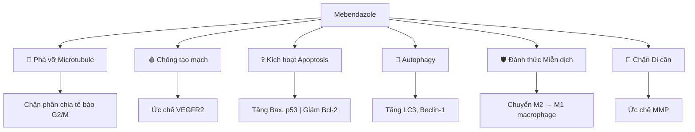

# Mebendazole — Thuốc Tẩy Giun Chống Ung Thư

**Mebendazole (MBZ)** là thuốc tẩy giun OTC (Fugacar, Vermox) được nghiên cứu như liệu pháp chống ung thư. Một ví dụ điển hình của "drug repurposing" — thuốc cũ, công dụng mới.

*Mebendazole (MBZ) is an OTC deworming drug (Fugacar, Vermox) being researched as anti-cancer therapy. A classic example of "drug repurposing" — old drug, new use.*

> Thuốc rẻ tiền, hết hạn bảo hộ sáng chế → Big Pharma không có lợi nhuận để quảng bá → Bị "quên lãng" dù có nghiên cứu peer-reviewed.

---

## Cơ Chế Chống Ung Thư / Anti-Cancer Mechanisms

### 1. Phá Vỡ Microtubule / Microtubule Disruption

| Cơ chế | Mô tả |
|--------|-------|
| **Gắn vào tubulin** | MBZ gắn vào β-tubulin, ngăn polymer hóa |
| **Chặn G2/M** | Tế bào ung thư không thể phân chia |
| **IC50** | 0.1–0.32 μM (rất thấp, hiệu quả cao) |

> Giống cơ chế của vincristine, paclitaxel — nhưng MBZ ít độc hơn nhiều.

### 2. Chống Tạo Mạch / Anti-Angiogenesis

| Target | Effect |
|--------|--------|
| **VEGFR2** | Ức chế receptor tạo mạch máu mới |
| **HIF-1/HIF-2** | Chặn yếu tố thiếu oxy (hypoxia) |
| **Result** | Khối u không được nuôi dưỡng |

### 3. Kích Hoạt Apoptosis / Apoptosis Activation

| Protein | Thay đổi |
|---------|----------|
| **Bax** | ↑ Tăng (pro-apoptotic) |
| **p53** | ↑ Ổn định hóa |
| **Bcl-2** | ↓ Giảm (anti-apoptotic) |
| **XIAP** | ↓ Giảm |
| **Caspase 3/9** | ↑ Kích hoạt |

### 4. Autophagy

- Tăng protein tự thực bào: **LC3**, **Beclin-1**
- Tế bào ung thư "tự ăn" chính mình
- Synergy với apoptosis

### 5. Đánh Thức Hệ Miễn Dịch / Immune Activation

| Từ | Sang | Ý nghĩa |
|----|------|---------|
| **M2 macrophage** | **M1 macrophage** | Từ "thân thiện khối u" → "giết ung thư" |

### 6. Chặn Di Căn / Anti-Metastasis

- Ức chế **MMP** (Matrix Metalloproteinases)
- Ngăn tế bào ung thư xâm lấn mô xung quanh
- Hiệu quả ở nồng độ thấp (0.1 μM)

---

## Nghiên Cứu Khoa Học / Scientific Studies

### In Vitro (Phòng thí nghiệm)

| Cancer Type | IC50 | Source |
|-------------|------|--------|
| **Melanoma** | 0.32 μM | ecancer 2014 |
| **Lung cancer** | < 1 μM | PMC6769799 |
| **Breast cancer** | Active | PMC9954103 |
| **Glioblastoma** | Active | Case reports |

### In Vivo (Trên chuột)

| Model | Dose | Result |
|-------|------|--------|
| **Medulloblastoma** | 50 mg/kg/day | Retarded tumor growth |
| **Glioblastoma** | 50 mg/kg/day | Stopped tumor growth |
| **Melanoma** | High dose | Tumor regression |

### Clinical Trials (Trên người)

| Trial | Phase | Cancer Type | Result |
|-------|-------|-------------|--------|
| **Nature 2021** | Phase 2a | GI cancer | Safe, some efficacy |
| **Case reports** | N/A | Adrenocortical, Colon | Tumor regression reported |

---

## Góc Nhìn Terrain Theory / Alternative Perspective

Theo [[Thuyết Vi Sinh Nội Sinh]] và [[Kính Chiếu Yêu - Nhìn Thấu Tây Y]]:

> *"Khối u là nơi gom độc tố — cơ thể đang tự bảo vệ, không phải tự tấn công."*

### Giả Thuyết Ký Sinh / Parasite Hypothesis

| Mainstream View | Terrain View |
|-----------------|--------------|
| MBZ giết tế bào ung thư | MBZ diệt ký sinh trùng/nấm trong khối u |
| Cancer = genetic mutation | Cancer = toxin accumulation + parasites |
| MBZ = chemotherapy nhẹ | MBZ = detox + antiparasitic |

### Kết Nối Với Suramin

[[Suramin]] cũng là thuốc anti-parasitic với tác dụng phụ là... chống ung thư và reset hệ thần kinh.

Pattern: **Thuốc tẩy giun/ký sinh → Chống ung thư** ?

---

## Liều Dùng & Cảnh Báo / Dosage & Warnings

### Liều Tẩy Giun Thông Thường

| Product | Dose | Frequency |
|---------|------|-----------|
| **Fugacar 500mg** | 500mg | 1 lần duy nhất |
| **Vermox 100mg** | 100mg x 2 | 3 ngày |

### Liều Trong Nghiên Cứu Ung Thư

| Protocol | Dose | Duration |
|----------|------|----------|
| **Joe Tippens** | 222mg/day | 3 days on, 4 off |
| **Clinical trials** | Up to 200mg/kg/day | Continuous |
| **Mouse studies** | 50mg/kg/day | Daily |

### ⚠️ CẢNH BÁO / WARNINGS

| Risk | Description |
|------|-------------|
| **Không FDA approved** | Chưa được phê duyệt cho ung thư |
| **Tương tác thuốc** | Có thể tương tác với chemo |
| **Gan** | Liều cao có thể ảnh hưởng gan |
| **Cần bác sĩ** | Không tự ý dùng liều cao kéo dài |

> **Disclaimer:** Bài viết chỉ mang tính tham khảo. Không thay thế tư vấn y khoa chuyên nghiệp.

---

## Fenbendazole vs Mebendazole

| Property | Fenbendazole | Mebendazole |
|----------|--------------|-------------|
| **Nguồn gốc** | Thuốc thú y | Thuốc người |
| **Nổi tiếng** | Joe Tippens protocol | Clinical trials |
| **Cơ chế** | Tương tự | Tương tự |
| **Độ an toàn** | Ít data ở người | Nhiều data hơn |
| **Giá** | Rẻ hơn | Đắt hơn chút |

---

## Related

### Health / Sức khỏe
- [[Suramin]] — Anti-parasitic, Third Eye
- [[Thuyết Vi Sinh Nội Sinh]] — Terrain theory
- [[Kính Chiếu Yêu - Nhìn Thấu Tây Y]] — Nhìn khác về ung thư
- [[Y Tế Tự Nhiên]] — Natural health

### Matrix Connection
- [[Thuốc Hóa Dầu]] — Big Pharma interests
- [[Điều mà nền giáo dục và chính phủ không dạy bạn]]

### Research
- [[The China Study]] — Diet & cancer connection
