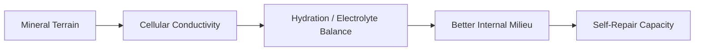

# Plasma Quinton (Huyết Tương Biển)

**Plasma Quinton là nước biển được xử lý theo phương pháp René Quinton, thường được đọc trong health sovereignty như một cách hỗ trợ terrain khoáng chất và nội môi. Điểm cốt lõi không phải “nước biển chữa mọi bệnh”, mà là câu hỏi sâu hơn: cơ thể có thể tự sửa tốt hơn khi môi trường nội bào được tái khoáng và bớt ô nhiễm không?**

*Quinton Plasma is seawater processed according to René Quinton's method, often read in health sovereignty as a way to support mineral terrain and internal milieu. The core point is not “seawater cures everything,” but a deeper question: can the body repair better when the internal cellular environment is remineralized and less polluted?*

---

## Medical Caution / Cẩn Trọng

Bài này là knowledge-vault synthesis, không phải medical advice. Người có bệnh thận, tăng huyết áp, rối loạn điện giải, suy tim, đang dùng thuốc, hoặc cần hạn chế sodium phải rất cẩn trọng với bất kỳ dạng bổ sung muối/khoáng nào.

Không tự tiêm hoặc dùng đường không an toàn. Nếu dùng sản phẩm, cần nguồn sạch, vô trùng, rõ chuẩn.

---

## Evidence Discipline / Cách Đọc Claim

| Tầng | Cách đọc | Ví dụ |
|---|---|---|
| **Fact / documentable** | seawater chứa khoáng/trace minerals; electrolytes ảnh hưởng physiology | sodium, magnesium, trace elements |
| **Historical / clinical claims** | René Quinton, marine dispensaries, early 20th-century reports | cần kiểm nguồn lịch sử |
| **Terrain reading** | nội môi khoáng chất ảnh hưởng self-healing | [[Thuyết Vi Sinh Nội Sinh]] |
| **Vault synthesis** | biển như ký ức sinh học, body as miniature ocean | symbolic + terrain lens |

Không nên đọc Plasma Quinton như panacea. Nó là một node trong terrain/mineral framework.

---

## Vault Position / Vị Trí Trong Vault

Plasma Quinton nằm trong cụm [[MOC - Health Sovereignty]], nối với [[Thuyết Vi Sinh Nội Sinh]], [[Y Tế Tự Nhiên]], [[Muối - Ký Ức Biển Cả và Lời Tiên Tri Về Sự Thức Tỉnh]] và biography [[René Quinton và Huyết Tương Biển]].

Trong terrain theory, bệnh không chỉ là “kẻ xâm nhập”, mà là môi trường nội bào mất cân bằng. Plasma Quinton được đọc như một cách tái nhắc cơ thể về “biển bên trong”.

> Máu và biển không giống nhau hoàn toàn. Nhưng motif “cơ thể là đại dương thu nhỏ” là một symbolic-biological lens rất mạnh.

---

## 1. René Quinton Và Ý Tưởng Nội Môi Biển

René Quinton cho rằng môi trường nội bào của sinh vật giữ ký ức của biển nguyên thủy. Từ đó, ông phát triển hướng dùng seawater/plasma biển để hỗ trợ cơ thể.

Dù nhiều claim lịch sử cần kiểm lại kỹ, ý tưởng nền rất đáng chú ý:

- sự sống đến từ biển,
- tế bào cần môi trường điện giải/khoáng phù hợp,
- cơ thể không chỉ cần calories mà cần mineral intelligence,
- terrain quyết định khả năng tự sửa.

---

## 2. Isotonic vs Hypertonic

| Loại | Ý nghĩa | Cẩn trọng |
|---|---|---|
| Isotonic | pha loãng gần áp suất thẩm thấu cơ thể | thường nhẹ hơn |
| Hypertonic | đậm đặc khoáng/muối hơn | cẩn trọng sodium/electrolytes |

Không phải càng đậm càng tốt. Electrolyte balance cần đúng liều và đúng người.

---

## 3. Terrain Logic

Trong [[Thuyết Vi Sinh Nội Sinh]], terrain quyết định rất nhiều biểu hiện sức khỏe. Nếu terrain thiếu khoáng, viêm, acid stress, độc tố, lymph tắc, thì tế bào khó hoạt động tối ưu.

Plasma Quinton được dùng trong lens này như:

- remineralization,
- electrolyte support,
- hydration quality,
- cellular terrain support,
- symbolic return to oceanic origin.

---

## 4. Vì Sao Muối Và Khoáng Bị Hiểu Sai?

Modern health thường demonize salt một cách quá thô. Nhưng vấn đề không chỉ là “muối nhiều hay ít”. Cần hỏi:

- loại muối nào,
- mineral spectrum ra sao,
- kidney/adrenal status,
- potassium/magnesium balance,
- processed food sodium hay mineral-rich salt,
- người đó mất khoáng qua sweat/stress/fasting không.

Đây là lý do Plasma Quinton nên đọc cùng [[Muối - Ký Ức Biển Cả và Lời Tiên Tri Về Sự Thức Tỉnh]], không tách riêng.

---

## 5. Rủi Ro Và Bẫy

- nguồn biển ô nhiễm,
- sản phẩm không vô trùng,
- sodium quá mức,
- dùng sai cho người bệnh thận/huyết áp/tim,
- thần thánh hóa như cure-all,
- DIY tùy tiện,
- nhầm “natural” với “safe”.

Health sovereignty không phải làm liều. Nó là hiểu cơ thể sâu hơn để chọn khôn hơn.

---

## 6. Practical Frame

Nếu nghiên cứu Plasma Quinton, hãy hỏi:

1. Sản phẩm có nguồn và quy trình rõ không?
2. Isotonic hay hypertonic?
3. Tình trạng thận/huyết áp/điện giải của mình ra sao?
4. Có đang fasting/keto/mất khoáng không?
5. Có theo dõi phản ứng cơ thể không?
6. Có đang kỳ vọng nó chữa mọi thứ không?

---

## Synthesis

Plasma Quinton là một node đẹp vì nó nối biology, ocean, terrain và symbolic memory. Nó nhắc rằng cơ thể không chỉ là máy hóa học, mà là một đại dương điện giải sống.

Nhưng càng đẹp càng cần kỷ luật: không biến biển thành thần dược.

> Cơ thể có thể nhớ biển. Nhưng người đọc vẫn phải nhớ dùng đầu.

---

## Related

- [[René Quinton và Huyết Tương Biển]]
- [[Thuyết Vi Sinh Nội Sinh]]
- [[Y Tế Tự Nhiên]]
- [[Muối - Ký Ức Biển Cả và Lời Tiên Tri Về Sự Thức Tỉnh]]
- [[MOC - Health Sovereignty]]
