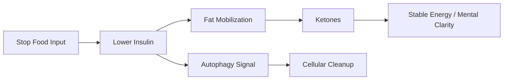

# Prolonged Fasting

**Prolonged Fasting là nhịn ăn kéo dài có chủ đích để đưa cơ thể từ chế độ tiêu hóa/liên tục nạp sang chế độ sửa chữa/tái chế: giảm insulin, tăng ketone, kích hoạt autophagy và buộc metabolism nhớ lại một nhịp cổ xưa hơn.**

*Prolonged fasting is intentional extended fasting that shifts the body from constant digestion and intake into repair and recycling: lowering insulin, raising ketones, activating autophagy, and forcing metabolism to remember an older rhythm.*

---

## Medical Caution / Cẩn Trọng

Bài này là knowledge-vault synthesis, không phải medical advice. Fasting kéo dài không phù hợp cho mọi người. Người có bệnh nền, đang dùng thuốc tiểu đường/huyết áp, phụ nữ mang thai, người quá gầy, có rối loạn ăn uống, bệnh thận/gan, hoặc thể trạng yếu cần supervision.

Fasting là hormetic stress. Đúng liều thì kích hoạt sửa chữa. Quá liều thì thành stress phá hoại.

---

## Vault Position / Vị Trí Trong Vault

Trong redpill.wiki, **Prolonged Fasting** nằm trong cụm [[MOC - Health Sovereignty]] và nối với [[Ketogenic Diet]], [[Ung Thư - Metabolic Protocol]], [[Y Tế Tự Nhiên]], [[Cơ Chế Tự Bảo Vệ Của Cơ Thể]].

Fasting không được đọc như punishment hay spiritual flex. Nó là một công cụ metabolic và tâm linh: tạm ngừng input để cơ thể và mind có khoảng trống tự dọn.

> Nhịn ăn không phải ghét cơ thể. Đôi khi đó là cách cho cơ thể đủ im lặng để tự sửa.

---

## 1. Prolonged Fasting Là Gì?

Prolonged fasting thường chỉ nhịn ăn kéo dài từ 24 giờ trở lên. Tùy protocol, có thể là 24h, 36h, 48h, 72h hoặc lâu hơn dưới giám sát.

| Duration | Tầng thường gặp |
|---|---|
| 16–24h | insulin giảm, glycogen bắt đầu cạn |
| 24–36h | fat burning tăng, ketone rõ hơn |
| 36–72h | autophagy và metabolic switch mạnh hơn |
| 72h+ | stress cao hơn, cần thận trọng/supervision |

Con số không phải giáo điều. Cơ địa, thuốc, stress, sleep, electrolyte và body fat đều ảnh hưởng.

---

## 2. Vì Sao Fasting Tồn Tại Trong Tự Nhiên?

Con người hiện đại ăn liên tục, nhưng cơ thể cổ xưa không được thiết kế để snack cả ngày.

Trong tự nhiên có nhịp:

- lúc no,
- lúc đói,
- lúc xây,
- lúc dọn,
- lúc hoạt động,
- lúc nghỉ.

Modern food system xóa mất nhịp đó bằng breakfast cereal, coffee sugar, snack, lunch, snack, dinner, dessert, late-night eating.

Cơ thể không còn khoảng trống để dọn rác.

---

## 3. Cơ Chế Chính

### Insulin Reset

Khi không ăn, insulin giảm. Khi insulin giảm, cơ thể dễ truy cập fat stores hơn.

### Ketosis

Sau khi glycogen giảm, gan tạo ketone từ fat. Đây là nơi fasting nối trực tiếp với [[Ketogenic Diet]].

### Autophagy

Autophagy là quá trình tế bào tái chế thành phần hỏng/cũ. Fasting là một trong các stressor kích hoạt quá trình này.

### Digestive Rest

Không tiêu hóa liên tục giúp hệ tiêu hóa và immune system có khoảng trống.

---

## 4. Fasting Và Ung Thư

Trong [[Ung Thư - Metabolic Protocol]], fasting được nhắc như một metabolic pressure tool.

Cách nói đúng:

- Fasting có thể giảm glucose/insulin availability.
- Fasting có thể tăng ketone và autophagy signaling.
- Một số protocol nghiên cứu fasting around chemo như cách giảm side effects hoặc tạo differential stress.
- Nhưng fasting không nên được claim đơn giản là “chữa ung thư”.

| Claim | Confidence |
|---|---|
| Fasting làm giảm insulin/glucose tạm thời | mạnh |
| Fasting tăng ketone | mạnh |
| Autophagy liên quan fasting | mạnh vừa/tùy duration/context |
| Fasting tự chữa cancer | không nên claim như fact |

---

## 5. Electrolytes: Chỗ Nhiều Người Sai

Fasting không chỉ là “không ăn”. Khi insulin giảm, cơ thể thải nước và muối nhiều hơn. Thiếu electrolyte gây:

- đau đầu,
- mệt,
- tim đập nhanh,
- chuột rút,
- chóng mặt,
- brain fog.

Sodium, potassium, magnesium cần được hiểu đúng, nhất là fasting trên 24h.

---

## 6. Spiritual Layer

Fasting có mặt trong nhiều truyền thống tâm linh vì khi input giảm, noise giảm.

Không phải vì đói là holy. Mà vì khi không liên tục tiêu hóa, thỏa mãn, phân tán, tâm trí có thể thấy rõ hơn các craving loop.

Fasting phơi bày:

- mình ăn vì đói hay vì stress,
- mình thèm taste hay thèm comfort,
- mình sợ trống hay sợ mất control,
- mình có đang dùng food để né cảm xúc không.

Đây là nơi fasting nối với [[Gnosis]] và [[Individuation]]: thấy được pattern bên trong thay vì bị nó kéo đi.

---

## 7. Sai Lầm Phổ Biến

- fasting để punish body,
- fasting quá dài quá sớm,
- thiếu electrolyte,
- binge sau fast,
- bỏ qua sleep/stress,
- fasting khi đang underweight hoặc burnout,
- biến fasting thành ego/spiritual superiority,
- không điều chỉnh thuốc khi cần supervision.

Một protocol tốt phải làm con người sovereign hơn, không làm họ cực đoan hơn.

---

## 8. Practical Frame

Một cách đọc an toàn hơn:

1. Bắt đầu bằng food quality trước.
2. Sau đó thử time-restricted eating.
3. Khi đã fat-adapted hơn, mới thử 24h.
4. Theo dõi energy, mood, sleep, dizziness.
5. Bổ sung electrolyte phù hợp.
6. Break fast nhẹ, không binge.
7. Nếu có bệnh/thuốc, cần người có chuyên môn.

---

## Synthesis

Prolonged Fasting là một công cụ trả lại nhịp cho cơ thể: có nạp, có nghỉ, có xây, có dọn. Trong một Ma Trận thực phẩm muốn con người tiêu thụ liên tục, fasting là hành động rút consent khỏi vòng lặp “cứ thấy trống là phải nhét gì đó vào”.

> Fasting không chỉ là không ăn. Nó là một khoảng im lặng để cơ thể, dopamine và bản ngã lộ nguyên hình.

---

## Related

- [[Ketogenic Diet]]
- [[Ung Thư - Metabolic Protocol]]
- [[Y Tế Tự Nhiên]]
- [[Cơ Chế Tự Bảo Vệ Của Cơ Thể]]
- [[MOC - Health Sovereignty]]
- [[Individuation]]
