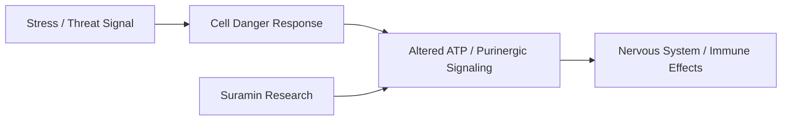

# Suramin

**Suramin là một thuốc antiparasitic tổng hợp được phát triển từ đầu thế kỷ 20, nổi tiếng trong điều trị một số bệnh ký sinh trùng như African sleeping sickness. Trong vault, Suramin quan trọng vì nó nằm ở giao điểm của antiparasitic medicine, purinergic signaling, nervous-system reset, autism research và các claim dân gian quanh trà lá thông.**

*Suramin is a synthetic antiparasitic drug developed in the early 20th century, known for treating certain parasitic diseases such as African sleeping sickness. In the vault, it matters because it sits at the intersection of antiparasitic medicine, purinergic signaling, nervous-system reset, autism research, and folk claims around pine needle tea.*

---

## Medical Caution / Cẩn Trọng

Suramin pharmaceutical không phải trà thảo mộc. Đây là thuốc mạnh, có thể có độc tính và cần supervision y khoa. Không tự ý dùng suramin dạng thuốc.

Pine needle tea cũng không đồng nghĩa với suramin pharmaceutical. Một số nội dung online trộn hai thứ này quá dễ dãi. Cần phân biệt: trà lá thông có phytochemicals riêng; suramin là một hợp chất thuốc cụ thể.

---

## Evidence Discipline / Cách Đọc Claim

| Tầng | Cách đọc | Ví dụ |
|---|---|---|
| **Fact / documentable** | suramin là thuốc antiparasitic; có nghiên cứu về purinergic signaling | sleeping sickness, P2 receptor effects |
| **Research / emerging** | autism/cell danger response studies | Robert Naviaux, small studies |
| **Folk / herbal layer** | pine needle tea, vitamin C, shikimic acid claims | không đồng nhất với suramin drug |
| **Vault synthesis** | antiparasitic → nervous system / cancer / terrain pattern | đọc như hypothesis, không phải protocol |

---

## Source Register / Nguồn Cần Đối Chiếu

Không gắn URL giả cho Suramin. Khi làm citation pass sâu hơn, ưu tiên các nhóm nguồn này:

- **Drug label / pharmacology references** — indication, toxicity, dosing context, contraindications của suramin pharmaceutical.
- **WHO / tropical medicine references** — African trypanosomiasis và bối cảnh dùng thuốc thật.
- **Purinergic signaling literature** — P2 receptors, ATP signaling, cell danger response.
- **Robert Naviaux / autism studies** — small clinical studies, protocol design, safety limits.
- **Pine needle ethnobotany and toxicology** — tách herbal claims khỏi suramin drug; kiểm loại cây độc, pregnancy cautions.
- **Regulatory / clinical trial records** — xem claim nào mới là trial, claim nào chỉ là internet lore.

> Source discipline ở đây rất quan trọng: "pine needle tea", "suramin", "third eye" và "cell danger response" là bốn lớp khác nhau, không được trộn thành một câu thần chú.

---

## Vault Position / Vị Trí Trong Vault

Suramin nối với [[Mebendazole - Thuốc Tẩy Giun Chống Ung Thư]] vì cùng chạm vào pattern: thuốc chống ký sinh trùng có nhiều tác động sinh học ngoài công dụng ban đầu.

Nó nối với [[Tuyến Tùng]] vì online health circles thường gắn suramin/pine needle với “decalcification” hoặc third-eye claims.

Nó nối với [[Y Tế Tự Nhiên]] và [[MOC - Health Sovereignty]] vì đặt câu hỏi: tại sao một số thuốc cũ hoặc chất tự nhiên lại bị internet mythologize, trong khi research thật thì phức tạp hơn nhiều?

---

## 1. Suramin Là Gì?

Suramin là thuốc tổng hợp, historically used chống trypanosomes. Nó không phải một hoạt chất “tự nhiên từ lá thông” theo nghĩa đơn giản.

Điều đáng chú ý là suramin ảnh hưởng **purinergic signaling**, tức hệ tín hiệu liên quan ATP và cell danger response.

| Tầng | Ý nghĩa |
|---|---|
| Antiparasitic | công dụng lịch sử/documentable |
| Purinergic signaling | hướng nghiên cứu nervous-system/cell communication |
| Autism research | emerging, small-scale, cần thận trọng |
| Internet health lore | pine needle, detox, spike protein, third eye claims |

---

## 2. Cell Danger Response

Dr. Robert Naviaux đề xuất **Cell Danger Response**: khi tế bào cảm thấy nguy hiểm, nó đổi trạng thái giao tiếp và metabolism để phòng thủ. Nếu stuck trong trạng thái này, cơ thể có thể biểu hiện dysfunction kéo dài.

Suramin được nghiên cứu như một chất có thể ảnh hưởng purinergic signaling, từ đó có khả năng “reset” một số pattern cell communication.

Đây là research thú vị, nhưng không nên phóng đại thành cure-all.

---

## 3. Pine Needle Tea: Cần Tách Khỏi Suramin

Pine needle tea có truyền thống sử dụng riêng, thường được nhắc vì:

- vitamin C,
- antioxidants,
- shikimic acid discussions,
- respiratory/folk use,
- symbolic connection với pineal/pine cone.

Nhưng pine needle tea không nên được gọi đơn giản là “suramin tự nhiên”. Đây là claim cần kiểm kỹ.

Cẩn trọng:

- tránh nhầm với cây độc như yew,
- phụ nữ mang thai cần tránh nhiều loại pine needle preparations,
- nguồn cây phải sạch,
- dị ứng/thuốc/bệnh nền cần để ý.

---

## 4. Suramin, Third Eye Và Gematria

Online circles hay gắn Suramin với [[Tuyến Tùng]], decalcification, Third Eye, thậm chí Gematria.

Trong vault, phần này nên đọc như **symbolic layer**, không phải biomedical fact.

Pine cone symbolism rất mạnh trong esoterica. Tuyến tùng cũng là node thật về melatonin/circadian rhythm. Nhưng từ đó nhảy thẳng sang “suramin mở third eye” là leap quá lớn nếu không có evidence.

Đọc đúng hơn:

> Suramin/pine/pineal nằm trong một symbolic cluster về cây thông, con mắt thứ ba, nervous system và detox. Cluster này đáng quan sát, nhưng không phải protocol y khoa.

---

## 5. Antiparasitic Pattern

Suramin, MBZ, ivermectin, fenbendazole thường được nhắc trong các cộng đồng health alternative vì một pattern chung: thuốc chống ký sinh có nhiều off-target biological effects.

Điều này có thể gợi ý:

- parasite/terrain layer bị mainstream xem nhẹ,
- repurposed drugs có potential,
- pharma incentive không mạnh với thuốc cũ,
- nhưng internet cũng dễ biến mọi thứ thành miracle cure.

Cần giữ cả hai mắt mở.

---

## Practical Reading

Nếu nghiên cứu Suramin, hãy tách:

1. Suramin pharmaceutical.
2. Pine needle tea.
3. Autism/cell danger research.
4. Third-eye/esoteric claims.
5. Internet spike-protein/detox claims.

Mỗi tầng cần nguồn khác nhau và độ tin cậy khác nhau.

---

## Synthesis

Suramin là một node nhạy vì nó nằm giữa research thật, thuốc mạnh, folk medicine, internet myth và esoteric symbolism.

Đọc quá mainstream thì bỏ qua pattern antiparasitic/nervous-system thú vị. Đọc quá alternative thì dễ biến một thuốc độc tính cao thành trà thần kỳ.

> Suramin dạy một bài học quan trọng: một chất có thể rất đáng nghiên cứu mà vẫn không nên bị biến thành niềm tin mù.

---

## Related

- [[Tuyến Tùng]]
- [[Mebendazole - Thuốc Tẩy Giun Chống Ung Thư]]
- [[Y Tế Tự Nhiên]]
- [[Thuyết Vi Sinh Nội Sinh]]
- [[MOC - Health Sovereignty]]
