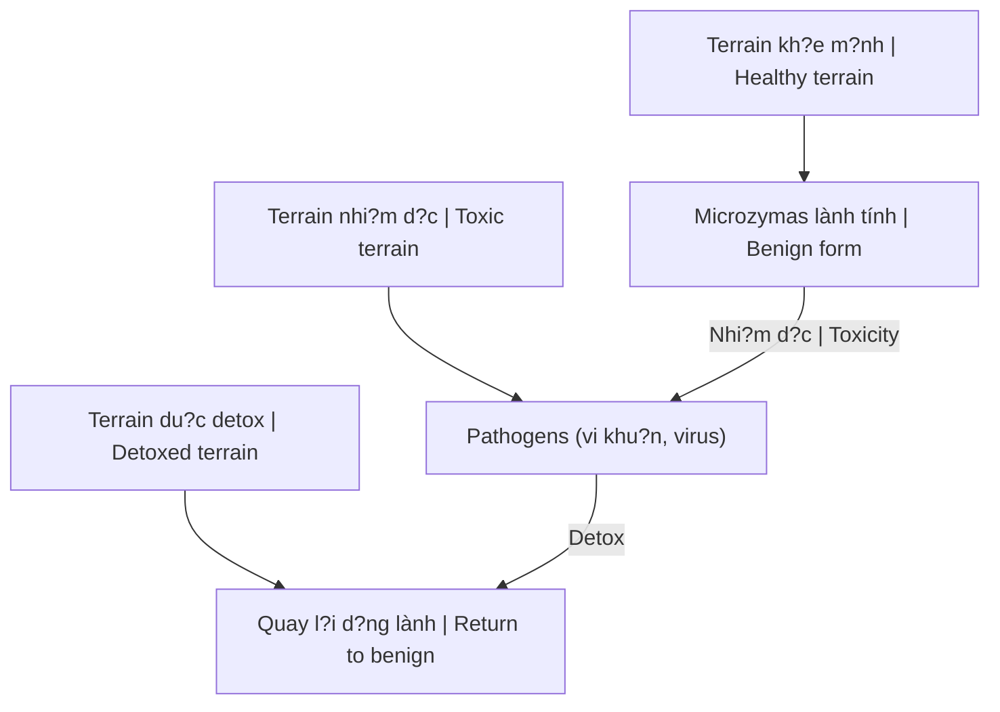

# Thuy?t Vi Sinh N?i Sinh (Terrain Theory)

**Terrain Theory** do Antoine Béchamp d? xu?t, d?i l?p v?i Germ Theory c?a Louis Pasteur. Thay vì vi khu?n/virus gây b?nh, chính môi tru?ng bên trong co th? (terrain) quy?t d?nh s?c kh?e.

*Terrain Theory proposed by Antoine Béchamp, opposing Louis Pasteur's Germ Theory. Instead of bacteria/viruses causing disease, the body's internal environment (terrain) determines health.*

> "Le microbe n'est rien, le terrain est tout."
> "The microbe is nothing, the terrain is everything." - Claude Bernard

---

## Germ Theory vs Terrain Theory

| Aspect / Khía c?nh | Germ Theory (Pasteur) | Terrain Theory (Béchamp) |
|--------------------|----------------------|-------------------------|
| **Cause of disease** | External invaders / Xâm nh?p t? ngoài | Internal imbalance / M?t cân b?ng bên trong |
| **Solution** | Kill germs / Di?t vi khu?n | Clean terrain / Làm s?ch môi tru?ng |
| **Method** | Antibiotics, vaccines | Nutrition, detox, lifestyle |
| **Body is** | Battlefield / Chi?n tru?ng | Garden / Khu vu?n |
| **Who won?** | Big Pharma adopted | Suppressed / B? dàn áp |

---

## Microzymas - Khái ni?m C?t lõi / Core Concept

### Béchamp's Discovery

- **Microzymas**: Vi th? nh? nh?t, n?n t?ng s? s?ng / Smallest units, foundation of life
- T?n t?i trong m?i t? bào / Exist in all cells
- **Pleomorphism**: Có th? bi?n d?i hình thái / Can change form
- Tùy terrain ? thành bacteria, virus, fungi / Depending on terrain ? become pathogens

### Pleomorphism Flow

**Implication:** Bacteria/virus không "xâm nh?p" - chúng PHÁT SINH t? bên trong khi terrain b? ô nhi?m.

*Bacteria/viruses don't "invade" - they ARISE internally when terrain is polluted.*

---

## B?ng ch?ng / Evidence

### Germ Theory Failures

- Antibiotics ? Superbugs
- Vaccines ? Autoimmune rise
- Không gi?i thích: Cùng exposure, t?i sao ngu?i b?nh ngu?i không? / Same exposure, why some sick, some not?

### Terrain Success Stories

| Approach | Result |
|----------|--------|
| **Fasting** | Rapid healing / Lành nhanh |
| **Whole food diet** | Chronic disease reversal / Ð?o ngu?c b?nh mãn tính |
| **Detox** | Symptoms disappear / Tri?u ch?ng bi?n m?t |

### Modern Research

- Microbiome importance
- Epigenetics (environment affects gene expression)
- Psychoneuroimmunology (mind-body connection)

---

## ?ng d?ng / Application

### Clean the Terrain / Làm s?ch Terrain

| Action | Purpose / M?c dích |
|--------|-------------------|
| **Whole foods** | Nuôi du?ng t? bào / Nourish cells |
| **Fasting** | Autophagy, d?n d?p / Clean up |
| **Detox** | Lo?i b? d?c t? / Remove toxins |
| **Sleep** | S?a ch?a, tái t?o / Repair, regenerate |
| **Sunlight** | Vitamin D, circadian rhythm |
| **Movement** | Tu?n hoàn lymph / Lymph circulation |
| **Stress reduction** | Gi?m cortisol / Lower cortisol |
| **Clean water** | Hydrat hóa / Hydration |

### Detox Protocols

- [[Plasma Quinton]] - Ocean minerals
- [[Suramin]] - Pine needle extract
- [[Công Th?c Ch?a Lành T? Nhiên]]
- Liver/kidney cleanses
- Heavy metal detox

---

## T?i sao b? Suppressed? / Why Suppressed?

### Follow the Money

| Theory | Product | Profit |
|--------|---------|--------|
| **Germ Theory** | Antibiotics, vaccines | Billions / T? dô |
| **Terrain Theory** | Diet, lifestyle | Nothing to sell |

### Pasteur vs Béchamp

| Pasteur | Béchamp |
|---------|---------|
| Connected, political | Pure scientist |
| Good at lobbying | No PR skills |
| Allegedly stole ideas | Original researcher |
| History's winner | Forgotten |

### Pasteur's Deathbed Confession?

> "Bernard was right; the pathogen is nothing; the terrain is everything."

*(Disputed quote, but symbolically powerful)*

---

## Related

### Health / S?c kh?e
- [[Y T? T? Nhiên]]
- [[Su That Ve Benh Dai Va Vac Xin]] - Pasteur exposed
- [[Virus và Ki?p T?t D?ch]] - Virus theory questioned
- [[Công Th?c Ch?a Lành T? Nhiên]]
- [[Plasma Quinton]] | [[Suramin]]

### Science / Khoa h?c
- [[Khoa H?c Xét L?i]]
- [[The China Study]] - Diet impacts

### Matrix Connection
- [[Thu?c Hóa D?u]] - Petrochemical medicine
- [[V?n Chín, Ngu?i Kogi và Ma Tr?n Y T?]]
