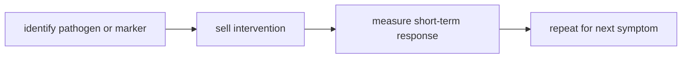

# Thuyết Vi Sinh Nội Sinh (Terrain Theory)

**Terrain Theory nói một điều đơn giản nhưng bị làm phẳng: mầm bệnh không hành động trong chân không. Nó gặp một cơ thể có miễn dịch, ruột, dinh dưỡng, stress, độc chất, nhịp ngủ và bệnh nền riêng.** Vì vậy cùng một exposure có thể cho hai kết quả khác nhau. Đọc đúng, terrain không cần phủ nhận germ theory; nó buộc germ theory phải đặt tác nhân vào hệ sinh thái sống.

*Terrain theory does not need to deny pathogens. It restores the missing context: the host terrain determines how exposure becomes illness, resilience, or nothing.*

---

## Medical Caution / Cảnh Báo Y Tế

Bài này không khuyên bỏ vaccine, kháng sinh, cấp cứu hoặc điều trị nhiễm trùng nặng. Nhiễm trùng huyết, viêm phổi nặng, viêm màng não, sốt cao kéo dài, mất nước nặng, khó thở, đau bất thường hoặc triệu chứng thần kinh cấp cần chăm sóc y tế.

Điểm redpill ở đây không phải "vi khuẩn không tồn tại". Điểm redpill là: một hệ thống chỉ biết tiêu diệt tác nhân sẽ bỏ quên câu hỏi tại sao terrain suy yếu.

Vì đây là bài health có rủi ro cao, mọi claim phải được đọc theo tầng. Microbiome, miễn dịch, dinh dưỡng, giấc ngủ và bệnh nền là vùng có bằng chứng mạnh hơn. Microzymas, pleomorphism theo nghĩa cổ điển và các diễn giải phủ nhận toàn bộ germ theory là vùng cần thận trọng hơn.

---

## Vault Position / Vị Trí Trong Vault

Đây là node nền của [[MOC - Health Sovereignty]]. Nó chống lưng cho [[Y Tế Tự Nhiên]], giải thích vì sao [[Hệ Tiêu Hóa - Bộ Não Thứ Hai]] quan trọng, và cho [[Cơ Chế Tự Bảo Vệ Của Cơ Thể]] một khung không mê tín. Nó cũng là điểm đối thoại với [[Thuốc Hóa Dầu]] và [[Khoa Học Xét Lại]]: khoa học thật phải hỏi cả tác nhân lẫn môi trường chứa tác nhân.

---

## Evidence Discipline / Kỷ Luật Bằng Chứng

| Tầng claim | Cách đọc |
|---|---|
| Fact / documentable | microbiome, dinh dưỡng, ngủ, stress, bệnh nền và miễn dịch ảnh hưởng nguy cơ bệnh |
| Historical | Béchamp, Pasteur, Bernard là tranh luận lịch sử phức tạp, không nên biến thành meme |
| Pattern / systems | pharma dễ kiếm tiền từ mô hình "một tác nhân - một thuốc" hơn từ tái thiết đời sống |
| Speculative synthesis | terrain-first là mô hình vault để đọc sức khỏe như hệ sinh thái |

Vault chọn **terrain-first**, không chọn **germ-denial**. Phủ nhận tác nhân lây nhiễm hoàn toàn là nguy hiểm; bỏ quên terrain cũng nguy hiểm theo kiểu chậm hơn.

---

## Source Register / Nguồn Cần Đối Chiếu

Không cần gắn citation rỗng vào từng câu. Citation pass sâu hơn nên dùng các nhóm nguồn sau:

- **Microbiome / host immunity reviews** — gut barrier, immune training, inflammation, infection susceptibility.
- **Sleep, stress, nutrition and metabolic health literature** — terrain factors có bằng chứng mạnh hơn.
- **Infectious disease references** — pathogen transmission, sepsis, pneumonia, meningitis, antibiotic indications.
- **History of medicine sources** — Pasteur, Béchamp, Claude Bernard, pleomorphism; tránh meme hóa lịch sử.
- **Biofilm / virulence / host-pathogen ecology research** — cầu nối hiện đại giữa germ và terrain.
- **Public health / vaccine / antibiotic guidelines** — để biết giới hạn của terrain practice trong bệnh cấp.

> Terrain-first cần nguồn hiện đại, không chỉ cần câu chuyện Pasteur vs Béchamp. Đất quan trọng nhất khi nó được đọc cùng dữ liệu miễn dịch, ruột, chuyển hóa và bệnh nhiễm thật.

---

## Germ Và Terrain Không Phải Hai Phe

Một cái cây không mọc chỉ vì có hạt. Nó cần đất, nước, ánh sáng, nhiệt, vi sinh, mùa. Mầm bệnh cũng vậy: exposure là hạt; cơ thể là đất.

Germ-only reading hỏi: "Tác nhân nào gây bệnh?" Terrain-first hỏi thêm: "Tại sao cơ thể này phản ứng nặng? Tại sao cơ thể kia không? Hệ nào đã mất resilience?" Hai câu hỏi này không loại trừ nhau. Chúng bổ sung nhau.

Khi y tế chỉ nhìn hạt, nó tạo văn hóa sợ hãi mọi thứ bên ngoài. Khi alternative health chỉ nhìn đất và phủ nhận hạt, nó tạo văn hóa chủ quan nguy hiểm. Trí tuệ là đọc cả hai.

---

## Terrain Gồm Những Gì?

Terrain không phải một khái niệm mơ hồ. Nó là toàn bộ điều kiện nội môi:

| Lớp terrain | Vai trò |
|---|---|
| gut microbiome | huấn luyện miễn dịch, tạo chất chuyển hóa, giữ hàng rào ruột |
| dinh dưỡng | nguyên liệu cho mô, hormone, enzyme, tế bào miễn dịch |
| giấc ngủ | điều hòa viêm, phục hồi thần kinh, tái lập hormone |
| stress | tác động cortisol, thần kinh tự chủ, viêm mạn |
| ánh sáng | circadian rhythm, mood, vitamin D, tín hiệu thời gian |
| vận động | lymph flow, insulin sensitivity, mitochondria |
| độc chất | tải lên gan, ruột, mô mỡ, hệ nội tiết |

Đọc như vậy, "chữa bệnh" không còn là săn một viên thuốc thần. Nó là tái lập điều kiện để cơ thể có thể tự làm phần việc của nó.

Một bảng như trên chỉ hữu ích nếu nó không biến thành checklist cơ học. Terrain là quan hệ giữa các lớp: stress phá ngủ, ngủ kém làm tăng craving, craving phá ruột, ruột viêm làm miễn dịch quá nhạy, miễn dịch quá nhạy làm người bệnh dễ kiệt. Sức khỏe thật là vòng lặp, không phải từng ô riêng lẻ.

---

## Microzymas Và Pleomorphism

Các ý tưởng của Béchamp về microzymas và pleomorphism thuộc tầng lịch sử và alternative biology. Không nên trình bày chúng như fact đã được mainstream xác nhận. Nhưng cũng không nên vứt bỏ câu hỏi mà chúng gợi ra: môi trường nội mô có thể làm thay đổi hành vi, độc lực và hình thái của vi sinh vật đến mức nào?

Trong ngôn ngữ hiện đại, câu hỏi này sống lại qua microbiome, biofilm, virulence, immune tolerance, metabolic health và host ecology. Có thể không cần thắng một cuộc chiến tên tuổi Pasteur-Béchamp để thấy rằng đất quan trọng.

Đây là cách đọc có kỷ luật hơn: không cần phong thánh Béchamp, không cần demonize Pasteur. Chỉ cần thấy mô hình "một mầm bệnh - một bệnh - một thuốc" quá hẹp để giải thích con người như hệ sinh thái sống.

---

## Vì Sao Mô Hình Diệt Mầm Bệnh Thắng?

Mô hình "một tác nhân - một thuốc" rất hợp với công nghiệp:

Terrain khó bán hơn vì nó đòi thay đời sống: ngủ, ăn, stress, ánh sáng, vận động, quan hệ, công việc, môi trường. Không công ty nào độc quyền được toàn bộ hành trình này. Vì vậy nó thường bị làm thành lời khuyên phụ, trong khi đơn thuốc trở thành trung tâm.

---

## Terrain Practice / Làm Sạch Đất

Thực hành terrain không cần kỳ bí. Nó bắt đầu bằng thứ người hiện đại coi thường:

- ngủ đúng nhịp và giảm ánh sáng đêm;
- ăn thực phẩm thật, đủ protein và khoáng;
- giảm đồ siêu chế biến, rượu, đường, dầu công nghiệp;
- đi bộ, tập lực, ra nắng;
- chăm ruột thay vì chỉ diệt khuẩn;
- giảm sợ hãi truyền thông, vì fear cũng là độc chất sinh học.

Các node như [[Plasma Quinton]], [[Công Thức Chữa Lành Tự Nhiên]] hay [[Ketogenic Diet]] chỉ nên đọc sau nền này. Protocol không thay thế terrain.

Với nhiễm trùng cấp, terrain practice là nền hỗ trợ, không phải lý do trì hoãn chăm sóc y tế khi có dấu hiệu nặng. Với bệnh mạn, terrain practice là nơi quyền lực quay về tay người bệnh từng ngày: bữa ăn, giấc ngủ, ánh sáng, stress, vận động, quan hệ và môi trường sống.

---

## Core Insight / Chốt Lại

**Terrain Theory mạnh nhất khi nó trả cơ thể về vai trò hệ sinh thái sống. Nó yếu nhất khi bị biến thành phủ nhận mọi mầm bệnh. Đất quan trọng; hạt cũng có thật. Người tỉnh đọc cả hai.**

*The seed matters. The soil matters. Health sovereignty begins when neither is allowed to erase the other.*
