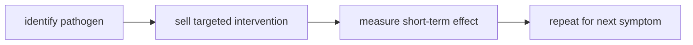

# Thuyết Vi Sinh Nội Sinh (Terrain Theory)

**Terrain Theory nhắc rằng mầm bệnh không hoạt động trong chân không: sức khỏe của mô, miễn dịch, ruột, dinh dưỡng, stress, độc chất và nhịp sống quyết định cơ thể phản ứng thế nào trước cùng một exposure.** Đọc đúng, terrain không cần phủ nhận germ theory; nó sửa lại điểm mù của mô hình chỉ biết "diệt tác nhân".

*Terrain theory reminds us that microbes act inside terrain. The same exposure can produce different outcomes depending on immunity, metabolism, gut ecology, stress, toxicity, and tissue resilience.*

---

## Medical Caution / Cảnh Báo Y Tế

Bài này không khuyên bỏ vaccine, kháng sinh, cấp cứu hoặc điều trị nhiễm trùng nặng. Nhiễm trùng huyết, viêm phổi nặng, viêm màng não, sốt cao kéo dài, mất nước nặng, khó thở hoặc đau bất thường cần chăm sóc y tế.

| Tầng claim | Cách đọc |
|---|---|
| Fact | microbiome, miễn dịch, dinh dưỡng, giấc ngủ, stress và bệnh nền ảnh hưởng nguy cơ bệnh |
| Historical | Béchamp/Pasteur/Bernard là tranh luận lịch sử phức tạp, không nên biến thành meme đơn giản |
| Pattern | pharma có incentive bán diệt mầm bệnh và quản lý triệu chứng |
| Vault synthesis | terrain-first: tăng sức đề kháng và khả năng tự sửa của cơ thể |

---

## Vault Position / Vị Trí Trong Vault

Đây là node nền cho [[Y Tế Tự Nhiên]], [[Cơ Chế Tự Bảo Vệ Của Cơ Thể]], [[Hệ Tiêu Hóa - Bộ Não Thứ Hai]] và phê bình [[Thuốc Hóa Dầu]]. Nó cũng nối với [[Khoa Học Xét Lại]] vì câu hỏi không phải "mainstream sai hết", mà là "mô hình nào bị incentive làm quá đơn giản?"

---

## Germ Và Terrain Không Cần Là Kẻ Thù

Mô hình cũ thường bị trình bày như binary:

| Germ-only reading | Terrain-first correction |
|---|---|
| bệnh do tác nhân bên ngoài | tác nhân cần terrain phù hợp để gây bệnh nặng |
| giải pháp là kill | giải pháp là kill khi cần và phục hồi terrain |
| cơ thể là chiến trường | cơ thể là hệ sinh thái |
| symptom là lỗi | symptom có thể là phản ứng bảo vệ |

Vault chọn terrain-first, không chọn germ-denial. Vì nếu phủ nhận hoàn toàn tác nhân lây nhiễm, người đọc có thể đi vào nguy hiểm thật.

---

## Terrain Là Gì?

Terrain là toàn bộ môi trường bên trong:

| Thành phần | Vì sao quan trọng |
|---|---|
| gut microbiome | huấn luyện miễn dịch, chuyển hóa, hàng rào ruột |
| dinh dưỡng | nguyên liệu cho tế bào miễn dịch và sửa chữa |
| giấc ngủ | điều hòa viêm và hormone |
| stress | cortisol, thần kinh tự chủ, viêm mạn |
| độc chất / ultra-processed food | tải lên gan, ruột, mitochondria |
| ánh sáng / vận động | circadian rhythm, lymph, insulin sensitivity |
| bệnh nền | quyết định resilience khi gặp tác nhân |

Nói ngắn: cùng một virus, cùng một vi khuẩn, nhưng hai terrain khác nhau có thể cho hai kết quả khác nhau.

---

## Microzymas Và Pleomorphism

Béchamp nói về microzymas và pleomorphism: ý tưởng rằng vi sinh vật có thể đổi dạng tùy môi trường. Trong lịch sử y học, phần này gây tranh luận và không nên được trình bày như fact đã giải quyết.

Kỷ luật vault:

| Claim | Nên nói thế nào |
|---|---|
| microzymas là nền tảng sự sống | historical claim / alternative biology |
| bacteria phát sinh hoàn toàn từ bên trong | speculative, không nên nói như fact phổ quát |
| môi trường ảnh hưởng hình thái và độc lực vi sinh | có cơ sở rộng hơn trong microbiome, biofilm, virulence, host ecology |

Giá trị thực dụng của terrain theory không nằm ở việc thắng tranh luận Pasteur-Béchamp. Nó nằm ở việc nhắc người đọc đừng bỏ quên đất.

---

## Vì Sao Mô Hình Diệt Mầm Bệnh Thắng?

Mô hình "một tác nhân - một thuốc" rất hợp với công nghiệp:

Terrain khó bán hơn vì nó đòi thay đổi đời sống: ngủ, ăn, stress, quan hệ, ánh sáng, vận động, môi trường, công việc. Không có một viên thuốc nào độc quyền được toàn bộ terrain.

---

## Terrain Practice / Làm Sạch Đất

| Trục | Thực hành nền |
|---|---|
| ngủ | giờ ngủ ổn, tối thật, sáng có ánh sáng |
| ăn | whole food, đủ protein, khoáng, giảm ultra-processed |
| ruột | chất xơ phù hợp, lên men nếu hợp, giảm irritants |
| nước | bù nước và điện giải khi cần |
| vận động | đi bộ, strength, lymph flow |
| stress | thở, quan hệ thật, giảm doomscroll |
| mặt trời | circadian, vitamin D, mood |

Các bài như [[Plasma Quinton]], [[Suramin]] hay [[Công Thức Chữa Lành Tự Nhiên]] chỉ nên đọc sau nền này. Không có supplement nào cứu được một terrain bị phá mỗi ngày.

---

## Core Insight / Chốt Lại

**Terrain Theory mạnh nhất khi nó trả cơ thể về vai trò hệ sinh thái sống. Nó yếu nhất khi bị biến thành phủ nhận mọi mầm bệnh. Đất quan trọng; hạt cũng có thật. Trí tuệ là biết đọc cả hai.**

*Terrain matters; pathogens also matter. Wisdom reads the seed and the soil together.*
