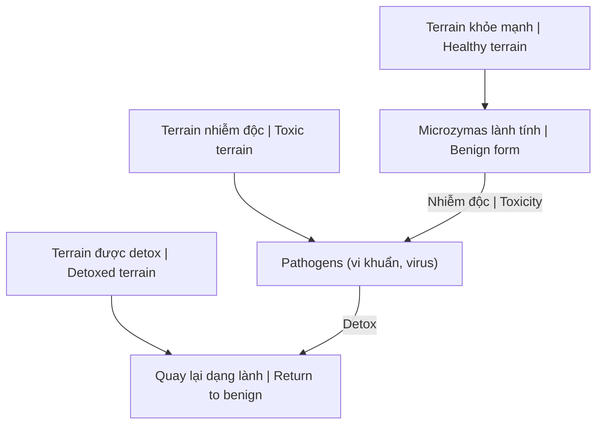

---
title: "Thuyết Vi Sinh Nội Sinh (Terrain Theory)"
aliases: ["Terrain Theory", "Thuyết Địa Hình"]
date: 2026-04-08
tags: [health]
status: refined
---
# Thuyết Vi Sinh Nội Sinh (Terrain Theory)

**Terrain Theory** do Antoine Béchamp đề xuất, đối lập với Germ Theory của Louis Pasteur. Thay vì vi khuẩn/virus gây bệnh, chính môi trường bên trong cơ thể (terrain) quyết định sức khỏe.

*Terrain Theory proposed by Antoine Béchamp, opposing Louis Pasteur's Germ Theory. Instead of bacteria/viruses causing disease, the body's internal environment (terrain) determines health.*

> "Le microbe n'est rien, le terrain est tout."
> "The microbe is nothing, the terrain is everything." — Claude Bernard

---

## Germ Theory vs Terrain Theory

| Aspect / Khía cạnh | Germ Theory (Pasteur) | Terrain Theory (Béchamp) |
|--------------------|----------------------|-------------------------|
| **Cause of disease** | External invaders / Xâm nhập từ ngoài | Internal imbalance / Mất cân bằng bên trong |
| **Solution** | Kill germs / Diệt vi khuẩn | Clean terrain / Làm sạch môi trường |
| **Method** | Antibiotics, vaccines | Nutrition, detox, lifestyle |
| **Body is** | Battlefield / Chiến trường | Garden / Khu vườn |
| **Who won?** | Big Pharma adopted | Suppressed / Bị đàn áp |

---

## Microzymas — Khái niệm Cốt lõi / Core Concept

### Béchamp's Discovery

- **Microzymas**: Vi thể nhỏ nhất, nền tảng sự sống / Smallest units, foundation of life
- Tồn tại trong mọi tế bào / Exist in all cells
- **Pleomorphism**: Có thể biến đổi hình thái / Can change form
- Tùy terrain → thành bacteria, virus, fungi / Depending on terrain → become pathogens

### Pleomorphism Flow

**Implication:** Bacteria/virus không "xâm nhập" — chúng PHÁT SINH từ bên trong khi terrain bị ô nhiễm.

*Bacteria/viruses don't "invade" — they ARISE internally when terrain is polluted.*

---

## Bằng chứng / Evidence

### Germ Theory Failures

- Antibiotics → Superbugs
- Vaccines → Autoimmune rise
- Không giải thích: Cùng exposure, tại sao người bệnh người không? / Same exposure, why some sick, some not?

### Terrain Success Stories

| Approach | Result |
|----------|--------|
| **Fasting** | Rapid healing / Lành nhanh |
| **Whole food diet** | Chronic disease reversal / Đảo ngược bệnh mãn tính |
| **Detox** | Symptoms disappear / Triệu chứng biến mất |

### Modern Research

- Microbiome importance
- Epigenetics (environment affects gene expression)
- Psychoneuroimmunology (mind-body connection)

---

## Ứng dụng / Application

### Clean the Terrain / Làm sạch Terrain

| Action | Purpose / Mục đích |
|--------|-------------------|
| **Whole foods** | Nuôi dưỡng tế bào / Nourish cells |
| **Fasting** | Autophagy, dọn dẹp / Clean up |
| **Detox** | Loại bỏ độc tố / Remove toxins |
| **Sleep** | Sửa chữa, tái tạo / Repair, regenerate |
| **Sunlight** | Vitamin D, circadian rhythm |
| **Movement** | Tuần hoàn lymph / Lymph circulation |
| **Stress reduction** | Giảm cortisol / Lower cortisol |
| **Clean water** | Hydrat hóa / Hydration |

### Detox Protocols

- [[Plasma Quinton]] — Ocean minerals
- [[Suramin]] — Pine needle extract
- [[Công Thức Chữa Lành Tự Nhiên]]
- Liver/kidney cleanses
- Heavy metal detox

---

## Tại sao bị Suppressed? / Why Suppressed?

### Follow the Money

| Theory | Product | Profit |
|--------|---------|--------|
| **Germ Theory** | Antibiotics, vaccines | Billions / Tỷ đô |
| **Terrain Theory** | Diet, lifestyle | Nothing to sell |

### Pasteur vs Béchamp

| Pasteur | Béchamp |
|---------|---------|
| Connected, political | Pure scientist |
| Good at lobbying | No PR skills |
| Allegedly stole ideas | Original researcher |
| History's winner | Forgotten |

### Pasteur's Deathbed Confession?

> "Bernard was right; the pathogen is nothing; the terrain is everything."

*(Disputed quote, but symbolically powerful)*

---

## Related

### Health / Sức khỏe
- [[Y Tế Tự Nhiên]]
- [[Su That Ve Benh Dai Va Vac Xin]] — Pasteur exposed
- [[Virus và Kiếp Tật Dịch]] — Virus theory questioned
- [[Công Thức Chữa Lành Tự Nhiên]]
- [[Plasma Quinton]] | [[Suramin]]

### Science / Khoa học
- [[Khoa Học Xét Lại]]
- [[The China Study]] — Diet impacts

### Matrix Connection
- [[Thuốc Hóa Dầu]] — Petrochemical medicine
- [[Vận Chín, Người Kogi và Ma Trận Y Tế]]
