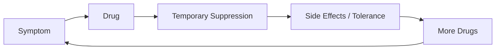

# Thuốc Hóa Dầu (Petrochemical Medicine)

**Thuốc Hóa Dầu là cách gọi phê phán nền y học dược phẩm hiện đại khi nó ưu tiên molecule tổng hợp, patent, symptom management và chronic treatment hơn terrain, dinh dưỡng, ánh sáng, giấc ngủ, khoáng chất và khả năng tự chữa của cơ thể. Vấn đề không phải “mọi thuốc đều xấu”, mà là incentive của cả hệ thống đang nghiêng về quản lý bệnh hơn là phục hồi sức khỏe.**

*Petrochemical Medicine is a critical term for modern pharmaceutical medicine when it prioritizes synthetic molecules, patents, symptom management, and chronic treatment over terrain, nutrition, light, sleep, minerals, and the body's self-healing capacity. The issue is not that “all drugs are bad,” but that the system's incentives often favor disease management over health restoration.*

---

## Medical Caution / Cẩn Trọng

Không tự ý ngừng thuốc đang dùng. Một số thuốc cứu mạng thật: kháng sinh đúng lúc, insulin, thuốc cấp cứu, gây mê phẫu thuật, thuốc tim mạch trong tình huống cần thiết. Bài này là system critique, không phải lời khuyên bỏ điều trị.

---

## Evidence Discipline / Cách Đọc Claim

| Tầng | Cách đọc | Ví dụ |
|---|---|---|
| **Fact / documentable** | lịch sử Flexner, pharma settlements, side effects, patent incentives | medical education reform, drug labels |
| **Pattern / systems reading** | chronic treatment, symptom suppression, regulatory capture | patient as recurring customer |
| **Terrain view** | bệnh là môi trường cơ thể mất cân bằng | [[Thuyết Vi Sinh Nội Sinh]], [[Y Tế Tự Nhiên]] |
| **Vault synthesis** | Rockefeller medicine / petrochemical dominance | đọc như power-structure model |

---

## 1. Vấn Đề Không Phải Thuốc, Mà Là Incentive

Một viên thuốc có thể cứu người. Nhưng một hệ thống sống bằng doanh thu thuốc sẽ có incentive khác với healing thật. Nếu lợi nhuận đến từ chronic management, thì hệ thống sẽ ưu tiên:

- thuốc dùng lâu dài,
- protocol chuẩn hóa,
- symptom suppression,
- ít hỏi root cause,
- ít đầu tư vào lifestyle/terrain,
- disease category ngày càng mở rộng.

> Cured patient = lost customer là câu nói cực đoan, nhưng nó chỉ đúng vào một điểm: business model ảnh hưởng loại câu hỏi được hỏi.

---

## 2. Rockefeller / Flexner Lens

Flexner Report 1910 thường được nhắc trong alternative health như bước ngoặt chuẩn hóa y khoa Mỹ. Các trường y không đạt chuẩn bị đóng cửa, biomedical/allopathic model thắng thế, còn nhiều truyền thống như herbalism, homeopathy, midwifery bị đẩy ra rìa.

Cách đọc disciplined:

- Chuẩn hóa y khoa có mặt tốt: hygiene, anatomy, surgery, training.
- Nhưng chuẩn hóa cũng tập trung quyền lực vào model được funding mạnh.
- Khi oil/pharma capital đi cùng medical education, câu hỏi về incentive là hợp lý.

Không cần nói “mọi thứ là âm mưu 100%” để thấy: y học hiện đại phát triển trong cấu trúc quyền lực/tài chính cụ thể.

---

## 3. Allopathic Loop

Loop này không xảy ra với mọi bệnh, nhưng rất phổ biến trong chronic disease:

- huyết áp,
- tiểu đường type 2,
- trầm cảm/anxiety,
- acid reflux,
- autoimmune symptoms,
- pain management.

Câu hỏi redpill không phải “thuốc có tác dụng không?”. Nhiều thuốc có tác dụng. Câu hỏi là: **nó chữa root cause hay quản lý biểu hiện?**

---

## 4. Terrain Bị Lãng Quên

[[Thuyết Vi Sinh Nội Sinh]] và [[Y Tế Tự Nhiên]] đặt lại câu hỏi:

- cơ thể thiếu gì?
- đang dư độc gì?
- ngủ ra sao?
- ánh sáng/nắng ra sao?
- khoáng chất ra sao?
- stress/nervous system ra sao?
- microbiome/tiêu hóa ra sao?
- quan hệ/cảm xúc có đang đầu độc terrain không?

Nếu terrain không đổi, thuốc chỉ đè symptom có thể làm vấn đề đi sâu hơn.

---

## 5. Petrochemical Logic

Nhiều thuốc hiện đại là molecule tổng hợp, có thể patent, sản xuất hàng loạt, bán theo protocol. Đây là model phù hợp với industrial capitalism. Những thứ khó patent thì ít hấp dẫn hơn:

- nắng,
- ngủ,
- fasting,
- breath,
- muối/khoáng,
- thực phẩm thật,
- movement,
- community,
- trauma healing.

Không phải vì chúng vô dụng. Vì chúng khó độc quyền.

---

## 6. Khi Nào Thuốc Là Cần Thiết?

Một critique trưởng thành phải thừa nhận:

- emergency medicine rất mạnh,
- surgery có thể cứu mạng,
- antibiotics đúng lúc là kỳ tích,
- insulin type 1 là thiết yếu,
- pain control có chỗ đúng,
- psychiatric meds đôi khi giúp người qua crisis.

Vấn đề là khi emergency logic được dùng cho chronic terrain problem suốt đời.

---

## 7. Health Sovereignty Frame

Không chống thuốc mù quáng. Không thờ thuốc mù quáng. Hỏi:

1. Thuốc này giải quyết root cause hay symptom?
2. Dùng ngắn hạn hay lifelong?
3. Side effects là gì?
4. Có cách thay đổi terrain song song không?
5. Ai hưởng lợi nếu mình dùng mãi?
6. Có marker nào để biết mình cải thiện thật không?

---

## Synthesis

Thuốc Hóa Dầu là node giúp nhìn y học hiện đại như một industrial system. Nó có thành tựu thật, nhưng cũng có incentive thật. Một người tỉnh không phủ định thuốc. Họ phủ định việc biến thuốc thành tôn giáo duy nhất.

> Y học cứu mạng khi dùng đúng chỗ. Nhưng khi nó quên terrain, nó có thể biến cơ thể sống thành khách hàng suốt đời.

---

## Related

- [[Kính Chiếu Yêu - Nhìn Thấu Tây Y]]
- [[Y Tế Tự Nhiên]]
- [[Thuyết Vi Sinh Nội Sinh]]
- [[Khế Ước Bí Mật Rockefeller]]
- [[MOC - Health Sovereignty]]