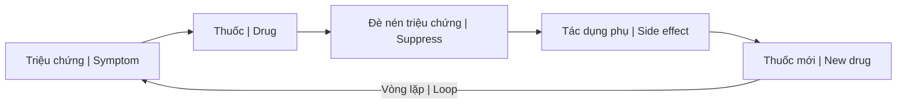

# Thuốc Hóa Dầu (Petrochemical Medicine)

**Thuốc Hóa Dầu** là các dược phẩm có nguồn gốc từ hóa chất chưng cất dầu mỏ. Nền tảng của y học hiện đại được thiết lập để thay thế tri thức y học tự nhiên.

*Petrochemical Medicine refers to pharmaceuticals derived from petroleum-based chemicals. The foundation of modern medicine was established to replace natural medical knowledge.*

---

## Lịch Sử: Rockefeller Medicine / History: Rockefeller Medicine

### Trước 1910 / Before 1910

| Đặc điểm / Feature | Chi tiết / Detail |
|--------------------|-------------------|
| Y học tự nhiên phổ biến | Natural medicine widespread |
| Homeopathy, herbalism | Vi lượng đồng căn, thảo dược |
| Thầy thuốc địa phương | Local healers, midwives |
| Giá cả phải chăng | Affordable, accessible |

### Flexner Report (1910)

| Sự kiện / Event | Hệ quả / Consequence |
|-----------------|----------------------|
| Tài trợ bởi Carnegie & Rockefeller | Funded by Carnegie & Rockefeller |
| "Chuẩn hóa" giáo dục y khoa | "Standardized" medical education |
| **80% trường y đóng cửa** | **80% medical schools closed** |
| Chỉ còn y học dựa trên thuốc | Only allopathic (drug-based) medicine remained |

### Tại sao? / Why?

- Rockefeller sở hữu Standard Oil / Rockefeller owned Standard Oil
- Hóa dầu = nguyên liệu làm thuốc / Petrochemicals = base for drugs
- Tạo nhu cầu cho sản phẩm của mình / Create demand for own products

→ Xem thêm: [[Khế Ước Bí Mật Rockefeller]]

---

## Cơ Chế Hoạt Động / How It Works

### Mô hình Allopathic / Allopathic Model

### So sánh / Comparison

| Y học Allopathic | Y học Tự nhiên |
|------------------|----------------|
| Trị triệu chứng / Treat symptoms | Trị gốc / Treat root cause |
| Đè nén nhanh / Quick suppression | Chữa lành chậm hơn / Slower healing |
| Nhiều tác dụng phụ / Side effects | Ít tác dụng phụ / Fewer side effects |
| Phụ thuộc thuốc / Dependency | Tự chữa lành / Self-healing |
| Đắt đỏ / Expensive | Phải chăng / Affordable |

---

## Vấn Đề / Problems

### 1. Không chữa tận gốc / Never Cured, Only "Managed"

| Bệnh / Disease | "Điều trị" / "Treatment" |
|----------------|--------------------------|
| Cao huyết áp | Thuốc suốt đời / Lifelong medication |
| Tiểu đường | Insulin suốt đời / Lifelong insulin |
| Trầm cảm | SSRIs suốt đời / Lifelong SSRIs |

> **"Bệnh nhân được chữa = khách hàng bị mất"**
>
> *"Cured patient = lost customer"*

### 2. Tác dụng phụ / Side Effects

| Vấn đề / Issue | Chi tiết / Detail |
|----------------|-------------------|
| Nguyên nhân tử vong #3 | 3rd leading cause of death (iatrogenic) |
| Khủng hoảng opioid | Opioid crisis (Purdue Pharma) |
| Tương tác thuốc | Drug interactions |
| Kháng kháng sinh | Antibiotic resistance |

### 3. Động lực tài chính / Financial Incentive

| Sự thật / Truth | Hệ quả / Consequence |
|-----------------|----------------------|
| Dân bệnh = lợi nhuận | Sick population = profitable |
| Phòng ngừa không sinh lời | Prevention doesn't pay |
| Thiên vị nghiên cứu | Research bias (funding source) |
| FDA "cửa xoay" | FDA revolving door |

### 4. Đàn áp y học thay thế / Suppression of Alternatives

| Phương pháp / Method | Chi tiết / Detail |
|----------------------|-------------------|
| Bôi nhọ thuốc tự nhiên | Natural cures discredited |
| Gán nhãn "lang băm" | "Quackery" label |
| Bỏ qua [[Thuyết Vi Sinh Nội Sinh]] | Terrain theory ignored |

---

## Ví Dụ / Examples

### Thuốc gốc hóa dầu phổ biến / Common Petrochemical Drugs

| Thuốc / Drug | Gốc / Origin |
|--------------|--------------|
| Aspirin | Dẫn xuất salicylic acid |
| Nhiều kháng sinh | Synthetic |
| Vitamin tổng hợp | Synthetic vitamins |
| Hóa trị | Chemotherapy agents |

### Đã thay thế cái gì? / What They Replaced

| Tự nhiên / Natural | Hóa dầu / Petrochemical |
|--------------------|-------------------------|
| Vỏ cây liễu / Willow bark | Aspirin |
| Thảo dược kháng khuẩn | Antibiotics |
| Dưỡng chất từ thực phẩm | Synthetic vitamins |
| Hỗ trợ terrain | Chemotherapy |

---

## Giải Pháp Thay Thế / The Alternative

### [[Thuyết Vi Sinh Nội Sinh]] / Terrain Theory

| Nguyên lý / Principle | Ý nghĩa / Meaning |
|-----------------------|-------------------|
| Cơ thể tự chữa lành | Body heals itself when terrain correct |
| Bệnh = độc + thiếu hụt | Disease = toxicity + deficiency |
| Làm sạch terrain | Clean the terrain, disease disappears |

### Phương pháp tự nhiên / Natural Approaches

| Phương pháp / Method | Tác dụng / Effect |
|----------------------|-------------------|
| Dinh dưỡng whole foods | Nutrition |
| Thảo dược | Herbal medicine |
| [[Plasma Quinton]] | Ocean minerals |
| Nhịn ăn, detox | Fasting, detox |
| [[Muối - Ký Ức Biển Cả và Lời Tiên Tri Về Sự Thức Tỉnh]] | Minerals |

---

## Kết Luận / Conclusion

> **Y học hiện đại không được thiết kế để chữa bệnh — nó được thiết kế để quản lý triệu chứng và tạo khách hàng suốt đời.**
>
> *Modern medicine wasn't designed to cure — it was designed to manage symptoms and create lifelong customers.*

---

## Related / Liên quan

### Lịch sử & Kiểm soát / History & Control
- [[Khế Ước Bí Mật Rockefeller]] — The secret contract
- [[Elite]] — Who benefits
- [[Vận Chín, Người Kogi và Ma Trận Y Tế]] — Medical matrix

### Y học thay thế / Alternative Medicine
- [[Thuyết Vi Sinh Nội Sinh]] — Terrain theory
- [[Plasma Quinton]] — Ocean minerals
- [[Muối - Ký Ức Biển Cả và Lời Tiên Tri Về Sự Thức Tỉnh]] — Salt
- [[Cơ Chế Tự Bảo Vệ Của Cơ Thể]] — Body's self-defense
