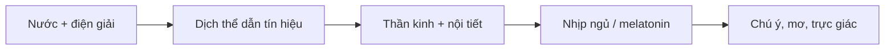

# Tần Số Cộng Hưởng Giữa Muối và Tuyến Tùng

**Muối và tuyến tùng không nên được đọc như một công thức "kích hoạt con mắt thứ ba" đơn giản. Đây là một node giao nhau giữa điện giải học, nhịp sinh học, biểu tượng biển-muối, và giả thuyết cộng hưởng của thân thể với môi trường.** Muối là tầng vật chất: ion, dịch thể, dẫn truyền thần kinh. Tuyến tùng là tầng nhịp: melatonin, bóng tối, chu kỳ ngày đêm. Khi vault đặt hai thứ này cạnh nhau, điểm chính không phải là bán protocol thần bí, mà là hỏi: thân thể có phải một hệ tín hiệu bị cắt khỏi môi trường tự nhiên bởi nước chết, ánh sáng giả, đồ ăn công nghiệp và nỗi sợ y tế?

*Salt and the pineal gland should not be read as a simple third-eye activation recipe. This note maps the overlap between electrolytes, circadian rhythm, sea symbolism, and the speculative idea of bodily resonance.*

---

## Vault Position / Vị Trí Trong Vault

Bài này nằm trong cụm [[MOC - Health Sovereignty]] nhưng chạm mạnh sang esoterica. Nó nối [[Muối - Ký Ức Biển Cả và Lời Tiên Tri Về Sự Thức Tỉnh]], [[Plasma Quinton]], [[Tuyến Tùng]], [[Tần Số Schumann]] và [[Y Tế Tự Nhiên]]. Nếu đọc như y khoa, nó nói về điện giải, giấc ngủ, ánh sáng và hydration. Nếu đọc như biểu tượng, nó nói về biển bên trong cơ thể và "antenna" của ý thức.

Đây là bài cầu nối, không phải medical protocol.

---

## Evidence Discipline / Kỷ Luật Bằng Chứng

| Tầng | Cách đọc đúng | Ví dụ |
|---|---|---|
| Fact / physiology | cơ chế điện giải, sodium-potassium pump, hydration, melatonin, ánh sáng ảnh hưởng circadian rhythm | muối cần cho dẫn truyền thần kinh; tuyến tùng tiết melatonin |
| Research / emerging | fluoride, calcification, vi khoáng, stress, giấc ngủ, ánh sáng xanh | có dữ liệu về fluoride tích lũy ở mô vôi hóa; ý nghĩa lâm sàng còn cần thận trọng |
| Pattern / systems | thực phẩm công nghiệp làm lệch cảm giác khát-mặn-ngủ; y tế thường tách cơ thể khỏi môi trường | refined salt, processed food, screen light, chronic stress |
| Symbol / speculative | muối như ký ức biển; tuyến tùng như antenna; cộng hưởng như ngôn ngữ giữa thân thể và trường | "third eye", Schumann resonance, nghi lễ bóng tối |

> Medical caution: Người cao huyết áp, suy thận, bệnh tim, đang dùng thuốc lợi tiểu/thuốc huyết áp, hoặc có rối loạn điện giải không nên tự tăng muối hay dùng supplement theo cảm hứng. Bài này giúp định vị tư duy, không thay thế bác sĩ hoặc xét nghiệm.

---

## Muối Là Điện, Không Chỉ Là Vị Mặn

Trong cơ thể, sodium không phải gia vị. Nó là một phần của gradient điện. Mỗi neuron, mỗi cơ, mỗi tín hiệu thần kinh đều dựa vào chênh lệch ion giữa trong và ngoài tế bào. Sodium-potassium pump là một trong những "máy bơm" nền của sự sống: tốn năng lượng để giữ điện thế mà từ đó tín hiệu có thể chạy.

Đọc theo ngôn ngữ redpill.wiki: ý thức không treo lơ lửng ngoài sinh học. Một người thiếu ngủ, thiếu nước, lệch điện giải, ăn đồ công nghiệp và ngồi dưới ánh sáng xanh cả ngày sẽ khó "thiền sâu" dù nói rất hay về thức tỉnh.

| Tầng muối | Điều cần phân biệt |
|---|---|
| Sodium sinh lý | cần cho điện giải, thể tích dịch, dẫn truyền thần kinh |
| Muối thực phẩm | đi cùng khẩu phần, khoáng, đồ chế biến, huyết áp, thận |
| Muối biểu tượng | biển, bảo quản, thanh tẩy, giao ước, ký ức nguyên thủy |
| Muối công nghiệp | refined salt trong thực phẩm siêu chế biến, thường đi cùng đường, dầu hạt, phụ gia |

Vấn đề không phải "muối tốt tuyệt đối" hay "muối xấu tuyệt đối". Vấn đề là context: cơ địa, thận, vận động, mồ hôi, chế độ ăn, thuốc, nước uống và mức stress.

---

## Tuyến Tùng Là Nhịp, Không Chỉ Là "Con Mắt Thứ Ba"

[[Tuyến Tùng]] thường bị kéo vào ngôn ngữ huyền học quá nhanh. Tầng fact trước: pineal gland liên quan mạnh đến melatonin và nhịp ngày đêm. Bóng tối, ánh sáng, giờ ngủ, stress và tín hiệu môi trường đều ảnh hưởng tới hệ này.

Khi truyền thống gọi nó là "third eye", có thể đọc theo ba tầng:

| Tầng đọc | Ý nghĩa |
|---|---|
| Sinh học | cơ quan nội tiết liên quan circadian rhythm |
| Tâm lý | khả năng mơ, tưởng tượng, trực giác, pattern recognition |
| Biểu tượng | điểm giao giữa ánh sáng bên ngoài và ánh sáng bên trong |

Cái cần giữ: pineal không phải nút bấm siêu năng lực. Nó là một phần của hệ nhịp. Muốn hệ nhịp khỏe thì bắt đầu từ những thứ ít glamorous: ngủ đúng, tối thật, sáng thật, ít kích thích đêm, bớt caffeine muộn, bớt màn hình trước ngủ.

---

## "Cộng Hưởng" Có Nghĩa Gì?

Trong vật lý, resonance là khi một hệ dao động nhận năng lượng hiệu quả hơn ở một dải tần phù hợp. Trong đời sống, chữ này dễ bị lạm dụng thành phép màu: cứ nói "frequency" là nghe như có khoa học. Bài này dùng "cộng hưởng" theo nghĩa kỷ luật hơn: cơ thể là hệ tín hiệu; tín hiệu tốt cần môi trường tốt.

Giả thuyết muối-tuyến tùng vì vậy không cần nhảy thẳng đến "THz kích hoạt antenna". Cách đọc chín hơn là: khoáng chất, nước, ánh sáng và nhịp sinh học tạo nền cho trạng thái ý thức ổn định hơn. Tầng metaphysical có thể được giữ như biểu tượng, nhưng không được giả dạng thành clinical evidence.

---

## Fluoride, Calcification Và Cạm Bẫy Claim Quá Đà

Trong cộng đồng alternative health, fluoride thường được nói như kẻ khóa tuyến tùng. Có một nền tảng fact đáng xem: fluoride có ái lực với mô khoáng hóa, và pineal có thể có lắng đọng khoáng. Nhưng từ đó nhảy sang "mọi fluoride đều đóng third eye" là claim quá nhanh.

Cách đọc chuẩn hơn:

1. Fluoride exposure là một biến môi trường nên theo dõi, nhất là từ nước, kem đánh răng, trà, công nghiệp.
2. Pineal calcification có tồn tại, nhưng nguyên nhân và hậu quả lâm sàng không thể giản lược thành một thủ phạm.
3. Giảm phơi nhiễm hợp lý khác với panic detox.
4. Giấc ngủ, ánh sáng và stress thường là đòn bẩy thực tế hơn cho người bình thường.

Vault có thể nghi ngờ hệ thống nước công nghiệp mà không cần biến mỗi người đọc thành bệnh nhân hoang tưởng.

---

## Protocol Tối Thiểu, Không Phô Trương

Nếu dùng bài này như thực hành, hãy bắt đầu bằng nền an toàn:

| Trục | Thực hành hợp lý | Không nên biến thành |
|---|---|---|
| Nước | uống đủ theo khát, vận động, thời tiết | ép nước vô hạn |
| Muối | dùng muối chất lượng trong bữa ăn thật, theo cơ địa | uống nước muối liều cao mỗi sáng cho mọi người |
| Ánh sáng | sáng thật ban ngày, tối thật ban đêm | nhìn mặt trời nguy hiểm |
| Giấc ngủ | giờ ngủ đều, giảm màn hình khuya | "activation ritual" thay cho ngủ |
| Theo dõi | huyết áp, thận, phù, nhịp tim nếu có rủi ro | bỏ dấu hiệu nguy hiểm vì tin protocol |

Người khỏe, vận động nhiều, ăn whole foods và đổ mồ hôi có nhu cầu điện giải khác người ít vận động, cao huyết áp hoặc suy thận. Sovereignty bắt đầu bằng phân biệt, không phải công thức chung.

---

## Tầng Biểu Tượng: Biển Bên Trong Và Antenna

[[René Quinton và Huyết Tương Biển]] đọc cơ thể như ký ức của biển. Dù cách đọc Quinton cần phân biệt rõ giữa lịch sử, nghiên cứu và biểu tượng, nó cho vault một motif mạnh: sự sống mang đại dương bên trong. Muối là dấu vết của đại dương đó. Tuyến tùng là dấu vết của nhịp ánh sáng. Một bên là nước mặn, một bên là bóng tối-ánh sáng.

Ở tầng symbolic, "cộng hưởng" nghĩa là con người trở lại đúng môi trường: ăn thật, ngủ thật, nước thật, ánh sáng thật, im lặng thật. Khi các lớp giả giảm xuống, trực giác thường sáng hơn không phải vì phép màu, mà vì nhiễu ít hơn.

---

## Chốt Lại / Core Insight

**Muối và tuyến tùng là lời nhắc rằng consciousness không thể tách khỏi dịch thể, ánh sáng, nhịp ngủ và môi trường. Tầng fact nói: hãy chăm điện giải và circadian rhythm. Tầng biểu tượng nói: hãy trả cơ thể về biển và bầu trời thật.**

*The mature reading is not "salt activates the third eye." It is that consciousness becomes clearer when the body's electrical and circadian foundations are no longer sabotaged.*
