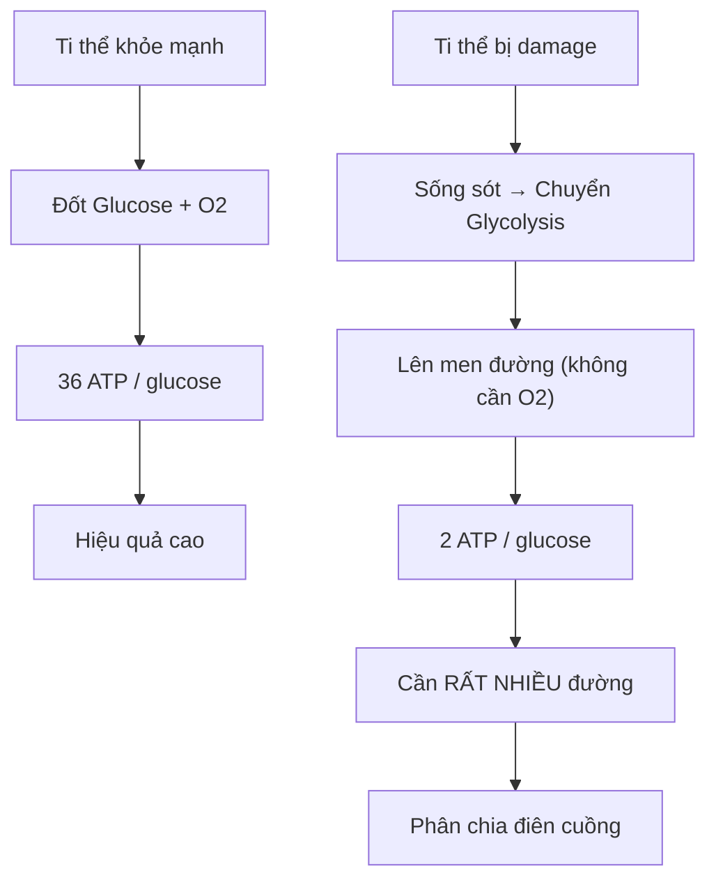
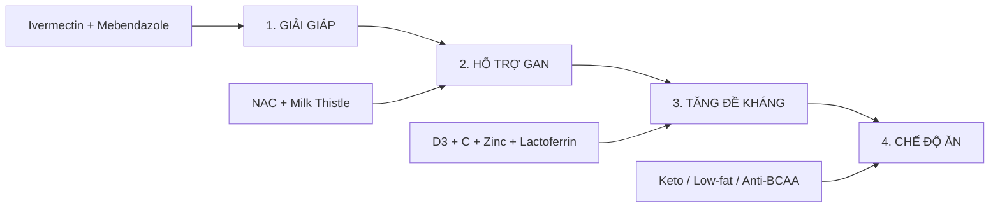
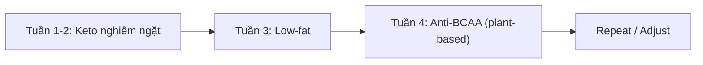
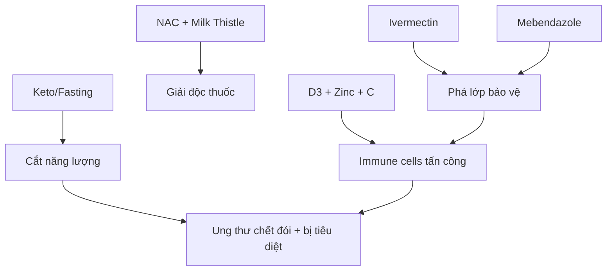

# Ung Thư — Metabolic Protocol

Hướng dẫn toàn diện về ung thư từ góc nhìn **chuyển hóa (metabolic)** — không phải đột biến gen, mà là **ti thể bị lỗi**. Bao gồm cơ chế, phòng ngừa, và protocol điều trị thay thế.

*Comprehensive guide to cancer from a metabolic perspective — not genetic mutation, but mitochondrial dysfunction. Includes mechanism, prevention, and alternative treatment protocols.*

> **Disclaimer:** Bài viết chỉ mang tính tham khảo. Không thay thế tư vấn y khoa chuyên nghiệp.

---

## Ung Thư Là Gì? / What Is Cancer?

### Mainstream View vs Metabolic View

| Góc nhìn | Mainstream | Metabolic (Warburg) |
|----------|------------|---------------------|
| **Nguyên nhân** | Đột biến gen | Ti thể bị lỗi |
| **Cơ chế** | DNA damage → uncontrolled growth | Glycolysis thay vì oxidative phosphorylation |
| **Giải pháp** | Chemo, radiation, surgery | Starve + repair mitochondria |

### Warburg Effect (Nobel Prize 1931)

**Tóm lại:**
- Ti thể khỏe: 1 glucose → **36 ATP** (cần oxy)
- Ti thể lỗi (ung thư): 1 glucose → **2 ATP** (không cần oxy)
- → Tế bào ung thư **đói đường**, tiêu thụ gấp 18 lần!

---

## Nguyên Nhân Ti Thể Bị Lỗi / Why Mitochondria Fail

### "Bóp mũi" Ti thể — Thiếu Oxy

| Nguyên nhân | Mô tả |
|-------------|-------|
| **Béo phì, ít vận động** | Không đủ oxy đưa vào cơ bắp/tế bào |
| **Phòng ngột ngạt** | Môi trường thiếu oxy |
| **Vi nhựa + Hóa chất** | Chặn "lỗ mũi" tế bào |
| **Bức xạ** | Damage trực tiếp DNA ti thể |

### Nguồn Vi nhựa & Hóa chất Hàng Ngày

- 🫖 Trà túi lọc (microplastic)
- 🥤 Ly nhựa, chai nhựa
- 🍜 Nước lèo bún phở đựng bịch nilon
- 🍳 Chảo chống dính (PFAS)
- 🧴 Mỹ phẩm, kem chống nắng

---

## Phòng Ngừa / Prevention

### Cho Ti Thể "Thở" Được

| Hành động | Mục đích |
|-----------|----------|
| **Vận động thường xuyên** | Đưa oxy vào tế bào |
| **Thở Wim Hof / Oxygen Advantage** | Tăng oxy máu |
| **Sauna** | Thải vi nhựa qua mồ hôi |
| **Giảm nhựa & hóa chất** | Bớt chặn "lỗ mũi" tế bào |

### Đừng Nuôi Tế Bào Ung Thư

| Hành động | Mục đích |
|-----------|----------|
| **Giữ đường huyết thấp** | Không cho "thức ăn" |
| **Prolonged fasting** (nhịn ăn kéo dài) | Bỏ đói ung thư, bật autophagy |
| **Ketosis** (chế độ keto) | Đốt mỡ thay đường |

---

## Protocol Điều Trị / Treatment Protocol

### Overview: 4 Trụ Cột

---

### 1️⃣ Giải Giáp (Disarm Cancer Cells)

Tế bào ung thư rất ma mãnh — có nhiều cách qua mặt hệ miễn dịch. Cần "giải giáp" trước.

#### Ivermectin

| Mục đích | Liều điều trị | Liều phòng ngừa |
|----------|---------------|-----------------|
| Giải giáp ung thư | 1mg/kg, 7 ngày liên tục | 50% liều, 3 ngày/tuần |

**Cách dùng:**
- Uống lúc **bụng rỗng** (sáng sớm)
- **Nhai nát** + uống với **dầu olive** (tăng hấp thu)
- Uống **TẤT CẢ** cùng 1 lúc

#### Mebendazole (Fugacar)

| Mục đích | Liều điều trị | Liều phòng ngừa |
|----------|---------------|-----------------|
| Giải giáp ung thư | 500-1000mg/ngày, 6 on/1 off | 50% liều, 3 ngày/tuần |

**Cách dùng:**
- Uống lúc **bụng rỗng** (sáng sớm)
- **Nhai nát** + uống với **dầu olive**
- **Chia 2 lần/ngày** (thời gian bán hủy ngắn hơn Ivermectin)

> Xem thêm: [[Mebendazole - Thuốc Tẩy Giun Chống Ung Thư]] — Chi tiết cơ chế 6 tác động

---

### 2️⃣ Hỗ Trợ Gan (Liver Support)

Gan cần giải độc Ivermectin và Mebendazole.

| Supplement | Liều | Cách dùng |
|------------|------|-----------|
| **NAC** (N-Acetyl Cysteine) | 1200mg | Bụng rỗng |
| **Milk Thistle** (Silymarin) | 500mg | Cùng bữa ăn (tan trong chất béo) |

---

### 3️⃣ Tăng Đề Kháng (Boost Immunity)

Sau khi ung thư bị "giải giáp", hệ miễn dịch sẽ đi dọn dẹp.

| Supplement | Liều | Ghi chú |
|------------|------|---------|
| **Vitamin D3** | 10,000-50,000 IU | Ung thư tiết chất chặn hấp thu D3 → cần liều cao |
| **Magnesium Bisglycinate** | 300mg | Cần để D3 chuyển sang dạng hoạt tính |
| **Phơi nắng** | 30 phút, 8-9h sáng | Nguồn D3 tự nhiên |
| **Vitamin C** | Từ thực phẩm | Chanh, ổi (rất nhiều C), ớt chuông, rau xanh |
| **Lactoferrin** | Standard dose | Tăng đề kháng (mua ở Concung) |
| **Zinc Bisglycinate** | 50mg/ngày | Chọn dạng Bisglycinate để hấp thu tốt |
| **Hít thở không khí trong lành** | Daily | |
| **Tập thể dục** | Daily | Đưa oxy vào tế bào |

---

### 4️⃣ Chế Độ Ăn (Starve Cancer)

**Key insight:** Ung thư biết thích nghi → cần **rotate** chế độ ăn!

#### Xác Định Loại Nhiên Liệu

| Loại ung thư | Fuel chính | Strategy |
|--------------|------------|----------|
| **Vú, phổi, đại tràng, não (glioblastoma)** | Glucose | **Anti-Glucose (Keto)** |
| **Tuyến tiền liệt** | Lipid | Anti-glucose 2-3 ngày → **Low-fat** |
| **Gan** | BCAA | Anti-glucose → **Anti-BCAA** |

#### Chiến Lược Rotate

> **Tài liệu chi tiết:** [Dr. Berg - 5 Diet Strategies for Cancer Care](https://www.drberg.com/wp-content/uploads/2026/04/5-Diet-Strategies-for-Cancer-Care_03.04.26-low.pdf)

---

## Tại Sao Protocol Này Hoạt Động?

### Synergy của 4 Trụ Cột

---

## Cảnh Báo & Lưu Ý / Warnings

| ⚠️ Risk | Mô tả |
|---------|-------|
| **Không thay thế điều trị chính thống** | Protocol này là **bổ sung**, không phải thay thế |
| **Cần xét nghiệm** | Xác định loại ung thư để chọn chế độ ăn đúng |
| **Theo dõi gan** | Ivermectin + Mebendazole liều cao cần support gan |
| **Tư vấn bác sĩ** | Đặc biệt nếu đang dùng thuốc khác |
| **U thư nặng** | Cần tăng liều — tham khảo specialist |

---

## Related

### Protocol Components
- [[Mebendazole - Thuốc Tẩy Giun Chống Ung Thư]] — Chi tiết 6 cơ chế
- [[Suramin]] — Anti-parasitic, Third Eye
- [[Y Tế Tự Nhiên]] — Natural health framework

### Theory
- [[Thuyết Vi Sinh Nội Sinh]] — Terrain theory
- [[Kính Chiếu Yêu - Nhìn Thấu Tây Y]] — Góc nhìn khác về ung thư
- [[The China Study]] — Diet & cancer connection

### Lifestyle
- [[Prolonged Fasting]] — Autophagy activation
- [[Ketogenic Diet]] — Starve cancer cells
