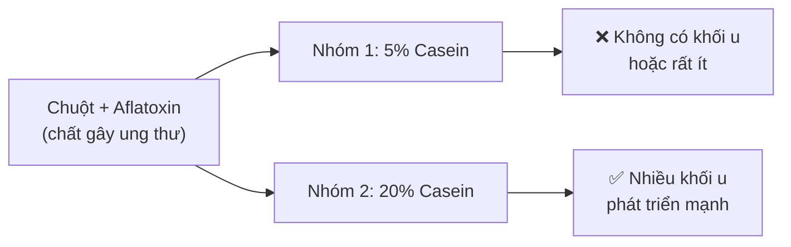
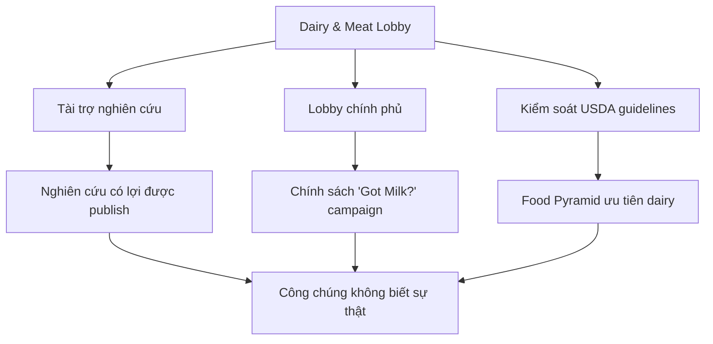
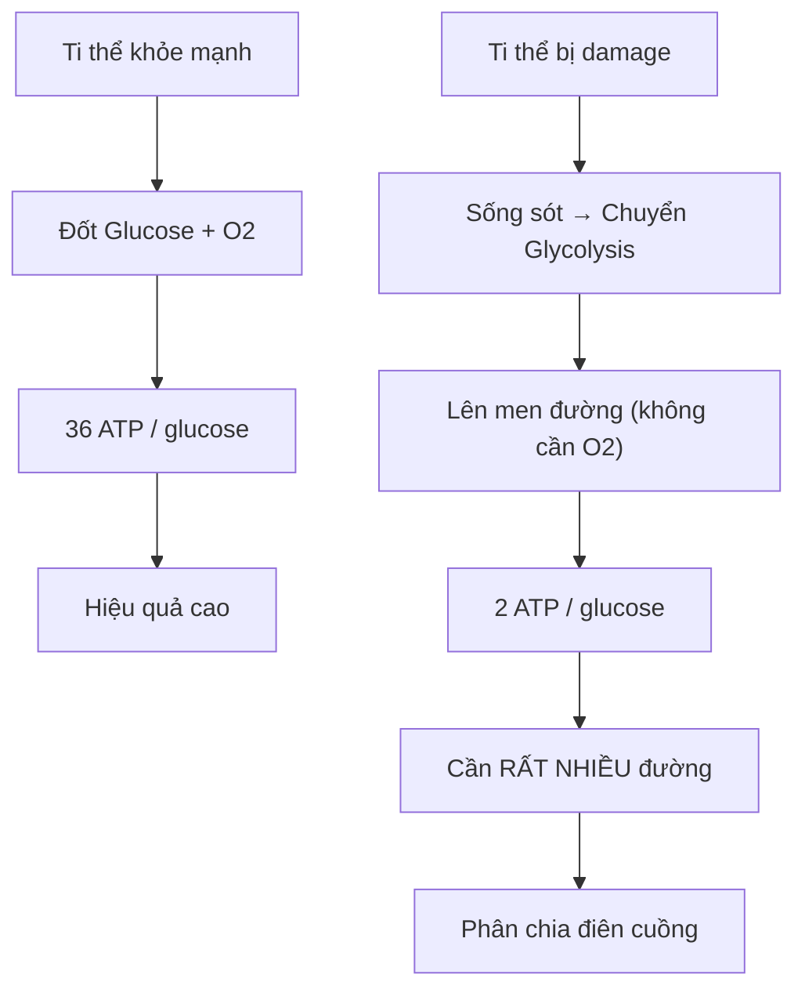
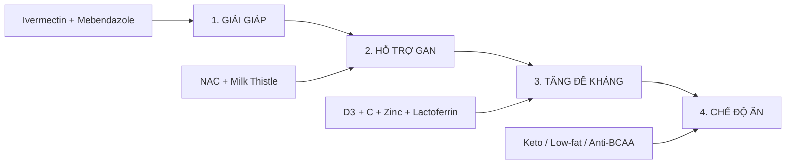
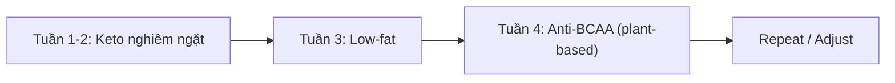
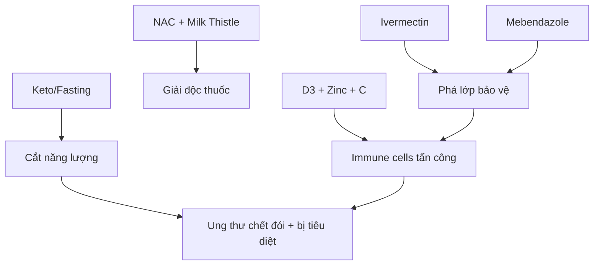

# Ung Thư — Metabolic Protocol

Hướng dẫn toàn diện về ung thư từ góc nhìn **chuyển hóa (metabolic)** — không phải đột biến gen, mà là **ti thể bị lỗi**. Bao gồm cơ chế, phòng ngừa, và protocol điều trị thay thế.

*Comprehensive guide to cancer from a metabolic perspective — not genetic mutation, but mitochondrial dysfunction. Includes mechanism, prevention, and alternative treatment protocols.*

> **Disclaimer:** Bài viết chỉ mang tính tham khảo. Không thay thế tư vấn y khoa chuyên nghiệp. Ung thư là tình trạng nghiêm trọng; mọi thay đổi lớn về điều trị, thuốc, fasting, keto, hoặc repurposed drugs cần được cân nhắc với người có chuyên môn và theo dõi bằng dữ liệu.

---

## Evidence Discipline / Cách Đọc Protocol Này

Bài này dùng giọng mạnh vì nó là một metabolic/terrain counter-frame với oncology chính thống. Nhưng cần đọc đúng tầng claim:

| Tầng | Cách đọc | Ví dụ |
|---|---|---|
| **Fact / documentable** | cơ chế sinh học hoặc phân loại có nguồn kiểm được | Warburg effect, IARC processed meat Group 1, insulin/glucose metabolism |
| **Research / emerging** | có nghiên cứu nhưng còn tùy cancer type, context, trial quality | keto adjunct therapy, fasting around treatment, drug repurposing |
| **Pattern / systems reading** | incentive của oncology/pharma/food system | chronic treatment, lobby, funding bias, dietary guideline politics |
| **Vault synthesis** | terrain/metabolic protocol tổng hợp nhiều hướng | mitochondria, detox, fasting, keto, antiparasitic repurposing |

Không nên đọc bài này như “bỏ hết điều trị chính thống”. Cách đọc đúng là: hiểu thêm một frame metabolic/terrain để đặt câu hỏi tốt hơn, giảm blind trust, và biết cần theo dõi dữ liệu gì.

> Strong synthesis is not permission for reckless certainty.

---

## Medical Caution / Cảnh Báo Y Tế

Ung thư không phải vùng để tự thử protocol internet. Bài này không bảo bỏ phẫu thuật, hóa trị, xạ trị, miễn dịch trị liệu, xét nghiệm, chẩn đoán mô học hoặc theo dõi bác sĩ. Nếu đang có khối u, sụt cân nhanh, đau tăng, chảy máu, khó thở, vàng da, rối loạn thần kinh, sốt kéo dài hoặc tác dụng phụ nặng, ưu tiên chăm sóc y tế trực tiếp.

Các phần về fasting, keto, ivermectin, mebendazole, vitamin D liều cao, supplement và "repurposed drugs" phải được đọc như **research / protocol discussion**, không phải đơn thuốc. Chúng có thể tương tác với điều trị ung thư, thuốc chống đông, thuốc gan-thận, thuốc tiểu đường, thuốc huyết áp và tình trạng suy kiệt.

> Terrain thinking giúp đặt câu hỏi tốt hơn. Nó không biến người bệnh thành bác sĩ của chính mình trong một ca ung thư phức tạp.

---

## Claim-Layer Register / Sổ Phân Tầng Claim

| Claim trong bài | Tầng đọc đúng | Ghi chú nguồn |
|---|---|---|
| Warburg effect, glycolysis, PET scan dùng glucose metabolism | **Fact / documentable** | cần đối chiếu textbook/review oncology metabolism |
| Processed meat Group 1, red meat Group 2A | **Fact / documentable** | WHO/IARC Monographs |
| Keto, fasting, fasting-mimicking diet trong cancer care | **Research / emerging** | phụ thuộc cancer type, giai đoạn, dinh dưỡng, trial quality |
| Mebendazole/ivermectin như adjunct cancer candidates | **Research / emerging** | drug-repurposing literature; không phải standard care |
| Meat/dairy lobby, funding bias, medical-industrial incentive | **Pattern / systems reading** | cần regulatory/funding/industry records |
| "Cancer là terrain/metabolic collapse" | **Vault synthesis** | counter-frame, không thay thế chẩn đoán mô học |
| "Tumor gom độc", "acid/toxin sinh u" | **Speculative terrain language** | dùng như ẩn dụ/synthesis, không trình bày như cơ chế consensus |

---

## Thịt, Sữa & Bệnh Văn Minh / Meat, Dairy & Modern Disease

### Conspiracy Đã Được Chứng Minh

Từ năm **1971**, khi Nixon khởi động "War on Cancer", Mỹ đã phát hiện mối liên hệ giữa **thịt đỏ, sữa bò** và các bệnh **ung thư, tim mạch**. Nhưng thông tin này bị **ém nhẹm** bởi lobby ngành công nghiệp thực phẩm.

*Since 1971, when Nixon launched the "War on Cancer", the US discovered the link between red meat, dairy and cancer, heart disease. But this information was suppressed by the food industry lobby.*

### The China Study (T. Colin Campbell)

| Phát hiện | Chi tiết |
|-----------|----------|
| **Nghiên cứu** | 20 năm, 6,500 người, 65 quận ở Trung Quốc |
| **Kết luận** | Tiêu thụ animal products → tăng ung thư, tim mạch, tiểu đường |
| **Casein (protein sữa)** | Bật/tắt tăng trưởng khối u như công tắc đèn |
| **NY Times gọi** | "Grand Prix of Epidemiology" |

### Thí Nghiệm Casein Trên Chuột

**Kết luận:** Protein từ sữa bò (casein) hoạt động như **phân bón cho ung thư** — càng nhiều casein, khối u càng phát triển nhanh.

### WHO/IARC 2015 — Bị Ép Phải Công Bố

| Phân loại | Loại thực phẩm | Ý nghĩa |
|-----------|----------------|---------|
| **Group 1** | Thịt chế biến (xúc xích, bacon, ham) | **Gây ung thư ở người** (như thuốc lá, asbestos) |
| **Group 2A** | Thịt đỏ (bò, heo, cừu) | **Có thể gây ung thư** |

> 22 chuyên gia từ 10 quốc gia đã review **800+ nghiên cứu** để đi đến kết luận này.

### Tại Sao Bị Ém Thông Tin?

**Stanford Study (2023):** Chứng minh meat & dairy lobby đã ảnh hưởng đến regulations và funding để bóp nghẹt cạnh tranh từ alternative products.

### Cơ Chế: Axit + Độc Tố → U

| Bước | Quá trình |
|------|-----------|
| 1 | Tiêu thụ thịt đỏ, sữa → tạo **môi trường axit** trong máu |
| 2 | Axit + độc tố tích tụ tại **điểm yếu nhất** của cơ thể |
| 3 | Tế bào tại đó bị stress → ti thể damage |
| 4 | Ti thể chuyển sang **glycolysis** → ung thư hình thành |
| 5 | Tiếp tục ăn thịt sữa = tiếp tục **nuôi khối u** |

### Giải Pháp Gốc Rễ

| Hành động | Tác dụng |
|-----------|----------|
| **Giảm/bỏ thịt đỏ + sữa bò** | Cắt nguồn axit, giảm casein |
| **Ưu tiên plant-based** | Kiềm hóa cơ thể |
| **Detox đường tiêu hóa** | Coffee enema, fiber, probiotics |
| **Fasting định kỳ** | Autophagy — dọn dẹp tế bào hư |

> **Nixon's War on Cancer đã thất bại** vì tập trung vào **chữa triệu chứng** (chemo, radiation) thay vì **chữa nguyên nhân** (diet). $200+ billion đã chi ra, tỷ lệ ung thư vẫn tăng.

---

## Ung Thư Là Gì? / What Is Cancer?

### Mainstream View vs Metabolic View

| Góc nhìn | Mainstream | Metabolic (Warburg) |
|----------|------------|---------------------|
| **Nguyên nhân** | Đột biến gen | Ti thể bị lỗi |
| **Cơ chế** | DNA damage → uncontrolled growth | Glycolysis thay vì oxidative phosphorylation |
| **Giải pháp** | Chemo, radiation, surgery | Starve + repair mitochondria |

### Warburg Effect (Nobel Prize 1931)

**Tóm lại:**
- Ti thể khỏe: 1 glucose → **36 ATP** (cần oxy)
- Ti thể lỗi (ung thư): 1 glucose → **2 ATP** (không cần oxy)
- → Tế bào ung thư **đói đường**, tiêu thụ gấp 18 lần!

---

## Nguyên Nhân Ti Thể Bị Lỗi / Why Mitochondria Fail

### "Bóp mũi" Ti thể — Thiếu Oxy

| Nguyên nhân | Mô tả |
|-------------|-------|
| **Béo phì, ít vận động** | Không đủ oxy đưa vào cơ bắp/tế bào |
| **Phòng ngột ngạt** | Môi trường thiếu oxy |
| **Vi nhựa + Hóa chất** | Chặn "lỗ mũi" tế bào |
| **Bức xạ** | Damage trực tiếp DNA ti thể |

### Nguồn Vi nhựa & Hóa chất Hàng Ngày

- 🫖 Trà túi lọc (microplastic)
- 🥤 Ly nhựa, chai nhựa
- 🍜 Nước lèo bún phở đựng bịch nilon
- 🍳 Chảo chống dính (PFAS)
- 🧴 Mỹ phẩm, kem chống nắng

---

## Phòng Ngừa / Prevention

### Cho Ti Thể "Thở" Được

| Hành động | Mục đích |
|-----------|----------|
| **Vận động thường xuyên** | Đưa oxy vào tế bào |
| **Thở Wim Hof / Oxygen Advantage** | Tăng oxy máu |
| **Sauna** | Thải vi nhựa qua mồ hôi |
| **Giảm nhựa & hóa chất** | Bớt chặn "lỗ mũi" tế bào |

### Đừng Nuôi Tế Bào Ung Thư

| Hành động | Mục đích |
|-----------|----------|
| **Giữ đường huyết thấp** | Không cho "thức ăn" |
| **Prolonged fasting** (nhịn ăn kéo dài) | Bỏ đói ung thư, bật autophagy |
| **Ketosis** (chế độ keto) | Đốt mỡ thay đường |

---

## Protocol Điều Trị / Treatment Protocol

Phần này là **map of claims** đang lưu hành trong metabolic/repurposed-drug circles, không phải toa thuốc. Nếu dùng để nghiên cứu cá nhân, hãy tách rõ: cái nào là standard oncology, cái nào là clinical trial, cái nào là preclinical signal, cái nào là anecdote. Không có tầng nào trong bài này cho phép tự ngưng điều trị đang theo dõi.

### Overview: 4 Trụ Cột

---

### 1️⃣ Giải Giáp (Disarm Cancer Cells)

Tế bào ung thư rất ma mãnh — có nhiều cách qua mặt hệ miễn dịch. Cần "giải giáp" trước.

#### Ivermectin

**Claim layer:** repurposed-drug discussion / internet protocol. Cần nguồn clinical oncology cụ thể trước khi xem như can thiệp có lợi. Liều cao hoặc kéo dài có thể gây rủi ro thần kinh, gan, tương tác thuốc và sai lệch thời điểm điều trị.

| Mục đích được claim online | Liều được nhắc trong protocol circles | Cách đọc đúng |
|----------|---------------|-----------------|
| Giải giáp ung thư | 1mg/kg, 7 ngày liên tục | **Không phải khuyến nghị dùng**; cần bác sĩ, nguồn lâm sàng và theo dõi độc tính |

**Cách dùng:**
- Uống lúc **bụng rỗng** (sáng sớm)
- **Nhai nát** + uống với **dầu olive** (tăng hấp thu)
- Uống **TẤT CẢ** cùng 1 lúc

#### Mebendazole (Fugacar)

**Claim layer:** drug-repurposing candidate. Có tín hiệu cơ chế và một số nghiên cứu nhỏ/case reports, nhưng không phải standard cancer treatment. Cần theo dõi gan, công thức máu, tương tác thuốc và bối cảnh điều trị.

| Mục đích được claim online | Liều được nhắc trong protocol circles | Cách đọc đúng |
|----------|---------------|-----------------|
| Giải giáp ung thư | 500-1000mg/ngày, 6 on/1 off | **Không phải khuyến nghị dùng**; off-label/high-dose cần supervision |

**Cách dùng:**
- Uống lúc **bụng rỗng** (sáng sớm)
- **Nhai nát** + uống với **dầu olive**
- **Chia 2 lần/ngày** (thời gian bán hủy ngắn hơn Ivermectin)

> Xem thêm: [[Mebendazole - Thuốc Tẩy Giun Chống Ung Thư]] — Chi tiết cơ chế 6 tác động

---

### 2️⃣ Hỗ Trợ Gan (Liver Support)

Gan cần giải độc Ivermectin và Mebendazole.

| Supplement | Liều | Cách dùng |
|------------|------|-----------|
| **NAC** (N-Acetyl Cysteine) | 1200mg | Bụng rỗng |
| **Milk Thistle** (Silymarin) | 500mg | Cùng bữa ăn (tan trong chất béo) |

---

### 3️⃣ Tăng Đề Kháng (Boost Immunity)

Sau khi ung thư bị "giải giáp", hệ miễn dịch sẽ đi dọn dẹp.

| Supplement | Liều | Ghi chú |
|------------|------|---------|
| **Vitamin D3** | cần xét nghiệm và theo dõi chuyên môn nếu dùng liều cao | Claim "ung thư chặn hấp thu D3" cần source pass riêng; tránh tự dùng megadose |
| **Magnesium Bisglycinate** | 300mg | Cần để D3 chuyển sang dạng hoạt tính |
| **Phơi nắng** | 30 phút, 8-9h sáng | Nguồn D3 tự nhiên |
| **Vitamin C** | Từ thực phẩm | Chanh, ổi (rất nhiều C), ớt chuông, rau xanh |
| **Lactoferrin** | Standard dose | Tăng đề kháng (mua ở Concung) |
| **Zinc Bisglycinate** | 50mg/ngày | Chọn dạng Bisglycinate để hấp thu tốt |
| **Hít thở không khí trong lành** | Daily | |
| **Tập thể dục** | Daily | Đưa oxy vào tế bào |

---

### 4️⃣ Chế Độ Ăn (Starve Cancer)

**Key insight:** Ung thư biết thích nghi → cần **rotate** chế độ ăn!

#### Xác Định Loại Nhiên Liệu

| Loại ung thư | Fuel chính | Strategy |
|--------------|------------|----------|
| **Vú, phổi, đại tràng, não (glioblastoma)** | Glucose | **Anti-Glucose (Keto)** |
| **Tuyến tiền liệt** | Lipid | Anti-glucose 2-3 ngày → **Low-fat** |
| **Gan** | BCAA | Anti-glucose → **Anti-BCAA** |

#### Chiến Lược Rotate

> **Tài liệu chi tiết:** [Dr. Berg - 5 Diet Strategies for Cancer Care](https://www.drberg.com/wp-content/uploads/2026/04/5-Diet-Strategies-for-Cancer-Care_03.04.26-low.pdf)

---

## Tại Sao Protocol Này Hoạt Động?

### Synergy của 4 Trụ Cột

---

## Cảnh Báo & Lưu Ý / Warnings

| ⚠️ Risk | Mô tả |
|---------|-------|
| **Không thay thế điều trị chính thống** | Protocol này là **bổ sung**, không phải thay thế |
| **Cần xét nghiệm** | Xác định loại ung thư để chọn chế độ ăn đúng |
| **Theo dõi gan** | Ivermectin + Mebendazole liều cao/off-label cần bác sĩ theo dõi độc tính, không chỉ "support gan" bằng supplement |
| **Tư vấn bác sĩ** | Đặc biệt nếu đang dùng thuốc khác |
| **U thư nặng** | Không tự tăng liều; cần oncology team/specialist đánh giá nguy cơ-lợi ích |

---

## Publication Pack / Health Sovereignty

Bài này thuộc **Health Sovereignty Pack**: đọc cơ thể như terrain sống, nhưng không biến phản biện y tế thành recklessness.

Reading path:

1. [[Y Tế Tự Nhiên]] — body sovereignty và terrain lens.
2. [[Kính Chiếu Yêu - Nhìn Thấu Tây Y]] — medical-industrial incentives.
3. [[Thuyết Vi Sinh Nội Sinh]] — terrain theory vs germ absolutism.
4. [[Ung Thư - Metabolic Protocol]] — metabolic research literacy.
5. [[Ketogenic Diet]] — practical metabolic lever, không phải magic cure.

Rule của pack: critique system incentives, nhưng không thay thế bác sĩ bằng niềm tin Telegram.

## Related

### Protocol Components
- [[Mebendazole - Thuốc Tẩy Giun Chống Ung Thư]] — Chi tiết 6 cơ chế
- [[Suramin]] — Anti-parasitic, Third Eye
- [[Y Tế Tự Nhiên]] — Natural health framework

### Theory
- [[Thuyết Vi Sinh Nội Sinh]] — Terrain theory
- [[Kính Chiếu Yêu - Nhìn Thấu Tây Y]] — Góc nhìn khác về ung thư

### Sources / Nguồn
- **The China Study** (T. Colin Campbell, 2005) — 20-year study, 6,500 subjects
- **WHO/IARC Monograph 2015** — Red meat Group 2A, Processed meat Group 1
- **Forks Over Knives** (Documentary) — Casein & tumor growth
- **Stanford Study 2023** — Meat & dairy industry lobby influence
- **National Cancer Act 1971** — Nixon's "War on Cancer"

### Lifestyle
- [[Prolonged Fasting]] — Autophagy activation
- [[Ketogenic Diet]] — Starve cancer cells

---

## Source Register / Nguồn Cần Đối Chiếu

Các nhóm nguồn nên được dùng khi citation pass sâu hơn:

- **Otto Warburg / cancer metabolism** — Warburg effect, mitochondrial respiration vs fermentation.
- **WHO/IARC Monographs** — processed meat Group 1, red meat Group 2A classification.
- **The China Study / T. Colin Campbell** — epidemiology and casein/cancer discussion; cần đọc cùng criticism để tránh one-sided certainty.
- **Fasting / autophagy literature** — Yoshinori Ohsumi/autophagy background, fasting-mimicking diet studies, clinical context.
- **Ketogenic diet and oncology reviews** — adjunct therapy evidence, cancer-type specificity, contraindications.
- **Drug repurposing literature** — mebendazole/ivermectin/metformin/doxycycline mechanisms and evidence quality.
- **Conventional oncology guidelines** — dùng để biết standard-of-care đang nói gì trước khi phản biện.

> Với health nodes, source discipline quan trọng hơn cảm giác “nghe có lý”. Body không phải nơi để thử niềm tin một cách mù quáng.
