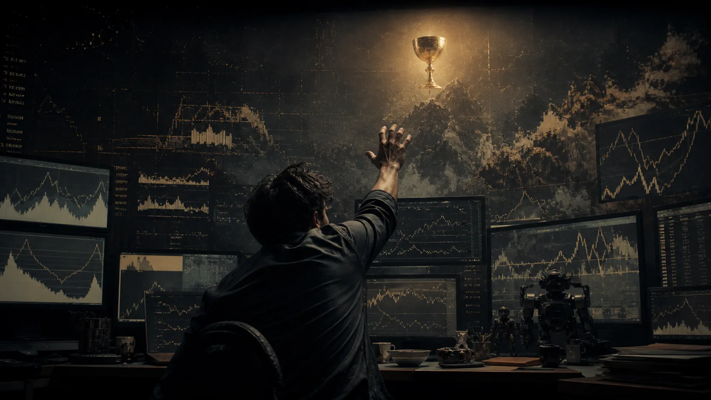
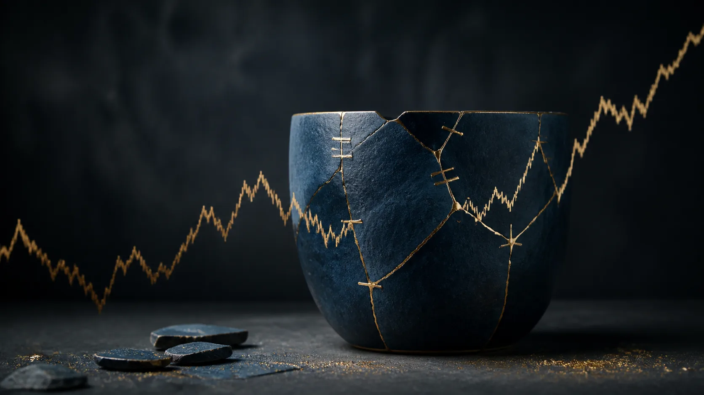
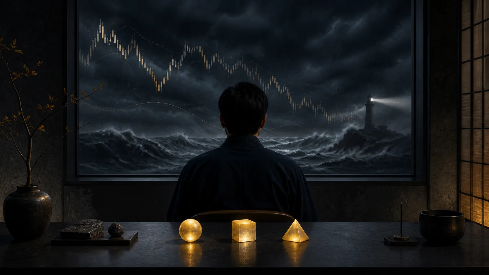

# Buông Bỏ “Chén Thánh” Để Tìm Thấy Sự Bình Yên Trong Trading

**Trading không cần một hệ thống không bao giờ nứt. Nó cần một edge đủ thật, một mức lỗ đủ nhỏ và một quy trình đủ bền để những lần sai không loại ta khỏi cuộc chơi.**

Trong mỹ học Nhật Bản có một khái niệm gọi là **Wabi-sabi** (侘寂): nhìn thấy vẻ đẹp trong sự bất toàn, vô thường và những dấu vết mà thời gian để lại.

Đi cùng tinh thần đó là **Kintsugi** (金継ぎ), nghệ thuật sửa đồ gốm đã vỡ bằng sơn urushi và bột kim loại quý. [New Orleans Museum of Art](https://noma.org/kintsugi-reflects-beauty-in-flaws-strength-in-healing/) mô tả kỹ thuật này như cách làm nổi bật lịch sử vỡ và hàn gắn thay vì che giấu nó. Người nghệ nhân không cố che đi vết nứt. Ngược lại, họ làm nó nổi bật. Chiếc bát sau khi được hàn gắn không quay về trạng thái “hoàn hảo” ban đầu. Những đường nứt vẫn còn đó, nhưng giờ chúng trở thành một phần lịch sử của chiếc bát.

Trading cũng vậy.

Nhưng phần lớn chúng ta lại dành quá nhiều thời gian để làm điều ngược lại:

> Đi tìm một chiếc bát không bao giờ nứt.

Wabi-sabi và Kintsugi ở đây là **ẩn dụ**, không phải bằng chứng rằng mỹ học Nhật Bản đưa ra một phương pháp giao dịch. Giá trị của chúng nằm ở câu hỏi mà chúng buộc trader đối diện: ta đang xây một hệ thống sống được với sai số, hay đang tìm một phép màu để khỏi phải cảm thấy mình sai?

---

## 1. Ảo Tưởng Về Một “Chén Thánh”

Rất nhiều trader dành nhiều năm đổi từ hệ thống này sang hệ thống khác, tham gia hàng chục hội nhóm, mua đủ loại indicator, bot và strategy.

Tất cả chỉ để tìm một thứ:

**Một hệ thống gần như không bao giờ sai.**

Vào lệnh là muốn xanh. Dính stop-loss là bắt đầu nghi ngờ. Thua vài lệnh liên tiếp là sửa hệ thống. Thua một chuỗi dài hơn thì xóa strategy cũ và bắt đầu hành trình tìm “chén thánh” mới.

Nhưng vấn đề có thể chưa bao giờ nằm hoàn toàn ở hệ thống.

Nó nằm ở **nhu cầu phải đúng**.

Khi trader đồng nhất giá trị bản thân với kết quả của từng lệnh, mỗi stop-loss không còn là một khoản chi phí vận hành. Nó trở thành một cú đánh vào cái tôi. Từ đó bắt đầu revenge trade, overtrade, tăng leverage, dời stop-loss hoặc phá bỏ chính những nguyên tắc mình đã đặt ra.

Đây là lúc [[Dopamine Economy - Nền Kinh Tế Của Sự Thèm Muốn]] bước vào trading. Chart một phút, PnL nhấp nháy, group call kèo và screenshot thắng lớn biến market thành một cỗ máy phần thưởng biến thiên. Trader tưởng mình đang tối ưu edge, nhưng đôi khi thứ họ thực sự tối ưu chỉ là cảm giác được đúng ngay lập tức.

---

## 2. Chấp Nhận “Vết Nứt” Của Thị Trường

Không có hệ thống nào dự đoán chính xác mọi chuyển động của market.

Bởi trading không phải trò chơi của sự chắc chắn. Nó là trò chơi của **xác suất**.

Một setup tốt vẫn có thể thua. Một setup tệ vẫn có thể thắng. Một lệnh thắng không chứng minh rằng bạn đúng. Một lệnh thua cũng không tự động chứng minh rằng hệ thống sai.

Điều quan trọng là kết quả của một **tập hợp đủ lớn** các giao dịch được thực hiện nhất quán, sau chi phí, với cùng một logic entry, sizing, invalidation và exit.

Đó là lúc tư duy Wabi-sabi trở nên hữu ích.

Stop-loss không phải một khiếm khuyết cần loại bỏ khỏi hệ thống. Nó chính là một phần của hệ thống. Nó là nơi thesis tuyên bố: “Nếu reality đi đến đây, giả định ban đầu không còn đáng để trả thêm tiền.”

Một trader trưởng thành không hỏi:

> “Làm thế nào để không bao giờ thua?”

Họ hỏi:

> “Khi mình sai, mình mất bao nhiêu?”

Câu hỏi này nối trực tiếp với [[Giữ Tiền Quan Trọng Hơn Kiếm Tiền]]. Survival không phải thái độ bi quan. Nó là điều kiện để [[Tư Duy Lũy Thừa]] có thời gian hoạt động.

---

## 3. Win Rate Không Phải Tất Cả

Một trong những ảo tưởng phổ biến nhất của trader là chạy theo win rate.

70%. 80%. 90%.

Nghe rất hấp dẫn. Nhưng win rate đứng một mình gần như vô nghĩa.

Một hệ thống thắng 50% vẫn có thể profitable nếu những lệnh thắng lớn hơn những lệnh thua. Ví dụ:

- Win rate: 50%
- Trung bình lệnh thắng: +2R
- Trung bình lệnh thua: −1R

Expectancy trước chi phí:

$$
E = 0.5 \times 2R - 0.5 \times 1R = +0.5R
$$

Tức trung bình lý thuyết **+0.5R mỗi trade** trên một mẫu đủ lớn, nếu execution giữ được đúng phân phối đó.

Nhưng phép tính này chưa phải toàn bộ reality. Spread, commission, slippage, funding, missed fills, regime change và lỗi execution đều có thể bào mòn expectancy. Một sample nhỏ cũng có thể khiến edge trông đẹp hơn thực tế.

Ngược lại, một strategy có win rate rất cao vẫn có thể phá tài khoản nếu liên tục ăn những khoản lời nhỏ nhưng thỉnh thoảng chịu một khoản thua khổng lồ.

Trading vì thế không phải nghệ thuật thắng thật nhiều. Nó là nghệ thuật:

**Thắng đủ lớn, thua đủ nhỏ và tồn tại đủ lâu để edge có cơ hội bộc lộ.**

---

## 4. Thị Trường Không Cần Biết Bạn Đúng Hay Sai

Market không biết bạn là ai. Nó cũng không quan tâm bạn vừa thua năm lệnh liên tiếp hay đang cần gỡ lại tiền.

Market đơn giản tạo ra một outcome.

Khi giá đi đến điểm invalidation của thesis, công việc của trader rất đơn giản:

**Cắt lỗ.**

Không tranh luận. Không cầu nguyện. Không dời stop-loss để “cho nó thêm chút không gian”. Không tăng vị thế để chứng minh rằng market rồi sẽ quay lại.

Buông bỏ ở đây không có nghĩa là mặc kệ. Nó có nghĩa là không cố kiểm soát thứ nằm ngoài khả năng kiểm soát của mình.

Bạn không kiểm soát market.

Bạn kiểm soát:

- entry có đúng setup hay không,
- position size,
- điểm invalidation,
- tổng risk,
- điều kiện không được trade,
- và việc mình có tuân thủ hệ thống hay không.

[[Sợ hãi - Tham Lam – Cân bằng]] gọi đây là quay về trung tâm. [[Ai Đứng Bên Kia Giao Dịch]] nhắc thêm rằng chart không phải sân khấu riêng của thesis cá nhân; mỗi cú click đều đứng đối diện một người có horizon, thông tin, constraint hoặc mức chịu đau khác mình.

---

## 5. Hàn Gắn Tài Khoản Bằng “Vàng Kỷ Luật”

Trong Kintsugi, người nghệ nhân không xóa đi đường nứt. Họ dùng vàng để nối nó lại.

Trading cũng cần một thứ “vàng” như vậy:

- Risk management
- Position sizing
- Execution discipline
- Trading journal
- Review process
- Kill switch khi trạng thái tâm lý hoặc tài khoản không còn phù hợp

Kỷ luật không khiến bạn ngừng thua. Risk management cũng không biến một strategy tệ thành strategy tốt.

Nhưng khi bạn thực sự có edge, chúng đảm bảo rằng những lần sai không đủ lớn để loại bạn khỏi cuộc chơi.

Một chuỗi năm lệnh thua sẽ không còn mang cùng ý nghĩa nếu mỗi lệnh chỉ risk 0.5–1% thay vì 10–20%. Một stop-loss sẽ bớt kích hoạt cái tôi nếu ngay trước khi bấm Buy/Sell, bạn đã chấp nhận số tiền đó có thể mất.

Đó mới là ý nghĩa thật sự của quản trị rủi ro:

> Chấp nhận cái giá của sự bất định trước khi bước vào thị trường.

Một checklist tốt cũng giống tinh thần của [[Quy Trình Là Ký Ức Được Mua Bằng Máu]]. Mỗi rule nên mang ký ức của một failure đã được chuyển thành control. Nhưng quy trình không phải giáo điều: nó phải được review bằng evidence, không bị sửa chỉ vì vài lệnh gần nhất làm ego khó chịu.

---

## 6. Đừng Cố Ăn Hết Mọi Con Sóng

Không ai cần bắt đúng đáy và bán đúng đỉnh.

Không cần trade mọi setup. Không cần kiếm tiền mỗi ngày. Không cần nhìn chart 24/7.

Một đoạn giữa của con sóng đã đủ. Một tháng +5R vẫn là +5R. Một ngày không có setup thì không trade cũng là một quyết định trading.

Vấn đề bắt đầu khi chúng ta nhìn tài khoản của người khác rồi cảm thấy kết quả của mình không đủ tốt.

Nhưng thứ xuất hiện trên mạng xã hội thường là những “chiếc bát hoàn hảo” đã được lựa chọn để trưng bày.

Bạn thấy screenshot +300%. Bạn không thấy 17 lần cháy tài khoản trước đó.

Bạn thấy một cú long đúng đáy. Bạn không thấy sáu lệnh stop-loss trước cú long đó.

Bạn thấy PnL. Bạn không thấy leverage, drawdown, vốn nạp thêm, lệnh chưa đóng hay khoảng thời gian đã bị cắt khỏi screenshot.

Vì vậy, thứ đáng theo dõi nhất không phải PnL của người khác, mà là:

- chart của mình,
- journal của mình,
- sai lầm lặp lại của mình,
- và khoảng cách giữa rule đã viết với hành vi thật.

---

## 7. Bình Yên Không Đến Từ Việc Biết Trước Thị Trường

Hôm nay market có thể chạy rất đẹp theo setup. Ngày mai nó có thể sideway, fake breakout rồi quét cả long lẫn short.

Đó không phải lỗi của market. Đó là bản chất của market.

Vô thường không phải một bug cần sửa. Nó là feature của trò chơi này.

Trader trưởng thành không phải người loại bỏ được sự bất định. Mà là người xây được một hệ thống vẫn sống sót và giữ được expectancy dương bên trong sự bất định đó.

Khi hiểu được điều này, stop-loss không còn là kẻ thù. Nó chỉ là một vết nứt. Một phần nhỏ của hành trình.

Và những vết nứt ấy được nối lại bằng thứ vàng quý giá nhất của trader:

**Kỷ luật.**

Bạn không cần một hệ thống hoàn hảo. Bạn cần một hệ thống có edge.

Bạn không cần thắng mọi lệnh. Bạn cần thắng đủ lớn và thua trong tầm kiểm soát.

Bạn không cần đoán đúng tương lai. Bạn chỉ cần biết mình sẽ làm gì khi tương lai khác với dự đoán.

Đến lúc đó, trading không còn là cuộc chiến để chứng minh mình đúng. Nó trở thành trò chơi của xác suất, quản trị rủi ro và sự bình thản trước những điều mình không thể kiểm soát.

Và có lẽ đó mới chính là “chén thánh” mà rất nhiều trader đã dành cả đời để tìm kiếm.

---

## Vault Position / Vị Trí Trong Bản Đồ

Bài này là cây cầu giữa market psychology và survival discipline:

- [[MOC - Market Psychology & Risk]] — bản đồ chính của tâm lý thị trường và quản trị rủi ro.
- [[Giữ Tiền Quan Trọng Hơn Kiếm Tiền]] — giữ vốn, runway và quyền chọn trước khi tìm upside.
- [[Sợ hãi - Tham Lam – Cân bằng]] — nhận diện market bên trong nervous system.
- [[Tư Duy Lũy Thừa]] — edge chỉ compound nếu trader còn sống.
- [[Quy Trình Là Ký Ức Được Mua Bằng Máu]] — biến failure thành rule nhưng không thờ rule như giáo điều.
- [[Ai Đứng Bên Kia Giao Dịch]] — đặt mỗi quyết định vào quá trình ownership transfer.
- [[Dopamine Economy - Nền Kinh Tế Của Sự Thèm Muốn]] — hiểu vì sao PnL, group call và chart ngắn hạn gây nghiện.

> **Claim discipline:** Wabi-sabi và Kintsugi là khung ẩn dụ cho sự bất toàn và hàn gắn. Edge vẫn phải được chứng minh bằng dữ liệu, chi phí, execution và sample đủ lớn. Một câu chuyện đẹp không biến một strategy tệ thành strategy tốt.
