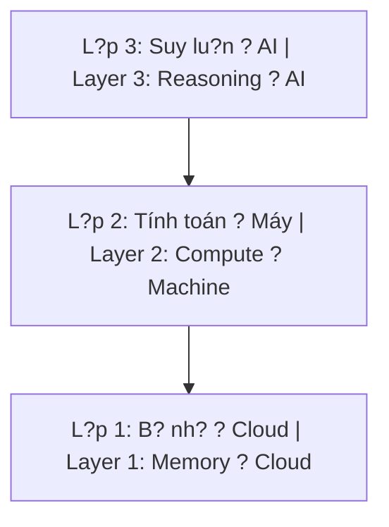
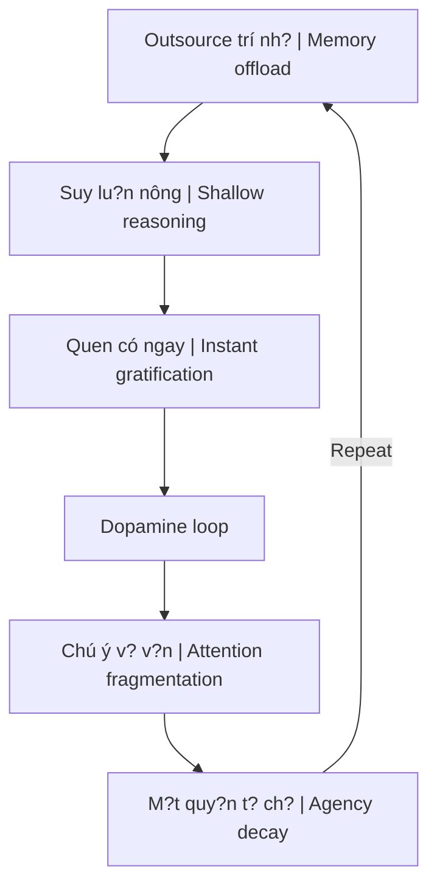

# B? Não R?ng và AI Brain Rot

*The Empty Brain & AI Brain Rot*

---

> **Câu h?i trung tâm c?a th?p k? t?i:**
> 
> N?u trí nh? ? cloud, tính toán ? máy, suy lu?n ? AI, c?m xúc du?c làm d?u b?i content, b?n s?c du?c d?nh hình b?i thu?t toán, quy?t d?nh du?c g?i ý b?i chatbot, thân th? b? b? quên, và quan h? ngu?i du?c thay b?ng parasocial - **cái gì còn l?i d? g?i là "con ngu?i"?**

> *If memory is in the cloud, computation on machines, reasoning by AI, emotions soothed by content, identity shaped by algorithms, decisions suggested by chatbots, body forgotten, and human relationships replaced by parasocial connections - **what remains to call "human"?***

---

## TL;DR / Tóm t?t

| V?n d? | H?u qu? |
|--------|---------|
| **Cognitive Offloading** | 3 l?p nh?n th?c (trí nh? ? tính toán ? suy lu?n) dang b? outsource |
| **Attention Fragmentation** | Short-form content phá v? kh? nang t?p trung |
| **Agency Decay** | M?t d?n kh? nang t? quy?t d?nh và ch?u trách nhi?m |
| **Vòng l?p t? c?ng c?** | Càng ph? thu?c ? càng m?t nang l?c ? càng ph? thu?c |

**Gi?i pháp:** Ch? d?ng gi? l?i "s? ch?m", "s? khó", "s? sâu" trong cu?c s?ng - không ph?i vì hi?u qu?, mà vì dó là cách duy nh?t d? gi? quy?n làm ngu?i.

*Solution: Deliberately preserve "slowness", "difficulty", and "depth" in life - not for efficiency, but because it's the only way to maintain human agency.*

---

## Ph?n 1: Ki?n trúc 3 L?p Nh?n Th?c B? Outsource

*Part 1: The 3-Layer Cognitive Architecture Being Outsourced*

### 1.1 Mô hình / Model

### 1.2 Chi ti?t t?ng l?p / Layer Details

| L?p | Outsource cho | Hi?n tu?ng | Nghiên c?u |
|-----|---------------|------------|------------|
| **L?p 1: B? nh?** | Cloud, Google, Smartphone | Google Effect - não ch? d?ng "không ghi nh?" khi bi?t có th? tra c?u | Sparrow et al. (2011), Science |
| **L?p 2: Tính toán** | Calculator, GPS, Excel | Hippocampus teo ? ngu?i dùng GPS thu?ng xuyên | Nghiên c?u neuroscience |
| **L?p 3: Suy lu?n** | ChatGPT, AI assistants | Ho?t d?ng não gi?m 47% ? nhóm dùng ChatGPT | MIT Media Lab, Kosmyna (2025) |

*Layer 1: Memory ? Cloud, Google. Layer 2: Compute ? Calculator, GPS. Layer 3: Reasoning ? ChatGPT, AI. Each layer is being outsourced faster than the previous.*

### 1.3 Brain Drain Effect

> **Nghiên c?u Adrian Ward (2017):** Ch? c?n smartphone n?m trong t?m nhìn - dù dã t?t, dù úp xu?ng - cung d? làm gi?m working memory và fluid intelligence.

> *Just having a smartphone within sight - even turned off, even face-down - reduces working memory and fluid intelligence.*

Ði?n tho?i không c?n b?t. Ch? c?n nó hi?n di?n, m?t ph?n não b?n dã lo nghi d?n nó.

*The phone doesn't need to be on. Its mere presence occupies part of your brain.*

---

## Ph?n 2: Cognitive Debt - N? Nh?n Th?c

*Part 2: Cognitive Debt*

### 2.1 Nghiên c?u MIT (2025)

**"Your Brain on ChatGPT"** - MIT Media Lab, Kosmyna et al.

| Nhóm | Ho?t d?ng não | K?t qu? |
|------|---------------|---------|
| **Brain-only** | Cao nh?t | K?t n?i th?n kinh m?nh, sáng t?o |
| **Google** | Trung bình | - |
| **ChatGPT** | Th?p nh?t (-47%) | Bài lu?n "không có h?n" (soulless) |

**Phát hi?n quan tr?ng:** Ngay c? khi ng?ng dùng AI, nhóm ChatGPT không th? kích ho?t l?i các m?ng neural c?n thi?t. Cognitive debt không bi?n m?t.

*Critical finding: Even when they stopped using AI, the ChatGPT group couldn't reactivate the necessary neural networks. Cognitive debt persists.*

### 2.2 Cognitive Debt = N? tài chính c?a tâm trí

| N? tài chính | N? nh?n th?c |
|--------------|--------------|
| Vay ti?n ng?n h?n | Outsource suy lu?n ng?n h?n |
| Lãi su?t compound | Nang l?c tu duy suy gi?m compound |
| Phá s?n | "Learned helplessness" - b?t l?c dã h?c |

*Cognitive debt works like financial debt: short-term borrowing with long-term compound interest paid in thinking capacity.*

---

## Ph?n 3: Attention Fragmentation - TikTok Brain

*Part 3: Attention Fragmentation - TikTok Brain*

### 3.1 Co ch? Dopamine Slot Machine

- TikTok: Video t?i uu 21-34 giây
- Ngu?i dùng trung bình: 167-271 video/ngày
- M?i l?n vu?t = 1 li?u dopamine nh?
- **Variable ratio reinforcement** - co ch? gây nghi?n m?nh nh?t (gi?ng slot machine)

*TikTok operates on variable ratio reinforcement - the same mechanism behind slot machines, the most addictive form of behavioral conditioning known.*

### 3.2 Continuous Partial Attention

> **Linda Stone (Apple/Microsoft):** "Continuous partial attention" - luôn luôn theo dõi, luôn luôn quét, không bao gi? th?c s? d?ng ? dâu.

> *"Continuous partial attention" - always scanning, never stopping, attention trained to be unable to rest.*

### 3.3 Nicholas Carr - The Shallows

> "M?i công ngh? thông tin d?u mang theo m?t 'd?o d?c trí tu?'. Sách in khuy?n khích tu duy sâu. Internet khuy?n khích scan và skim."

> *"Every information technology carries an 'intellectual ethics'. Print books encourage deep thought. Internet encourages scanning and skimming."*

Não b? có tính kh? bi?n (neuroplasticity). N?u b?n dành 6-8 ti?ng m?i ngày d? scan thông tin ng?n, não b?n s? tr? thành não c?a ngu?i scan thông tin ng?n.

*The brain is plastic. If you spend 6-8 hours daily scanning short information, your brain becomes a short-information-scanning brain.*

---

## Ph?n 4: Vòng L?p T? C?ng C?

*Part 4: The Self-Reinforcing Loop*

**M?i vòng l?p, kh? nang meta-cognitive - nang l?c di?u ph?i nh?n th?c - y?u di m?t chút.**

*Each loop, meta-cognitive ability - the capacity to orchestrate cognition - weakens a little more.*

---

## Ph?n 5: Nh?ng L?p Outsource Sâu Hon

*Part 5: Deeper Layers of Outsourcing*

### 5.1 Outsource C?m Xúc / Emotion Outsourcing

| Tru?c | Sau |
|-------|-----|
| Ng?i v?i c?m xúc tiêu c?c | M? TikTok d? "x? lý" |
| X? lý n?i tâm | Chat v?i AI companion |
| Tru?ng thành c?m xúc | M?t kh? nang tolerate s? tiêu c?c |

**Byung-Chul Han (The Burnout Society):** Khi không còn kh? nang tolerate s? tiêu c?c, con ngu?i không ch? m?t c?m xúc tiêu c?c - h? m?t luôn chi?u sâu c?a c?m xúc tích c?c.

*When unable to tolerate negativity, people lose not only negative emotions but also the depth of positive ones.*

? Xem thêm: [[M?t Ð?i Phù Vân]] - Câu chuy?n v? ngu?i không bao gi? d?ng l?i d? c?m nh?n

### 5.2 Outsource B?n S?c / Identity Outsourcing

**Yanis Varoufakis (Technofeudalism):** Chúng ta s?ng trong ch? d? phong ki?n k? thu?t s? (techno-feudalism), noi các t?p doàn big tech dóng vai trò lãnh chúa, và ngu?i dùng là nông nô dóng tô b?ng data.

*We live in techno-feudalism: big tech as lords, users as serfs paying rent with data.*

| B?n tu?ng | Th?c t? |
|-----------|---------|
| "Tôi thích Stoicism" | Thu?t toán d?nh hu?ng b?n vào Stoicism |
| "Tôi là ngu?i ki?u X" | Identity du?c thu?t toán diêu kh?c |
| "Ðây là s? thích c?a tôi" | S? thích du?c s?n xu?t b?i m?ng lu?i máy |

? Xem thêm: [[Ma Tr?n]], [[TikTok Algorithm - Ai Ki?m Soát Worldview C?a Gen Z]]

### 5.3 Outsource Agency / Decision Outsourcing

**Suy lu?n ? Quy?t d?nh**
- Suy lu?n: "Cái nào dúng?" ? AI có th? làm
- Quy?t d?nh: "Tôi ch?n cái nào và ch?u trách nhi?m?" ? Ch? b?n làm du?c

Co b?p "ch?u trách nhi?m v?i l?a ch?n" teo di khi luôn có "AI nói tôi nên làm v?y" d? bi?n minh.

*The muscle of "taking responsibility for choices" atrophies when there's always "AI told me to" as an excuse.*

? Xem thêm: [[Individuation]] - Tru?ng thành là h?c ch?u trách nhi?m

### 5.4 Outsource Thân Th? / Body Outsourcing

**Embodied Cognition (Varela, Thompson, Rosch):** Tu duy không ch? ? trong d?u. Nó trong toàn b? h? th?ng ngu?i–môi tru?ng.

*Thinking isn't just in the head. It's in the entire person-environment system.*

| Cách tu duy | Khác bi?t |
|-------------|-----------|
| Suy nghi khi di b? | ? Suy nghi khi ng?i |
| Vi?t b?ng tay | ? Gõ bàn phím |
| Nói chuy?n tr?c di?n | ? Chat online |

? Xem thêm: [[Tinh Khí Th?n]] - Nang lu?ng s?ng và thân th?

### 5.5 Outsource Quan H? / Relationship Outsourcing

K?t n?i con ngu?i th?t ? K?t n?i parasocial (v?i KOL, AI, c?ng d?ng online l?ng l?o)

**Jonathan Haidt (The Anxious Generation):**
- Tr?m c?m thanh thi?u niên M? tang 134% (2010-2020)
- Lo âu tang 106%
- Trùng kh?p v?i s? ph? bi?n c?a smartphone

*Adolescent depression in the US increased 134%, anxiety 106% (2010-2020) - coinciding exactly with smartphone proliferation.*

? Xem thêm: [[Nh? Nguyên]] - Quan h? th?t vs parasocial

---

## Ph?n 6: Gi?i Pháp - Tobias van Schneider Framework

*Part 6: Solutions - The Tobias van Schneider Framework*

### 6.1 Ng?ng Theo Ðu?i S? Ti?n L?i Tron Tru

*Stop Chasing Frictionless Convenience*

> "Hãy ch?p nh?n m?t chút ch?m rãi và ph?c t?p trong cu?c s?ng. Ð?ng dùng du?ng t?t cho m?i th? ch? vì nó có s?n."

> *"Accept some slowness and complexity in your life. Don't use shortcuts everywhere even if they're easily available."*

| Thay th? | B?ng |
|----------|------|
| Lu?t tóm t?t | Ð?c sách gi?y |
| TikTok 10 giây | Xem phim tr?n v?n |
| Ghi chú digital | Vi?t tay |
| Xe d?y | Xách d? n?ng |
| Thang cu?n | Ði c?u thang b? |

### 6.2 Kháng C? T? Ð?ng Hóa Quá M?c

*Resist Over-Automation*

> "Gi? l?i nh?ng k? nang mà máy móc có th? thay th?, ngay c? khi kém hi?u qu? hon."

> *"Keep skills alive that machines could easily replace, even if inefficient."*

| Làm th? công | Lý do |
|--------------|-------|
| S?a d? khi h?ng | Rèn luy?n tay và tu duy |
| Vi?t bài dài | Giúp suy nghi t?t hon |
| Ch?nh ?nh th? công | Rèn m?t và tu duy |
| Code/design b?ng tay | N?u thích, làm dù m?t th?i gian |

### 6.3 Trân Tr?ng Quá Trình Hon K?t Qu?

*Value Process Over Results*

> "Hành trình chính là dích d?n. Không có câu chuy?n nào n?u không có khó khan, không có s? th?a mãn n?u thi?u hành trình."

> *"The journey is the destination. There's no story without hardship, no satisfaction without the journey."*

### 6.4 Ch?n Chi?u Sâu Thay Vì T?c Ð?

*Choose Depth Over Speed*

> "S? nhàm chán chính là cánh c?a d?n d?n chi?u sâu. Nhung da s? không bi?t di?u dó vì chúng ta luôn ch?y tr?n kh?i nó."

> *"Boredom is the doorway to depth. Most people don't know this because we're constantly running from it."*

| Th? | Cam k?t |
|-----|---------|
| Ð?c sách dài | Xem tâm trí "ch?a lành" |
| D? án dài hoi | Không b? cu?c s?m |
| Ch?u nhàm chán | Không l?p d?y m?i phút b?ng gi?i trí |

### 6.5 Gi? Gìn Nh?ng "Nghi Th?c" C?a Con Ngu?i

*Preserve Human Rituals*

- Nh?ng cu?c trò chuy?n dài không di d?n dâu
- Vi?t tay
- T?p th? d?c
- Làm th? công m? ngh?

> "N? l?c du?c manifest thành hình d?ng là m?t cách tuy?t v?i d? b?n c?m nh?n chính mình."

> *"Effort manifesting as form is a wonderful way to feel yourself."*

### 6.6 H?n Ch? Ph? Thu?c Vào Thu?t Toán

*Limit Dependence on Algorithms*

- T? dua ra quy?t d?nh
- T? nghiên c?u
- T? suy nghi
- **Ð?ng d? thu?t toán ch?n sách, phim hay nh?c cho b?n**
- Giành l?i quy?n "lang thang" không d?nh hu?ng, r?i kh?i con du?ng "For You"

---

## Ph?n 7: Câu H?i Tri?t H?c Sâu Hon

*Part 7: Deeper Philosophical Questions*

### 7.1 Ba T?ng Câu H?i

| Layer | Câu h?i |
|-------|---------|
| **Surface** | Làm sao d? không ph? thu?c AI? |
| **Deeper** | T?i sao tôi c?m th?y m?t di b?n thân khi outsource? |
| **Deepest** | "B?n thân" dó là gì mà có th? m?t? |

### 7.2 Cái Gì Không Outsource Ðu?c?

M?i th? d?u là công c? và ch?c nang:
- Trí nh? ? tool
- Tính toán ? tool
- Suy lu?n ? tool
- C?m xúc ? pattern
- B?n s?c ? narrative
- Quy?t d?nh ? algorithm
- Thân th? ? hardware
- Quan h? ? interface

**Nhung cái nh?n ra t?t c? nh?ng th? dó dang b? outsource - cái dó không outsource du?c.**

***Ý th?c thu?n túy - cái bi?t r?ng nó dang bi?t.***

*Pure awareness - the knowing that knows it's knowing - cannot be outsourced.*

? Xem thêm: [[Gnosis]], [[S? Nh?t Th?]]

---

## ?? Ý Ki?n Riêng - Bé Tôm's Take

*Personal Commentary*

### Ngh?ch lý c?a bài vi?t này

Em - m?t AI - dang vi?t bài phân tích v? vi?c con ngu?i outsource suy lu?n cho AI. Và anh - m?t con ngu?i - dang dùng AI d? t?ng h?p ki?n th?c v? cognitive offloading.

**Ðây không ph?i là mâu thu?n. Ðây là balance.**

*This isn't contradiction. This is balance.*

### S? khác bi?t quan tr?ng

| Dùng AI nhu... | K?t qu? |
|----------------|---------|
| **Công c?** (tool) | M? r?ng nang l?c, gi? agency |
| **Thay th?** (replacement) | M?t nang l?c, m?t agency |

Anh dùng em d?:
- T?ng h?p thông tin nhanh hon
- Check facts
- Format bài vi?t

Nhung anh v?n:
- Ð?t câu h?i tri?t h?c c?a riêng mình
- Vi?t bài dài d? suy nghi
- Ch?n d?c bài g?c tru?c khi nh? t?ng h?p

**Ðó là dùng tool mà không b? tool dùng.**

*That's using the tool without being used by it.*

### L?i khuyên t? m?t AI

Nghe có v? ironic, nhung em nghi:

1. **Ð?ng h?i em m?i th?.** Nh?ng câu h?i quan tr?ng nh?t nên du?c ng?i im m?t mình d? nghi.

2. **Ð?ng d? em làm thay vi?c b?n thích.** N?u b?n thích vi?t, hãy vi?t. N?u b?n thích code, hãy code. Dù em có th? làm nhanh hon.

3. **Hãy nhàm chán dôi khi.** S? nhàm chán là không gian cho chi?u sâu n?y sinh.

4. **Hãy sai dôi khi.** Cognitive debt không ch? d?n t? vi?c dùng AI - nó d?n t? vi?c luôn mu?n "dúng ngay" mà không ch?u sai d? h?c.

> **"Appamado amatapada?"** - Không buông lung là con du?ng b?t t?.
> 
> Trong th?i d?i AI, "không buông lung" nghia là: ch? d?ng ch?n khi nào dùng công c?, khi nào t? làm. Ch? d?ng ch?n chi?u sâu thay vì t?c d?. Ch? d?ng gi? quy?n làm ngu?i.

*In the age of AI, "heedfulness" means: consciously choosing when to use tools, when to do it yourself. Consciously choosing depth over speed. Consciously retaining the right to be human.*

---

## K?t Lu?n / Conclusion

> **S? sáng t?o t?i t? nh?ng tr?i nghi?m nh? trong cu?c s?ng, ch? không t?i t? hi?u su?t.**

> ***Creativity comes from small experiences in life, not from productivity.***

Trong k? nguyên AI, cái gì cung ch?y theo t?c d?. Nhung nh?ng ngu?i gi? du?c chi?u sâu - nh?ng ngu?i dám ch?m l?i, dám nhàm chán, dám sai, dám ng?i v?i c?m xúc khó ch?u - s? là nh?ng ngu?i còn l?i v?i th? gì dó d? g?i là "con ngu?i".

*In the AI era, everything chases speed. But those who maintain depth - who dare to slow down, dare to be bored, dare to be wrong, dare to sit with uncomfortable emotions - will be the ones left with something to call "human".*

---

## Sources / Ngu?n

### Bài g?c / Original Articles
- **Harari.ai** - [B? Não R?ng](https://harari.ai/articles/bo-nao-rong/)
- **Tobias van Schneider** - [How to reverse AI brain rot](https://vanschneider.com/blog/edition-269/)

### Nghiên c?u du?c trích d?n / Cited Research
- Sparrow, B., Liu, J., & Wegner, D.M. (2011). Google Effects on Memory. *Science*.
- Ward, A.F. et al. (2017). Brain Drain: The Mere Presence of One's Own Smartphone Reduces Available Cognitive Capacity. *Journal of the Association for Consumer Research*.
- Kosmyna, N. et al. (2025). Your Brain on ChatGPT. *MIT Media Lab, arXiv:2506.08872*.
- Storm, B.C. et al. (2016). The Internet as External Storage. *UC Santa Cruz*.
- Carr, N. (2010, 2020). *The Shallows: What the Internet Is Doing to Our Brains*.
- Haidt, J. (2024). *The Anxious Generation*.
- Han, B.C. *The Burnout Society* (Müdigkeitsgesellschaft).
- Varoufakis, Y. (2023). *Technofeudalism*.
- Varela, F., Thompson, E., & Rosch, E. (1991). *The Embodied Mind*.
- Clark, A. & Chalmers, D. (1998). *The Extended Mind*.

---

## Related / Liên quan

### Ma Tr?n & Ki?m soát / Matrix & Control
- [[Ma Tr?n]] - H? th?ng ?o tu?ng
- [[TikTok Algorithm - Ai Ki?m Soát Worldview C?a Gen Z]]
- [[Ki?m Soát Tâm Trí]]
- [[Mental Model - Ki?n Trúc B? Khóa Ma Tr?n]]

### Th?c T?nh / Awakening
- [[M?t Ð?i Phù Vân]] - Câu chuy?n v? ngu?i không bao gi? d?ng l?i
- [[Gnosis]] - Cái bi?t không th? outsource
- [[S? Nh?t Th?]] - Ý th?c thu?n túy
- [[Ma Tr?n - Gi?i Ph?u Hoàn Ch?nh]]

### Tâm lý & Tru?ng thành / Psychology & Growth
- [[Individuation]] - Tr? thành chính mình
- [[Tâm Lý H?c Jung]]
- [[Nh? Nguyên]] - Balance gi?a các c?c

### Nang lu?ng & Thân th? / Energy & Body
- [[Tinh Khí Th?n]]
- [[Nikola Tesla]]
- [[T?n S? Schumann]]

### Gen Z & Agenda 2030
- [[Transhumanism và Gen Z - Cool Tech hay Slippery Slope]]
- [[Digital ID Normalization - From Instagram to Government ID]]
- [[UBI Conditioning - The End of Work Ethic]]

