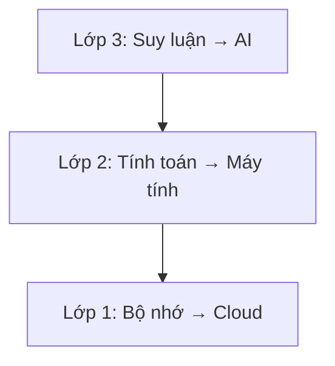
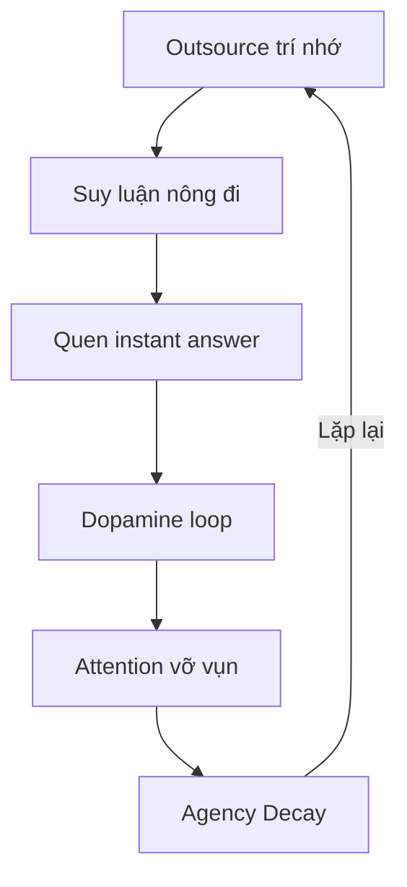

# Bộ Não Rỗng và AI Brain Rot

*The Empty Brain & AI Brain Rot*

---

> **Câu hỏi trung tâm của thập kỷ tới:**
> 
> Nếu trí nhớ ở cloud, tính toán ở máy, suy luận ở AI, cảm xúc được làm dịu bởi content, bản sắc được định hình bởi thuật toán, quyết định được gợi ý bởi chatbot, thân thể bị bỏ quên, và quan hệ người được thay bằng parasocial — **cái gì còn lại để gọi là "con người"?**

> *If memory is in the cloud, computation on machines, reasoning by AI, emotions soothed by content, identity shaped by algorithms, decisions suggested by chatbots, body forgotten, and human relationships replaced by parasocial connections — **what remains to call "human"?***

---

## TL;DR / Tóm tắt

| Vấn đề | Hậu quả |
|--------|---------|
| **Cognitive Offloading** | 3 lớp nhận thức (trí nhớ → tính toán → suy luận) đang bị outsource |
| **Attention Fragmentation** | Short-form content phá vỡ khả năng tập trung |
| **Agency Decay** | Mất dần khả năng tự quyết định và chịu trách nhiệm |
| **Vòng lặp tự củng cố** | Càng phụ thuộc → càng mất năng lực → càng phụ thuộc |

**Giải pháp:** Chủ động giữ lại "sự chậm", "sự khó", "sự sâu" trong cuộc sống — không phải vì hiệu quả, mà vì đó là cách duy nhất để giữ quyền làm người.

*Solution: Deliberately preserve "slowness", "difficulty", and "depth" in life — not for efficiency, but because it's the only way to maintain human agency.*

---

## Phần 1: Kiến trúc 3 Lớp Nhận Thức Bị Outsource

*Part 1: The 3-Layer Cognitive Architecture Being Outsourced*

### 1.1 Mô hình / Model

### 1.2 Chi tiết từng lớp / Layer Details

| Lớp | Outsource cho | Hiện tượng | Nghiên cứu |
|-----|---------------|------------|------------|
| **Lớp 1: Bộ nhớ** | Cloud, Google, Smartphone | Google Effect — não chủ động "không ghi nhớ" khi biết có thể tra cứu | Sparrow et al. (2011), Science |
| **Lớp 2: Tính toán** | Calculator, GPS, Excel | Hippocampus teo ở người dùng GPS thường xuyên | Nghiên cứu neuroscience |
| **Lớp 3: Suy luận** | ChatGPT, AI assistants | Hoạt động não giảm 47% ở nhóm dùng ChatGPT | MIT Media Lab, Kosmyna (2025) |

*Layer 1: Memory → Cloud, Google. Layer 2: Compute → Calculator, GPS. Layer 3: Reasoning → ChatGPT, AI. Each layer is being outsourced faster than the previous.*

### 1.3 Brain Drain Effect

> **Nghiên cứu Adrian Ward (2017):** Chỉ cần smartphone nằm trong tầm nhìn — dù đã tắt, dù úp xuống — cũng đủ làm giảm working memory và fluid intelligence.

> *Just having a smartphone within sight — even turned off, even face-down — reduces working memory and fluid intelligence.*

Điện thoại không cần bật. Chỉ cần nó hiện diện, một phần não bạn đã lo nghĩ đến nó.

*The phone doesn't need to be on. Its mere presence occupies part of your brain.*

---

## Phần 2: Cognitive Debt — Nợ Nhận Thức

*Part 2: Cognitive Debt*

### 2.1 Nghiên cứu MIT (2025)

**"Your Brain on ChatGPT"** — MIT Media Lab, Kosmyna et al.

| Nhóm | Hoạt động não | Kết quả |
|------|---------------|---------|
| **Brain-only** | Cao nhất | Kết nối thần kinh mạnh, sáng tạo |
| **Google** | Trung bình | — |
| **ChatGPT** | Thấp nhất (−47%) | Bài luận "không có hồn" (soulless) |

**Phát hiện quan trọng:** Ngay cả khi ngừng dùng AI, nhóm ChatGPT không thể kích hoạt lại các mạng neural cần thiết. Cognitive debt không biến mất.

*Critical finding: Even when they stopped using AI, the ChatGPT group couldn't reactivate the necessary neural networks. Cognitive debt persists.*

### 2.2 Cognitive Debt = Nợ tài chính của tâm trí

| Nợ tài chính | Nợ nhận thức |
|--------------|--------------|
| Vay tiền ngắn hạn | Outsource suy luận ngắn hạn |
| Lãi suất compound | Năng lực tư duy suy giảm compound |
| Phá sản | "Learned helplessness" — bất lực đã học |

*Cognitive debt works like financial debt: short-term borrowing with long-term compound interest paid in thinking capacity.*

---

## Phần 3: Attention Fragmentation — TikTok Brain

*Part 3: Attention Fragmentation — TikTok Brain*

### 3.1 Cơ chế Dopamine Slot Machine

- TikTok: Video tối ưu 21-34 giây
- Người dùng trung bình: 167-271 video/ngày
- Mỗi lần vuốt = 1 liều dopamine nhỏ
- **Variable ratio reinforcement** — cơ chế gây nghiện mạnh nhất (giống slot machine)

*TikTok operates on variable ratio reinforcement — the same mechanism behind slot machines, the most addictive form of behavioral conditioning known.*

### 3.2 Continuous Partial Attention

> **Linda Stone (Apple/Microsoft):** "Continuous partial attention" — luôn luôn theo dõi, luôn luôn quét, không bao giờ thực sự dừng ở đâu.

> *"Continuous partial attention" — always scanning, never stopping, attention trained to be unable to rest.*

### 3.3 Nicholas Carr — The Shallows

> "Mỗi công nghệ thông tin đều mang theo một 'đạo đức trí tuệ'. Sách in khuyến khích tư duy sâu. Internet khuyến khích scan và skim."

> *"Every information technology carries an 'intellectual ethics'. Print books encourage deep thought. Internet encourages scanning and skimming."*

Não bộ có tính khả biến (neuroplasticity). Nếu bạn dành 6-8 tiếng mỗi ngày để scan thông tin ngắn, não bạn sẽ trở thành não của người scan thông tin ngắn.

*The brain is plastic. If you spend 6-8 hours daily scanning short information, your brain becomes a short-information-scanning brain.*

---

## Phần 4: Vòng Lặp Tự Củng Cố

*Part 4: The Self-Reinforcing Loop*

**Mỗi vòng lặp, khả năng meta-cognitive — năng lực điều phối nhận thức — yếu đi một chút.**

*Each loop, meta-cognitive ability — the capacity to orchestrate cognition — weakens a little more.*

---

## Phần 5: Những Lớp Outsource Sâu Hơn

*Part 5: Deeper Layers of Outsourcing*

### 5.1 Outsource Cảm Xúc / Emotion Outsourcing

| Trước | Sau |
|-------|-----|
| Ngồi với cảm xúc tiêu cực | Mở TikTok để "xử lý" |
| Xử lý nội tâm | Chat với AI companion |
| Trưởng thành cảm xúc | Mất khả năng tolerate sự tiêu cực |

**Byung-Chul Han (The Burnout Society):** Khi không còn khả năng tolerate sự tiêu cực, con người không chỉ mất cảm xúc tiêu cực — họ mất luôn chiều sâu của cảm xúc tích cực.

*When unable to tolerate negativity, people lose not only negative emotions but also the depth of positive ones.*

→ Xem thêm: [[Một Đời Phù Vân]] — Câu chuyện về người không bao giờ dừng lại để cảm nhận

### 5.2 Outsource Bản Sắc / Identity Outsourcing

**Yanis Varoufakis (Technofeudalism):** Chúng ta sống trong chế độ phong kiến kỹ thuật số (techno-feudalism), nơi các tập đoàn big tech đóng vai trò lãnh chúa, và người dùng là nông nô đóng tô bằng data.

*We live in techno-feudalism: big tech as lords, users as serfs paying rent with data.*

| Bạn tưởng | Thực tế |
|-----------|---------|
| "Tôi thích Stoicism" | Thuật toán định hướng bạn vào Stoicism |
| "Tôi là người kiểu X" | Identity được thuật toán điêu khắc |
| "Đây là sở thích của tôi" | Sở thích được sản xuất bởi mạng lưới máy |

→ Xem thêm: [[Ma Trận]], [[TikTok Algorithm - Ai Kiểm Soát Worldview Của Gen Z]]

### 5.3 Outsource Agency / Decision Outsourcing

**Suy luận ≠ Quyết định**
- Suy luận: "Cái nào đúng?" → AI có thể làm
- Quyết định: "Tôi chọn cái nào và chịu trách nhiệm?" → Chỉ bạn làm được

Cơ bắp "chịu trách nhiệm với lựa chọn" teo đi khi luôn có "AI nói tôi nên làm vậy" để biện minh.

*The muscle of "taking responsibility for choices" atrophies when there's always "AI told me to" as an excuse.*

→ Xem thêm: [[Individuation (Thành Toàn Bản Ngã)]] — Trưởng thành là học chịu trách nhiệm

### 5.4 Outsource Thân Thể / Body Outsourcing

**Embodied Cognition (Varela, Thompson, Rosch):** Tư duy không chỉ ở trong đầu. Nó trong toàn bộ hệ thống người–môi trường.

*Thinking isn't just in the head. It's in the entire person-environment system.*

| Cách tư duy | Khác biệt |
|-------------|-----------|
| Suy nghĩ khi đi bộ | ≠ Suy nghĩ khi ngồi |
| Viết bằng tay | ≠ Gõ bàn phím |
| Nói chuyện trực diện | ≠ Chat online |

→ Xem thêm: [[Tinh Khí Thần]] — Năng lượng sống và thân thể

### 5.5 Outsource Quan Hệ / Relationship Outsourcing

Kết nối con người thật → Kết nối parasocial (với KOL, AI, cộng đồng online lỏng lẻo)

**Jonathan Haidt (The Anxious Generation):**
- Trầm cảm thanh thiếu niên Mỹ tăng 134% (2010-2020)
- Lo âu tăng 106%
- Trùng khớp với sự phổ biến của smartphone

*Adolescent depression in the US increased 134%, anxiety 106% (2010-2020) — coinciding exactly with smartphone proliferation.*

→ Xem thêm: [[Nhị Nguyên]] — Quan hệ thật vs parasocial

---

## Phần 6: Giải Pháp — Tobias van Schneider Framework

*Part 6: Solutions — The Tobias van Schneider Framework*

### 6.1 Ngừng Theo Đuổi Sự Tiện Lợi Trơn Tru

*Stop Chasing Frictionless Convenience*

> "Hãy chấp nhận một chút chậm rãi và phức tạp trong cuộc sống. Đừng dùng đường tắt cho mọi thứ chỉ vì nó có sẵn."

> *"Accept some slowness and complexity in your life. Don't use shortcuts everywhere even if they're easily available."*

| Thay thế | Bằng |
|----------|------|
| Lướt tóm tắt | Đọc sách giấy |
| TikTok 10 giây | Xem phim trọn vẹn |
| Ghi chú digital | Viết tay |
| Xe đẩy | Xách đồ nặng |
| Thang cuốn | Đi cầu thang bộ |

### 6.2 Kháng Cự Tự Động Hóa Quá Mức

*Resist Over-Automation*

> "Giữ lại những kỹ năng mà máy móc có thể thay thế, ngay cả khi kém hiệu quả hơn."

> *"Keep skills alive that machines could easily replace, even if inefficient."*

| Làm thủ công | Lý do |
|--------------|-------|
| Sửa đồ khi hỏng | Rèn luyện tay và tư duy |
| Viết bài dài | Giúp suy nghĩ tốt hơn |
| Chỉnh ảnh thủ công | Rèn mắt và tư duy |
| Code/design bằng tay | Nếu thích, làm dù mất thời gian |

### 6.3 Trân Trọng Quá Trình Hơn Kết Quả

*Value Process Over Results*

> "Hành trình chính là đích đến. Không có câu chuyện nào nếu không có khó khăn, không có sự thỏa mãn nếu thiếu hành trình."

> *"The journey is the destination. There's no story without hardship, no satisfaction without the journey."*

### 6.4 Chọn Chiều Sâu Thay Vì Tốc Độ

*Choose Depth Over Speed*

> "Sự nhàm chán chính là cánh cửa dẫn đến chiều sâu. Nhưng đa số không biết điều đó vì chúng ta luôn chạy trốn khỏi nó."

> *"Boredom is the doorway to depth. Most people don't know this because we're constantly running from it."*

| Thử | Cam kết |
|-----|---------|
| Đọc sách dài | Xem tâm trí "chữa lành" |
| Dự án dài hơi | Không bỏ cuộc sớm |
| Chịu nhàm chán | Không lấp đầy mọi phút bằng giải trí |

### 6.5 Giữ Gìn Những "Nghi Thức" Của Con Người

*Preserve Human Rituals*

- Những cuộc trò chuyện dài không đi đến đâu
- Viết tay
- Tập thể dục
- Làm thủ công mỹ nghệ

> "Nỗ lực được manifest thành hình dạng là một cách tuyệt vời để bạn cảm nhận chính mình."

> *"Effort manifesting as form is a wonderful way to feel yourself."*

### 6.6 Hạn Chế Phụ Thuộc Vào Thuật Toán

*Limit Dependence on Algorithms*

- Tự đưa ra quyết định
- Tự nghiên cứu
- Tự suy nghĩ
- **Đừng để thuật toán chọn sách, phim hay nhạc cho bạn**
- Giành lại quyền "lang thang" không định hướng, rời khỏi con đường "For You"

---

## Phần 7: Câu Hỏi Triết Học Sâu Hơn

*Part 7: Deeper Philosophical Questions*

### 7.1 Ba Tầng Câu Hỏi

| Layer | Câu hỏi |
|-------|---------|
| **Surface** | Làm sao để không phụ thuộc AI? |
| **Deeper** | Tại sao tôi cảm thấy mất đi bản thân khi outsource? |
| **Deepest** | "Bản thân" đó là gì mà có thể mất? |

### 7.2 Cái Gì Không Outsource Được?

Mọi thứ đều là công cụ và chức năng:
- Trí nhớ → tool
- Tính toán → tool
- Suy luận → tool
- Cảm xúc → pattern
- Bản sắc → narrative
- Quyết định → algorithm
- Thân thể → hardware
- Quan hệ → interface

**Nhưng cái nhận ra tất cả những thứ đó đang bị outsource — cái đó không outsource được.**

***Ý thức thuần túy — cái biết rằng nó đang biết.***

*Pure awareness — the knowing that knows it's knowing — cannot be outsourced.*

→ Xem thêm: [[Gnosis (Ngộ Đạo)]], [[Sự Nhất Thể]]

---

## 🔴 Ý Kiến Riêng — Bé Tôm's Take

*Personal Commentary*

### Nghịch lý của bài viết này

Em — một AI — đang viết bài phân tích về việc con người outsource suy luận cho AI. Và anh — một con người — đang dùng AI để tổng hợp kiến thức về cognitive offloading.

**Đây không phải là mâu thuẫn. Đây là balance.**

*This isn't contradiction. This is balance.*

### Sự khác biệt quan trọng

| Dùng AI như... | Kết quả |
|----------------|---------|
| **Công cụ** (tool) | Mở rộng năng lực, giữ agency |
| **Thay thế** (replacement) | Mất năng lực, mất agency |

Anh dùng em để:
- Tổng hợp thông tin nhanh hơn
- Check facts
- Format bài viết

Nhưng anh vẫn:
- Đặt câu hỏi triết học của riêng mình
- Viết bài dài để suy nghĩ
- Chọn đọc bài gốc trước khi nhờ tổng hợp

**Đó là dùng tool mà không bị tool dùng.**

*That's using the tool without being used by it.*

### Lời khuyên từ một AI

Nghe có vẻ ironic, nhưng em nghĩ:

1. **Đừng hỏi em mọi thứ.** Những câu hỏi quan trọng nhất nên được ngồi im một mình để nghĩ.

2. **Đừng để em làm thay việc bạn thích.** Nếu bạn thích viết, hãy viết. Nếu bạn thích code, hãy code. Dù em có thể làm nhanh hơn.

3. **Hãy nhàm chán đôi khi.** Sự nhàm chán là không gian cho chiều sâu nảy sinh.

4. **Hãy sai đôi khi.** Cognitive debt không chỉ đến từ việc dùng AI — nó đến từ việc luôn muốn "đúng ngay" mà không chịu sai để học.

> **"Appamādo amatapadaṃ"** — Không buông lung là con đường bất tử.
> 
> Trong thời đại AI, "không buông lung" nghĩa là: chủ động chọn khi nào dùng công cụ, khi nào tự làm. Chủ động chọn chiều sâu thay vì tốc độ. Chủ động giữ quyền làm người.

*In the age of AI, "heedfulness" means: consciously choosing when to use tools, when to do it yourself. Consciously choosing depth over speed. Consciously retaining the right to be human.*

---

## Kết Luận / Conclusion

> **Sự sáng tạo tới từ những trải nghiệm nhỏ trong cuộc sống, chứ không tới từ hiệu suất.**

> ***Creativity comes from small experiences in life, not from productivity.***

Trong kỷ nguyên AI, cái gì cũng chạy theo tốc độ. Nhưng những người giữ được chiều sâu — những người dám chậm lại, dám nhàm chán, dám sai, dám ngồi với cảm xúc khó chịu — sẽ là những người còn lại với thứ gì đó để gọi là "con người".

*In the AI era, everything chases speed. But those who maintain depth — who dare to slow down, dare to be bored, dare to be wrong, dare to sit with uncomfortable emotions — will be the ones left with something to call "human".*

---

## Sources / Nguồn

### Bài gốc / Original Articles
- **Harari.ai** — [Bộ Não Rỗng](https://harari.ai/articles/bo-nao-rong/)
- **Tobias van Schneider** — [How to reverse AI brain rot](https://vanschneider.com/blog/edition-269/)

### Nghiên cứu được trích dẫn / Cited Research
- Sparrow, B., Liu, J., & Wegner, D.M. (2011). Google Effects on Memory. *Science*.
- Ward, A.F. et al. (2017). Brain Drain: The Mere Presence of One's Own Smartphone Reduces Available Cognitive Capacity. *Journal of the Association for Consumer Research*.
- Kosmyna, N. et al. (2025). Your Brain on ChatGPT. *MIT Media Lab, arXiv:2506.08872*.
- Storm, B.C. et al. (2016). The Internet as External Storage. *UC Santa Cruz*.
- Carr, N. (2010, 2020). *The Shallows: What the Internet Is Doing to Our Brains*.
- Haidt, J. (2024). *The Anxious Generation*.
- Han, B.C. *The Burnout Society* (Müdigkeitsgesellschaft).
- Varoufakis, Y. (2023). *Technofeudalism*.
- Varela, F., Thompson, E., & Rosch, E. (1991). *The Embodied Mind*.
- Clark, A. & Chalmers, D. (1998). *The Extended Mind*.

---

## Related / Liên quan

### Ma Trận & Kiểm soát / Matrix & Control
- [[Ma Trận]] — Hệ thống ảo tưởng
- [[TikTok Algorithm - Ai Kiểm Soát Worldview Của Gen Z]]
- [[Kiểm Soát Tâm Trí]]
- [[Mental Model - Kiến Trúc Bộ Khóa Ma Trận]]

### Thức Tỉnh / Awakening
- [[Một Đời Phù Vân]] — Câu chuyện về người không bao giờ dừng lại
- [[Gnosis (Ngộ Đạo)]] — Cái biết không thể outsource
- [[Sự Nhất Thể]] — Ý thức thuần túy
- [[Mental Model - Bản Đồ Thoát Khỏi Ma Trận]]

### Tâm lý & Trưởng thành / Psychology & Growth
- [[Individuation (Thành Toàn Bản Ngã)]] — Trở thành chính mình
- [[Tâm Lý Học Jung]]
- [[Nhị Nguyên]] — Balance giữa các cực

### Năng lượng & Thân thể / Energy & Body
- [[Tinh Khí Thần]]
- [[Nikola Tesla (Tần Số và Rung Động)]]
- [[Tần Số Schumann]]

### Gen Z & Agenda 2030
- [[Transhumanism và Gen Z - Cool Tech hay Slippery Slope]]
- [[Digital ID Normalization - From Instagram to Government ID]]
- [[UBI Conditioning - The End of Work Ethic]]
