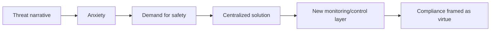

# Climate Anxiety as Control - Fear-Based Compliance

**Climate anxiety là thật. Nhưng nỗi sợ thật vẫn có thể bị weaponize. Khi một thế hệ được dạy rằng tương lai đang cháy, họ có thể tự nguyện trao quyền kiểm soát consumption, movement và money cho những hệ thống hứa sẽ “cứu hành tinh”.**

*Climate anxiety is real. But real fear can still be weaponized. When a generation is taught that the future is burning, it may voluntarily hand over control of consumption, movement, and money to systems promising planetary salvation.*

---

## Vault Position / Vị Trí Trong Vault

Bài này không phủ định mọi vấn đề môi trường. Nó phân biệt:

- **environmental reality** — ô nhiễm, phá rừng, suy thoái đất, industrial toxicity, khí hậu biến động,
- **climate narrative management** — cách fear được đóng gói để justify policy/control,
- **personal guilt machine** — chuyển gánh nặng từ hệ thống công nghiệp/quân sự/corporate sang cá nhân,
- **compliance architecture** — carbon wallet, consumption scoring, mobility restriction, programmable money.

Claim discipline:

| Tầng | Cách đọc |
|---|---|
| **Fact** | Climate anxiety among youth is documented in surveys/studies; environmental issues exist. |
| **Pattern** | Fear narratives can increase demand for centralized solutions. |
| **Control risk** | Carbon tracking + digital ID + payment rails can become behavioral governance. |
| **Speculative synthesis** | Climate as moral operating system for permission economy. |

---

## 1. Eco-Anxiety Là Gì?

Eco-anxiety là nỗi lo dai dẳng về môi trường/tương lai khí hậu. Nó có thể biểu hiện như:

- lo âu,
- helplessness,
- guilt khi tiêu dùng,
- không muốn sinh con,
- mất niềm tin vào tương lai,
- giận thế hệ trước,
- doomerism.

Không nên chế giễu nó. Một phần nỗi lo là phản ứng thật trước môi trường sống bị công nghiệp hóa quá mức.

Nhưng câu hỏi redpill là:

> Ai giúp người trẻ biến nỗi lo thành agency? Và ai biến nỗi lo thành compliance?

---

## 2. Từ Fear Sang Compliance

Fear-based control có cấu trúc quen:



Các giai đoạn khác nhau có threat khác nhau:

- terrorism → surveillance,
- pandemic → health passport/tracking,
- misinformation → speech moderation,
- climate → carbon tracking/consumption control.

Không phải threat nào cũng fake. Điểm cần thấy là threat thật có thể được dùng để bán control thật.

---

## 3. Personal Guilt Machine

Narrative phổ biến nói:

- burger của bạn giết hành tinh,
- chuyến bay của bạn giết hành tinh,
- xe của bạn giết hành tinh,
- con cái của bạn là carbon burden,
- consumption của bạn là moral failure.

Trong khi đó, những layer lớn hơn thường ít bị cá nhân trẻ nhìn thấy:

- military emissions,
- industrial agriculture,
- planned obsolescence,
- corporate supply chains,
- private jets,
- shipping/logistics,
- regulatory capture,
- financial incentives.

Personal responsibility không sai. Nhưng nếu chỉ nhấn vào guilt cá nhân, nó chuyển anger khỏi system và biến người trẻ thành self-policing subject.

> Guilty people are easier to govern.

---

## 4. Climate Doomerism Là Paralysis

Doomerism nói: đã quá muộn, mọi thứ sẽ sụp, không có tương lai.

Nó tạo ba phản ứng:

1. **Nihilism** — “vậy enjoy now”.
2. **Dependency** — “ai đó cứu tôi đi”.
3. **Compliance** — “làm gì cũng được miễn là cứu hành tinh”.

Cả ba đều làm giảm sovereignty.

Agency thật không phải phủ nhận vấn đề. Agency là:

- trồng lại đất,
- giảm độc tố thật,
- xây cộng đồng địa phương,
- hiểu năng lượng/thực phẩm,
- chống corporate greenwashing,
- giữ quyền tự do khi giải quyết vấn đề.

---

## 5. Carbon Wallet: Từ Moral Metric Sang Permission Rail

Carbon footprint ban đầu là metric. Nhưng metric nào gắn với payment/ID thì có thể thành rule.

```text
carbon score
+ digital ID
+ CBDC/payment app
+ merchant category data
= consumption permission layer
```

Possible controls:

- surcharge khi mua “high carbon” goods,
- quota cho flight/meat/fuel,
- reward cho behavior “green”,
- restriction khi vượt budget,
- dynamic pricing theo profile.

Có thể có phiên bản tự nguyện/tốt. Nhưng nếu mandatory và gắn vào money, carbon wallet trở thành remote control cho consumption.

---

## 6. 15-Minute City: Convenience Hay Cage?

Ý tưởng thành phố 15 phút có mặt tốt:

- giảm commute,
- walkable neighborhood,
- local commerce,
- cộng đồng gần hơn,
- ít phụ thuộc xe.

Nhưng rủi ro xuất hiện khi urban design bị ghép với:

- camera/ANPR,
- mobility permits,
- zone restrictions,
- carbon limits,
- digital ID,
- fines tự động.

Câu hỏi không phải “15-minute city tốt hay xấu?”. Câu hỏi là:

> Nó tăng lựa chọn sống địa phương, hay giảm quyền rời khỏi zone?

Convenience mà không có exit dễ thành cage.

---

## 7. Greenwashing Và Elite Exemption

Climate control sẽ không thuyết phục nếu người dân thấy rule chỉ áp cho tầng dưới.

Pattern hay gặp:

- người thường bị guilt vì ống hút nhựa,
- elite bay private jet tới climate summit,
- corporation mua offset thay vì đổi supply chain,
- military/security layer miễn trừ,
- người nghèo bị hạn chế consumption, người giàu mua credit.

Nếu rule có thể được mua để miễn, nó không phải moral system. Nó là market for indulgences.

---

## 8. Climate Anxiety Trong Gen Z Path

Climate anxiety nối với các bài khác:

- [[TikTok Algorithm - Ai Kiểm Soát Worldview Của Gen Z]] — doom content được algorithm khuếch đại.
- [[Gen Z và CBDC - Programmable Money Psychology]] — carbon rule có thể đi vào programmable money.
- [[Digital ID Normalization - From Instagram to Government ID]] — carbon budget cần identity.
- [[UBI Conditioning - The End of Work Ethic]] — benefit có thể gắn “green behavior”.

Đây là stack:

```text
fear → identity → money → mobility → consumption rule
```

---

## 9. Claim Discipline: Không Rơi Vào Hai Cực

Hai cực sai:

1. “Climate change fake hết, khỏi quan tâm.”
2. “Planet sắp chết, giao hết quyền cho technocrats.”

Vault position:

> Environmental harm is real. Technocratic fear management is also real.

Một người tỉnh phải giữ cả hai:

- bảo vệ đất, nước, không khí, cơ thể,
- không để fear biến thành permission economy.

---

## Synthesis

Climate anxiety là cửa vào rất mạnh vì nó đánh vào đạo đức. Không ai muốn mình là người phá hành tinh.

Nhưng khi guilt được nối vào payment rail, đạo đức thành policy engine.

> Cứu môi trường không nên đồng nghĩa với việc biến con người thành carbon account.  
> Hành tinh cần healing thật, không cần một panopticon xanh.

Câu hỏi cuối:

> Ai được quyền định nghĩa “sống đúng” và đóng/mở ví tiền của bạn dựa trên định nghĩa đó?

---

## Related

- [[Gen Z - Phân Tích Phản Biện]]
- [[Gen Z và CBDC - Programmable Money Psychology]]
- [[Digital ID Normalization - From Instagram to Government ID]]
- [[TikTok Algorithm - Ai Kiểm Soát Worldview Của Gen Z]]
- [[Báo Cáo 2030]]
