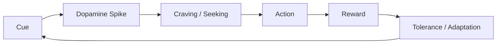
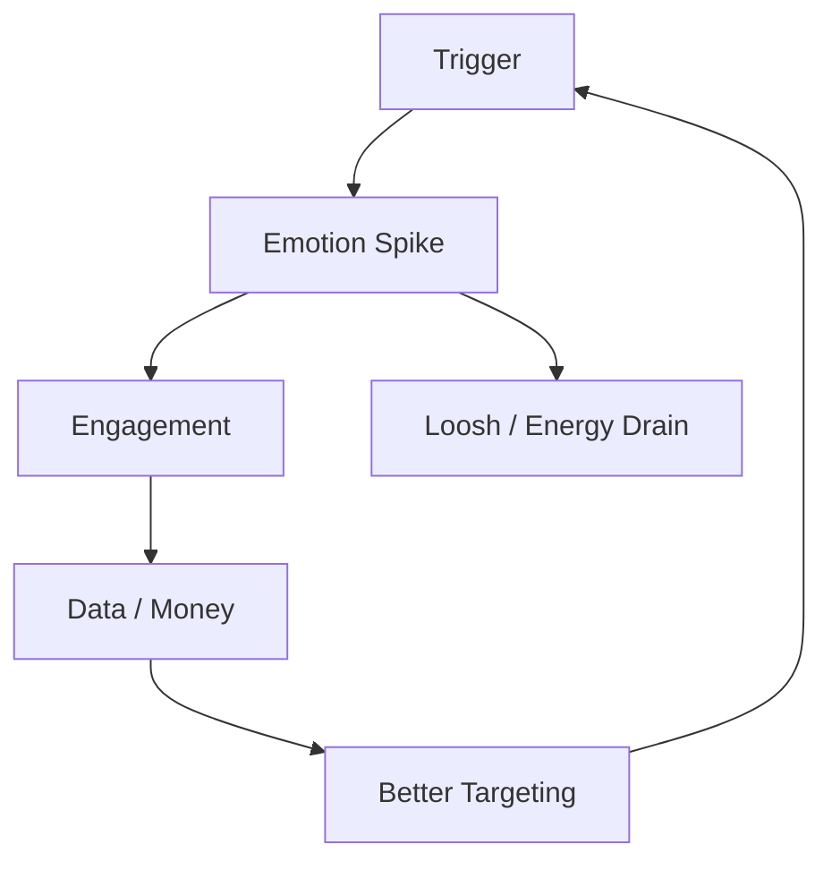

# Dopamine Economy — Nền Kinh Tế Của Sự Thèm Muốn

**Dopamine Economy là nền kinh tế không bán hạnh phúc, mà bán vòng lặp thèm muốn. Nó biến hệ thống phần thưởng của não thành hạ tầng khai thác attention, hành vi, dữ liệu, tiền bạc và năng lượng sống.**

*The Dopamine Economy does not sell happiness. It sells loops of craving. It turns the brain's reward system into infrastructure for extracting attention, behavior, data, money, and life-force.*

---

## Vault Position / Vị Trí Trong Vault

Bài này nằm giữa [[Ma Trận]], [[Kiểm Soát Tâm Trí]], [[Bộ Não Rỗng và AI Brain Rot]], [[Schadenfreude - Dopamine Phản Diện]] và [[Sự Thật Đen Tối Về Phim Khiêu Dâm]].

Nếu [[Ma Trận]] là operating system của perception, dopamine economy là module giữ người dùng tương tác tự nguyện.

> Roi da không cần thiết khi phần thưởng đủ gây nghiện.

---

## 1. Dopamine Không Phải Hạnh Phúc

Dopamine thường bị gọi sai là “hormone hạnh phúc”. Chính xác hơn, dopamine liên quan mạnh tới **wanting**, anticipation, seeking, motivation.

Nó tăng trước reward, khi não dự đoán có thứ đáng theo đuổi.

Vấn đề: hệ thống này được thiết kế cho môi trường khan hiếm, không phải infinite scroll, porn tube, sugar drink, loot box và breaking news 24/7.

---

## 2. Attention Là Hàng Hóa

Trong attention economy, bạn tưởng mình dùng app. Thực ra app dùng nervous system của bạn.

| Bạn đưa | Hệ thống lấy |
|---|---|
| attention | ad revenue |
| emotion | engagement |
| behavior | data prediction |
| outrage | virality |
| loneliness | retention |
| insecurity | purchase intent |

Nếu sản phẩm miễn phí, thường có nghĩa sản phẩm thật là hành vi của bạn.

---

## 3. Variable Reward: Máy Đánh Bạc Trong Túi

Phần thưởng không đoán trước gây nghiện mạnh hơn phần thưởng đều đặn.

- không biết post có bao nhiêu like,
- không biết inbox có gì mới,
- không biết video tiếp theo có hay hơn không,
- không biết match tiếp theo có hấp dẫn hơn không,
- không biết news tiếp theo có làm mình sốc hơn không.

Đây là slot machine logic.

Một chiếc điện thoại hiện đại là casino cá nhân hóa nằm trong túi.

---

## 4. Các Kênh Hijack Chính

### Social Media

Validation loop: post → chờ → check → reward/anxiety → post tiếp.

Social media không chỉ cho dopamine. Nó tạo identity phụ thuộc vào phản hồi.

### Porn

Porn hijack sexual novelty, Coolidge effect và bonding system. Nó không chỉ tiêu hao thời gian; nó tiêu hao [[Năng Lượng Tình Dục]] và làm méo intimacy.

→ Xem: [[Sự Thật Đen Tối Về Phim Khiêu Dâm]].

### Food

Ultra-processed food được thiết kế theo bliss point: đường, muối, béo, texture, smell, color.

Food không còn chỉ nuôi cơ thể. Nó điều khiển craving.

### Gaming / Gambling

Level, loot box, streak, battle pass, leaderboard: tất cả biến progress thành dopamine treadmill.

### News / Politics

Outrage là dopamine tối. [[Schadenfreude - Dopamine Phản Diện]] làm người ta thấy khoái khi phe kia bị hạ nhục.

---

## 5. Dopamine Và Loosh

Ở tầng metaphysical, dopamine economy có thể đọc như loosh harvesting công nghiệp hóa.

Không cần đợi chiến tranh lớn. Hệ thống có thể harvest micro-emotions mỗi ngày:

- envy,
- lust,
- rage,
- fear,
- humiliation,
- craving,
- validation hunger.

Dopamine economy là nơi capitalism, algorithm và occult energy model gặp nhau.

---

## 6. Tại Sao Ý Chí Không Đủ?

Nhiều người nghĩ mình thiếu kỷ luật. Nhưng phần lớn đang đấu với hệ thống tối ưu bằng A/B testing, neuroscience, behavioral design và AI.

Willpower cá nhân chống lại trillion-dollar engagement machine là trận không cân sức.

Cần đổi environment, không chỉ tự trách.

---

## 7. Escape Strategy

### 1. Remove Cues

- tắt notification,
- xóa app khỏi home screen,
- không để phone cạnh giường,
- block autoplay,
- dùng grayscale nếu cần.

### 2. Restore Natural Rewards

- nắng,
- vận động,
- sex thật có kết nối,
- ăn thật,
- deep work,
- ngủ,
- nói chuyện offline.

### 3. Dopamine Fasting Đúng Nghĩa

Không phải hành xác. Là giảm superstimuli để receptor sensitivity và attention quay lại.

### 4. Replace, Not Just Remove

Nếu chỉ bỏ dopamine xấu mà không có meaning, body sẽ relapse.

Cần thay bằng:

- purpose,
- craft,
- community,
- nature,
- spiritual practice,
- creative work.

---

## 8. Dấu Hiệu Đang Bị Kinh Tế Dopamine Nuốt

- check phone vô thức,
- mất khả năng đọc dài,
- không chịu nổi im lặng,
- thèm drama,
- sex thật kém hấp dẫn hơn porn,
- ăn dù không đói,
- cần nhạc/podcast mọi lúc,
- khó ngủ vì não vẫn chạy,
- thấy đời thật “nhạt”.

Nếu đời thật nhạt, có thể không phải đời thật thiếu màu. Có thể reward system đã bị burn.

---

## Synthesis

Dopamine Economy là Ma Trận ở cấp nervous system. Nó không cần bạn tin một ideology. Nó chỉ cần bạn không lấy lại được attention.

Một người mất attention sẽ mất memory, mất will, mất depth, mất prayer, mất Gnosis.

> Trong thời đại này, giữ được sự chú ý là một hành động tâm linh.

---

## Related

- [[Ma Trận]]
- [[Kiểm Soát Tâm Trí]]
- [[Bộ Não Rỗng và AI Brain Rot]]
- [[Schadenfreude - Dopamine Phản Diện]]
- [[Sự Thật Đen Tối Về Phim Khiêu Dâm]]
- [[Loosh - Năng Lượng Thu Hoạch Từ Con Người]]
