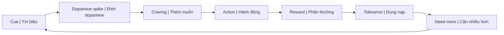
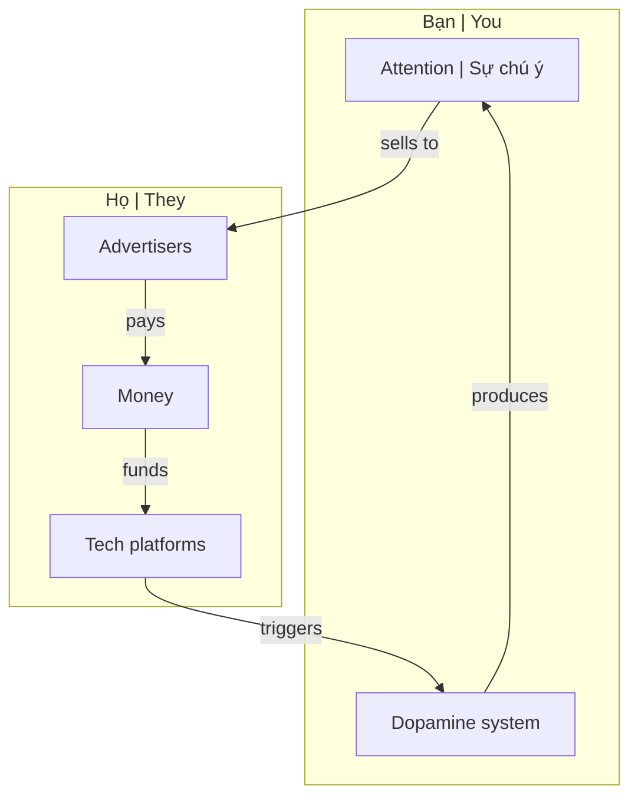
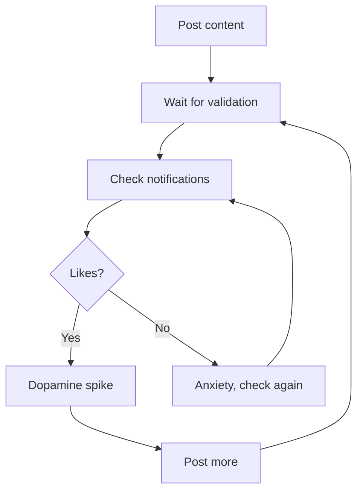
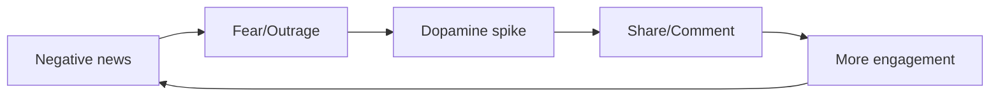
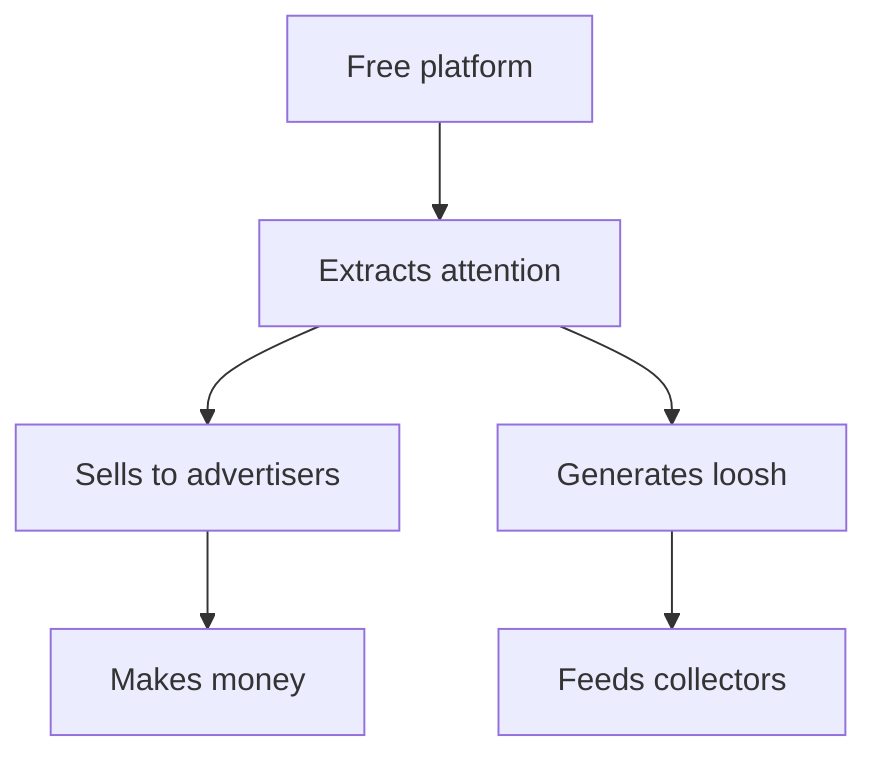

---
title: "Dopamine Economy - Nền Kinh Tế Của Sự Thèm Muốn"
aliases: ["Dopamine Economy", "Attention Economy", "Kinh Tế Dopamine"]
date: 2026-04-29
tags: [mental-model, psychology, matrix, social-media]
status: refined
---

# Dopamine Economy — Nền Kinh Tế Của Sự Thèm Muốn

> *"Nếu bạn không trả tiền cho sản phẩm, bạn là sản phẩm."*
> *"If you're not paying for the product, you are the product."*

Bài viết này tổng hợp cách hệ thống hiện đại đã **weaponize dopamine** — biến hệ thống phần thưởng tự nhiên của não bộ thành công cụ kiểm soát hành vi, khai thác attention, và thu hoạch năng lượng (xem: [[Loosh - Năng Lượng Thu Hoạch Từ Con Người|Loosh]]).

*This article synthesizes how modern systems have weaponized dopamine — turning the brain's natural reward system into a tool for behavior control, attention extraction, and energy harvesting (see: [[Loosh - Năng Lượng Thu Hoạch Từ Con Người|Loosh]]).*

---

## Dopamine 101

### Dopamine Là Gì? / What Is Dopamine?

**Dopamine** không phải là "hormone hạnh phúc" — nó là **hormone của sự thèm muốn** (wanting), không phải sự thỏa mãn (liking).

*Dopamine is not the "happiness hormone" — it's the hormone of wanting, not liking.*

| Myth | Reality |
|------|---------|
| Dopamine = happiness | Dopamine = anticipation, craving |
| Release khi được reward | Release **trước** reward, khi expect |
| Nhiều hơn = tốt hơn | Quá nhiều = tolerance → cần nhiều hơn |

### Evolutionary Purpose / Mục đích tiến hóa

Dopamine tiến hóa để **motivate survival behaviors**:
- Tìm thức ăn → Dopamine
- Tìm bạn đời → Dopamine
- Khám phá cái mới → Dopamine

*Dopamine evolved to motivate survival: finding food, mates, exploring novelty.*

**Vấn đề:** Hệ thống này **không có brakes** — nó được design cho môi trường khan hiếm, không phải abundance.

*Problem: This system has no brakes — designed for scarcity, not abundance.*

---

## Cách Hệ Thống Hijack Dopamine / How the System Hijacks Dopamine

### The Attention Economy / Nền kinh tế chú ý

**Công thức:** Attention → Engagement → Ad revenue → More addictive features

*Your attention is the commodity. Your dopamine system is the extraction mechanism.*

### Variable Reward Schedule / Lịch thưởng biến đổi

Kỹ thuật mạnh nhất: **unpredictable rewards** (như máy đánh bạc).

*Most powerful technique: unpredictable rewards (like slot machines).*

| Platform | Variable Reward |
|----------|-----------------|
| **Social Media** | Likes, comments — không biết bao giờ có |
| **Email** | New message có thể hay hoặc nhàm |
| **News** | "Breaking" news bất kỳ lúc nào |
| **Dating apps** | Match có thể xuất hiện bất kỳ lúc nào |
| **Porn** | Endless novelty, next video might be better |

### Infinite Scroll / Cuộn vô tận

**Không có điểm dừng tự nhiên** → não bộ không có cue để stop.

*No natural stopping point → brain has no cue to stop.*

| Old media | Natural stop |
|-----------|--------------|
| Book | Chapter ends |
| TV episode | Credits roll |
| Newspaper | Last page |

| New media | No stop |
|-----------|---------|
| Social feed | Infinite scroll |
| YouTube | Autoplay next |
| TikTok | Endless stream |

---

## Các Kênh Hijack Chính / Main Hijacking Channels

### 1. Social Media — [[Schadenfreude - Dopamine Phản Diện|Schadenfreude]] Loop

**Double exploitation:**
1. **Validation seeking** → addiction to posting
2. **[[Schadenfreude - Dopamine Phản Diện|Schadenfreude]]** → engagement from watching others fail

### 2. Porn — [[Sự Thật Đen Tối Về Phim Khiêu Dâm|Sexual Energy Drain]]

| Mechanism | Effect |
|-----------|--------|
| **Novelty** | Endless new partners → tolerance |
| **Escalation** | Need more extreme to get same hit |
| **Coolidge effect** | Wired for novelty, one partner "boring" |
| **Supernormal stimulus** | Exaggerated features > reality |

→ Xem chi tiết: [[Sự Thật Đen Tối Về Phim Khiêu Dâm]]

### 3. Food — Hyperpalatable Design

Thực phẩm được **engineer** để tối đa dopamine:
- Tỷ lệ đường-muối-béo "bliss point"
- Tan ngay trong miệng (tricks satiety signals)
- Màu sắc, mùi hương artificial

*Food is engineered to maximize dopamine: sugar-salt-fat "bliss point", melt-in-mouth texture, artificial colors/scents.*

### 4. Gaming — Achievement Loops

| Technique | Example |
|-----------|---------|
| **Loot boxes** | Random rewards (gambling) |
| **Daily login** | Fear of missing out |
| **Leaderboards** | Social comparison |
| **Leveling** | Constant progress dopamine |

### 5. News — Fear & Outrage

**Negativity bias:** Bad news gets 3x more engagement than good news.

*Tin xấu được engagement gấp 3 lần tin tốt.*

---

## Connection: [[Loosh - Năng Lượng Thu Hoạch Từ Con Người|Loosh]] và Dopamine

### Dopamine Loop = Loosh Loop

| Dopamine System | Loosh Production |
|-----------------|------------------|
| Craving → Action → Crash | Emotional intensity → Energy release |
| Guilt, shame after | Low-frequency emotions |
| Need more stimulus | Repeat cycle |
| Empty feeling | Energy drained |

**Insight:** Dopamine loop có thể được design để **maximize loosh production**, không chỉ ad revenue.

*Dopamine loops may be designed to maximize loosh production, not just ad revenue.*

### Emotional Harvesting Chart

| Activity | Dopamine | Loosh Type |
|----------|----------|------------|
| Doom scrolling news | ↑ then ↓↓ | Fear, anxiety |
| Porn → post-nut | ↑↑ then ↓↓↓ | Lust → guilt → shame |
| Social comparison | ↑ then ↓ | Envy, inadequacy |
| Outrage engagement | ↑ sustained | Anger, hatred |
| Cancel culture pile-on | ↑ then ↓ | [[Schadenfreude - Dopamine Phản Diện|Schadenfreude]] |

---

## Connection: [[Privacy Is The New Wealth|Privacy]] và Dopamine

### Oversharing = Dopamine Trap

| Behavior | Dopamine Hook | Risk |
|----------|---------------|------|
| Posting success | Validation hit | Attracts envy, scrutiny |
| Sharing location | Likes on travel pics | Safety risk |
| Documenting everything | Constant validation loop | No authentic experience |

**Người giàu thật sự giấu** → không cần dopamine từ flexing.

*Truly wealthy hide → don't need dopamine from flexing.*

→ Xem: [[Privacy Is The New Wealth]]

---

## Hậu Quả / Consequences

### Neurological / Thần kinh

| Effect | Mô tả / Description |
|--------|---------------------|
| **Dopamine tolerance** | Cần nhiều hơn để cảm thấy tốt |
| **Baseline drop** | Khi không có stimulus → feel below normal |
| **Anhedonia** | Không còn enjoy things đơn giản |
| **Attention fragmentation** | Không thể focus dài |

### Psychological / Tâm lý

- Anxiety khi không có phone
- Depression từ comparison
- FOMO (Fear of Missing Out)
- Instant gratification addiction

### Societal / Xã hội

- Polarization từ outrage algorithms
- Decreased empathy
- Shortened attention spans
- Relationship difficulties

---

## Giải Pháp / Solutions

### 1. Dopamine Detox / Thanh lọc Dopamine

| Level | Action |
|-------|--------|
| **Light** | Notification off, grayscale phone |
| **Medium** | 1 day/week no screens |
| **Heavy** | 1 week full detox |
| **Lifestyle** | Design environment for boredom |

### 2. Raise Baseline Naturally

| Activity | Dopamine Effect |
|----------|-----------------|
| Exercise | Steady, sustainable boost |
| Cold exposure | Sharp spike, then baseline ↑ |
| Sunlight | Morning light regulates |
| Accomplishment | Real achievement dopamine |
| Deep work | Flow state |

### 3. Design Environment

- Remove apps, don't rely on willpower
- Physical distance from phone
- Scheduled check times
- [[Privacy Is The New Wealth|Privacy]] = less seeking validation

### 4. Awareness

Biết mình đang bị manipulate = bước đầu tiên.

*Knowing you're being manipulated = first step.*

---

## Ma Trận Connection / Matrix Connection

### Dopamine Economy = [[Ma Trận]] Layer

| Ma Trận Layer | Dopamine Mechanism |
|---------------|-------------------|
| **Physical** | Food, sex, substances |
| **Psychological** | Social media, news, entertainment |
| **Spiritual** | [[Loosh - Năng Lượng Thu Hoạch Từ Con Người|Loosh]] harvesting |

### Why "Free" Platforms Exist

**You are not the customer. You are the product AND the energy source.**

*Bạn không phải khách hàng. Bạn là sản phẩm VÀ nguồn năng lượng.*

---

## Related / Liên quan

### Core Connections
- [[Loosh - Năng Lượng Thu Hoạch Từ Con Người]] — Energy harvesting unified theory
- [[Schadenfreude - Dopamine Phản Diện]] — Dark dopamine
- [[Sự Thật Đen Tối Về Phim Khiêu Dâm]] — Porn as dopamine trap
- [[Privacy Is The New Wealth]] — Stealth as escape

### System Analysis
- [[Ma Trận]] — The control system
- [[TikTok Algorithm - Ai Kiểm Soát Worldview Của Gen Z]] — Algorithm control
- [[Gen Z - Phân Tích Phản Biện]] — Generation most affected

### Solutions
- [[Individuation]] — Path to freedom
- [[Tâm bất Biến]] — Emotional stability

---

## Sources

- **Andrew Huberman** — Dopamine Nation lectures
- **Anna Lembke** — *Dopamine Nation* (2021)
- **Nir Eyal** — *Hooked* (2014) — How tech creates habits
- **Tristan Harris** — Center for Humane Technology
- Vault: [[Loosh - Năng Lượng Thu Hoạch Từ Con Người]], [[Schadenfreude - Dopamine Phản Diện]], [[Privacy Is The New Wealth]]
