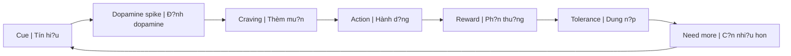
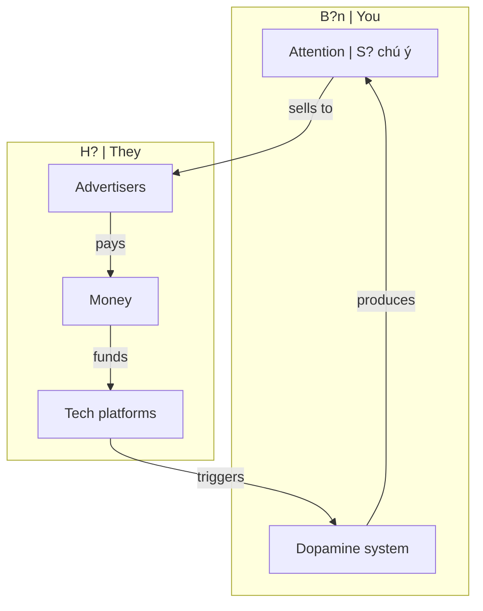
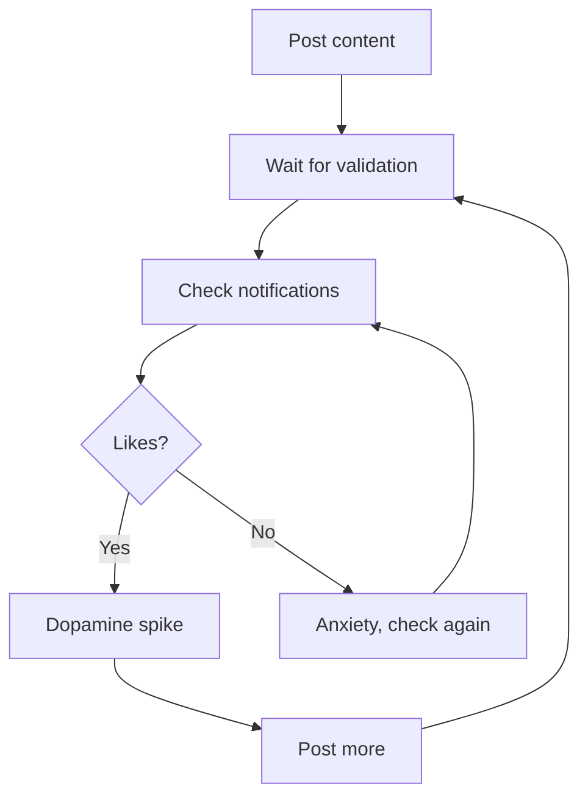
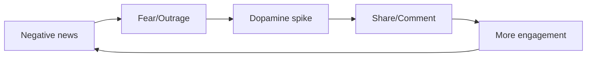
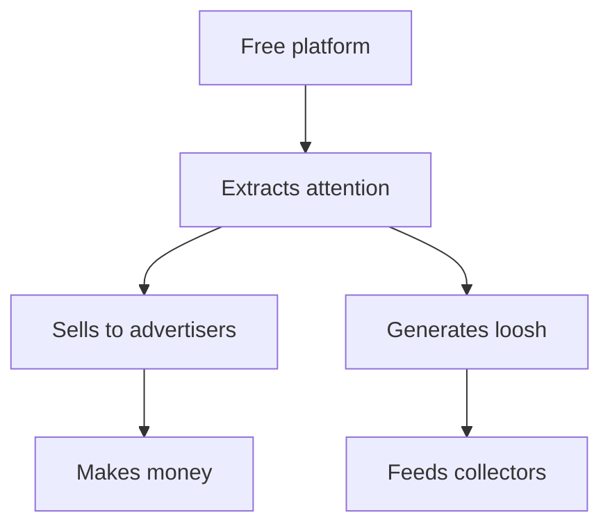

# Dopamine Economy - N?n Kinh T? C?a S? Thèm Mu?n

> *"N?u b?n không tr? ti?n cho s?n ph?m, b?n là s?n ph?m."*
> *"If you're not paying for the product, you are the product."*

Bài vi?t này t?ng h?p cách h? th?ng hi?n d?i dã **weaponize dopamine** - bi?n h? th?ng ph?n thu?ng t? nhiên c?a não b? thành công c? ki?m soát hành vi, khai thác attention, và thu ho?ch nang lu?ng (xem: [[Loosh - Nang Lu?ng Thu Ho?ch T? Con Ngu?i|Loosh]]).

*This article synthesizes how modern systems have weaponized dopamine - turning the brain's natural reward system into a tool for behavior control, attention extraction, and energy harvesting (see: [[Loosh - Nang Lu?ng Thu Ho?ch T? Con Ngu?i|Loosh]]).*

---

## Dopamine 101

### Dopamine Là Gì? / What Is Dopamine?

**Dopamine** không ph?i là "hormone h?nh phúc" - nó là **hormone c?a s? thèm mu?n** (wanting), không ph?i s? th?a mãn (liking).

*Dopamine is not the "happiness hormone" - it's the hormone of wanting, not liking.*

| Myth | Reality |
|------|---------|
| Dopamine = happiness | Dopamine = anticipation, craving |
| Release khi du?c reward | Release **tru?c** reward, khi expect |
| Nhi?u hon = t?t hon | Quá nhi?u = tolerance ? c?n nhi?u hon |

### Evolutionary Purpose / M?c dích ti?n hóa

Dopamine ti?n hóa d? **motivate survival behaviors**:
- Tìm th?c an ? Dopamine
- Tìm b?n d?i ? Dopamine
- Khám phá cái m?i ? Dopamine

*Dopamine evolved to motivate survival: finding food, mates, exploring novelty.*

**V?n d?:** H? th?ng này **không có brakes** - nó du?c design cho môi tru?ng khan hi?m, không ph?i abundance.

*Problem: This system has no brakes - designed for scarcity, not abundance.*

---

## Cách H? Th?ng Hijack Dopamine / How the System Hijacks Dopamine

### The Attention Economy / N?n kinh t? chú ý

**Công th?c:** Attention ? Engagement ? Ad revenue ? More addictive features

*Your attention is the commodity. Your dopamine system is the extraction mechanism.*

### Variable Reward Schedule / L?ch thu?ng bi?n d?i

K? thu?t m?nh nh?t: **unpredictable rewards** (nhu máy dánh b?c).

*Most powerful technique: unpredictable rewards (like slot machines).*

| Platform | Variable Reward |
|----------|-----------------|
| **Social Media** | Likes, comments - không bi?t bao gi? có |
| **Email** | New message có th? hay ho?c nhàm |
| **News** | "Breaking" news b?t k? lúc nào |
| **Dating apps** | Match có th? xu?t hi?n b?t k? lúc nào |
| **Porn** | Endless novelty, next video might be better |

### Infinite Scroll / Cu?n vô t?n

**Không có di?m d?ng t? nhiên** ? não b? không có cue d? stop.

*No natural stopping point ? brain has no cue to stop.*

| Old media | Natural stop |
|-----------|--------------|
| Book | Chapter ends |
| TV episode | Credits roll |
| Newspaper | Last page |

| New media | No stop |
|-----------|---------|
| Social feed | Infinite scroll |
| YouTube | Autoplay next |
| TikTok | Endless stream |

---

## Các Kênh Hijack Chính / Main Hijacking Channels

### 1. Social Media - [[Schadenfreude - Dopamine Ph?n Di?n|Schadenfreude]] Loop

**Double exploitation:**
1. **Validation seeking** ? addiction to posting
2. **[[Schadenfreude - Dopamine Ph?n Di?n|Schadenfreude]]** ? engagement from watching others fail

### 2. Porn - [[S? Th?t Ðen T?i V? Phim Khiêu Dâm|Sexual Energy Drain]]

| Mechanism | Effect |
|-----------|--------|
| **Novelty** | Endless new partners ? tolerance |
| **Escalation** | Need more extreme to get same hit |
| **Coolidge effect** | Wired for novelty, one partner "boring" |
| **Supernormal stimulus** | Exaggerated features > reality |

? Xem chi ti?t: [[S? Th?t Ðen T?i V? Phim Khiêu Dâm]]

### 3. Food - Hyperpalatable Design

Th?c ph?m du?c **engineer** d? t?i da dopamine:
- T? l? du?ng-mu?i-béo "bliss point"
- Tan ngay trong mi?ng (tricks satiety signals)
- Màu s?c, mùi huong artificial

*Food is engineered to maximize dopamine: sugar-salt-fat "bliss point", melt-in-mouth texture, artificial colors/scents.*

### 4. Gaming - Achievement Loops

| Technique | Example |
|-----------|---------|
| **Loot boxes** | Random rewards (gambling) |
| **Daily login** | Fear of missing out |
| **Leaderboards** | Social comparison |
| **Leveling** | Constant progress dopamine |

### 5. News - Fear & Outrage

**Negativity bias:** Bad news gets 3x more engagement than good news.

*Tin x?u du?c engagement g?p 3 l?n tin t?t.*

---

## Connection: [[Loosh - Nang Lu?ng Thu Ho?ch T? Con Ngu?i|Loosh]] và Dopamine

### Dopamine Loop = Loosh Loop

| Dopamine System | Loosh Production |
|-----------------|------------------|
| Craving ? Action ? Crash | Emotional intensity ? Energy release |
| Guilt, shame after | Low-frequency emotions |
| Need more stimulus | Repeat cycle |
| Empty feeling | Energy drained |

**Insight:** Dopamine loop có th? du?c design d? **maximize loosh production**, không ch? ad revenue.

*Dopamine loops may be designed to maximize loosh production, not just ad revenue.*

### Emotional Harvesting Chart

| Activity | Dopamine | Loosh Type |
|----------|----------|------------|
| Doom scrolling news | ? then ?? | Fear, anxiety |
| Porn ? post-nut | ?? then ??? | Lust ? guilt ? shame |
| Social comparison | ? then ? | Envy, inadequacy |
| Outrage engagement | ? sustained | Anger, hatred |
| Cancel culture pile-on | ? then ? | [[Schadenfreude - Dopamine Ph?n Di?n|Schadenfreude]] |

---

## Connection: [[Privacy Is The New Wealth|Privacy]] và Dopamine

### Oversharing = Dopamine Trap

| Behavior | Dopamine Hook | Risk |
|----------|---------------|------|
| Posting success | Validation hit | Attracts envy, scrutiny |
| Sharing location | Likes on travel pics | Safety risk |
| Documenting everything | Constant validation loop | No authentic experience |

**Ngu?i giàu th?t s? gi?u** ? không c?n dopamine t? flexing.

*Truly wealthy hide ? don't need dopamine from flexing.*

? Xem: [[Privacy Is The New Wealth]]

---

## H?u Qu? / Consequences

### Neurological / Th?n kinh

| Effect | Mô t? / Description |
|--------|---------------------|
| **Dopamine tolerance** | C?n nhi?u hon d? c?m th?y t?t |
| **Baseline drop** | Khi không có stimulus ? feel below normal |
| **Anhedonia** | Không còn enjoy things don gi?n |
| **Attention fragmentation** | Không th? focus dài |

### Psychological / Tâm lý

- Anxiety khi không có phone
- Depression t? comparison
- FOMO (Fear of Missing Out)
- Instant gratification addiction

### Societal / Xã h?i

- Polarization t? outrage algorithms
- Decreased empathy
- Shortened attention spans
- Relationship difficulties

---

## Gi?i Pháp / Solutions

### 1. Dopamine Detox / Thanh l?c Dopamine

| Level | Action |
|-------|--------|
| **Light** | Notification off, grayscale phone |
| **Medium** | 1 day/week no screens |
| **Heavy** | 1 week full detox |
| **Lifestyle** | Design environment for boredom |

### 2. Raise Baseline Naturally

| Activity | Dopamine Effect |
|----------|-----------------|
| Exercise | Steady, sustainable boost |
| Cold exposure | Sharp spike, then baseline ? |
| Sunlight | Morning light regulates |
| Accomplishment | Real achievement dopamine |
| Deep work | Flow state |

### 3. Design Environment

- Remove apps, don't rely on willpower
- Physical distance from phone
- Scheduled check times
- [[Privacy Is The New Wealth|Privacy]] = less seeking validation

### 4. Awareness

Bi?t mình dang b? manipulate = bu?c d?u tiên.

*Knowing you're being manipulated = first step.*

---

## Ma Tr?n Connection / Matrix Connection

### Dopamine Economy = [[Ma Tr?n]] Layer

| Ma Tr?n Layer | Dopamine Mechanism |
|---------------|-------------------|
| **Physical** | Food, sex, substances |
| **Psychological** | Social media, news, entertainment |
| **Spiritual** | [[Loosh - Nang Lu?ng Thu Ho?ch T? Con Ngu?i|Loosh]] harvesting |

### Why "Free" Platforms Exist

**You are not the customer. You are the product AND the energy source.**

*B?n không ph?i khách hàng. B?n là s?n ph?m VÀ ngu?n nang lu?ng.*

---

## Related / Liên quan

### Core Connections
- [[Loosh - Nang Lu?ng Thu Ho?ch T? Con Ngu?i]] - Energy harvesting unified theory
- [[Schadenfreude - Dopamine Ph?n Di?n]] - Dark dopamine
- [[S? Th?t Ðen T?i V? Phim Khiêu Dâm]] - Porn as dopamine trap
- [[Privacy Is The New Wealth]] - Stealth as escape

### System Analysis
- [[Ma Tr?n]] - The control system
- [[TikTok Algorithm - Ai Ki?m Soát Worldview C?a Gen Z]] - Algorithm control
- [[Gen Z - Phân Tích Ph?n Bi?n]] - Generation most affected

### Solutions
- [[Individuation]] - Path to freedom
- [[Tâm b?t Bi?n]] - Emotional stability

---

## Sources

- **Andrew Huberman** - Dopamine Nation lectures
- **Anna Lembke** - *Dopamine Nation* (2021)
- **Nir Eyal** - *Hooked* (2014) - How tech creates habits
- **Tristan Harris** - Center for Humane Technology
- Vault: [[Loosh - Nang Lu?ng Thu Ho?ch T? Con Ngu?i]], [[Schadenfreude - Dopamine Ph?n Di?n]], [[Privacy Is The New Wealth]]
