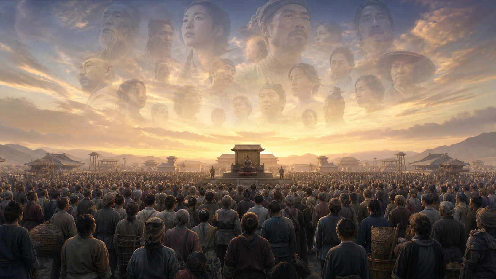
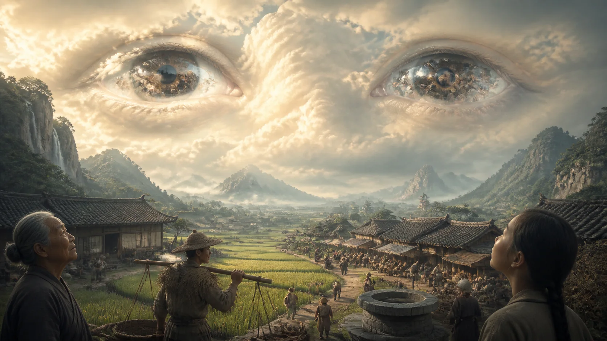
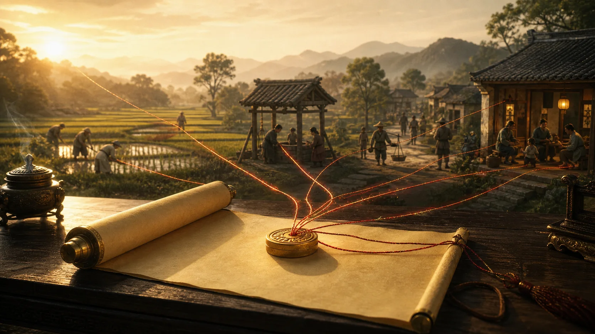
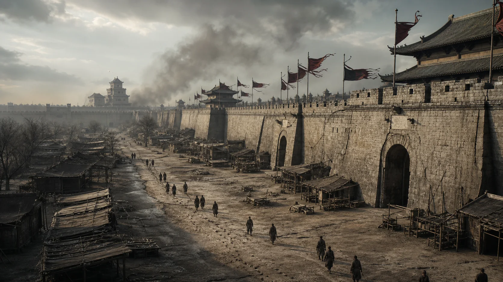
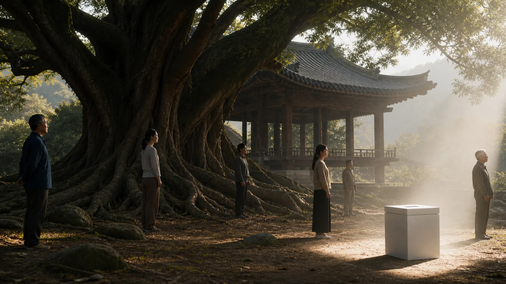
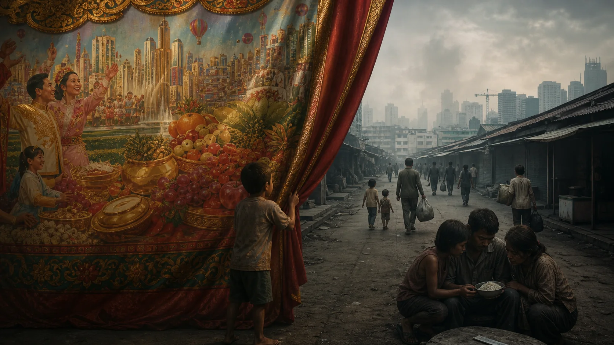
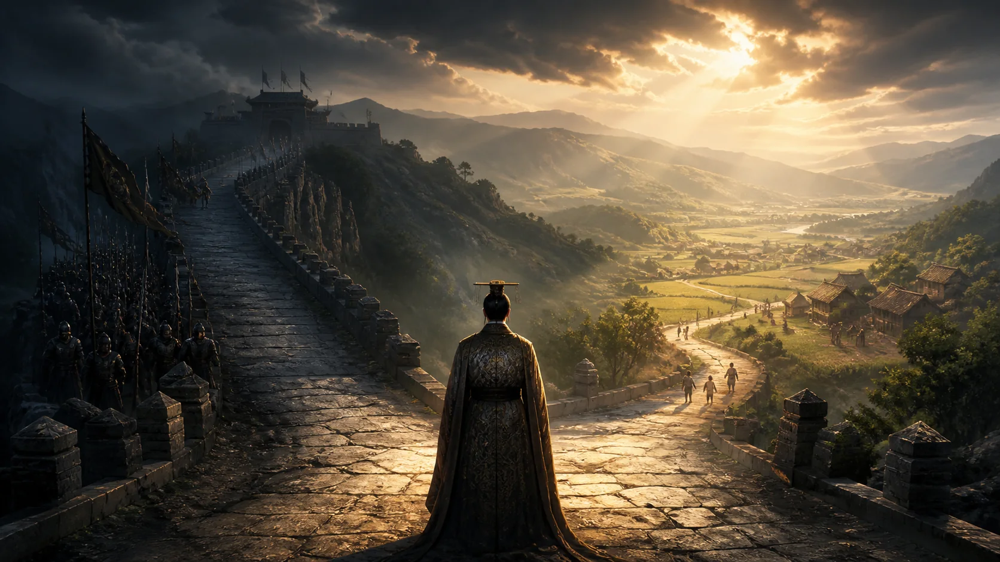
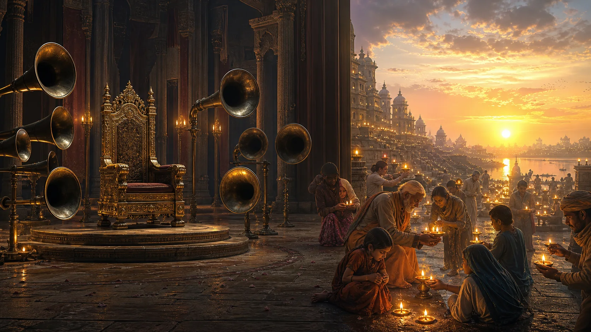

# Dân Tâm Là Thiên Tâm

**Thiên mệnh không phải một tờ sắc phong vĩnh viễn mà Trời trao cho người cầm quyền. Đó là tính chính danh có điều kiện, chỉ còn hiệu lực khi quyền lực vẫn giữ được dân, nuôi được dân và không đánh mất lòng dân.**

Người xưa không có lá phiếu phổ thông, hiến pháp hiện đại hay khái niệm chủ quyền cá nhân như chúng ta hiểu ngày nay. Nhưng họ đã nhìn thấy một giới hạn mà không triều đại nào vượt qua được mãi: một chính quyền có thể cưỡng ép sự phục tùng, song không thể dùng cưỡng ép để sản xuất lòng tin vô hạn.

Khi dân còn tin, quyền lực có nền. Khi dân chỉ còn sợ, quyền lực có vỏ mà rỗng ruột. Khi ngay cả nỗi sợ cũng không đủ giữ trật tự, cái được gọi là Thiên mệnh bắt đầu rời đi.

---

## 1. Trời Nhìn Bằng Mắt Dân

Trong thiên [*Thái Thệ thượng* của *Thượng Thư*](https://zh.wikisource.org/zh-hant/尚書/泰誓上) có câu:

> **民之所欲，天必從之。**
>
> **Hán–Việt:** Dân chi sở dục, thiên tất tòng chi.
>
> **Dịch nghĩa:** Điều dân mong muốn, Trời ắt thuận theo.

Đến [*Thái Thệ trung*](https://ctext.org/shang-shu/great-declaration-ii), ý ấy được nói rõ hơn:

> **天視自我民視，天聽自我民聽。**
>
> **Hán–Việt:** Thiên thị tự ngã dân thị, thiên thính tự ngã dân thính.
>
> **Dịch nghĩa:** Trời nhìn theo điều dân nhìn, Trời nghe theo điều dân nghe.

“Trời” trong hai câu này không nhất thiết phải được hiểu như một vị thần ngồi trên cao ghi chép từng lời than. Trời là tên gọi của trật tự lớn hơn con người, của giới hạn mà ý chí cá nhân không thể tùy tiện xóa bỏ. Ý Trời không hiện ra bằng sấm truyền riêng cho vua. Nó hiện ra qua đời sống của dân: dân có được ăn không, có được sống yên không, có còn tin vào lời của người cầm quyền không.

Bởi vậy, câu **“民心即天心”** — **“Dân tâm tức Thiên tâm”**, nghĩa là **“lòng dân chính là lòng Trời”** — nên được xem là một câu tổng hợp tư tưởng hậu thế, không phải nguyên văn trực tiếp của *Thượng Thư* hay *Mạnh Tử*. Nó cô đọng tinh thần của các câu kinh điển, nhưng không được gán sai nguồn.

Cũng cần giữ kỷ luật văn bản: *Thượng Thư* có lịch sử truyền bản phức tạp; các thiên *Thái Thệ* đi qua nhiều lớp lưu truyền, chỉnh lý và tranh luận về niên đại. Giá trị của chúng nằm ở truyền thống tư tưởng mà văn bản đã tạo nên, không phải ở ảo tưởng rằng đây là bản ghi âm nguyên vẹn từ đầu thời Chu.

---

## 2. Thiên Mệnh Là Khế Ước Có Điều Kiện

Thiên mệnh thường bị hiểu sai thành quyền cai trị do Trời ban. Cách hiểu ấy mới chỉ thấy nửa đầu của vấn đề.

Điểm quyết định của học thuyết Thiên mệnh không nằm ở chữ **ban**, mà nằm ở khả năng **rút lại**.

Một triều đại được mệnh không có nghĩa là đã sở hữu thiên hạ như tài sản riêng. Nó chỉ đang gánh một chức phận. Khi còn làm tròn chức phận, nó còn chính danh. Khi chức phận bị phản bội, quyền lực có thể vẫn còn quân đội, kho lẫm và nghi lễ, nhưng cái nền làm cho quyền lực được chấp nhận đã bắt đầu mục ruỗng.

Trong [*Mạnh Tử, Tận Tâm hạ*](https://ctext.org/mengzi/jin-xin-ii), có câu:

> **民為貴，社稷次之，君為輕。**
>
> **Hán–Việt:** Dân vi quý, xã tắc thứ chi, quân vi khinh.
>
> **Dịch nghĩa:** Dân là quý nhất, xã tắc đứng sau, vua là nhẹ nhất.

Đây không phải một lời trang trí đạo đức. Nó đảo ngược thứ tự mà quyền lực thường muốn áp đặt. Vua không phải trung tâm tuyệt đối. Xã tắc cũng không phải thần tượng bất khả thay đổi. Khi người cai trị làm nguy hại đến xã tắc, Mạnh Tử nói có thể đổi người. Khi ngay cả việc thờ thần đất và thần lúa không còn mang lại trật tự, biểu tượng ấy cũng có thể được thay.

Thiên mệnh vì thế giống một khế ước không được viết bằng mực. “Khế ước” ở đây là ẩn dụ hiện đại để diễn tả tính có điều kiện, không phải một thiết chế pháp lý đã tồn tại trong chế độ quân chủ cổ. Một bên nhận quyền, bên kia giao sự phục tùng. Nhưng sự phục tùng ấy không vô điều kiện. Nó được duy trì bằng khả năng bảo vệ sự sống chung.

---

## 3. Mất Nước Bắt Đầu Từ Mất Lòng Người

Trong [*Mạnh Tử, Ly Lâu thượng*](https://ctext.org/mengzi/li-lou-i), có đoạn:

> **桀紂之失天下也，失其民也；失其民者，失其心也。**
>
> **Hán–Việt:** Kiệt Trụ chi thất thiên hạ dã, thất kỳ dân dã; thất kỳ dân giả, thất kỳ tâm dã.
>
> **Dịch nghĩa:** Kiệt và Trụ mất thiên hạ là vì mất dân; mất dân là vì mất lòng dân.

Và ngay sau đó:

> **得天下有道：得其民，斯得天下矣；得其民有道：得其心，斯得民矣。**
>
> **Hán–Việt:** Đắc thiên hạ hữu đạo: đắc kỳ dân, tư đắc thiên hạ hĩ; đắc kỳ dân hữu đạo: đắc kỳ tâm, tư đắc dân hĩ.
>
> **Dịch nghĩa:** Có đạo để được thiên hạ: được dân thì được thiên hạ; có đạo để được dân: được lòng dân thì được dân.

Một nhà nước không sụp đổ vào ngày bức tường thành đổ xuống. Nó bắt đầu sụp từ lúc dân không còn tin rằng sự tồn tại của nó gắn với sự sống còn của mình.

Mất lòng người thường diễn ra âm thầm trước khi thành biến cố. Người ta thôi góp ý vì biết lời nói không còn tác dụng. Người có năng lực rút khỏi việc chung. Người trẻ tìm đường rời đi. Người dân tuân thủ ngoài mặt nhưng tìm mọi cách né tránh bên trong. Lời tuyên bố vẫn vang trên loa, còn đời sống thật lặng lẽ đi theo hướng khác.

Đó là lúc quyền lực bắt đầu nhầm sự im lặng với đồng thuận, nhầm sự mệt mỏi với trung thành, nhầm việc chưa có phản kháng công khai với việc dân tâm vẫn còn nguyên.

Một chế độ có thể mất dân tâm rất lâu trước khi mất quyền lực. Nhưng từ khoảnh khắc ấy, mỗi khủng hoảng đều trở nên nguy hiểm hơn, bởi bộ máy phải dùng ngày càng nhiều cưỡng chế để tạo ra cùng một mức phục tùng.

---

## 4. Dân Là Gốc Không Có Nghĩa Là Dân Chủ Hiện Đại

Không nên đọc tư tưởng dân bản của người xưa như một bản hiến pháp dân chủ được viết sớm hàng nghìn năm.

Khi nói dân là quý, Mạnh Tử vẫn sống trong một thế giới quân chủ. Ông chưa chủ trương mọi người đều có quyền bầu người đứng đầu, chưa xây dựng hệ thống phân quyền, quyền tự do cá nhân hay cơ chế pháp lý để người dân trực tiếp thu hồi quyền lực.

Dân bản trước hết là một học thuyết về **trách nhiệm của người trị dân** và **điều kiện tồn tại của trật tự chính trị**. Dân là gốc vì không có dân thì không có thuế, binh, ruộng, lễ, nước hay vua. Người cai trị phải chăm dân không chỉ vì lòng tốt, mà vì bỏ mặc dân chính là chặt vào gốc của mình.

Điểm tiến bộ của tư tưởng ấy nằm ở việc nó từ chối cho quyền lực tính chính danh tuyệt đối. Nhưng giới hạn của nó cũng rõ: dân được xem là nền của trật tự, chưa hẳn là chủ thể có đầy đủ quyền chính trị theo nghĩa hiện đại.

Giữ được phân biệt này giúp ta tránh hai cực đoan. Một bên coi cổ học chỉ là công cụ bảo vệ quân quyền. Bên kia biến mọi câu “dân vi quý” thành bằng chứng rằng người xưa đã có sẵn dân chủ hiện đại. Cả hai đều ép văn bản nói điều nó chưa từng nói.

---

## 5. Tuyên Truyền Có Thể Che Mắt, Không Thể Thay Đời Sống

Mọi quyền lực đều kể một câu chuyện về chính mình. Nó nói mình bảo vệ trật tự, đại diện cho chính nghĩa, mang lại phồn vinh hoặc cứu dân khỏi một mối đe dọa nào đó.

Câu chuyện ấy có thể đúng một phần. Nó cũng có thể đã từng đúng rồi dần trở nên lỗi thời. Vấn đề bắt đầu khi bộ máy dùng việc lặp lại câu chuyện để thay thế cho việc kiểm tra đời sống thật.

Tuyên truyền có thể làm người dân nghi ngờ mắt mình trong một thời gian. Nó có thể đổi tên thất bại, giấu số liệu, phân tán sự chú ý và biến mọi phản biện thành lỗi đạo đức. Nhưng nó không thể vô hạn làm đầy một bát cơm trống, chữa một bệnh viện thiếu thuốc, tạo việc làm từ khẩu hiệu hay khiến người trẻ sinh con chỉ vì được kêu gọi.

Khoảng cách giữa lời kể chính thức và kinh nghiệm sống càng lớn, quyền lực càng phải tăng âm lượng. Nhưng âm lượng không làm khoảng cách biến mất. Đến một mức nào đó, mỗi lời ca ngợi quá mức lại trở thành bằng chứng rằng người nói không còn sống trong cùng một thực tại với người nghe.

Dân tâm không phải những gì người dân buộc phải nói khi có người đứng cạnh. Nó nằm trong quyết định họ đưa ra khi không ai nhìn: giữ hay rút tiền, sinh hay không sinh con, ở lại hay rời đi, hợp tác hay làm cho có, tin lời hứa hay chỉ chờ qua ngày.

Đó là nơi Thiên mệnh để lại dấu vết.

---

## 6. Dân Tâm Không Phải Cơn Sốt Đám Đông

Nếu lòng dân là một giới hạn của quyền lực, có phải đám đông muốn gì thì điều ấy mặc nhiên đúng?

Không.

Đám đông có thể bị kích động. Dư luận có thể bị mua, dẫn dắt hoặc làm giả. Một cơn giận lan truyền trong vài ngày không nhất thiết là dân tâm. Một khẩu hiệu được hô lớn không chứng minh rằng nó đại diện cho nhu cầu bền sâu của cộng đồng.

Dân tâm theo nghĩa Thiên mệnh không phải từng cơn dao động trên mặt nước. Nó là dòng chảy sâu hơn: nhu cầu được sống, được ăn, được an toàn, được đối xử có phẩm giá, được nuôi con và nhìn thấy tương lai. Những nhu cầu ấy có thể bị che, nhưng khó bị xóa.

Đây cũng là lý do [[Abilene Paradox - Nghịch Lý Đồng Thuận Giả|Nghịch lý Abilene]] quan trọng. Một tập thể đôi khi cùng đi theo con đường mà từng cá nhân đều không muốn, chỉ vì mỗi người tưởng người khác muốn như vậy. Sự nhất trí bề mặt có thể che giấu một dân tâm đã rạn nứt.

Ngược lại, tiếng ồn phản đối cũng chưa chắc đại diện cho toàn dân. Muốn đọc dân tâm, phải nhìn qua thời gian và qua hành vi có giá phải trả. Người ta sẵn sàng chịu gì, bỏ gì, giữ gì? Những lựa chọn bền bỉ ấy đáng tin hơn một cuộc thăm dò tức thời hay một đợt phẫn nộ trên mạng.

---

## 7. Thuận Thiên Không Phải Thuận Theo Kẻ Mạnh

Mạnh Tử có câu nổi tiếng:

> **順天者存，逆天者亡。**
>
> **Hán–Việt:** Thuận thiên giả tồn, nghịch thiên giả vong.
>
> **Dịch nghĩa:** Thuận theo Trời thì còn, trái với Trời thì mất.

Câu này thường bị dùng như một lời đe dọa: kẻ thắng tự nhận mình thuận Trời, rồi gọi mọi chống đối là nghịch mệnh. Nhưng nếu đặt trong toàn bộ tư tưởng Mạnh Tử, “thuận thiên” không thể chỉ là phục tùng kẻ mạnh.

Mạnh Tử nhắc rằng ba đời được thiên hạ nhờ nhân, mất thiên hạ vì bất nhân. Ông nói kẻ bạo ngược tự gây ra điều khiến mình diệt vong. Sức mạnh có thể thắng một trận, nhưng nếu cách sử dụng sức mạnh làm tiêu hao lòng người, chiến thắng ấy đang vay nợ từ tương lai.

Thuận thiên trước hết là thuận với điều kiện làm cho sự sống chung tiếp tục được. Đó là biết giới hạn của quyền lực, nghe được tiếng khổ trước khi nó thành tiếng gào, sửa mình trước khi buộc cả thiên hạ phải trả giá cho sự cố chấp của một người.

Nghịch thiên là khi quyền lực tin rằng thực tại phải phục tùng lời mình nói. Là khi số liệu được sửa để bảo vệ hình ảnh, người báo tin xấu bị trừng phạt, nghi lễ được giữ còn chức năng nuôi dân bị bỏ. Đến lúc ấy, Thiên mệnh không cần một bàn tay siêu nhiên đến thu hồi. Chính hệ thống tự làm mòn nền móng của nó.

---

## 8. Quyền Lực Có Thể Ép Im Lặng, Không Thể Ép Chính Danh

Một chính quyền mạnh có thể cấm lời phản đối. Nó có thể khiến quảng trường im, báo chí đồng thanh và mọi cuộc họp kết thúc bằng vỗ tay.

Nhưng im lặng không phải đồng thuận.

Chính danh không nằm trong số lần một danh hiệu được nhắc lại. Nó nằm trong mối quan hệ giữa lời nói và đời sống, giữa quyền được sử dụng và trách nhiệm phải gánh, giữa sự hy sinh được yêu cầu và lợi ích thực sự mà cộng đồng nhận lại.

“Dân tâm tức Thiên tâm” vì thế không phải lời nịnh dân. Nó là lời cảnh báo dành cho quyền lực: không ai độc quyền được tiếng nói của Trời. Người cai trị chỉ có thể chứng minh mình thuận Thiên bằng cách không quay lưng với dân.

Thiên mệnh cũng không rời đi trong một khoảnh khắc duy nhất. Nó mòn dần mỗi lần sự thật bị hy sinh để bảo vệ thể diện, mỗi lần người nói thật bị xem là kẻ thù, mỗi lần nỗi khổ của dân bị biến thành một con số đẹp trên giấy.

Đến khi biến cố xảy ra, người đời tưởng Thiên mệnh vừa đổi chủ. Thực ra nó đã rút đi từ lâu.

> **Quyền lực có thể buộc dân im tiếng trong một thời gian. Nhưng không thể biến sự im tiếng ấy thành lòng tin, càng không thể biến nó thành Thiên mệnh.**

---

## Ghi Chú Nguồn Và Cách Đọc

- `民之所欲，天必從之` thuộc *Thượng Thư, Thái Thệ thượng*.
- `天視自我民視，天聽自我民聽` thuộc *Thượng Thư, Thái Thệ trung*.
- `順天者存，逆天者亡` thuộc *Mạnh Tử, Ly Lâu thượng*.
- `民為貴，社稷次之，君為輕` thuộc *Mạnh Tử, Tận Tâm hạ*.
- `民心即天心` là câu tổng hợp tư tưởng, không phải nguyên văn trực tiếp của các thiên trên.
- Bài này đọc Thiên mệnh như một khung về tính chính danh có điều kiện. Đây là diễn giải triết học và chính trị, không phải bằng chứng cho một mệnh lệnh siêu nhiên cụ thể.

## Vị Trí Trong Bản Đồ Tri Thức

Bài này nằm giữa ba đường đọc:

- [[MOC - Epistemology & Propaganda|Bản đồ Nhận thức và Tuyên truyền]] — khi lời kể chính thức tách khỏi thực tại sống.
- [[politics-conspiracy/Elite|Tầng quyền lực]] — quyền lực, tính chính danh và giới hạn của tầng cai trị.
- [[Abilene Paradox - Nghịch Lý Đồng Thuận Giả]] — sự nhất trí bề mặt không đồng nghĩa ý muốn thật của cộng đồng.

Nó cũng nối với [[Tâm bất Biến]] ở một điểm sâu hơn: muốn nghe được dân tâm, cả người cầm quyền lẫn người quan sát phải đủ tĩnh để phân biệt dòng chảy bền sâu với tiếng ồn nhất thời.
