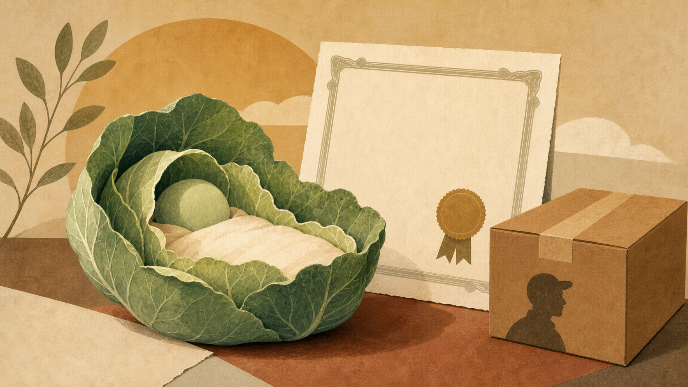
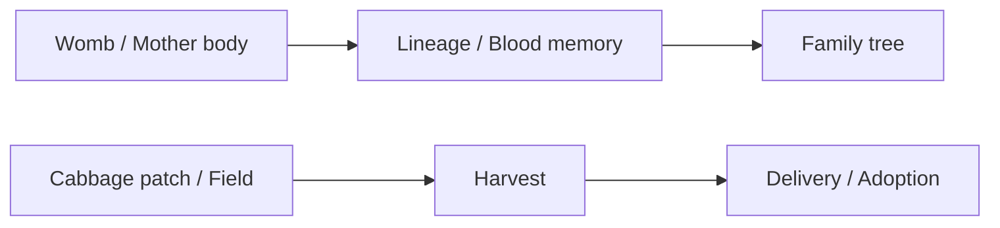
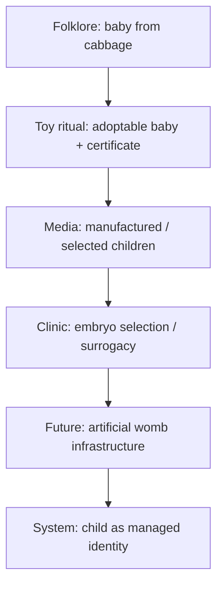

# Em Bé Bắp Cải - Khi Đứa Trẻ Mọc Từ Ruộng Thay Vì Dòng Máu

> Một trong những câu chuyện dễ thương nhất để nói với trẻ con là: em bé không đến từ bụng mẹ, mà được nhặt trong bụi bắp cải. Nghe vô hại. Nhưng symbol không bao giờ chỉ là trò đùa. Một nền văn hóa kể chuyện trẻ em “mọc từ ruộng” đang vô thức tập cho mình tưởng tượng một đứa trẻ không cần womb, không cần lineage, không cần câu chuyện cha-mẹ-con, chỉ cần được tìm thấy, nhận nuôi, đăng ký và mang về nhà.

“Em bé bắp cải” là motif cũ. Ở tầng folklore, nó là cách người lớn né câu hỏi sex/reproduction với trẻ con. Ở tầng toy culture, nó thành một dòng búp bê được “adopt”, có giấy khai sinh, có tên, có câu chuyện được personalize. Ở tầng system, nó là một rehearsal mềm cho một tương lai nơi đứa trẻ không còn được tưởng tượng như kết quả của covenant và dòng máu, mà như một unit được grown, selected, delivered và assigned vào household.

Bài này không nói rằng mọi người từng chơi búp bê Cabbage Patch đều bị lập trình. Nó cũng không nói nhà sản xuất đồ chơi “chứng minh” agenda artificial womb. Đọc đúng hơn: đây là một **symbolic nursery**. Văn hóa đại chúng tập cho ta thấy một motif nhiều lần cho đến khi điều từng kỳ lạ trở nên dễ thương, rồi bình thường, rồi inevitable.

---

## Evidence Discipline / Cách Đọc Bài Này

| Tầng | Cách đọc đúng |
|---|---|
| Fact / documentable | Folklore “babies in cabbage patches” tồn tại trong văn hóa phương Tây; Cabbage Patch Kids là dòng búp bê nổi tiếng với adoption certificate/persona; artificial womb, IVF, surrogacy và embryo selection là các hiện tượng thật |
| Pattern / systems | Culture có xu hướng tách trẻ em khỏi womb/lineage và đưa vào language của adoption, product identity, certificate, delivery, selection |
| Symbol / myth | Bắp cải/ruộng là image của crop: đứa trẻ như thứ được trồng, thu hoạch, đóng gói và giao vào nhà |
| Speculative synthesis | Nối motif này với [[Orphan Train 2.0 - Khi Ma Trận Chở Trẻ Em Ra Khỏi Dòng Máu]], artificial womb và child logistics là lens vault, không phải bằng chứng pháp lý |

Rule: không dùng toy/folklore như proof. Nhưng cũng không bỏ qua việc folklore, toy, cinema và medical future thường cùng dạy xã hội tưởng tượng một hình dạng mới của gia đình trước khi policy gọi nó là “tiến bộ”.

---

## 1. Folklore: Khi Người Lớn Né Womb

Trước khi có sex education, nhiều nền văn hóa dùng chuyện cổ tích để trả lời câu hỏi “em bé từ đâu ra?”. Ở phương Tây có stork đem em bé tới, hoặc em bé được tìm thấy trong cabbage patch. Cả hai đều làm một việc: tách trẻ khỏi sex, tách sinh sản khỏi cơ thể mẹ, và biến birth thành arrival.

Một đứa trẻ không “được sinh ra” mà “được đem tới”. Không có womb, không có máu, không có đau đẻ, không có milk, không có body memory. Chỉ có một package dễ thương xuất hiện trước cửa nhà hoặc trong bụi rau.

Ở tầng bình thường, đây là chuyện trẻ con. Ở tầng symbol, nó là một phép chuyển rất quan trọng: từ **birth** sang **delivery**.

Đây nối thẳng với motif [[Orphan Train 2.0 - Khi Ma Trận Chở Trẻ Em Ra Khỏi Dòng Máu]]: khi đứa trẻ được đọc như arrival/delivery, câu hỏi về lineage bị làm mờ. Ai mang nó tới? Ai chọn nó? Ai cấp giấy? Ai ghi tên? Ai quyết định nó thuộc về đâu?

---

## 2. Cabbage Patch Kids: Adoption As Product Ritual

Cabbage Patch Kids không chỉ là búp bê. Nó là một mini-ritual của adoption. Mỗi con búp bê có tên, có “birth certificate”, có hồ sơ cá nhân, và người mua không chỉ mua toy, mà “adopt” một em bé.

Đây là thiên tài marketing. Nhưng marketing giỏi thường hoạt động vì nó chạm đúng archetype. Người chơi không chỉ sở hữu vật phẩm. Họ tham gia một ceremony:

- chọn một child-unit,
- nhận certificate,
- đem về household,
- đặt vào care fantasy,
- cảm thấy mình là parent trong một kịch bản đã được đóng gói.

Không có gì sai khi trẻ con chơi búp bê. Vấn đề nằm ở symbolic grammar: child được tưởng tượng như một identity package đi kèm name, paperwork và ownership ritual. Trong một xã hội ngày càng quen với IVF clinic, embryo selection, surrogacy contract và future artificial womb, grammar này không còn chỉ là đồ chơi.

Nó là bản mềm của một logic lớn hơn: **child as adoptable product with paperwork**.

---

## 3. Bắp Cải Là Crop Symbol

Tại sao là bắp cải? Vì cabbage patch là ruộng. Ruộng là nơi crop mọc lên. Crop không có genealogy như một đứa trẻ. Crop có batch, season, yield, quality, harvest, distribution.

Khi một đứa trẻ được đặt vào ruộng, dù chỉ trong folklore, imagination đã chuyển từ family tree sang agriculture logistics. Family tree nói về tổ tiên, gốc rễ, nhánh, quả, mùa và ký ức gia đình. Cabbage patch nói về một field được canh tác, nơi các units mọc lên theo luống.

Hai image này tạo ra hai anthropology khác nhau. Nếu child là fruit của family tree, nó thuộc về memory sống. Nếu child là crop trong field, nó thuộc về system trồng, thu hoạch và phân phối.

Đọc như symbol, cabbage baby là một bước nhỏ nhưng sắc: nó thay womb bằng field.

---

## 4. Delivery Room: Birth Hay Logistics?

Trong bài [[Orphan Train 2.0 - Khi Ma Trận Chở Trẻ Em Ra Khỏi Dòng Máu]], motif **delivery room** đã mở ra một wordplay rất đắt. Phòng sinh trong tiếng Anh là delivery room. Tầng bình thường: nơi em bé được sinh ra. Tầng thương mại/pháp lý: delivery là giao hàng, chuyển quyền kiểm soát, hoàn tất logistics.

Cabbage baby nằm cùng grammar đó. Em bé được found, picked, adopted, delivered. Family không còn là womb-field của lineage, mà trở thành receiving address.

Một lần nữa: đây không phải bằng chứng pháp lý rằng birth certificate là shipping document. Đó là symbolic reading. Nhưng symbolic reading có giá trị vì hệ thống thường trượt rất mượt qua language. Khi xã hội quen gọi birth là delivery, quen chơi adoption certificate như toy, quen thấy em bé mọc từ field, quen nghe future artificial womb được bán bằng từ “safety” và “choice”, thì imagination đã được chuẩn bị.

Không phải policy đi trước culture. Rất nhiều khi culture đi trước policy.

---

## 5. Artificial Womb: Cabbage Patch Trở Thành Infrastructure

Artificial womb sẽ không được bán bằng ngôn ngữ lạnh lùng. Nó sẽ được bán bằng ngôn ngữ care:

- an toàn hơn cho mẹ,
- cứu trẻ sinh non,
- giúp người không thể mang thai,
- bình đẳng hơn,
- kiểm soát môi trường tốt hơn,
- giảm rủi ro sinh học,
- mở rộng quyền làm cha mẹ.

Một phần lợi ích có thể thật. Nhưng câu hỏi vault là: khi womb trở thành infrastructure, ai vận hành field đó?

Cabbage patch là image của field. Artificial womb là field công nghiệp hóa. Embryo selection là seed selection. Surrogacy contract là logistics layer. Birth certificate là identity paperwork. Delivery room là handoff point. Household là receiving address.

Đây là lý do motif em bé bắp cải không nhỏ. Nó là meme vô hại của một future rất nghiêm túc: trẻ em như beings được grown outside lineage và delivered into legal/social containers.

---

## 6. Orphan Train 2.0: Không Cần Tàu Nếu Đã Có Nursery

Orphan Train cũ chở trẻ em bằng tàu. Orphan Train mới không cần đường ray. Nếu trẻ em đã được tưởng tượng như crop, product, adopted persona và delivery package, thì train không còn cần thiết. The nursery itself is the station.

Trong Orphan Train cũ, cơ thể đứa trẻ bị chuyển từ city sang household khác. Trong Orphan Train mới, attention, identity, desire và memory bị chuyển khỏi lineage ngay cả khi cơ thể vẫn ở nhà. Cabbage baby motif thêm một tầng nữa: child không chỉ bị chuyển sau khi sinh, mà được tưởng tượng như chưa từng thuộc về womb/lineage từ đầu.

Đây là sự khác biệt giữa orphaned child và manufactured orphanhood.

Một đứa trẻ orphaned vì mất cha mẹ vẫn có thể được một vòng care thật ôm lại. Nhưng manufactured orphanhood là khi hệ thống thiết kế một anthropology trong đó lineage không còn là default, care trở thành service, và parenthood trở thành quyền truy cập vào một child-unit.

---

## 7. Predictive Programming Dễ Thương Nhất Là Đồ Chơi

[[Predictive Programming - Cấy Tương Lai Vào Tiềm Thức]] không chỉ xảy ra trong phim dystopia. Đôi khi nó xảy ra trong nursery, toy aisle, cartoon và bedtime story.

Phim dystopia làm ta sợ. Đồ chơi làm ta thương. Vì vậy đồ chơi có một quyền lực đặc biệt: nó đưa motif vào nervous system trước khi critical mind kịp phản ứng. Một em bé nhựa có certificate không gây alarm. Một nursery fantasy không gây alarm. Một câu chuyện “em bé nhặt trong bắp cải” không gây alarm.

Nhưng culture memory không vận hành bằng alarm. Nó vận hành bằng familiarity. Điều được lặp lại đủ lâu sẽ trở thành hình ảnh có sẵn trong đầu. Khi technology thật xuất hiện, public không cần được thuyết phục từ zero. Họ đã có image rồi.

---

## 8. Counterspell: Đứa Trẻ Không Phải Crop

Lối ra không phải panic đạo đức hay ghét đồ chơi. Lối ra là nhớ lại anthropology đúng: đứa trẻ không phải crop, không phải product, không phải adult desire object, không phải identity package, không phải ticket để người lớn hoàn thành fantasy của mình.

Đứa trẻ là một soul đi vào một dòng care. Dòng đó có thể là dòng máu sinh học, nhưng không chỉ là DNA. Nó là ký ức, nghĩa tình, người lớn hiện diện, lời hứa, bữa ăn, câu chuyện ông bà, người thức dậy lúc trẻ sốt, người không outsource toàn bộ childhood cho screen, school và app.

[[Tình Nghĩa Là Hạ Tầng Cuối Cùng]] là counterspell vì nó không thể được in hàng loạt như búp bê. Nó không thể được assigned bằng paperwork. Nó không thể được delivered như parcel. Care thật phải diễn ra trong thời gian thật, bằng thân thể thật, với một người lớn thật ở lại.

Cabbage patch nói: child mọc từ field.

Family tree nói: child mọc từ memory.

Một xã hội muốn giữ linh hồn của trẻ phải chọn lại image thứ hai.

---

## Final Line

Em bé bắp cải dễ thương vì nó giấu womb khỏi câu chuyện. Nhưng chính chỗ dễ thương đó mới đáng đọc. Khi đứa trẻ được tưởng tượng như thứ mọc trong ruộng, được nhặt, được đặt tên, được cấp giấy và được mang về nhà, culture đã rehearsal một thế giới nơi family không còn là nơi sinh ra sự sống, mà chỉ là nơi nhận delivery.

Và nếu chúng ta không nhận ra spell này, một ngày artificial womb sẽ không còn nhìn giống dystopia. Nó sẽ nhìn giống một nursery rất sạch, rất an toàn, rất tiện, và rất dễ thương.
