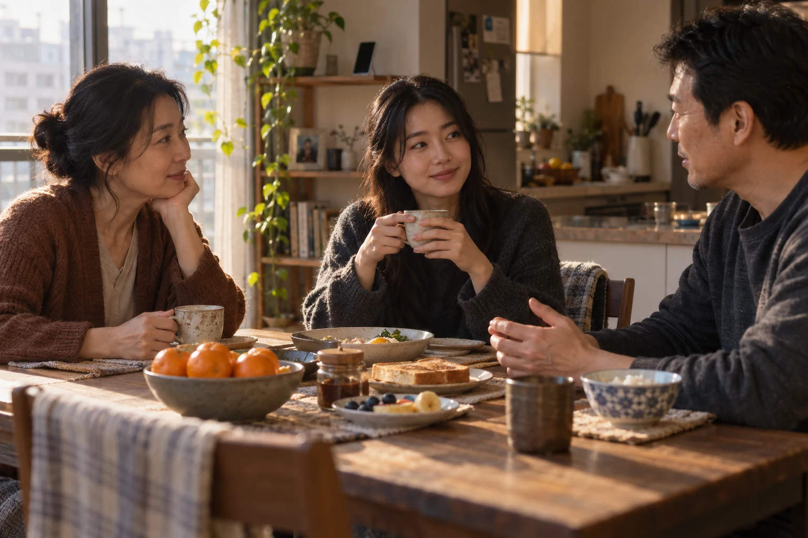

# Nếu Đức Phật Sống Trong Thời Đại Smartphone

**Nếu Đức Phật sống trong thời đại này, Ngài có dùng smartphone không? Câu hỏi nghe có vẻ lạ. Nhưng điều đáng nghĩ không nằm ở chiếc điện thoại trong tay Ngài. Nó nằm ở chúng ta: nếu lời Phật dạy xuất hiện giữa dòng tin đang cuộn mỗi ngày, liệu chúng ta có dừng lại để thực hành, hay chỉ bấm thích rồi tiếp tục lướt?**

*If the Buddha lived in this age, would he use a smartphone? It may seem an unusual question. But what deserves reflection is not the phone in his hand. It is our own response: if his teaching appeared in the stream of posts we scroll through each day, would we pause to put it into practice, or simply tap like and keep scrolling?*

Hãy thử hình dung Đức Phật hiện diện trong một thế giới đã biết đến Phật giáo. Có kinh điển, chùa viện, Tăng đoàn, nhiều truyền thống tu học và hàng triệu người thành kính hướng về Ngài. Nhưng cũng có những cuộc tranh cãi nhân danh Ngài, những lời chưa rõ xuất xứ được gắn tên Ngài, những món hàng hứa hẹn bình an và những người biết rất nhiều về buông bỏ mà vẫn không thể buông một lời hơn thua.

*Imagine the Buddha present in a world already acquainted with Buddhism. There are scriptures, monasteries, the Sangha, diverse traditions of practice, and millions who revere him. Yet there are also arguments conducted in his name, statements attributed to him without a clear source, products promising peace, and people who know a great deal about letting go but cannot let go of having the last word.*

Đây là một giả định để soi lại cách chúng ta học và sống hôm nay, không phải lời khẳng định về điều Đức Phật sẽ nghĩ hay làm. Sự kính trọng Ngài không ngăn chúng ta đặt câu hỏi. Trái lại, chính vì kính trọng, ta càng cần phân biệt lời dạy với cách mình diễn giải, sự thực hành với thói quen, và lòng thành với nhu cầu chứng minh mình đúng.

*This is a thought experiment for examining how we learn and live today, not a claim about what the Buddha would think or do. Reverence does not prevent questions. On the contrary, it asks us to distinguish the teaching from our interpretations, practice from habit, and sincere devotion from the need to prove ourselves right.*

---

## 1. Một Thế Giới Đã Có Rất Nhiều Lời Nói Về Đức Phật / A World Full of Words About the Buddha

Trước khi thành đạo, Đức Phật đã trải qua một cuộc tìm cầu, học với những vị thầy và thực hành những con đường có mặt trong thời đại của Ngài. Người học hôm nay bước vào một hoàn cảnh khác: rất nhiều lời giải thích đã chờ sẵn. Ta có thể tìm một bài giảng về vô thường trong vài giây, nghe về vô ngã lúc đi làm, đọc một câu về từ bi trước khi ngủ. Chưa bao giờ việc tiếp cận lời dạy thuận tiện đến thế. Nhưng thuận tiện trong tiếp cận không đồng nghĩa với sâu sắc trong tiếp nhận.

*Before his awakening, the Buddha undertook a search, studied with teachers, and practised paths available in his time. Learners today begin in different circumstances: countless explanations are already waiting. We can find a talk on impermanence in seconds, listen to a discussion of non-self on the way to work, and read a passage about compassion before bed. Access has never been so convenient. Yet ease of access does not guarantee depth of understanding.*

Một người có thể giải thích rằng mọi thứ đều đổi thay, rồi cả đêm không ngủ vì người khác không đối xử với mình như trước. Có thể nói rất hay về từ bi, nhưng không đủ kiên nhẫn nghe cha mẹ nói hết câu. Điều đó không chứng minh giáo pháp vô ích, cũng không có nghĩa người ấy giả dối. Nó cho thấy một khoảng cách rất người: điều đã hiểu bằng lời chưa chắc đã trở thành cách mình sống.

*Someone may explain that everything changes, yet lie awake because another person no longer treats them as before. They may speak eloquently about compassion but lack the patience to let a parent finish a sentence. This does not make the teaching useless or necessarily make the person dishonest. It reveals a very human gap: what we understand in words has not necessarily become the way we live.*

Kinh điển và truyền thống không phải nguyên nhân của khoảng cách ấy. Nhờ công sức gìn giữ, truyền dạy và thực hành của nhiều thế hệ, người đến sau mới có nơi để bắt đầu. Nhưng có nơi bắt đầu khác với đã đi đến nơi. Nếu hình dung Đức Phật ở giữa thế giới hôm nay, câu hỏi đáng đặt có lẽ không phải ai trích dẫn đúng nhiều nhất, mà là: sau những điều đã học, chúng ta có bớt làm khổ mình và người khác không?

*Scriptures and traditions are not the cause of that gap. Generations of preservation, teaching, and practice have given later learners somewhere to begin. Having a starting point, however, is not the same as arriving. If we imagine the Buddha among us today, the meaningful question may not be who can quote the most accurately, but whether what we have learned has helped us cause less suffering to ourselves and others.*

---

## 2. Khổ Đau Bước Vào Đời Sống Qua Những Cánh Cửa Mới / Suffering Enters Through New Doors

Sinh, già, bệnh, chết không biến mất vì con người có công nghệ tốt hơn. Mất mát vẫn đau, chia lìa vẫn khó, thân thể vẫn có giới hạn. Nhưng bên cạnh những điều ấy, đời sống hiện đại đưa thêm nhiều lý do để lòng người không yên. Công việc có thể theo ta về tận phòng ngủ. Một bữa cơm có thể bị cắt vụn bởi thông báo. Một buổi sáng đang bình thường có thể trở nên nặng nề chỉ vì nhìn thấy cuộc sống của người khác trên màn hình.

*Birth, ageing, illness, and death do not disappear because technology improves. Loss still hurts, separation remains difficult, and the body has limits. Alongside these realities, modern life supplies further reasons for unease. Work can follow us into the bedroom. Notifications can fragment a meal. An otherwise ordinary morning can become heavy after seeing someone else’s life on a screen.*

Ta biết người khác chỉ đăng những khoảnh khắc được chọn. Vậy mà khi nhìn lâu, ta vẫn đem toàn bộ đời mình so với phần đẹp nhất của đời họ. Mình có công việc, nhưng thấy chưa đủ thành công. Có người thương, nhưng thấy tình yêu chưa đủ đáng ngưỡng mộ. Có thời gian nghỉ, nhưng lại lo mình đang chậm hơn người khác. Sự thiếu thốn lúc này không chỉ nằm ở thứ chưa có. Nó còn nằm ở việc không biết thế nào mới được phép thấy đủ.

*We know that people post selected moments. Yet with enough exposure, we still compare our whole lives with the most attractive parts of theirs. We have work but feel insufficiently successful. We are loved but worry that our relationship is not impressive enough. We have time to rest but fear falling behind. The sense of lack is no longer only about what we do not possess. It is also about not knowing when we are allowed to feel that we have enough.*

Đây là điều [[Dopamine Economy - Nền Kinh Tế Của Sự Thèm Muốn|nền kinh tế của sự thèm muốn]] giúp ta nhìn rõ: có những mô hình kinh doanh hưởng lợi khi người dùng tiếp tục chú ý, so sánh và quay lại. Không cần cho rằng mọi nền tảng đều có cùng mục đích hoặc mọi nhu cầu đều do ai đó tạo ra. Chỉ cần thấy rằng môi trường quanh mình không phải lúc nào cũng giúp mình dừng. Khi ấy, thực hành không chỉ là trách mình yếu lòng. Nó còn là biết tắt bớt tiếng gọi, đặt giới hạn công việc và dành chỗ cho những điều không cần được chụp lại để có giá trị.

*The desire economy helps make one feature of this environment visible: some business models benefit when users continue paying attention, comparing, and returning. We need not assume that every platform shares one purpose or that every need has been manufactured. It is enough to recognise that our surroundings do not always help us stop. Practice then involves more than blaming ourselves for weakness. It can also mean reducing interruptions, setting limits on work, and making room for things whose value does not depend on being photographed.*

---

## 3. Nếu Gặp Đức Phật, Ta Muốn Được Chỉ Dạy Hay Được Xác Nhận? / Would We Seek Guidance or Confirmation?

Đặt Đức Phật vào hiện tại còn mở ra một câu hỏi khó hơn. Nếu điều mình nghe không giống cách mình vẫn hiểu, mình có đủ bình tĩnh để học lại không? Hay mình sẽ giữ cách hiểu quen thuộc, rồi chỉ tiếp nhận những lời khiến mình thấy yên tâm rằng bấy lâu nay mình không sai?

*Imagining the Buddha in the present opens a more difficult question. If what we heard differed from our accustomed understanding, would we remain calm enough to learn again? Or would we hold on to the familiar interpretation and accept only what reassured us that we had been right all along?*

Ta dễ thấy sự bám chấp khi nó mang hình dáng tiền bạc hoặc danh vọng. Khó hơn nhiều khi nó mang hình dáng một điều mình tin là tốt. Một phương pháp tu tập đã giúp mình qua cơn khủng hoảng có thể rất đáng quý. Nhưng từ đó đi đến kết luận rằng ai thực hành khác mình cũng sai là một bước khác. Biết ơn con đường đã giúp mình không đòi hỏi phủ nhận mọi con đường của người khác; tôn trọng người khác cũng không có nghĩa mọi lời dạy đều giống nhau hoặc khỏi cần phân biệt đúng sai.

*Attachment is easier to recognise when it concerns money or status. It is harder to recognise when it concerns something we regard as good. A practice that carried us through a crisis may be deeply valuable. Concluding from this that everyone who practises differently must be wrong is another step altogether. Gratitude for a path does not require rejecting every other path; respect for others does not mean that all teachings are identical or that discernment is unnecessary.*

Các truyền thống có lịch sử, cách diễn giải và phương pháp khác nhau. Muốn hiểu cần học có văn cảnh, không thể chỉ dựa vào một đoạn video hoặc một câu trích. [[theravada/04 - Cách Đọc Kinh Pāli Mà Không Biến Thành Tín Điều|Đọc kinh nghiêm túc]] không phải bỏ lòng kính tin; đó là để lòng kính tin đi cùng sự cẩn trọng. Nếu đặt câu hỏi chỉ để thắng người khác, ta đã mang sự hơn thua vào việc học. Nhưng nếu không bao giờ dám hỏi vì sợ mất hình ảnh người có đức tin, ta cũng có thể bỏ lỡ cơ hội hiểu sâu hơn.

*Traditions have different histories, interpretations, and methods. Understanding requires context; a short video or isolated quotation is not enough. Reading scripture carefully does not require abandoning reverence. It allows reverence to work together with care. If we question only to defeat someone, we bring rivalry into learning. But if we never dare to question for fear of losing our image as a faithful person, we may also miss the opportunity to understand more deeply.*

---

## 4. Khi Sự Bình An Cũng Có Thể Được Bán / When Peace Can Also Be Sold

Một người mệt mỏi tìm đến ứng dụng thiền. Một người vừa trải qua mất mát đăng ký khóa tĩnh tâm. Một người khác bỏ phố vài ngày để được ngủ đủ và nghe lại tiếng chim. Những lựa chọn ấy có thể giúp ích thật. Có chi phí không làm một sự hỗ trợ trở nên giả; được quảng bá cũng không tự động có nghĩa nó không có giá trị. Người hướng dẫn, nơi ở và công sức chăm sóc đều cần điều kiện để tồn tại.

*An exhausted person turns to a meditation app. Someone grieving joins a retreat. Another leaves the city for a few days to sleep properly and hear birds again. These choices can offer real help. A fee does not make support false, and publicity does not automatically make it worthless. Teachers, accommodation, and the labour of care all require resources.*

Vấn đề bắt đầu khi ta được hứa rằng chỉ cần mua đúng trải nghiệm thì phần khó của đời sống sẽ được giải quyết thay. Ta trở về từ nơi yên tĩnh, nhưng cách làm việc vẫn kiệt sức, cách nói với người thân vẫn gây tổn thương, và mỗi lúc bất an lại cần mua thêm một trải nghiệm mới. Sự nghỉ ngơi cần thiết đã bị nhầm với một thay đổi sâu hơn chưa xảy ra.

*Trouble begins when we are promised that buying the right experience will resolve life’s difficulties on our behalf. We return from a peaceful place, but our way of working remains exhausting, our words still hurt those close to us, and every new period of unease seems to require another purchase. Necessary rest has been mistaken for a deeper change that has not yet happened.*

Nếu nghĩ đến Đức Phật trong thế giới ấy, ta không cần tưởng tượng Ngài lên án mọi tiện nghi hay mọi dịch vụ chăm sóc tinh thần. Điều đáng tự hỏi gần gũi hơn: việc này đang giúp mình sống khác đi, hay chỉ giúp mình cảm thấy trong chốc lát rằng mình đã khác? Một kỳ nghỉ có thể cho ta sức để bắt đầu. Nhưng không ai có thể mua hộ việc nhận lỗi, giữ lời, kiên nhẫn lắng nghe hoặc nhìn thẳng vào một thói quen mình đã dung dưỡng nhiều năm.

*Thinking of the Buddha in such a world does not require imagining him condemning every comfort or form of spiritual support. The nearer question is whether something helps us live differently or merely gives us a brief feeling that we have changed. A retreat can provide the strength to begin. But no purchase can do the work of admitting fault, keeping a promise, listening patiently, or facing a habit we have indulged for years.*

---

## 5. Ngay Cả Người Muốn Buông Bỏ Cũng Có Thể Tự Làm Mình Căng Thẳng / Even the Wish to Let Go Can Become a Burden

Người mới thực hành thường mong tâm mình yên hơn. Mong muốn ấy không có gì đáng chê. Nhưng rồi có thể xuất hiện một yêu cầu khác: mình đã học đạo thì không được giận, đã ngồi thiền thì không được buồn, đã hiểu vô thường thì không được đau khi mất một người thân. Mỗi cảm xúc khó chịu trở thành một lần tự kết tội. Thay vì nhận ra điều đang có để chăm sóc và chuyển hóa, ta bận chứng minh rằng nó không nên có trong mình.

*A person beginning to practise often hopes for greater peace of mind. There is nothing blameworthy in that aspiration. Yet another demand can emerge: having studied the teaching, I must not become angry; having meditated, I must not feel sad; having understood impermanence, I must not hurt when someone close to me dies. Every difficult feeling becomes an accusation against oneself. Instead of recognising what is present so it can be cared for and transformed, we become occupied with proving that it should not be there.*

Chỗ này rất dễ dẫn đến một kết luận quá nhanh: muốn hết khổ cũng là muốn, vậy phải bỏ cả mục tiêu tu tập. Nhưng cùng một chữ “muốn” không làm mọi động lực giống nhau. Trong Phật học, **ái** là sự khát khao nuôi bám chấp; còn ý muốn thực hành điều thiện không vì được gọi là “muốn” mà tự động trở thành ái. Một người quyết tâm thôi nói lời gây tổn thương đang cần nỗ lực, không phải cần buông luôn trách nhiệm ấy.

*This can lead to a premature conclusion: wanting to end suffering is still wanting, so the goal of practice must itself be abandoned. But using one word for desire does not make every motivation the same. In Buddhist teaching, craving sustains clinging; the aspiration to cultivate what is wholesome does not automatically become craving merely because it is a form of wanting. Someone determined to stop speaking hurtfully needs effort, not the abandonment of that responsibility.*

Trong cuộc đối thoại được ghi lại ở [SN 51.15](https://www.accesstoinsight.org/tipitaka/sn/sn51/sn51.015.than.html), Tôn giả Ānanda giải thích điều này bằng một việc rất thường: muốn đến một khu vườn, rồi khi đến nơi, ý muốn đi đến ấy lắng xuống. Động lực có thể làm xong công việc của nó. Bài học không phải bỏ con đường trước khi đi, mà là đừng biến việc đi thành nhu cầu phải luôn có một hình ảnh tốt đẹp về mình. Người thực hành có thể nỗ lực mà không cần liên tục tự phong mình là người đã tiến xa.

*In the conversation recorded in [SN 51.15](https://www.accesstoinsight.org/tipitaka/sn/sn51/sn51.015.than.html), Venerable Ānanda explains this through an ordinary example: someone wants to reach a park, and upon arrival that particular desire subsides. Motivation can complete its task. The lesson is not to abandon the path before walking it, but not to turn the journey into a constant need for a favourable image of oneself. Practitioners can make an effort without continually declaring how far they have advanced.*

---

## 6. Giải Thoát Không Phải Giả Vờ Rằng Mình Không Đau / Liberation Is Not Pretending That Nothing Hurts

Một người đang bệnh cần được chữa. Một người bị bạo hành cần được bảo vệ. Một người vừa mất người thân có thể cần có ai đó ngồi cạnh mà không vội giảng giải. Nói “mọi thứ do tâm” trong những lúc ấy rất dễ biến một lời nghe sâu sắc thành cách tránh trách nhiệm với nỗi đau trước mắt. Thực hành không nên làm ta bớt nhạy cảm với khổ đau của người khác.

*A person who is ill needs care. A person experiencing abuse needs protection. Someone who has lost a loved one may need another person to sit beside them without rushing to explain. In such moments, saying that “everything comes from the mind” can turn a profound-sounding statement into an escape from responsibility for the pain before us. Practice should not make us less sensitive to another person’s suffering.*

[Bài kinh về hai mũi tên, SN 36.6](https://www.accesstoinsight.org/tipitaka/sn/sn36/sn36.006.than.html), phân biệt cảm giác đau thân với phần khổ tinh thần đi kèm sự chống đối và bị cuốn theo. Sự phân biệt ấy mở ra khả năng không làm nỗi đau nặng thêm. Nó không cho phép ta trách người đang khổ rằng họ chỉ cần nghĩ khác đi là đủ. Có những tổn thương cần thời gian, sự hỗ trợ và điều kiện sống an toàn, chứ không chỉ một lời nhắc phải buông.

*[SN 36.6, the discourse on the two arrows](https://www.accesstoinsight.org/tipitaka/sn/sn36/sn36.006.than.html), distinguishes bodily pain from the mental suffering associated with resistance and entanglement. That distinction opens the possibility of not adding further suffering to pain. It does not entitle us to tell someone in distress that changing their thoughts should be enough. Some wounds require time, support, and safe living conditions, not merely an instruction to let go.*

Cũng vì vậy, không nên hình dung Đức Phật như một người chỉ giỏi chịu đựng hơn chúng ta, hoặc cho rằng giác ngộ chỉ là biết sống thoải mái giữa biến động. Theo giáo pháp, mục tiêu giải thoát sâu hơn việc điều chỉnh tâm trạng: đó là sự đoạn trừ những gốc rễ gây trói buộc. Thừa nhận thân thể còn có thể đau không phủ nhận mục tiêu ấy. Và việc người học còn đang khó khăn không phải lý do để hạ mục tiêu xuống cho vừa trình độ hiện tại, cũng không phải lý do để tự khinh mình.

*For the same reason, the Buddha should not be imagined as someone merely better at enduring distress, nor awakening reduced to living comfortably amid change. In the teaching, liberation reaches deeper than mood regulation: it concerns the ending of the roots of bondage. Acknowledging that the body can still experience pain does not deny that goal. A learner’s present difficulties are neither a reason to reduce the goal to current abilities nor a reason for self-contempt.*

---

## 7. Có Thể Chiếc Điện Thoại Không Phải Điều Khó Nhất / Perhaps the Phone Is Not the Hardest Part

Trở lại câu hỏi ban đầu: Đức Phật có dùng smartphone không? Ta không có cơ sở để trả lời chắc chắn. Nhưng không cần trả lời thay Ngài mới thấy được điều câu hỏi gợi ra. Điện thoại có thể đưa một bài giảng đến người không thể đến chùa, giúp người bệnh gọi trợ giúp, giúp người ở xa hỏi thăm cha mẹ. Nó cũng có thể khiến người đang ngồi cạnh nhau không thật sự có mặt với nhau. Giá trị không chỉ nằm ở có hay không có thiết bị, mà còn ở việc ta dùng nó vào đâu và biết dừng lúc nào.

*Returning to the opening question: would the Buddha use a smartphone? We have no basis for certainty. Yet we do not need to answer on his behalf to see what the question reveals. A phone can bring a teaching to someone unable to visit a monastery, help a sick person call for assistance, or allow someone far away to care for their parents. It can also leave people sitting beside each other without being truly present. What matters is not simply whether the device is there, but how it is used and when we can put it down.*

Sự thực hành trong thời đại này vì thế không nhất thiết phải trông khác thường. Có khi nó bắt đầu bằng việc nghe hết một câu mà không nhìn màn hình. Nhận lỗi mà không kể thêm một câu chuyện để mình vẫn là người đúng. Không chuyển tiếp một lời được gắn tên Đức Phật khi chưa rõ xuất xứ. Giữ lòng kính trọng ngay cả khi đang bất đồng cách hiểu. Những việc ấy không phải thước đo để tự nhận đã giác ngộ; chúng là nơi những điều đã học có cơ hội trở thành hành động.

*Practice in this age need not look extraordinary. It may begin with hearing someone out without checking a screen, admitting a mistake without adding a story that keeps us in the right, or declining to forward a saying attributed to the Buddha when its source is unclear. It may mean remaining respectful while disagreeing over an interpretation. These acts do not provide a measure by which to claim awakening. They give what we have learned a chance to become conduct.*

Có lẽ phần khó nhất của giả định này không phải một thế giới có quá nhiều công nghệ. Đó là một thế giới có rất nhiều hình ảnh về Đức Phật, nhưng mỗi người vẫn cần tự hỏi mình có đang để lời dạy chạm đến đời sống hay không. Kính một hình tượng, gìn giữ nghi lễ và học kinh có thể nâng đỡ sự thực hành. Nhưng nếu chỉ bảo vệ điều mình đã quen tin mà không bao giờ nhìn lại cách mình hành xử, ta có thể ở rất gần những lời nói về đạo mà vẫn chậm bước trên con đường mình trân trọng.

*Perhaps the hardest part of this thought experiment is not a world with so much technology. It is a world with so many images of the Buddha, in which each of us must still ask whether the teaching is reaching our own life. Reverence for an image, observance of ritual, and study of scripture can support practice. But if we only defend familiar beliefs without examining our conduct, we may remain close to words about the path while moving slowly along the path we cherish.*

**Nếu Đức Phật hiện diện giữa thời đại smartphone, câu hỏi đáng mang theo có lẽ không chỉ là Ngài sẽ dùng công cụ gì. Mà là chúng ta sẽ sống khác đi thế nào khi thực sự lắng nghe lời Ngài dạy.**

*If the Buddha were present in the smartphone age, the question worth carrying might not simply be which tools he would use, but how we would live differently if we truly listened to his teaching.*

---

## Đọc Tiếp / Further Reading

Bài này nối với [[Luân Hồi Trên Home Screen]] về đời sống chú ý, [[Nghịch Lý Của Hiểu Biết]] về khoảng cách giữa hiểu và bám vào cái hiểu, cùng [[theravada/06 - Dukkha - Khổ Không Chỉ Là Đau Đớn|Dukkha — Khổ Không Chỉ Là Đau Đớn]] để đọc sâu hơn về khổ. Các minh họa là hình ảnh biên tập tạo bằng AI về đời sống hiện đại, không mô tả Đức Phật hay tái dựng sự kiện lịch sử.

*Continue with Home Screen Samsara on everyday attention, The Paradox of Knowing on understanding and attachment to understanding, and Dukkha — More Than Pain for a deeper reading of suffering. The illustrations are AI-generated editorial scenes of contemporary life, not depictions of the Buddha or reconstructions of historical events.*
