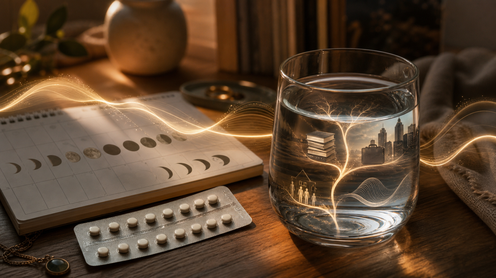
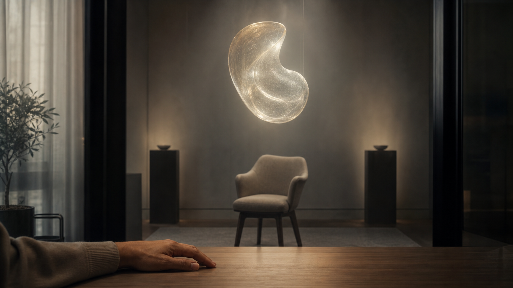

# Hormone, Hôn Nhân Và Cái Bẫy Giải Phóng Sinh Học

**Hiện đại không phá hôn nhân chỉ bằng tự do tình dục. Nó phá bằng cách tách tình dục khỏi sinh sản, sinh sản khỏi nghĩa vụ, nghĩa vụ khỏi danh dự, rồi gọi phần trống rỗng còn lại là tự do cá nhân. Nhưng phản ứng ngược kiểu đổ toàn bộ lỗi lên phụ nữ, thuốc tránh thai và “xã hội suy đồi” cũng là một dạng mù sinh học khác: thấy một nửa mẫu hình, rồi biến nó thành vũ khí.**

*Hiện đại không làm hôn nhân tan ra chỉ bằng tự do tình dục. Nó tách tình dục khỏi sinh sản, sinh sản khỏi nghĩa vụ, nghĩa vụ khỏi danh dự, rồi gọi khoảng trống còn lại là tự do cá nhân.*

---

---

## Vị Trí Trong Vault

Bài này nằm trong cụm bài về gia đình, dopamine và “Orphan Train” của [[mental-models/index|Mental Models Domain Gateway]]. Nó nối [[Care Economy Và Cách Ma Trận Làm Rỗng Gia Đình]], [[Tình Nghĩa Là Hạ Tầng Cuối Cùng]], [[Năng Lượng Tình Dục]], [[Chimera]], [[Tình Yêu Tỉnh Thức]], [[MOC - Health Sovereignty]] và [[Ma Trận]].

Nó không phải bài cổ vũ văn hóa nam quyền cực đoan, cũng không phải bài bênh “tự do hiện đại” một cách ngây thơ. Nó là bài đặt lại câu hỏi:

> Khi một nền văn minh làm tình dục rời khỏi sinh sản, sinh sản rời khỏi gia đình, gia đình rời khỏi nghĩa vụ, và cơ thể rời khỏi nhịp sinh học tự nhiên, điều gì xảy ra với hôn nhân?

Nguyên tắc của bài: **phê bình hệ thống và tầng động cơ lợi ích, không đổ tội phụ nữ, đàn ông, người không con, người dùng thuốc tránh thai, người từng phá thai, hoặc trẻ em.**

---

## Kỷ Luật Tuyên Bố

| Tầng đọc | Có thể nói gì | Không được nói gì |
|---|---|---|
| **Dữ kiện / có thể kiểm chứng** | Hormone ảnh hưởng tâm trạng, ham muốn, gắn kết, căng thẳng, chu kỳ, sinh sản; thuốc tránh thai hormone có tác dụng phụ và chống chỉ định ở một số nhóm; chất gây rối loạn nội tiết là vấn đề nghiên cứu thật. | Không được nói “thuốc tránh thai làm phụ nữ ghét thai phụ” như một kết luận khoa học. |
| **Mẫu hình / hệ thống** | Hiện đại biến tình dục, hẹn hò, chăm sóc, chăm con, phá thai, sinh sản và bản sắc thành chiến trường chính trị/thị trường. | Không quy toàn bộ vào “phụ nữ ích kỷ” hay “đàn ông suy đồi”. |
| **Biểu tượng / huyền thoại** | Mẹ, cha, tử cung, đứa trẻ, lời thề, dòng máu và gia đình là mẫu tượng quyền lực. | Không dùng biểu tượng để thay thế bằng chứng y sinh. |
| **Tổng hợp suy đoán** | Có thể đặt giả thuyết rằng sự tách tình dục khỏi sinh sản làm thay đổi đạo đức tập thể về thân thể và nghĩa vụ. | Không biến giả thuyết thành luật phổ quát hoặc công cụ làm nhục. |

Cảnh báo y tế: bài này không phải lời khuyên về tránh thai, phá thai, can thiệp sinh sản, ung thư, liệu pháp hormone hoặc quyết định y tế cá nhân. Đó là vùng cần bác sĩ, nguồn nghiên cứu và hoàn cảnh cụ thể.

---

## Từ Khóa Cần Hiểu

**Chủ Nghĩa Hưởng Lạc** là lối sống đặt khoái cảm, trải nghiệm và tránh đau làm trục chính. Nó không chỉ là tình dục, chất kích thích, du lịch. Nó có thể mặc áo “tự chăm sóc”, “tự do”, “chữa lành”, “sống đời rực rỡ nhất”.

**Giao ước** khác hợp đồng. Hợp đồng hỏi hai bên được gì khi còn có lợi. Giao ước hỏi lời hứa có còn đứng khi một bên yếu, bệnh, già, xấu, nghèo hoặc không còn “phục vụ sự trưởng thành của tôi”. Đây là ngôn ngữ của [[Tình Nghĩa Là Hạ Tầng Cuối Cùng]].

**Chất gây rối loạn nội tiết** là chất có thể can thiệp vào hệ hormone. Nhựa, phthalates, BPA, một số thuốc trừ sâu, phơi nhiễm hóa chất công nghiệp và nhiều yếu tố môi trường/lối sống đều thuộc vùng cần nghiên cứu nghiêm túc.

**Thuốc tránh thai hormone** là công cụ y khoa có lợi ích và rủi ro. Nó cho quyền tự quyết sinh sản cho phụ nữ, nhưng cũng can thiệp vào một hệ tinh vi. Đọc nó như công cụ có đánh đổi, không như quỷ hay phép màu.

---

## 1. Hôn Nhân Không Còn Là Vé Vào Cửa Của Tình Dục

Ngày xưa, hôn nhân giữ nhiều chức năng cùng lúc: tình dục hợp pháp, sinh sản, tài sản, liên minh họ hàng, lao động gia đình, bảo vệ phụ nữ/trẻ em, danh dự dòng tộc và trật tự xã hội. Hiện đại đã tách các chức năng này ra.

Tình dục có thể có ngoài hôn nhân. Sống chung có thể không cần cưới. Tài sản có thể ký hợp đồng. Bạn đồng hành có thể là bạn đời dài hạn. Dịch vụ chăm sóc có thể mua. Giải trí, du lịch, biểu đạt bản thân và lối sống đều có thể thay thế một phần cảm giác “đời sống phong phú”.

Vì vậy câu hỏi “tại sao kết hôn?” không còn ngây thơ. Nếu hôn nhân chỉ là tình dục + bạn đồng hành lãng mạn, nó đang cạnh tranh với một thị trường khoái cảm khổng lồ mà nó không thể thắng lâu dài. [[Dopamine Economy - Nền Kinh Tế Của Sự Thèm Muốn]] luôn có cái mới hơn, ít nghĩa vụ hơn, ít ma sát hơn.

Nhưng kết luận “vậy chỉ cưới để có con” vẫn hơi hẹp. Câu sắc hơn là:

> Hôn nhân chỉ đáng làm khi hai người cùng bước vào một dự án dài hạn lớn hơn cảm xúc hiện tại của họ: con cái, chăm sóc, giao ước, dòng truyền thừa, trưởng thành tâm linh, hoặc một dạng nghĩa vụ sống thật.

Con cái là dự án mạnh nhất vì nó ép hai người vượt khỏi bản thân. Nhưng không phải cặp không con nào cũng vô nghĩa, và không phải cặp có con nào cũng có hôn nhân thật. Có con mà không có sự chăm sóc chỉ là biến cố sinh học. Không con mà có giao ước, phụng sự, sáng tạo, chăm sóc người già, cộng đồng, hoặc một đời sống nghĩa tình thật vẫn có thể là một cấu trúc thiêng.

Vấn đề của hiện đại không phải nó cho phép người ta không có con. Vấn đề là nó dạy người ta nghĩ mọi thứ không phục vụ khoái cảm cá nhân đều là gánh nặng.

---

## 2. Thuốc Tránh Thai: Tự Do Thật, Nhưng Không Miễn Phí

Thuốc tránh thai và các công nghệ kiểm soát sinh sản đã thay đổi lịch sử. Chúng cho phụ nữ khả năng học, làm việc, thoát khỏi sinh sản cưỡng bức, tránh thai khi chưa sẵn sàng, và rời khỏi những cấu trúc áp bức. Đây là tầng thật. Không nên xóa nó chỉ vì ta đang phê bình hiện đại.

Nhưng cũng có tầng khác: khi tình dục được tách khỏi hậu quả sinh sản gần như hoàn toàn, đạo đức tình dục đổi hình. Một hành vi từng nằm trong vòng trách nhiệm gia đình/dòng máu có thể bị thị trường hóa thành giải trí, xác nhận giá trị, chinh phục, xả căng thẳng, biểu đạt bản sắc hoặc vòng lặp dopamine.

Đây là chỗ [[Năng Lượng Tình Dục]] quan trọng. Tình dục không chỉ là ma sát sinh học. Nó là sinh lực, gắn kết, sự mở lòng, ký ức, hormone, gắn bó, xấu hổ, trách nhiệm. Công nghệ có thể giảm hậu quả sinh sản, nhưng không xóa hết hậu quả tâm lý/năng lượng/xã hội.

Nói vậy không có nghĩa “ai dùng thuốc tránh thai là lệch”. Nó nghĩa là tự do luôn có tầng giá. Nếu một công cụ giúp con người chọn có ý thức hơn, nó có thể phục vụ chủ quyền. Nếu nó giúp thị trường biến tình dục thành hàng tiêu dùng không hậu quả, nó phục vụ bòn rút.

> Công cụ không phải Ma Trận. Ma Trận là khi công cụ định nghĩa lại con người mà con người không nhận ra.

---

## 3. Chính Trị Phá Thai: Khi Tử Cung Thành Chiến Trường Ý Thức Hệ

Phá thai là một trong những chủ đề dễ biến con người thành khẩu hiệu nhất. Một bên chỉ thấy “quyền tự chủ cơ thể”. Bên kia chỉ thấy “giết một sinh mệnh”. Cả hai chạm vào một phần thật, rồi thường mất khả năng nghe phần còn lại.

Tầng dữ kiện/chính sách cần phân biệt rất kỹ: sức khỏe người mẹ, hiếp dâm, dị tật nặng, nghèo đói, tuổi thai, khả năng tiếp cận y tế, trách nhiệm của người cha, hỗ trợ sau sinh, nhận con nuôi, và động cơ lợi ích của hệ thống. Một slogan không đủ chứa toàn bộ.

Tầng biểu tượng sâu hơn: xã hội hiện đại không biết xử lý đứa trẻ chưa sinh. Nó vừa là sinh mệnh tiềm năng, vừa là gánh nặng kinh tế, vừa là quyền chính trị, vừa là vết thương riêng tư, vừa là điểm dữ liệu trong chiến tranh văn hóa. Tử cung trở thành nơi nhà nước, tôn giáo, y khoa, thị trường và ý thức hệ tranh quyền định nghĩa.

Vault không dùng chủ đề này để làm nhục phụ nữ. Sự xấu hổ không chữa được gì. Nhưng vault cũng không làm phẳng nó thành “thủ thuật y tế bình thường” như nhổ răng. Có những quyết định để lại dấu vết trong thân, tâm, ký ức và linh hồn. [[Chimera]] nhắc rằng cơ thể không phải hệ kín vô ký ức; thai kỳ, tình dục, máu, sang chấn và gắn bó đều có thể để lại dấu ấn ở nhiều tầng.

Cách đọc đúng hơn:

- bảo vệ quyền tự quyết của người phụ nữ;
- không xóa thực tại đạo đức của sinh mệnh tiềm năng;
- yêu cầu trách nhiệm từ đàn ông, gia đình và cộng đồng;
- nhìn động cơ lợi ích của hệ thống khiến việc sinh con trở nên bất khả thi;
- không biến đau riêng thành vũ khí chính trị.

---

## 4. Hormone Không Phải Định Mệnh, Nhưng Cũng Không Phải Chi Tiết Phụ

Một lỗi của hiện đại là tưởng ý thức chỉ là quan điểm. Muốn gì, nghĩ gì, yêu ai, chịu được gì, gắn kết ra sao, tâm trạng thế nào, ham muốn thế nào, tất cả bị nói như thể chỉ là bản sắc và lựa chọn. Nhưng cơ thể có tiếng nói riêng.

Hormone, chu kỳ kinh nguyệt, tuyến giáp, các tín hiệu như cortisol/insulin/oxytocin/dopamine/prolactin/estrogen/progesterone/testosterone, cùng giấc ngủ, ánh sáng, căng thẳng, viêm và tình trạng dinh dưỡng đều ảnh hưởng đến cảm nhận về bản thân và người khác.

Nói vậy không có nghĩa rơi vào định mệnh luận sinh học. Phụ nữ không phải hormone. Đàn ông không phải testosterone. Nhưng một nền văn minh bắt cả hai sống như thể thân thể không có nhịp, rồi bán thuốc/dịch vụ để xử lý hậu quả, thì đang chống lại khả năng đọc cơ thể.

Đây là lý do bài này nối vào [[MOC - Health Sovereignty]]. Chủ quyền cơ thể không chỉ là quyền nói “cơ thể tôi, lựa chọn của tôi”. Nó còn là khả năng đọc tín hiệu cơ thể trước khi mọi thứ thành chẩn đoán, toa thuốc, ý thức hệ hoặc thương hiệu lối sống.

> Chủ quyền cơ thể = quyền chọn + năng lực hiểu cái mình đang chọn trên một cơ thể thật.

---

## 5. Rối Loạn Nội Tiết Từ Môi Trường: Ma Trận Đi Qua Nước, Nhựa, Ánh Sáng Và Stress

Nếu chỉ nói “phụ nữ hiện đại không muốn sinh con” hoặc “đàn ông hiện đại yếu” thì quá lười. Câu hỏi mạnh hơn: cơ thể hiện đại đang sống trong môi trường nào?

- ngủ muộn, thiếu nắng, ánh sáng xanh ban đêm;
- căng thẳng tài chính, nợ, tiền thuê nhà, KPI công việc;
- thực phẩm công nghiệp, dầu hạt công nghiệp, đường, rượu bia;
- nhựa, mùi hương tổng hợp, thuốc trừ sâu, phơi nhiễm hóa chất;
- khiêu dâm, ứng dụng hẹn hò, vòng lặp dopamine và cơn thèm cái mới;
- thiếu vận động, thiếu cộng đồng, thiếu sự tĩnh lặng;
- tuổi sinh con bị đẩy trễ vì học phí, nhà cửa, nấc thang sự nghiệp.

Đây là một dạng Ma Trận vật lý trong [[Ma Trận]]. Nó không cần cấm sinh sản. Nó chỉ cần làm cơ thể mệt, tinh trùng yếu, chu kỳ rối, ham muốn lệch, khả năng gắn kết đôi lứa nghèo, tiền bạc căng, nhà cửa đắt, rồi nói: “Bạn tự do chọn không sinh con mà.”

Một lần nữa: không phải ai không sinh con cũng bị lừa. Có người chọn đúng với đời mình. Nhưng khi cả nền văn minh đồng loạt thấy việc hình thành gia đình trở nên quá khó, đó không còn là chuyện sở thích cá nhân. Đó là hạ tầng thất bại.

---

## 6. Xa Xỉ Không Con Và Cái Bẫy Hưởng Lạc

Những cặp không con đi Bali, Tahiti, đi trượt tuyết, mua đồ chơi đắt tiền không tự động sai. Người ta có quyền sống đời mình. Vấn đề không nằm ở chuyến du lịch. Vấn đề là khi văn hóa bán hình ảnh đó như đỉnh cao tự do, còn con cái được đóng khung như mất lối sống.

Đây là chủ nghĩa hưởng lạc mềm: không nhất thiết trụy lạc, chỉ là một đời sống luôn hỏi “cái này có làm tôi thoải mái hơn không?” thay vì “cái này có làm tôi sâu hơn, thật hơn, có ích hơn không?”

Con cái không làm ai tự động cao quý. Có người sinh con vì cái tôi, áp lực, vô thức hoặc để cứu hôn nhân. Nhưng con cái có một quyền năng đặc biệt: nó phá ảo tưởng rằng đời sống xoay quanh biểu đạt bản thân. Một đứa trẻ kéo người lớn vào nhịp sinh học, mất ngủ, hy sinh, chăm sóc, kiên nhẫn, truyền thừa và dòng truyền thừa.

Hiện đại ghét điều đó vì trẻ em là biến cố chống tiêu dùng. Một đứa trẻ thật đòi thời gian thật, thân thể thật, tiền thật, trách nhiệm thật. Không mở rộng quy mô được. Không tối ưu. Không thể quẹt tay bỏ qua.

Nhưng cũng cần nói rõ: nếu một người không có năng lực chứa làm cha/mẹ, việc họ không sinh có thể là trách nhiệm, không phải ích kỷ. Vault không sùng bái sinh sản như số lượng. Vault hỏi: nền văn minh có còn tạo điều kiện cho những người muốn xây gia đình làm điều đó một cách khỏe mạnh không?

---

## 7. Hôn Nhân Như Hạ Tầng Của Sinh Học Và Linh Hồn

Hôn nhân khỏe không chỉ là tình yêu. Nó là trường chứa cho những thứ rất khó chứa nếu chỉ có cá nhân:

- dục lực;
- ghen tuông;
- bệnh tật;
- tiền bạc;
- thai kỳ;
- con nhỏ;
- người già;
- thất bại;
- tuổi già;
- phóng chiếu bóng tối;
- tha thứ;
- nghĩa vụ.

[[Tình Yêu Tỉnh Thức]] nói tình yêu trưởng thành không chiếm hữu, nhưng cũng không né trách nhiệm. [[Tình Nghĩa Là Hạ Tầng Cuối Cùng]] nói giao ước hiện ra khi đời hết lớp đẹp bề mặt. [[Care Economy Và Cách Ma Trận Làm Rỗng Gia Đình]] nói gia đình là hạ tầng chăm sóc, không chỉ cảm xúc.

Nếu ba bài đó ghép lại, ta có một định nghĩa:

> Hôn nhân là một trường chứa sinh học, tâm lý, xã hội và tâm linh để hai người không chỉ tiêu thụ nhau, mà cùng giữ một trường chăm sóc đủ lâu cho sự sống đi qua.

Con cái là hình thức rõ nhất của “sự sống đi qua”, nhưng không phải hình thức duy nhất. Có thể là chăm cha mẹ già. Có thể là xây cộng đồng. Có thể là giữ một dòng truyền thừa tri thức. Có thể là phụng sự. Nhưng nếu hôn nhân không chứa bất cứ thứ gì vượt khỏi cái tôi, nó sẽ rất dễ thành gói thuê bao cảm xúc.

---

## 8. Đọc Bài Viết Gốc Như Thế Nào?

Nếu gặp một bài viết nói kiểu “hôn nhân không con là vô nghĩa”, “thuốc tránh thai làm phụ nữ hỏng”, “phá thai làm nữ giới mất bản năng”, “xã hội hiện đại chống sinh học”, hãy đọc như sau:

### Phần có thể giữ

- Hôn nhân hiện đại đã mất nhiều chức năng cổ điển.
- Con cái/sự chăm sóc/dòng truyền thừa là trục nghĩa vụ mạnh nhất của hôn nhân.
- Tình dục tách khỏi sinh sản làm thay đổi đạo đức tập thể.
- Hormone và môi trường nội tiết ảnh hưởng đời sống thân mật.
- Lối sống tiêu dùng có thể thay thế nghĩa vụ bằng trải nghiệm.
- Việc hình thành gia đình đang bị phá bởi hệ thống kinh tế, y tế, dopamine và nhà ở.

### Phần phải bỏ

- Thói ghét phụ nữ.
- Làm nhục người không con như thể họ vô dụng.
- Nói như thể mọi phụ nữ đều có cùng bản năng hoặc cùng phản ứng hormone.
- Biến thuốc tránh thai/phá thai thành nguyên nhân duy nhất của sự sụp đổ.
- Dùng giả khoa học để chứng minh một kết luận đạo đức đã có sẵn.
- Quên vai trò của đàn ông, tiền bạc, nhà ở, khiêu dâm, thị trường lao động và chính sách nhà nước.

### Phần cần nâng cấp

Thay vì hỏi “phụ nữ đã sai ở đâu?”, hỏi:

> Hệ thống nào đã làm cả nam lẫn nữ yếu đi trong khả năng tạo gia đình, giữ lời hứa, đọc cơ thể, sinh con, chăm con, chăm người già và sống một đời không bị thị trường định nghĩa?

Câu hỏi đó mới đủ lớn.

---

## Thực Hành Chủ Quyền

Không cần biến bài này thành chiến tranh văn hóa. Bắt đầu bằng những việc rất thật:

- học khả năng đọc cơ thể: ngủ, chu kỳ, ham muốn, căng thẳng, ánh sáng, ăn uống, tâm trạng;
- đọc kỹ đánh đổi của bất kỳ can thiệp hormone nào;
- không dùng tình dục để xin xác nhận giá trị;
- không dùng “tự do” để né hậu quả;
- không dùng “sinh học” để kiểm soát hoặc hạ nhục người khác;
- hỏi người mình yêu: chúng ta đang xây gì lớn hơn khoái cảm hiện tại?
- xem con cái/sự chăm sóc/gia đình như hạ tầng, không như phụ kiện lối sống;
- giữ kỷ luật tuyên bố khi nói về sức khỏe, khả năng sinh sản, tránh thai, phá thai.

Chủ quyền không phải quay về quá khứ nguyên xi. Quá khứ có áp bức thật. Hiện đại có tự do thật. Nhưng nếu tự do hiện đại làm con người mất khả năng đọc cơ thể, mất năng lực chăm sóc và chứa đựng, mất dòng truyền thừa và mất khả năng giao ước, thì đó không còn là tự do đầy đủ. Đó là giải phóng bị thị trường chiếm dụng.

---

## Chốt Lại

Hôn nhân không chết vì người ta thông minh hơn tổ tiên. Hôn nhân yếu đi vì những trường chứa từng giữ tình dục, sinh sản, sự chăm sóc, nghĩa vụ, dòng máu và linh hồn đã bị tách ra thành các sản phẩm riêng lẻ: ứng dụng hẹn hò, khiêu dâm, thuốc tránh thai, phòng khám hỗ trợ sinh sản, dịch vụ chăm trẻ, gói trị liệu, cơ sở chăm sóc người già, thương hiệu lối sống, hợp đồng pháp lý.

Một số tách rời này cứu người thật. Một số cho quyền tự quyết thật. Nhưng khi tất cả bị tách, con người có thể có nhiều lựa chọn hơn mà ít trường nghĩa hơn.

Câu hỏi không phải “quay lại truyền thống bằng mọi giá” hay “tiến lên hiện đại bằng mọi giá”. Câu hỏi là:

> Ta có thể giữ quyền tự quyết hiện đại mà không đánh mất sinh học, nghĩa vụ, tình nghĩa và khả năng truyền sự sống qua mình không?

Nếu câu trả lời là có, hôn nhân không phải nhà tù cũ. Nó là một trong những hạ tầng cuối cùng chống lại một thế giới muốn biến mọi quan hệ thành tiêu dùng.

## Related

- [[Care Economy Và Cách Ma Trận Làm Rỗng Gia Đình]]
- [[Tình Nghĩa Là Hạ Tầng Cuối Cùng]]
- [[Năng Lượng Tình Dục]]
- [[Chimera]]
- [[Tình Yêu Tỉnh Thức]]
- [[MOC - Health Sovereignty]]
- [[Ma Trận]]
