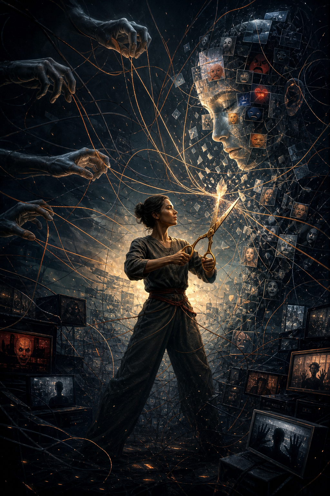

# Individuation (Thành Toàn Bản Ngã)

**Individuation là quá trình một con người ngừng sống như persona được lập trình và bắt đầu trở thành một cá thể toàn vẹn: biết shadow của mình, không bị role xã hội nuốt chửng, tích hợp vô thức, rồi tiến gần hơn tới Self. Trong ngôn ngữ vault, đây là nền tâm lý để [[Gnosis]] không biến thành spiritual inflation.**

*Individuation is the process of becoming whole: integrating persona, shadow, unconscious material, and the Self. In the vault's language, it is the psychological groundwork that allows Gnosis to stabilize instead of inflating the ego.*

Một người chưa individuation dễ biến mọi red pill thành ego mới. Họ không thoát Ma Trận; họ chỉ đổi persona từ “người bình thường” sang “người đã biết”.

---

## Vault Position / Vị Trí Trong Vault

Trong redpill.wiki, Individuation là cầu nối giữa psychology và spirituality.

[[Tâm Lý Học Jung]] cung cấp language: persona, shadow, anima/animus, Self. [[Vô Thức Tập Thể]] cung cấp archetypal background. [[Ma Trận]] là hệ thống khai thác persona và shadow chưa tích hợp. [[Gnosis]] là direct knowing, nhưng nếu psyche chưa đủ vững, Gnosis dễ thành inflation.

Individuation giúp người đọc không dùng esoterica để chạy khỏi bản thân. Nó nhắc rằng trước khi nói về Source, Monad, Oneness hay Ma Trận, ta phải nhìn cái tôi đang nói những chữ đó.

---

## Persona: Mặt Nạ Cần Thiết Nhưng Nguy Hiểm

Persona là mặt nạ xã hội: vai trò, nghề nghiệp, hình ảnh, danh tính công khai. Persona không xấu. Không có persona, ta khó vận hành trong xã hội.

Bẫy bắt đầu khi con người tưởng persona là Self.

Người giỏi không được yếu. Người tỉnh thức không được sai. Người tốt không được giận. Người thành công không được rỗng. Spiritual person không được có shadow. Redpill person không được admit mình vẫn bị programming.

[[Ma Trận]] rất thích persona vì persona dễ bị điều khiển bằng shame, status và approval. Nếu identity của bạn là “người thông minh”, hệ thống chỉ cần làm bạn sợ bị xem là ngu. Nếu identity của bạn là “người tỉnh”, hệ thống chỉ cần làm bạn sợ bị xem là sheep.

---

## Shadow: Cái Bị Đẩy Xuống Dưới

Shadow là phần bị phủ nhận: giận dữ, ham muốn, ghen tị, sợ hãi, yếu đuối, quyền lực, ích kỷ, cả tài năng bị chôn. Shadow không biến mất khi bị phủ nhận. Nó đi vòng ra ngoài qua projection.

Bạn ghét người kiêu ngạo vì mình không dám nhận nhu cầu được công nhận. Ghét người giàu vì mình sợ quyền lực của tiền. Ghét “NPC” vì mình sợ phần máy móc trong chính mình. Ghét dục tính vì mình chưa biết tích hợp năng lượng sống.

Shadow work không phải nuông chiều bóng tối. Nó là nhìn thẳng để năng lượng bị split quay về trung tâm.

Một người không làm shadow work sẽ biến spiritual path thành sân khấu cho persona. Một người làm shadow work thật thường bớt cần chứng minh mình sáng.

---

## Anima / Animus Và Đối Cực Bên Trong

Jung dùng anima/animus để chỉ inner feminine trong nam và inner masculine trong nữ. Đọc rộng hơn, đây là quá trình tích hợp phần đối cực bên trong psyche.

Nam phủ nhận feminine có thể mất cảm xúc, mất receptivity, sợ vulnerability. Nam bị anima chiếm có thể mood swing, projection lên phụ nữ, romantic obsession. Nữ phủ nhận masculine có thể thiếu direction, khó boundary. Nữ bị animus chiếm có thể có harsh inner voice, rigid ideology.

Individuation không xóa giới tính. Nó giúp con người không bị một cực điều khiển vô thức.

Ở tầng vault, đây là cách vượt [[Nhị Nguyên]] trong chính psyche: không chọn một cực để giết cực kia, mà làm hai cực biết đối thoại.

---

## Self: Không Phải Ego Lớn Hơn

Self trong Jung không phải ego được nâng cấp. Self là toàn thể psyche: conscious + unconscious, personal + archetypal, center + circumference. Ego cần thiết để sống. Nhưng ego không phải vua.

Khi ego tưởng mình là Self, đó là inflation. Trong spiritual circles, inflation rất phổ biến: một người có trải nghiệm mạnh rồi tưởng mình đã giác ngộ, được chọn, hiểu hết Ma Trận, hoặc có quyền đứng trên người khác.

[[Gnosis]] thật làm ego khiêm hơn. Gnosis giả làm ego phình to.

Individuation là quá trình ego học cách phục vụ Self thay vì giả làm Self.

---

## Individuation Và Ma Trận

Ma Trận khai thác những phần chưa tích hợp: shadow bằng outrage, persona bằng status, wound bằng fear, tribe identity bằng politics, sexual energy bằng porn, spiritual hunger bằng guru/system.

Một người càng split bên trong càng dễ bị trigger bên ngoài. Individuation làm giảm số nút bấm mà hệ thống có thể nhấn.

Đây là lý do Individuation là một kỹ năng sovereignty. Không chỉ là therapy. Không chỉ là Jung. Nó là security architecture của psyche.

Nếu bạn không biết shadow của mình, người khác có thể dùng nó như remote control.

---

## Beyond Nhị Nguyên

Người chưa individuation thường cần thế giới đơn giản: tốt/xấu, ta/địch, tỉnh/NPC, chính nghĩa/quỷ dữ. Individuation giúp psyche chịu được paradox.

Mình vừa sáng vừa tối. Người khác vừa sai vừa có phần đúng. Hệ thống vừa ác vừa có người tốt bên trong. Một symbol vừa đẹp vừa bị weaponize. Một red pill vừa giải phóng vừa có thể gây nghiện.

Đây là bước vượt [[Nhị Nguyên]] ở tầng tâm lý. Không phải bằng cách nói “mọi thứ là một” rồi bỏ qua khác biệt, mà bằng cách chịu được complexity mà không tan rã.

---

## Practice / Thực Hành

Dream journal giúp unconscious nói bằng symbol. Projection tracking hỏi: người nào làm mình phản ứng quá mạnh và vì sao? Shadow journaling viết thật những điều không muốn ai thấy. Active imagination đối thoại với hình ảnh bên trong. Creative expression cho unconscious nói qua art/writing/music. Therapy/container cần thiết khi shadow quá mạnh. Embodiment nhắc rằng hiểu bằng đầu chưa đủ; phải sống khác đi.

Practice quan trọng nhất: khi bị trigger, đừng chỉ hỏi “người kia sai ở đâu?”. Hỏi thêm: “phần nào trong mình đang bị kích hoạt?”

Câu hỏi đó không làm người kia đúng. Nó làm mình tự do hơn.

---

## Common Traps

Biến shadow work thành self-obsession. Dùng Jung để rationalize toxic behavior. Nghĩ “tích hợp shadow” là làm mọi impulse. Spiritual bypass: nói Oneness để né trauma. Redpill inflation: biết conspiracy rồi tưởng mình hơn người. Guru dependency: outsource Self cho người khác.

Individuation không làm bạn đặc biệt hơn. Nó làm bạn thật hơn.

---

## Kết

Individuation là quá trình thu hồi những mảnh psyche bị phân tán vào persona, shadow, projection và collective programming.

Trong vault, nó là một trong những kỹ năng thoát Ma Trận quan trọng nhất: không phải thoát bằng chạy trốn thế giới, mà bằng cách không còn bị thế giới kéo dây từ bên trong.

> Ma Trận dễ kiểm soát một cái tôi bị chia mảnh. Nó khó kiểm soát một con người đã bắt đầu toàn vẹn.

---

## Reading Path / Đọc Tiếp

- [[Tâm Lý Học Jung]] — language nền của Jungian psychology
- [[Vô Thức Tập Thể]] — archetypal background
- [[Gnosis]] — direct knowing cần psyche đủ vững
- [[Monad]] — tia lửa Source không phải ego
- [[Sự Nhất Thể]] — cái Một không dùng để bypass shadow
- [[Nghịch Lý Của Hiểu Biết]] — chịu được paradox mà không bám framework
