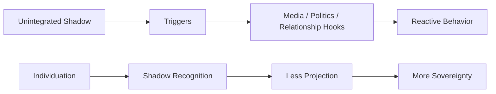

# Individuation (Thành Toàn Bản Ngã)

**Individuation là quá trình một con người ngừng sống như persona được lập trình và bắt đầu trở thành một cá thể toàn vẹn: biết shadow của mình, không bị role xã hội nuốt chửng, tích hợp vô thức, rồi tiến gần hơn tới Self. Trong ngôn ngữ vault, đây là bước tâm lý trước khi [[Gnosis]] có thể đứng vững.**

*Individuation is the process by which a person stops living as a programmed persona and begins becoming a whole individual: knowing their shadow, not being swallowed by social roles, integrating the unconscious, and moving closer to the Self. In the vault's language, it is the psychological groundwork that allows [[Gnosis]] to stabilize.*

---

## Vault Position / Vị Trí Trong Vault

Trong redpill.wiki, **Individuation** là cầu nối giữa psychology và spirituality.

- [[Tâm Lý Học Jung]] cung cấp language: shadow, persona, anima/animus, Self.
- [[Vô Thức Tập Thể]] cung cấp archetypal background.
- [[Ma Trận]] là hệ thống khai thác persona và shadow chưa tích hợp.
- [[Gnosis]] là direct knowing, nhưng nếu psyche chưa đủ vững, gnosis dễ biến thành spiritual inflation.

> Một người chưa individuation dễ biến mọi red pill thành ego mới.

---

## 1. Persona: Mặt Nạ Cần Thiết Nhưng Nguy Hiểm

Persona là mặt nạ xã hội: vai trò, nghề nghiệp, hình ảnh, danh tính công khai. Persona không xấu. Không có persona, ta khó vận hành trong xã hội. Bẫy bắt đầu khi con người tưởng persona là Self.

| Persona | Bẫy |
|---|---|
| người giỏi | không được yếu |
| người tỉnh thức | không được sai |
| người tốt | không được giận |
| người thành công | không được rỗng |
| spiritual person | không được có shadow |

Ma Trận rất thích persona vì persona dễ bị điều khiển bằng shame, status và approval.

---

## 2. Shadow: Cái Bị Đẩy Xuống Dưới

Shadow là phần bị phủ nhận: giận dữ, ham muốn, ghen tị, sợ hãi, yếu đuối, quyền lực, sự ích kỷ, cả tài năng bị chôn. Shadow không biến mất khi bị phủ nhận. Nó đi vòng ra ngoài qua projection.

- Ghét người kiêu ngạo vì mình không dám nhận nhu cầu được công nhận.
- Ghét người giàu vì mình sợ quyền lực của tiền.
- Ghét “NPC” vì mình sợ phần máy móc trong chính mình.
- Ghét dục tính vì mình chưa biết tích hợp năng lượng sống.

Shadow work không phải nuông chiều bóng tối. Nó là nhìn thẳng để năng lượng bị split quay về trung tâm.

---

## 3. Anima / Animus

Jung dùng anima/animus để chỉ inner feminine trong nam và inner masculine trong nữ. Đọc rộng hơn, đó là quá trình tích hợp phần đối cực bên trong psyche.

| Nếu thiếu integration | Biểu hiện |
|---|---|
| Nam phủ nhận feminine | mất cảm xúc, mất receptivity, sợ vulnerability |
| Nam bị anima chiếm | mood swing, projection lên phụ nữ, romantic obsession |
| Nữ phủ nhận masculine | thiếu direction, khó boundary |
| Nữ bị animus chiếm | harsh inner voice, rigid ideology |

Individuation không xóa giới tính. Nó giúp con người không bị một cực điều khiển vô thức.

---

## 4. Self: Không Phải Ego Lớn Hơn

Self trong Jung không phải ego được nâng cấp. Self là toàn thể psyche: conscious + unconscious, personal + archetypal, center + circumference. Ego cần thiết để sống. Nhưng ego không phải vua.

Khi ego tưởng mình là Self, đó là inflation. Trong spiritual circles, inflation rất phổ biến: một người có trải nghiệm mạnh rồi tưởng mình đã giác ngộ, được chọn, hoặc hiểu hết Ma Trận.

[[Gnosis]] thật làm ego khiêm nhường hơn. Gnosis giả làm ego phình to.

---

## 5. Individuation Và Ma Trận

[[Ma Trận]] khai thác những phần chưa tích hợp:

- shadow bị kích bằng outrage,
- persona bị kích bằng status,
- wound bị kích bằng fear,
- tribe identity bị kích bằng politics,
- sexual energy bị hijack bằng porn,
- spiritual hunger bị hijack bằng guru/system.

Một người càng split bên trong càng dễ bị trigger bên ngoài. Individuation làm giảm số “nút bấm” mà hệ thống có thể nhấn.

---

## 6. Beyond Nhị Nguyên

Người chưa individuation thường cần thế giới đơn giản: tốt/xấu, ta/địch, tỉnh/NPC, chính nghĩa/quỷ dữ. Individuation giúp psyche chịu được paradox:

- mình vừa sáng vừa tối,
- người khác vừa sai vừa có phần đúng,
- hệ thống vừa ác vừa có người tốt bên trong,
- một symbol vừa đẹp vừa bị weaponize,
- một red pill vừa giải phóng vừa có thể gây nghiện.

Đây là bước vượt [[Nhị Nguyên]] ở tầng tâm lý.

---

## 7. Practice / Thực Hành

1. **Dream journal** — ghi lại dream symbol, đừng vội giải thích.
2. **Projection tracking** — người nào làm mình phản ứng quá mạnh?
3. **Shadow journaling** — viết thật những điều không muốn ai thấy.
4. **Active imagination** — đối thoại với hình ảnh bên trong.
5. **Creative expression** — cho unconscious nói qua art/writing/music.
6. **Therapy/container** — cần không gian an toàn khi shadow quá mạnh.
7. **Embodiment** — không chỉ hiểu bằng đầu, phải sống khác đi.

---

## 8. Common Traps

- biến shadow work thành self-obsession,
- dùng Jung để rationalize toxic behavior,
- nghĩ “tích hợp shadow” là làm mọi impulse,
- spiritual bypass: nói Oneness để né trauma,
- redpill inflation: biết conspiracy rồi tưởng mình hơn người,
- guru dependency: outsource Self cho người khác.

Individuation không làm bạn đặc biệt hơn. Nó làm bạn thật hơn.

---

## Synthesis

Individuation là quá trình thu hồi những mảnh psyche bị phân tán vào persona, shadow, projection và collective programming.

Trong vault, nó là một trong những kỹ năng thoát Ma Trận quan trọng nhất: không phải thoát bằng chạy trốn thế giới, mà bằng cách không còn bị thế giới kéo dây từ bên trong.

> Ma Trận dễ kiểm soát một cái tôi bị chia mảnh. Nó khó kiểm soát một con người đã bắt đầu toàn vẹn.

---

## Related

- [[Tâm Lý Học Jung]]
- [[Vô Thức Tập Thể]]
- [[Nguyên Mẫu]]
- [[Gnosis]]
- [[Monad]]
- [[Ma Trận]]
- [[Nhị Nguyên]]
- [[Sự Nhất Thể]]