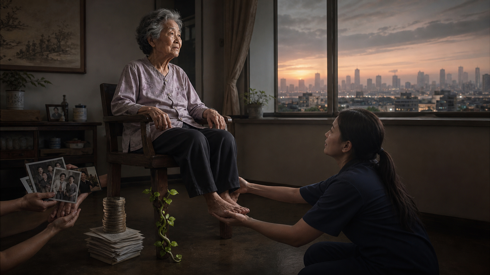
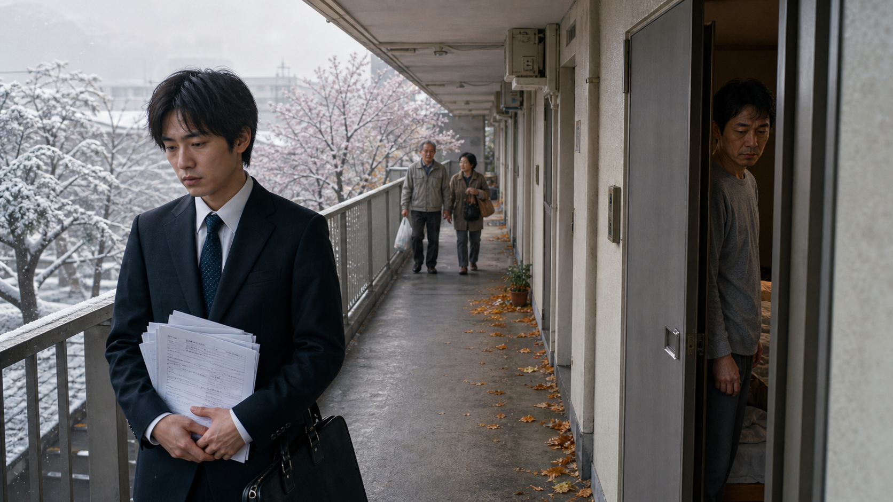
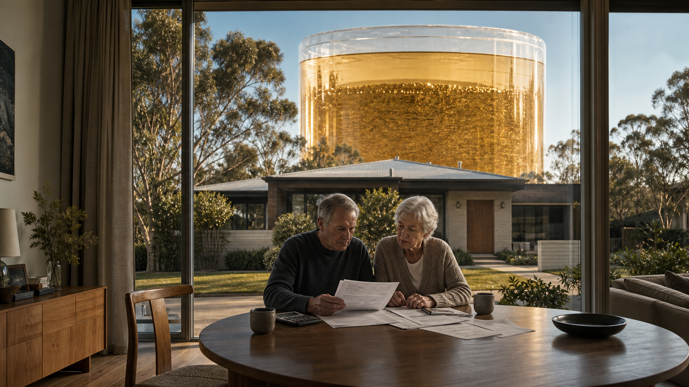
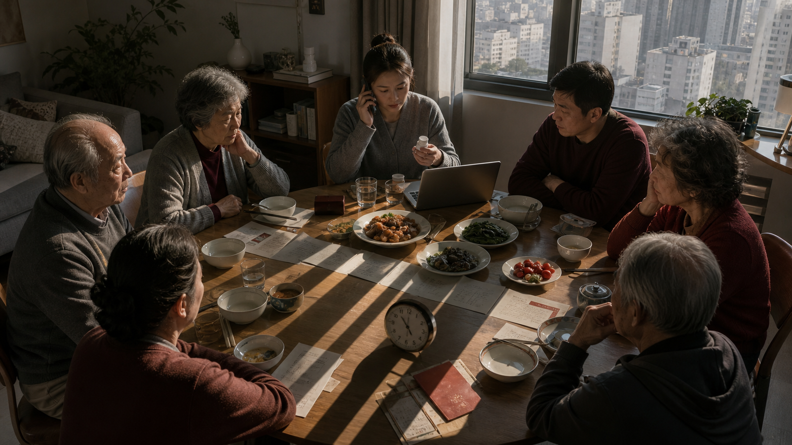
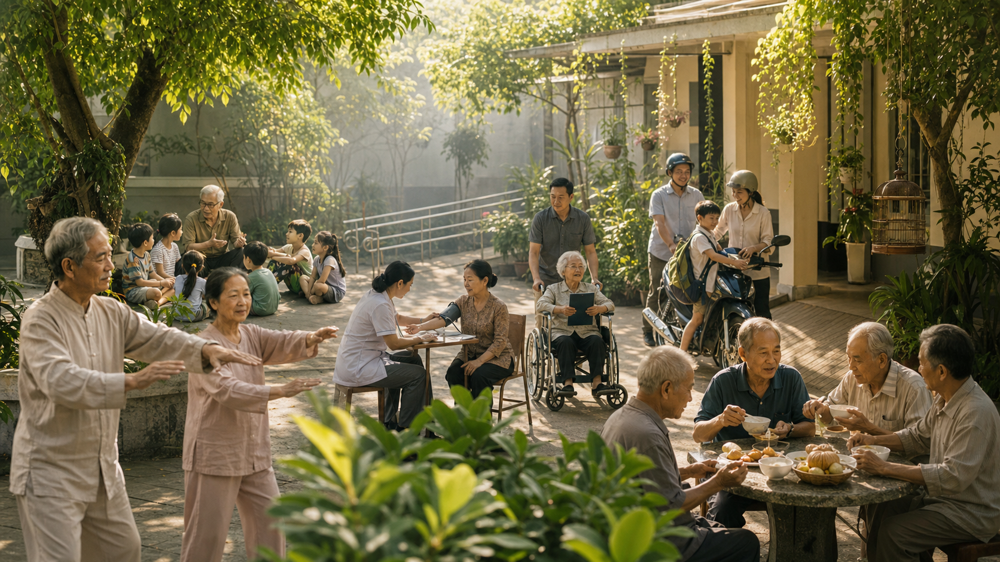

# Khi Tuổi Già Không Còn Chỗ Tựa — Nhật, Úc, Trung Quốc và Bài Toán Việt Nam

**Một xã hội có thể tích lũy hàng nghìn tỷ đô la cho hưu trí mà vẫn sản xuất ra tuổi già cô độc. Một quốc gia có thể phủ bảo hiểm cho hơn một tỷ người mà vẫn phải hỏi ai sẽ chăm một cơ thể yếu đi trong căn hộ nhỏ. Một gia đình có thể thương nhau mà vẫn quá kiệt sức để có mặt. Bài toán tuổi già vì vậy không chỉ là “có bao nhiêu tiền trong quỹ”. Nó là bài toán bốn chân: thu nhập, sức khỏe, hạ tầng chăm sóc và những quan hệ có trí nhớ. Thiếu chân cuối, tuổi già có thể được quản lý rất chuyên nghiệp mà vẫn không còn chỗ tựa.**

Nhật Bản cho thấy cái giá khi một thế hệ bị kẹt từ tuổi trẻ đi vào tuổi trung niên rồi già cùng cha mẹ. Úc cho thấy sức mạnh thật của cưỡng chế tiết kiệm dài hạn, nhưng cũng nhắc rằng tài sản tài chính không tự biến thành người nhớ lịch thuốc. Trung Quốc cho thấy quy mô bảo hiểm rất lớn vẫn phải va vào nhân khẩu học, tuổi nghỉ hưu và mô hình 4-2-1. Việt Nam đang bước vào cùng bài toán khi mức bao phủ bảo hiểm còn chưa phổ quát, gia đình vẫn là trụ cột chăm sóc chính, và chính gia đình ấy đang bị hút cạn thời gian.

Đây không phải bảng xếp hạng quốc gia. Không nước nào là thiên đường để sao chép nguyên xi, cũng không nước nào là lời tiên tri chắc chắn cho Việt Nam. Bốn trường hợp là bốn tấm gương soi bốn loại hạ tầng khác nhau.

*Tuổi già không đứng vững bằng một chân duy nhất. Tiền mua được đường lui; sức khỏe giữ khả năng tự quyết; chăm sóc tạo tay vịn; tình nghĩa giữ một đời người khỏi biến thành mã hồ sơ.*

---

## 1. Vị Trí Trong Vault Và Kỷ Luật Bằng Chứng

Bài này nằm ở giao điểm của ba đường đọc. [[Care Economy Và Cách Ma Trận Làm Rỗng Gia Đình]] đặt việc chăm sóc như một hạ tầng vô hình bị rút khỏi gia đình. [[MOC - Financial Sovereignty|Chủ quyền tài chính]] hỏi tiền có mua lại thời gian và quyền chọn hay chỉ dựng một chiếc lồng đẹp hơn. [[Tình Nghĩa Là Hạ Tầng Cuối Cùng]] hỏi câu sau cùng: khi thân thể không còn hữu dụng, ai vẫn nhận ra mình là “người của họ”?

Để không biến khủng hoảng già hóa thành kiểu giật gân tận thế, bài này giữ bốn tầng tuyên bố:

| Tầng đọc | Nội dung được phép khẳng định | Giới hạn bắt buộc |
|---|---|---|
| **Dữ kiện** | Tỷ lệ, mốc luật, số người tham gia, kết quả khảo sát, mô hình ngân sách từ nguồn được ghi rõ. | Mọi số liệu phải có năm, mẫu số và loại dữ liệu; ước tính khảo sát không được biến thành số đếm hành chính. |
| **Mẫu hình** | Cách bất ổn việc làm, sinh ít, sống một mình, tài sản hóa hưu trí và thiếu năng lực chăm sóc cùng tạo áp lực. | Mẫu hình không chứng minh có một trung tâm bí mật điều khiển mọi biến số. |
| **Biểu tượng** | “Chiếc ghế bốn chân”, “8050”, “4-2-1”, “hạ tầng cuối cùng” như hình ảnh cô đọng cấu trúc. | Biểu tượng không thay thế dữ liệu và không đại diện cho mọi gia đình. |
| **Tổng hợp giả thuyết** | Vault đặt giả thuyết rằng hệ thống tối ưu cho lao động, tài sản và dịch vụ có xu hướng định giá thấp quan hệ không trung gian. | Đây là một cách đọc hệ thống, không phải bằng chứng về động cơ bí mật của nhà nước Nhật, Úc, Trung Quốc hay Việt Nam. |

Có ba lỗi phổ biến bài này cố ý tránh.

Thứ nhất, **không đồng nhất “chết một mình tại nhà” với “cô độc đến chết”**. Dữ liệu cảnh sát Nhật ghi nhận thi thể do cảnh sát xử lý trong những điều kiện cụ thể; nó không đọc được toàn bộ quan hệ xã hội của người đã mất.

Thứ hai, **không biến một dự phóng thành hạn chót chắc chắn**. Dự phóng quỹ hưu trí Trung Quốc cạn năm 2035 là kết quả của một mô hình năm 2019 với giả định nhất định, không phải lời tuyên bố quỹ đã được định sẵn ngày sập.

Thứ ba, **không biến tài sản hưu trí thành lợi suất được bảo đảm**. Một năm thị trường tốt ở Úc không hứa hẹn năm sau, và lợi suất bình quân toàn hệ thống không phải lợi suất của từng tài khoản.

---

## 2. Từ Khóa Cần Hiểu

**Già hóa dân số** là sự tăng tỷ trọng người lớn tuổi trong dân số. Việt Nam thường dùng ngưỡng **60+** trong chính sách người cao tuổi; so sánh quốc tế thường dùng **65+**. Hai tỷ lệ không thể tráo cho nhau. Một quốc gia có 20% dân số 60+ không đồng nghĩa 20% dân số 65+.

**Hưu trí** không chỉ là ngừng làm việc. Nó là sự chuyển từ sống chủ yếu bằng thu nhập lao động sang hỗn hợp lương hưu, tiết kiệm, chuyển giao trong gia đình, thu nhập từ tài sản và hỗ trợ công. Nhiều người vẫn làm sau tuổi nghỉ hưu, tự nguyện hoặc vì không đủ đường lui.

**PAYG / pay-as-you-go** là cấu trúc trong đó đóng góp và thu ngân sách hiện tại tài trợ phần lớn quyền lợi hiện tại. Nó nhạy với số người đóng trên số người nhận, mức lương, tuổi nghỉ hưu và cam kết quyền lợi.

**Hưu trí tích lũy vốn** là cấu trúc đóng góp được đầu tư để tích lũy tài sản cho tương lai. Superannuation của Úc là ví dụ lớn, nhưng “tích lũy vốn” không có nghĩa hết rủi ro: lợi nhuận thị trường, phí, lạm phát, gián đoạn nghề nghiệp và tuổi thọ vẫn quyết định kết quả.

**Trợ cấp hưu trí xã hội** là khoản không nhất thiết dựa hoàn toàn trên lịch sử đóng góp, thường dùng để tạo sàn tối thiểu cho người già. Nó khác lương hưu dựa trên đóng góp, vốn gắn với thời gian và mức đóng.

**Hikikomori** trong khảo sát chính phủ Nhật là một nhóm được xác định bằng tần suất ra ngoài, thời gian ít nhất sáu tháng và các tiêu chí loại trừ. Đây không phải chẩn đoán lâm sàng, không phải đồng nghĩa “lười”, và không phải sổ đăng ký đếm từng người.

**Vấn đề 8050** là cách gọi tắt cho hộ gia đình nơi cha mẹ khoảng tuổi 80 vẫn hỗ trợ người con khoảng tuổi 50 bị cô lập, việc làm bấp bênh hoặc phụ thuộc. Nó là biểu tượng chính sách hữu ích, không phải mô tả chuẩn của mọi hộ gia đình và không có một con số toàn quốc duy nhất được dùng trong bài này.

**4-2-1** là cách gọi tắt về một người con có thể đứng sau hai cha mẹ và bốn ông bà trong một cấu trúc sinh ít. Nó mô tả áp lực liên thế hệ, không phải một nhóm phân loại điều tra dân số áp cho mọi nhà Trung Quốc.

**Hạ tầng chăm sóc** gồm cả dịch vụ chuyên môn lẫn năng lực quan hệ: người chăm, thời gian, kỹ năng, nhà ở phù hợp, giao thông, chăm sóc ban đầu, dịch vụ thay ca, lòng tin, ký ức và điều phối. Tiền có thể mua nhiều thành phần của chăm sóc, nhưng không tự sản xuất lòng tin.

---

## 3. Một Phương Trình, Bốn Quốc Gia

Bài toán tuổi già có thể viết ngắn như sau:

> **Chỗ tựa tuổi già = sàn thu nhập + năng lực sức khỏe + năng lực chăm sóc + tính liên tục của quan hệ**

Mỗi quốc gia trong bài mạnh ở một chân và để lộ một vết nứt ở chân khác.

| Trường hợp | Hạ tầng nổi bật | Vết nứt nhìn thấy | Điều Việt Nam không nên hiểu sai |
|---|---|---|---|
| **Nhật Bản** | Bảo hiểm xã hội, chăm sóc dài hạn, nhà nước có năng lực thống kê và phản ứng. | việc làm thời kỳ băng giá, thu mình kéo dài, hộ 8050, nhiều người sống một mình và chết tại nhà. | Không phải mọi người chết một mình đều bị xã hội bỏ rơi; cũng không thể chữa cô lập chỉ bằng thêm cơ sở chăm sóc. |
| **Úc** | Superannuation bắt buộc, tài sản hưu trí lớn, Age Pension làm sàn theo điều kiện tài chính. | Tài sản phân bố không đều, rủi ro thị trường, chi phí chăm sóc và khoảng cách giữa số dư tài khoản với sự hiện diện của con người. | Không phải “tư nhân lo hết”; lương hưu công vẫn còn và các ưu đãi thuế cũng có chi phí tài khóa. |
| **Trung Quốc** | Quy mô bao phủ bảo hiểm tuổi già cơ bản rất lớn, nhà nước điều chỉnh tuổi nghỉ hưu và thời gian đóng. | Dân số già nhanh, sinh ít, chênh lệch giữa các chương trình và khoảng cách di cư/nông thôn-thành thị và áp lực 4-2-1. | “Quỹ cạn năm 2035” là dự phóng cũ cho một phạm vi quỹ cụ thể, không phải đồng hồ đếm ngược cho toàn bộ hệ thống. |
| **Việt Nam** | Gia đình liên thế hệ còn mạnh, bảo hiểm xã hội đang mở rộng, cải cách 2024 tạo thêm tầng bảo vệ. | Bao phủ chưa phổ quát, việc làm phi chính thức lớn, già hóa nhanh, người nhà là người chăm sóc mặc định nhưng ngày càng ít thời gian. | Không thể dùng đạo hiếu để thay lương hưu, cũng không thể dùng lương hưu để thay đạo hiếu. |

Bảng trên không nói Úc “tốt hơn” Nhật hay Trung Quốc “xấu hơn” Việt Nam. Nó nói một điều khó chịu hơn: **không có một biến số duy nhất cứu được tuổi già**.

Nếu chỉ tăng tiền mà không tăng lực lượng chăm sóc, người già có sức mua nhưng không chắc có người phục vụ đúng lúc. Nếu chỉ dựa vào gia đình mà không có sàn thu nhập, tình nghĩa bị ép gánh toàn bộ lạm phát, bệnh tật và rủi ro sống thọ. Nếu chỉ xây viện dưỡng lão mà không giữ tính liên tục của quan hệ, ta có thể tạo ra một hệ thống vận hành sạch sẽ cho một đời sống bị cắt khỏi ký ức.

[[Giàu Không Phải Để Vợ Không Làm Gì]] đã đặt tiền đúng vị trí: tiền tốt mua lại **khoảng đệm**. Với tuổi già cũng vậy. Lương hưu tốt mua thời gian, thuốc, nhà ở và dịch vụ. Nhưng khoảng đệm chỉ có ý nghĩa khi còn một đời sống đáng để chạy về.

---

## 4. Nhật Bản: Khi Tuổi Già Bắt Đầu Từ Một Tuổi Trẻ Bị Đóng Băng

*Có những cuộc khủng hoảng tuổi già bắt đầu từ lần đầu một người bị loại khỏi đường ray việc làm khi mới ngoài hai mươi.*

### Thời kỳ băng giá việc làm không kết thúc khi kinh tế hồi phục

Bộ Y tế, Lao động và Phúc lợi Nhật mô tả **employment ice-age generation** là những người tìm việc khoảng **1993–2004**, giai đoạn việc làm đặc biệt khắc nghiệt sau khi bong bóng tài sản vỡ. Không phải ai trong nhóm này cũng thất bại; không phải mọi người làm việc không thường xuyên đều trở thành hikikomori. Nhưng một cú trượt lúc bước vào thị trường lao động có thể kéo dài qua nhiều thập niên: ít thâm niên, ít đóng góp hưu trí, ít cơ hội mua nhà, ít khả năng lập gia đình và ít tự tin để quay lại đường chính.

Đây là điểm quan trọng của mô hình tư duy. Xã hội thường xem tuổi già là một chặng bắt đầu ở tuổi 60 hoặc 65. Thực tế, **sự bấp bênh tuổi già có thể bắt đầu từ lần đầu một người bị đẩy khỏi bậc thang lao động ở tuổi 22**. Nếu ba mươi năm sau họ vẫn làm việc bấp bênh, dựa vào cha mẹ và có ít quan hệ xã hội, “khủng hoảng người già” chỉ là tên mới của một vết thương cũ.

MHLW hiện mở rộng hỗ trợ từ “ice-age generation” sang nhóm trung niên lớn hơn có vấn đề tương tự: việc làm bất ổn, thất nghiệp, thu mình và cần hỗ trợ tham gia xã hội. Sự thay đổi ngôn ngữ này đáng chú ý. Nó thừa nhận cú sốc của cả một thế hệ đã trở thành bài toán xuyên suốt vòng đời, không còn là chiến dịch tuyển dụng ngắn hạn.

### Hikikomori: 1,46 triệu là ước tính suy rộng, không phải danh sách hành chính

Khảo sát năm 2022 do Cabinet Office công bố tháng 3/2023, sau đó chuyển sang Children and Families Agency, ước tính nhóm **hikikomori theo định nghĩa rộng** như sau:

- tuổi **15–39**: 144 người trong mẫu hợp lệ, **2,05%**, suy rộng khoảng **541.000 người**;
- tuổi **40–64**: 86 người trong subset tương ứng, **2,02%**, suy rộng khoảng **915.000 người**.

Cộng hai ước tính cho ra khoảng **1,456 triệu**, thường được làm tròn thành “1,46 triệu người 15–64”. Nhưng con số tổng này là phép cộng từ hai ước tính theo nhóm tuổi. Nó không phải một sổ đăng ký và không nên gọi là “1,46 triệu người được chính phủ xác nhận sống ẩn dật”.

Định nghĩa rộng gồm những người chỉ ra ngoài vì sở thích, chỉ đi quanh khu phố, không rời nhà hoặc hầu như không rời phòng, kéo dài ít nhất sáu tháng, sau khi áp dụng các tiêu chí loại trừ về việc làm, chăm sóc và một số bệnh. Chính báo cáo cảnh báo định nghĩa có thể tính cả người không thực sự ở trạng thái hikikomori và loại nhầm người đang ở trạng thái ấy. Sai số mẫu được báo cáo là ±0,47 điểm phần trăm cho khảo sát 15–39 và ±0,65 điểm phần trăm cho khảo sát 40–69.

Đây là một điểm sửa dữ kiện quan trọng: **hikikomori là một ước tính dân số theo định nghĩa khảo sát, không phải một bản án căn tính**.

### Từ hikikomori đến 8050: vòng lặp chăm sóc khép kín trong một căn nhà

“8050” cô đọng một vòng lặp hộ gia đình: cha mẹ già dùng lương hưu, nhà ở và sức lực còn lại để giữ một người con trung niên chưa thể đứng độc lập; người con lại có thể đảm nhiệm một phần việc chăm sóc cha mẹ nhưng thiếu thu nhập, mạng lưới xã hội và kết nối với các cơ chế hỗ trợ. Khi cha mẹ nhập viện hoặc mất, hai hệ thống sụp cùng lúc: việc chăm sóc cha mẹ và sinh kế của người con.

Không nên lãng mạn hóa hay quỷ hóa kiểu hộ gia đình này. Có nhà đầy tình nghĩa. Có nhà đầy xấu hổ, bạo hành, bệnh tâm thần, khuyết tật, nợ nần hoặc nhiều thập niên im lặng. Mẫu hình đáng thấy là **gia đình trở thành bên bảo hiểm cuối cùng cho một cú sốc mà thị trường lao động, hỗ trợ sức khỏe tâm thần và kết nối cộng đồng đã không xử lý từ sớm**.

### “Chết một mình” cần được đọc với kỷ luật

*Con số của cảnh sát ghi lại hoàn cảnh phát hiện một thi thể; nó không thể kể thay toàn bộ lịch sử quan hệ của người đã mất.*

Trong nửa đầu năm 2024, National Police Agency ghi nhận **37.227** thi thể do cảnh sát xử lý thuộc nhóm người sống một mình và chết tại nhà. Trong đó **28.330**, khoảng **76,1%**, là người từ 65 tuổi trở lên.

Con số nặng, nhưng không nên gọi toàn bộ 37.227 trường hợp là *kodokushi* theo nghĩa xã hội học. Dữ liệu không chứng minh tất cả đều cô độc, không ai quan tâm hoặc chỉ được phát hiện sau nhiều tuần. Thực tế bảng thời gian cho thấy nhiều trường hợp được phát hiện trong 0–1 ngày. Nó cũng không bao gồm mọi cái chết tại nhà trên toàn quốc, chỉ các trường hợp do cảnh sát xử lý theo phạm vi báo cáo.

Dữ kiện đúng không làm mẫu hình nhẹ đi. Nó làm mẫu hình sắc hơn: **một số lượng lớn người sống một mình đang đi qua cửa tử trong không gian riêng, và phần lớn là người già**. Câu hỏi về chăm sóc không chỉ là ai trả viện phí. Nó là ai phát hiện hôm nay người đó không mở rèm, ai có chìa khóa, ai được phép bước vào, ai biết họ muốn được xử lý thế nào khi khả năng tự quyết giảm.

---

## 5. Úc: Khi Nhà Nước Bắt Tương Lai Phải Tiết Kiệm

*Tài sản tài chính có thể dựng một đường lui rất dài, nhưng không tự biến thành một người biết lúc nào căn phòng cần được gõ cửa.*

Nếu Nhật là tấm gương về một nhóm người bị rơi khỏi bậc thang lao động, Úc là tấm gương về cách luật buộc thu nhập lao động hiện tại xây tài sản cho tuổi già tương lai.

### 12% không phải khẩu hiệu, mà là kiến trúc mặc định

Australian Taxation Office xác nhận mức **Superannuation Guarantee** chung tăng từ 11,5% lên **12%** cho giai đoạn từ **1/7/2025**. Người sử dụng lao động phải đóng tối thiểu theo quy định áp dụng cho phần thu nhập đủ điều kiện. Đây là một trong những ví dụ mạnh nhất về sức mạnh của cơ chế mặc định: thay vì mong từng người có kỷ luật đầu tư suốt bốn mươi năm, hệ thống biến tích lũy thành một phần của cấu trúc trả lương.

Đến ngày **30/6/2025**, APRA ghi nhận tổng tài sản superannuation của Úc khoảng **A$4,3 nghìn tỷ**. Khoảng A$3,0 nghìn tỷ nằm trong các tổ chức do APRA quản lý và khoảng A$1,1 nghìn tỷ trong các quỹ hưu trí tự quản; phần còn lại gồm các chương trình khu vực công được miễn trừ và một số quỹ thuộc công ty bảo hiểm nhân thọ.

Quy mô này cho thấy hiệu ứng lãi kép ở cấp quốc gia là có thật. Nó cũng kết nối trực tiếp với [[Giữ Tiền Quan Trọng Hơn Kiếm Tiền]]: giữ tiền đều, lâu, có cấu trúc có thể quan trọng hơn truy tìm một cú giao dịch cứu đời.

### Lợi nhuận là lịch sử, không phải giao ước

Với các tổ chức do APRA quản lý có hơn sáu thành viên, tỷ suất lợi nhuận hằng năm trong năm kết thúc tháng 6/2025 là **10,1%**. Mức bình quân năm cho giai đoạn 5 năm là **7,8%**, và 10 năm là **6,5%**.

Ba số này phải đi cùng ba cảnh báo:

1. Đây là chỉ số hiệu suất ở cấp hệ thống cho một nhóm tổ chức, không phải mức lợi nhuận được ghi đều vào mọi tài khoản.
2. Lợi nhuận khác nhau theo sản phẩm, phân bổ tài sản, phí, khoản khấu trừ bảo hiểm, dòng tiền và thời điểm tham gia.
3. Lợi nhuận một năm 10,1% không phải lời hứa; rủi ro thị trường vẫn tồn tại đúng lúc người nghỉ hưu bắt đầu rút tiền.

Nói “super tạo ra tài sản” là hợp lý. Nói “super bảo đảm lợi nhuận hưu trí 10%” là sai.

### Age Pension không biến mất khi super lớn lên

Báo cáo Liên thế hệ 2023 dự phóng chi Age and Service Pension giảm từ **2,3% GDP năm 2022–23** xuống **2,0% GDP năm 2062–63**, dù dân số già đi. Logic của mô hình là số dư superannuation lớn hơn sẽ khiến nhiều người nhận lương hưu một phần hoặc không đủ điều kiện nhận lương hưu tính theo nhu cầu tài chính.

Cùng báo cáo dự phóng tài sản superannuation tăng từ khoảng **116% GDP** lên **218% GDP**. Nhưng một dòng khác không nên bị bỏ quên: chi phí thuế dưới dạng các ưu đãi thuế cho superannuation được dự phóng tăng từ khoảng **2,0% GDP** lên **2,4% GDP** trong cùng giai đoạn. Chi phí thuế không giống chi tiêu trực tiếp, và số thu “mất” phụ thuộc vào chuẩn đối chiếu. Tuy vậy, nó cho thấy hưu trí tích lũy vốn không đơn giản là nhà nước rút lui. Nhà nước chuyển từ chi lương hưu trực tiếp sang hỗn hợp quy định, ưu đãi thuế, điều tiết và sàn trợ cấp tính theo nhu cầu.

Úc vì vậy không chứng minh “cá nhân tự lo tốt hơn nhà nước”. Nó chứng minh **một kiến trúc công có thể dùng các tài khoản tư nhân để tích lũy dài hạn**, trong khi lương hưu công và hệ thống chăm sóc vẫn phải làm sàn.

### Tài khoản có thể giàu, căn phòng vẫn có thể lạnh

Super có thể chi trả tiền thuê nhà, thuốc men, cải tạo nhà, đi lại và dịch vụ chăm sóc chuyên môn. Nó cực kỳ quan trọng. Nhưng số dư tài khoản không nhớ mình thích ăn cháo loãng hay đặc, không nhận ra mình đột nhiên nói ít, không phân biệt sự bướng bỉnh với suy giảm nhận thức sớm, và không quyết định ai sẽ ngồi cạnh khi xuất viện lúc tối muộn.

Đây không phải lập luận chống dịch vụ. Chăm sóc chuyên môn có kỹ năng mà gia đình không có và đôi khi an toàn hơn việc người nhà tự chăm. Điểm cần giữ là: **vốn tài chính và vốn quan hệ không thay thế nhau; chúng phải phối hợp**.

Một hệ thống hưu trí trưởng thành nên hỏi hai câu song song:

- người này có đủ thu nhập và tài sản để không lệ thuộc hoàn toàn vào con cái không?
- người này có đủ kết nối và điều phối chăm sóc để tài sản của chính mình không biến thành một chuỗi hóa đơn vô danh không?

---

## 6. Trung Quốc: 4-2-1, 1,07 Tỷ Người Và Chiếc Đồng Hồ Nhân Khẩu

*4-2-1 không phải công thức cho mọi gia đình; nó là biểu tượng cô đọng của một nền chăm sóc có tán rộng nhưng thân ngày càng mảnh.*

Cuối năm 2024, báo cáo do Ministry of Civil Affairs và Office of the China National Committee on Ageing công bố ghi nhận:

- dân số **60+** đạt **310,3 triệu**, tương đương **22%** dân số;
- dân số **65+** vượt **220,2 triệu**, tương đương **15,6%**;
- hơn **1,07 tỷ người** nằm trong diện bảo hiểm tuổi già cơ bản, tăng 6,39 triệu so với năm trước.

Đây là hai sự thật cùng lúc: Trung Quốc đã xây một hệ thống bảo hiểm có quy mô khổng lồ, nhưng quy mô ấy vẫn đang chạy ngược chiều một tỷ lệ nhân khẩu học ngày càng khó khăn.

### 4-2-1 là biểu tượng của sự nén, không phải công thức cho mọi gia đình

Mô hình 4 ông bà, 2 cha mẹ, 1 người con cho thấy nền tảng hỗ trợ liên thế hệ bị nén. Nhưng nếu dùng nó như một dữ kiện điều tra dân số cho mọi gia đình Trung Quốc, ta sẽ sai. Ly hôn, tái hôn, nhiều con, mất sớm, di cư, khác biệt nông thôn-thành thị và chính sách hai/ba con làm thực tế hộ gia đình đa dạng hơn nhiều.

Giá trị của 4-2-1 nằm ở khả năng nén biểu tượng. Nó hỏi: **khi cây gia đình có tán rộng nhưng thân ngày càng mảnh, ai giữ từng nhánh?** Một người con không thể đồng thời là người lao động năng suất cao, cha/mẹ lý tưởng, người điều phối y tế cho hai cha mẹ và điểm tựa cảm xúc cho bốn ông bà mà không có chăm sóc công và chăm sóc cộng đồng.

### Nâng tuổi nghỉ hưu: cải cách cần thiết nhưng không miễn phí về con người

Quyết định tháng 9/2024 của National People’s Congress bắt đầu có hiệu lực từ 2025 và nâng tuổi nghỉ hưu dần trong 15 năm:

- nam: **60 lên 63**;
- nữ cán bộ: **55 lên 58**;
- nữ lao động phổ thông: **50 lên 55**.

Từ 2030, số năm đóng tối thiểu để nhận lương hưu cơ bản hằng tháng tăng dần từ **15 lên 20 năm**, mỗi năm thêm sáu tháng. Chính sách cũng mở không gian nghỉ sớm hoặc hoãn nghỉ trong giới hạn nhất định.

Ở tầng tính toán bảo hiểm, nâng tuổi nghỉ hưu làm tăng thời gian đóng và rút ngắn thời gian nhận. Ở tầng lao động, nó giữ thêm người trong lực lượng làm việc. Nhưng ở tầng hộ gia đình, nó cũng có thể làm giảm nguồn chăm sóc của ông bà vốn đang trông trẻ nhỏ, nhất là nơi dịch vụ giữ trẻ chính thức thiếu hoặc đắt.

Một cải cách đúng trên bảng tính có thể chuyển chi phí sang một cột không nằm trong bảng tính. Nếu bà ngoại làm thêm năm năm, ai đón cháu? Nếu người con gái trung niên vừa đi làm vừa chăm cha mẹ, cải cách có làm tăng đóng góp chính thức nhưng đẩy gánh nặng chăm sóc không chính thức sang cô ấy? Đây không phải lý do phản đối cải cách tuổi nghỉ hưu. Đây là lý do phải thiết kế cải cách hưu trí cùng chính sách giữ trẻ, chăm sóc người cao tuổi, việc làm linh hoạt và hỗ trợ người chăm sóc.

### “Cạn năm 2035”: một dữ kiện cần sửa trước khi dùng

Báo cáo **China Pension Actuarial Report 2019–2050** của Chinese Academy of Social Sciences mô hình hóa quỹ **lương hưu cơ bản cho người lao động doanh nghiệp đô thị** dưới một kịch bản cơ sở cụ thể. Kết quả được nhắc nhiều nhất:

- số dư hằng năm/hiện tại chuyển âm vào **2028**;
- số dư tích lũy đạt đỉnh khoảng **6,99 nghìn tỷ yuan năm 2027** rồi được mô hình dự phóng cạn vào **2035**.

Đây không phải dự phóng cho mọi chương trình hưu trí Trung Quốc. Nó không bao gồm toàn bộ tác động của gộp quỹ toàn quốc, chuyển giao tài khóa, thay đổi tuổi nghỉ hưu, tỷ lệ đóng, mức hưởng, di cư hay cải cách sau 2019. Nói “CASS năm 2019 từng mô hình hóa một kịch bản cơ sở trong đó số dư tích lũy cạn vào năm 2035” là chính xác. Nói “quỹ hưu trí Trung Quốc chắc chắn phá sản năm 2035” là sai.

Chính độ chênh giữa tiêu đề và mô hình là một bài học của [[Source Discipline - Kỷ Luật Nguồn Và Bằng Chứng]]. Tiêu đề tạo cảm giác về một ngày tận thế. Mô hình thực ra tạo ra một **tín hiệu chính sách**: nếu giữ nguyên các giả định, đường áp lực sẽ đi về đâu?

### Được bao phủ không đồng nghĩa đủ sống

Con số 1,07 tỷ người nghe gần như phổ quát, nhưng “được bao phủ” không nói mức trợ cấp có đủ hay không. Chương trình cho người lao động, chương trình cho cư dân, lịch sử đóng góp nông thôn-thành thị, hồ sơ đóng và tài chính địa phương tạo ra mức bảo vệ khác nhau. Độ rộng bao phủ là một thành tựu. Mức trợ cấp đủ sống và khả năng tiếp cận chăm sóc mới quyết định người già sống thế nào.

---

## 7. Việt Nam: Già Trước Khi Giàu, Gia Đình Trước Khi Có Hệ Thống

*Gia đình Việt Nam là một tài sản quan hệ lớn, nhưng tài sản nào bị ghi sổ hai lần mà không được tái đầu tư cũng sẽ cạn.*

UNFPA ghi nhận người **60+ chiếm 11,9% dân số Việt Nam năm 2019**, dự kiến vượt **25% vào 2050**, và Việt Nam chuyển từ “già hóa” sang “xã hội già” khoảng **2036**. Các mốc này dùng ngưỡng và dự phóng cụ thể; không nên trộn chúng với tỷ lệ 65+ từ một bộ dữ liệu khác. Nhưng hướng đi không mơ hồ: Việt Nam đang già hóa rất nhanh, trong khi thời gian để tích lũy tài sản hưu trí, lực lượng chăm sóc và nhà ở phù hợp với người cao tuổi ngắn hơn nhiều nước đã giàu trước khi già.

### Bao phủ đang tăng nhưng chưa phải an ninh hưu trí phổ quát

Viet Nam Social Security ước tính đến 31/12/2024 có khoảng **20,11 triệu người tham gia bảo hiểm xã hội**, tương đương **42,71% dân số trong độ tuổi lao động**. Trong đó 2,29 triệu là người tham gia tự nguyện. Cùng nguồn ghi nhận hơn **3,3 triệu người hưởng lương hưu và trợ cấp bảo hiểm xã hội** được chi trả trong năm.

Ba con số này không được trộn:

- 42,71% dùng mẫu số dân số trong độ tuổi lao động, không phải toàn dân;
- 3,3 triệu gồm người hưởng lương hưu **và** người nhận trợ cấp, không phải “toàn bộ người cao tuổi có lương hưu”;
- số người tham gia hôm nay không tự động tạo ra mức hưu trí đủ sống ngày mai nếu thời gian đóng ngắn, mức đóng thấp hoặc người lao động rút một lần.

Vì vậy, nói “Việt Nam đã bao phủ 42,71% người già” là sai. Nói “số người tham gia bảo hiểm xã hội đạt khoảng 42,71% dân số trong độ tuổi lao động vào cuối 2024 theo ước tính VSS” mới đúng.

### Luật 2024 mở thêm tầng sàn

Luật Bảo hiểm xã hội sửa đổi được Quốc hội thông qua ngày 29/6/2024 và có hiệu lực từ **1/7/2025**. ILO nhấn mạnh ba thay đổi quan trọng:

- giảm thời gian đóng tối thiểu để đủ điều kiện hưởng lương hưu từ **20 xuống 15 năm**;
- giảm tuổi hưởng trợ cấp hưu trí xã hội không dựa trên đóng góp từ **80 xuống 75**;
- mở rộng diện tham gia bắt buộc sang một số nhóm mới như chủ hộ kinh doanh, người làm việc bán thời gian và người quản lý không hưởng lương; ước tính khoảng 3 triệu người có thể được đưa vào diện bao phủ theo luật.

Đây là bước tiến thật. Nó giảm tình trạng đóng gần đủ nhưng vẫn rơi khỏi hệ thống lương hưu. Nhưng “được luật bao phủ” không tự động thành bao phủ thực tế. Người lao động phi chính thức còn phải có khả năng và động lực để đóng đều; thủ tục hành chính phải đủ đơn giản; quyền lợi phải đủ đáng để họ không rút một lần; và trợ cấp hưu trí xã hội phải đủ làm sàn chứ không chỉ là khoản tượng trưng.

### Gia đình Việt Nam là tài sản, nhưng đang bị ghi sổ hai lần

Khác với nhiều xã hội cá nhân hóa mạnh, Việt Nam vẫn có mạng lưới gia đình dày: ông bà chăm cháu, con cái gửi tiền, anh chị em chia nhau việc, nhà nhiều thế hệ, giỗ chạp và họ hàng giữ ký ức. Đây là vốn xã hội thật, không phải phần lạc hậu cần xóa.

Nhưng cùng một mạng lưới gia đình đang bị **ghi sổ hai lần**:

- người trung niên phải đóng góp cho tuổi già của chính mình;
- trả khoản vay mua nhà hoặc tiền thuê trong thị trường nhà ở căng;
- nuôi con lâu hơn vì việc học và bước vào thị trường nhà ở đều khó;
- chăm cha mẹ sống lâu hơn cùng các bệnh mạn tính;
- giữ việc trong một nền kinh tế đòi hỏi luôn sẵn sàng gần như liên tục.

[[Việt Nam Trước Hai Chiến Hào - Khi Nam Nữ Cùng Đòi Quyền Làm Người]] đã chỉ ra mặt giới của khủng hoảng này. Nếu việc chăm sóc mặc định đổ vào con gái/con dâu, phụ nữ trả giá hưu trí qua gián đoạn nghề nghiệp và mức đóng thấp hơn. Nếu nghĩa vụ chu cấp mặc định đổ vào con trai/con rể, đàn ông trả giá sức khỏe qua làm việc quá sức và sự xấu hổ khi thu nhập không đủ. Hai giới có thể quay sang trách nhau trong khi cùng gánh một sức ép nhân khẩu học mà chính sách chưa định giá.

### Đạo hiếu không phải khoản ngân sách vô hạn

Dùng “đạo hiếu” để bịt mọi khoảng trống chính sách là một dạng đẩy gánh nặng đạo đức. Nó giả định con cái ở gần, hôn nhân bền, nhà đủ chỗ, con khỏe, có tiền, có thời gian và quan hệ không bạo hành. Những giả định ấy ngày càng ít chắc chắn.

Nhưng phản ứng ngược, biến chăm sóc người cao tuổi hoàn toàn thành dịch vụ có phí, cũng có thể làm mất tính liên tục của quan hệ. Người già không chỉ cần tắm đúng kỹ thuật. Họ cần được nhìn như người có tiểu sử, sở thích, nỗi xấu hổ và quyền quyết định.

Việt Nam không nên chọn giữa “gia đình tự lo hết” và “thiết chế lo hết”. Cần một kiến trúc kết hợp:

- lương hưu và trợ cấp hưu trí xã hội tạo sàn thu nhập;
- bảo hiểm y tế và cơ chế tài chính cho chăm sóc dài hạn giảm rủi ro biến cố lớn;
- dịch vụ chuyên môn gánh phần kỹ thuật và thời gian nghỉ cho người chăm sóc;
- gia đình/cộng đồng giữ ký ức, tiếng nói bảo vệ quyền lợi và cảm giác thuộc về;
- luật lao động cho người chăm sóc có thời gian thật để làm phần việc ấy.

---

## 8. Từ Dữ Kiện Đến Mẫu Hình, Biểu Tượng Và Tổng Hợp Giả Thuyết

### Dữ kiện: bốn hệ thống đang điều chỉnh trước cùng một đường áp lực

Nhật mở rộng hỗ trợ nhóm thời kỳ băng giá việc làm và đo mức thu mình khỏi xã hội. Úc tăng tiết kiệm hưu trí bắt buộc lên 12% và quản lý một khối tài sản super trị giá A$4,3 nghìn tỷ. Trung Quốc tăng tuổi nghỉ hưu, tăng số năm đóng tối thiểu và mở rộng bảo hiểm tuổi già. Việt Nam giảm số năm đủ điều kiện, hạ tuổi hưởng trợ cấp hưu trí xã hội và mở rộng diện bao phủ theo luật.

Đó là hồ sơ công khai. Mỗi nước đang phản ứng với tuổi thọ tăng, thay đổi lực lượng lao động và sức ép tài khóa/chăm sóc theo lịch sử thể chế riêng.

### Mẫu hình: chi phí không biến mất, nó chỉ chuyển cột

*Trong kinh tế chăm sóc, chi phí hiếm khi biến mất. Nó chỉ đổi người trả, đổi loại tiền hoặc đổi thành thời gian và sức khỏe.*

Nếu nhà nước cắt lương hưu, chi phí chuyển sang hộ gia đình. Nếu hộ gia đình thiếu người, chi phí chuyển sang thị trường chăm sóc có phí. Nếu thị trường chăm sóc có phí thiếu nhân công, chi phí chuyển sang lao động di cư, lao động nữ không được trả công hoặc thời gian chờ đợi. Nếu tuổi nghỉ hưu tăng, sức ép tài khóa giảm một phần nhưng việc ông bà trông cháu và sức khỏe người lao động có thể chịu thêm áp lực. Nếu hưu trí dựa nhiều vào tài sản phát triển, chi hưu trí có thể giảm tương đối nhưng ưu đãi thuế, rủi ro thị trường và bất bình đẳng tài sản sẽ đóng vai trò lớn hơn.

> **Trong nền kinh tế chăm sóc, không có “xóa chi phí”. Chỉ có trả rõ, trả ngầm, trả bằng tiền, trả bằng thời gian, trả bằng sức khỏe hoặc đẩy cho thế hệ sau.**

Đây là mẫu hình mạnh nhất nối bốn nước.

### Biểu tượng: chiếc ghế bốn chân

Hãy hình dung tuổi già như một chiếc ghế có bốn chân:

1. **Tiền:** lương hưu, tiết kiệm, an toàn nhà ở, bảo hiểm.
2. **Thân:** số năm sống khỏe, khả năng vận động, nhận thức, môi trường dễ tiếp cận.
3. **Chăm sóc:** con người và dịch vụ có khả năng hỗ trợ đúng lúc.
4. **Tình nghĩa:** lòng tin, ký ức, cảm giác thuộc về và một người lên tiếng bảo vệ mình khi mình yếu.

Nhật cho thấy chiếc ghế có dịch vụ nhưng chân quan hệ có thể nứt. Úc cho thấy chân tiền có thể được gia cố rất mạnh nhưng không tự mọc thành chân tình nghĩa. Trung Quốc cho thấy quy mô bảo hiểm lớn vẫn chịu áp lực khi nền tảng gia đình thu hẹp. Việt Nam còn chân tình nghĩa tương đối dày nhưng ba chân còn lại chưa đủ chắc, trong khi chân cuối đang bị mối ăn bởi sự kiệt sức của các hộ hai nguồn thu nhập và di cư.

Biểu tượng không phải bảng chấm điểm. Nó là một công cụ để chính sách và hộ gia đình không quên chân vô hình.

### Tổng hợp giả thuyết: Ma Trận không cần “ghét gia đình” để làm gia đình rỗng

Ở tầng vault, có thể đặt một giả thuyết mạnh hơn: một hệ thống tối ưu cho tỷ lệ tham gia lao động, thu nhập chịu thuế, tích lũy tài sản, tiêu dùng và dịch vụ đo đếm được sẽ tự nhiên nhìn thấy những gì có giá, có hợp đồng và có bảng điều khiển rõ hơn những gì diễn ra trong bữa cơm, cuộc gọi hoặc một buổi ngồi chờ bệnh viện.

Không cần giả định chính phủ bốn nước bí mật phối hợp phá gia đình. Sự hội tụ của các động lực đã đủ:

- GDP nhìn thấy dịch vụ giữ trẻ có phí rõ hơn việc ông bà trông cháu;
- bảng lương nhìn thấy giờ làm rõ hơn một ngày người con nghỉ để chăm cha;
- bảng kê tài sản nhìn thấy số dư rõ hơn người hàng xóm có chìa khóa;
- bệnh viện nhìn thấy thủ thuật rõ hơn ai sẽ đưa bệnh nhân về nhà;
- nền tảng nhìn thấy mức tương tác rõ hơn một cuộc nói chuyện không cầm điện thoại.

Kết quả có thể là việc chăm sóc bị rút khỏi quan hệ rồi bán lại dưới dạng dịch vụ. Dịch vụ có thể cần thiết và tốt. Vấn đề xuất hiện khi xã hội tưởng mua đủ dịch vụ đồng nghĩa với thay thế được cảm giác thuộc về.

Đây là một tổng hợp giả thuyết về hệ thống, không phải bằng chứng về ý đồ độc hại của nhà nước. Cách kiểm nghiệm nó không phải săn tài liệu mật. Hãy đo:

- số giờ chăm sóc không được trả công đang đi đâu;
- tình trạng kiệt sức của người chăm sóc tăng hay giảm;
- số ca xuất viện không thành công vì thiếu người nhà;
- tỷ lệ sống một mình đi cùng chất lượng kết nối ra sao;
- mức hưu trí đủ sống đi cùng sự cô đơn ra sao;
- bao nhiêu gia đình thật sự có kế hoạch chăm sóc khi khẩn cấp.

Nếu đo những thứ ấy, “hạ tầng cuối cùng” sẽ rời khỏi thơ và bước vào chính sách.

---

## 9. Bài Toán Việt Nam: Xây Bốn Chỗ Tựa Trước Khi Cửa Sổ Khép Lại

*Mô hình đối trọng không bắt gia đình tự gánh mọi thứ, cũng không giao toàn bộ tuổi già cho thị trường: tiền, chuyên môn, cộng đồng và tình nghĩa phải đứng cạnh nhau.*

Việt Nam không có thời gian để tuần tự làm giàu rồi mới học cách chăm sóc như một số nước đi trước. Cần xây đồng thời bốn tầng.

### 9.1. Một sàn thu nhập không phụ thuộc hoàn toàn vào con cái

Mở rộng số người tham gia bảo hiểm xã hội thực tế, giữ người lao động trong hệ thống thay vì rút một lần, làm cho đóng góp tự nguyện dễ tham gia và có giá trị, đồng thời nâng trợ cấp hưu trí xã hội theo khả năng ngân sách. Sàn này không cần thay thế mọi thu nhập; nó cần đủ để người già không phải xin từng khoản thiết yếu và để con cái hỗ trợ từ tình nghĩa thay vì bị ép làm toàn bộ hệ thống hưu trí.

Hiểu biết tài chính cũng phải đổi. Lập kế hoạch hưu trí không thể chỉ là mua đất “để đó”. Tài sản nhà đất thiếu tính thanh khoản, giấy tờ rõ ràng hoặc dòng tiền có thể khiến một người “giàu trên giấy, nghèo trong ngày”. [[Giữ Tiền Quan Trọng Hơn Kiếm Tiền]] đúng ở đây: khoản đệm, đòn bẩy thấp và nhiều loại tài sản quan trọng hơn một tài sản duy nhất phải chờ đúng thị trường mới bán được.

### 9.2. Một hệ thống chăm sóc không mặc định phụ nữ là nguồn lực miễn phí

Việt Nam cần chăm sóc lão khoa, tiêu chuẩn chăm sóc tại nhà, điều dưỡng cộng đồng, dịch vụ thay ca, hỗ trợ sa sút trí tuệ, đào tạo người chăm sóc và cơ chế tài chính cho chăm sóc dài hạn. Nhưng mọi chính sách phải tính đến giới: ai nghỉ việc, ai nhớ thuốc, ai tắm, ai đưa đi khám, ai chịu ca đêm? Nếu câu trả lời luôn là phụ nữ trong nhà, cải cách hưu trí cho thế hệ sau sẽ tự bị phá bởi gián đoạn nghề nghiệp hôm nay.

Nghỉ phép cho người chăm sóc và việc làm linh hoạt cần trở thành quyền có rào chắn bảo vệ, không phải đặc ân khiến người sử dụng bị phạt trên đường thăng tiến. Đàn ông phải được bước vào việc chăm sóc mà không bị xem là mất nam tính; phụ nữ phải được bước ra khỏi việc chăm sóc một phần mà không bị gọi là bất hiếu.

### 9.3. Một tầng cộng đồng giữa căn nhà và viện dưỡng lão

Khoảng trống lớn nhất thường nằm giữa hai cực: vẫn đủ khỏe để không cần vào cơ sở tập trung, nhưng không còn đủ khỏe để sống hoàn toàn một mình. Đây là chỗ chăm sóc cộng đồng có thể làm được nhiều với chi phí thấp hơn ứng phó khi biến cố đã xảy ra:

- trung tâm sinh hoạt ban ngày cho người cao tuổi;
- bữa ăn cộng đồng;
- mạng lưới hỏi thăm định kỳ trong khu phố;
- phương tiện đến cơ sở chăm sóc ban đầu;
- nhóm vận động và phục hồi chức năng;
- bảo vệ pháp lý và tài chính trước lừa đảo;
- cải tạo nhỏ cho phù hợp với người cao tuổi;
- kết nối xã hội theo chỉ định và hoạt động liên thế hệ.

Công nghệ có thể hỗ trợ hỏi thăm, phát hiện té ngã, nhắc thuốc và điều phối. Nhưng thiết kế phải coi công nghệ là **bộ khuếch đại của quan hệ**, không phải vật thay thế. Một cảm biến báo ngã chỉ có giá trị khi biết ai sẽ đến, trong bao lâu, có chìa khóa không và người già có tin họ không.

### 9.4. Một cam kết gia đình công bằng, không có cưỡng bức

[[Tình Nghĩa Là Hạ Tầng Cuối Cùng]] không có nghĩa bắt con cái chịu bạo hành hoặc bắt vợ/chồng hy sinh vô hạn. Một cam kết gia đình trưởng thành cần thảo luận sớm:

- cha mẹ có lương hưu, nợ, bảo hiểm y tế và giấy tờ gì;
- ai là người hỗ trợ quyết định y tế;
- ai giữ bản sao hồ sơ;
- nếu sa sút trí tuệ xuất hiện, tài chính được bảo vệ thế nào;
- anh chị em chia tiền, thời gian và việc điều phối ra sao;
- cha mẹ muốn tiếp tục sống tại nhà hay chấp nhận vào cơ sở chăm sóc khi nào;
- ranh giới nào bảo vệ người chăm sóc khỏi kiệt sức;
- tài sản thừa kế có được dùng để bù đắp công bằng cho gánh nặng chăm sóc không.

Những câu này nghe “tính toán”, nhưng im lặng mới thường làm tình nghĩa vỡ. Việc chăm sóc không được nói rõ sẽ biến thành oán giận, còn oán giận kéo dài sẽ biến người già thành bị cáo trong chính sự yếu đi của họ.

### 9.5. Đổi thước đo: từ tuổi thọ sang số năm được giữ phẩm giá

Tuổi thọ tăng là thành tựu. Nhưng chính sách cần nhìn thêm số năm sống khỏe, số năm không khuyết tật, sự cô đơn, gánh nặng người chăm sóc, chi phí tự trả do biến cố lớn, mức hưu trí đủ sống và khả năng tiếp tục sống tại nhà.

Một quốc gia không thắng bài toán già hóa chỉ vì người dân sống lâu hơn. Nó thắng khi người dân sống lâu mà không bị buộc chọn giữa ăn và thuốc, không thành gánh nặng vô danh, không bị lừa đảo vì một lời hỏi thăm, và không chết như một mã hồ sơ dù xung quanh đầy dịch vụ.

> Lương hưu là sàn. Sức khỏe là thân. Chăm sóc là tay vịn. Tình nghĩa là lý do một người còn muốn ngồi lại trên chiếc ghế đó.

---

## 10. Sổ Nguồn Và Các Điểm Sửa Dữ Kiện

**Nhật Bản**

1. Children and Families Agency, *Survey on the Awareness and Lifestyles of Children and Young People (FY2022)*, government landing page and Part III PDF. https://www.cfa.go.jp/resources/research/chilren-attitudes
2. National Police Agency, *Police-handled bodies of people living alone who died at home, Jan–Jun 2024 provisional data*. https://www.npa.go.jp/news/release/2024/20240821001.html
3. Ministry of Health, Labour and Welfare, support portal defining the employment ice-age job-search period as roughly 1993–2004. https://www.mhlw.go.jp/shushoku_hyogaki_shien/

**Điểm sửa:** “1,46 triệu hikikomori” là tổng suy rộng từ khoảng 541.000 người 15–39 và 915.000 người 40–64 theo định nghĩa rộng, không phải số đếm hành chính. “37.227 người chết một mình” là các ca tử vong tại nhà của người sống một mình do cảnh sát xử lý trong nửa đầu 2024; không tự động đồng nghĩa mọi trường hợp là *kodokushi* hay bị bỏ quên dài ngày.

**Úc**

4. Australian Taxation Office, Superannuation Guarantee rates: 12% from 1 July 2025. https://www.ato.gov.au/tax-rates-and-codes/key-superannuation-rates-and-thresholds/super-guarantee
5. APRA, *Annual superannuation bulletin 2024–25 highlights*: A$4,3 trillion total assets; annual return 10,1%, five-year average 7,8%, ten-year average 6,5% for entities in stated scope. https://www.apra.gov.au/annual-superannuation-bulletin-2024-25-highlights
6. Australian Treasury, *2023 Intergenerational Report*: retirement-income and fiscal projections to 2062–63. https://treasury.gov.au/publication/2023-intergenerational-report

**Điểm sửa:** 10,1% là lợi nhuận của một năm và một phạm vi cụ thể, không phải lợi nhuận MySuper được bảo đảm. Chi Age Pension được dự phóng giảm theo tỷ trọng GDP, không có nghĩa Age Pension bị “xóa”; các ưu đãi thuế cho superannuation cũng có chi phí tài khóa và dự phóng phụ thuộc vào giả định.

**Trung Quốc**

7. State Council Information Office/Xinhua, NPC decision on gradual retirement-age reform, 13/9/2024. http://english.scio.gov.cn/chinavoices/2024-09/13/content_117427348.html
8. State Council/Xinhua, end-2024 ageing and basic old-age insurance coverage figures. https://english.www.gov.cn/archive/statistics/202507/25/content_WS688325f4c6d0868f4e8f46da.html
9. Chinese Academy of Social Sciences, *China Pension Actuarial Report 2019–2050* project page. http://cisscass.com/yanjiucginfo.aspx?ids=26&fl=3
10. UNICEF China, *Family Policies in China*, context for changing family structures. https://www.unicef.cn/media/25321/file/FAMILY%20POLICIES%20IN%20CHINA.pdf

**Điểm sửa:** “4-2-1” là cách gọi tắt về nhân khẩu học, không phải tỷ lệ hộ gia đình chính thức. Mốc 2035 là dự phóng kịch bản cơ sở năm 2019 cho số dư tích lũy của quỹ lương hưu cơ bản dành cho người lao động doanh nghiệp đô thị; không phải ngày toàn bộ hệ thống hưu trí Trung Quốc chắc chắn phá sản.

**Việt Nam**

11. UNFPA Việt Nam, *Ageing*: 11,9% dân số 60+ năm 2019, hơn 25% vào 2050, transition to aged society khoảng 2036. https://vietnam.unfpa.org/en/topics/ageing-0
12. ILO, *Viet Nam’s amended Social Insurance Law: a step towards universal coverage*, 2024. https://www.ilo.org/resource/article/viet-nams-amended-social-insurance-law-step-towards-universal-coverage
13. Viet Nam Social Security, *Top 10 achievements in 2024*: 20,11 triệu participants, 42,71% working-age population, 2,29 triệu voluntary participants, hơn 3,3 triệu pensioners và allowance recipients. https://vss.gov.vn/english/news/pages/vietnam-social-security.aspx?CateID=198&ItemID=12430

**Điểm sửa:** 42,71% là tỷ lệ tham gia bảo hiểm xã hội trên dân số trong độ tuổi lao động theo ước tính VSS cuối 2024, không phải tỷ lệ bao phủ lương hưu của người già. Con số hơn 3,3 triệu gồm cả người hưởng lương hưu và trợ cấp bảo hiểm xã hội, nên không được dùng như số người cao tuổi có lương hưu dựa trên đóng góp.

## Kết: Một Kiến Trúc Không Bỏ Rơi Con Người

Nhật nhắc rằng một người có thể bắt đầu già từ lúc bị loại khỏi cơ hội tuổi trẻ. Úc nhắc rằng hiệu ứng lãi kép cần được biến thành hạ tầng chứ không phó mặc cho ý chí. Trung Quốc nhắc rằng quy mô bảo hiểm không xóa được phép tính của sinh ít và sống lâu. Việt Nam nhắc rằng gia đình là tài sản lớn, nhưng tài sản nào bị khai thác mà không được tái đầu tư cũng sẽ cạn.

[[Tình Nghĩa Là Hạ Tầng Cuối Cùng|Tình nghĩa]] không thay lương hưu. Lương hưu không thay chăm sóc. Chăm sóc chuyên nghiệp không thay cảm giác thuộc về. Cảm giác thuộc về không thay chuyên môn y tế. Một tuổi già có phẩm giá cần tất cả đứng cạnh nhau.

> Chỗ tựa cuối đời không phải một người con bị trói bằng tội lỗi, cũng không phải một tài khoản bị thần thánh hóa như có thể mua mọi thứ. Nó là một kiến trúc trong đó con người không bị bỏ mặc cho gia đình, gia đình không bị bỏ mặc cho thị trường, và thị trường không được quyền định nghĩa toàn bộ giá trị của một đời người.
