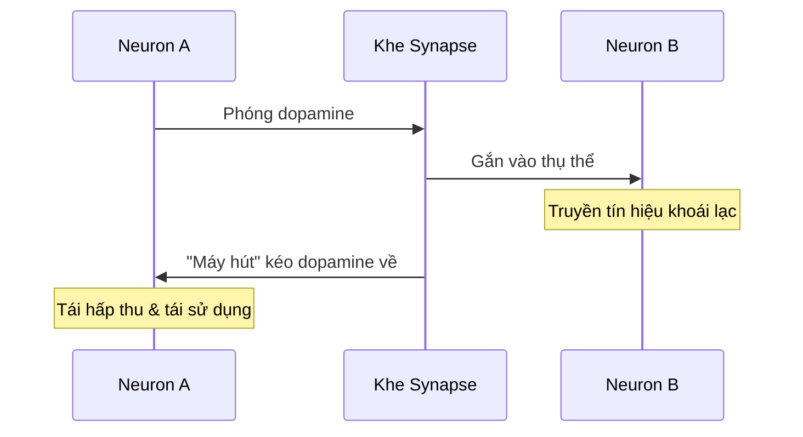
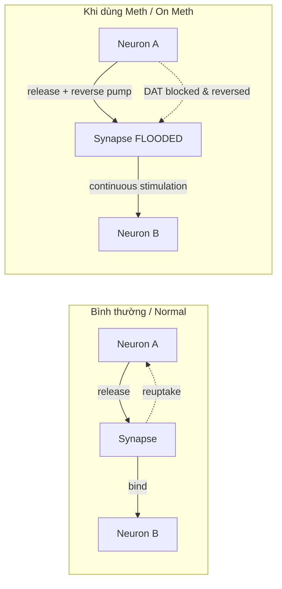
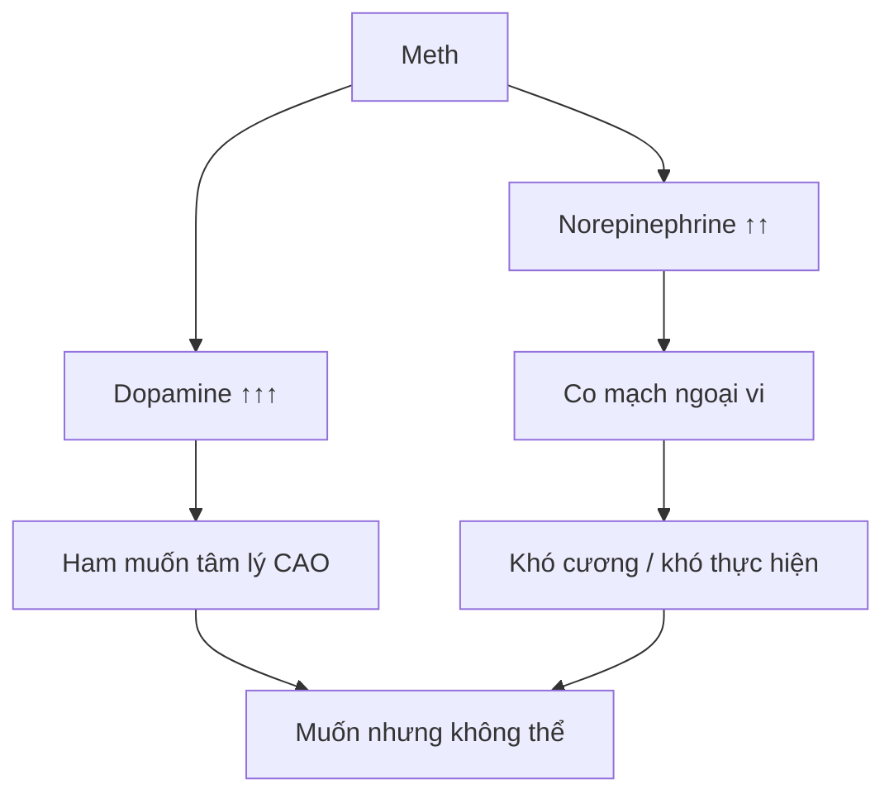
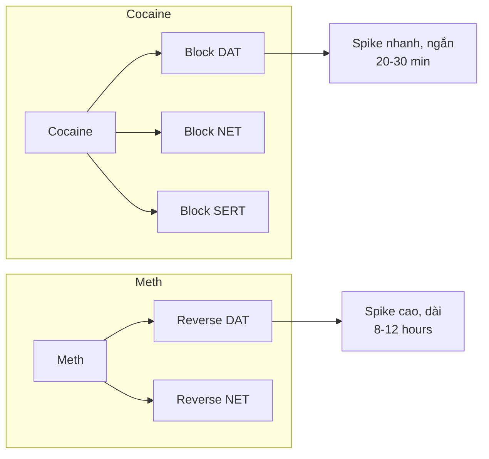
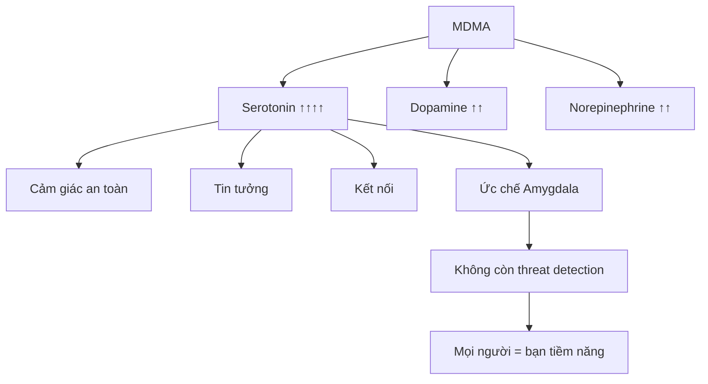
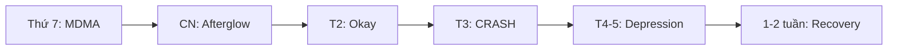
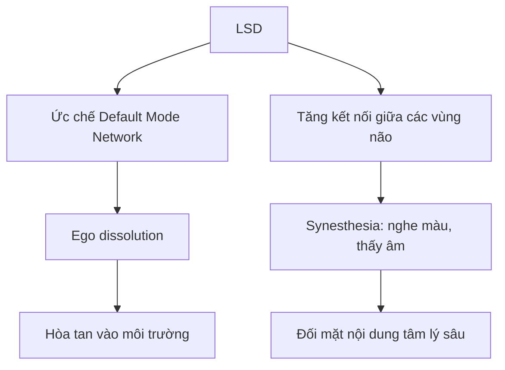
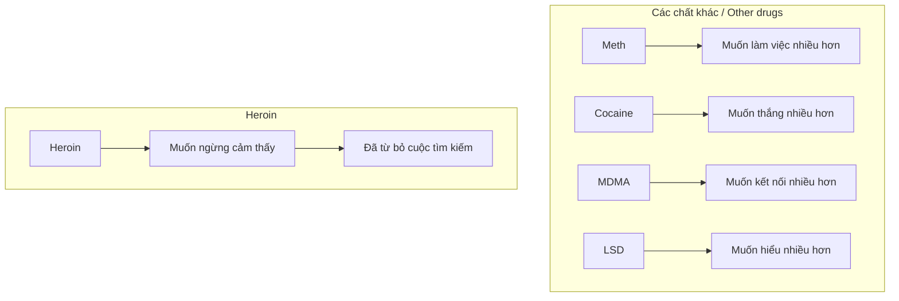
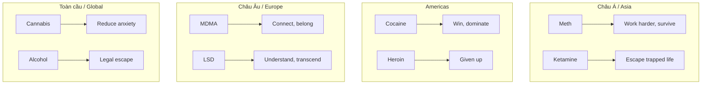

# Mười Lần Làm Tình - Giải Phẫu Học Các Chất Gây Nghiện

> *"1 lần chơi đá có thể mang đến cảm giác của 10 lần làm tình."*

Câu này không phải urban legend. Nó có cơ sở thần kinh học. Và cách mỗi loại chất gây nghiện hoạt động tiết lộ rất nhiều về **văn hóa, kinh tế, và nỗi đau tập thể** của vùng địa lý nơi nó phổ biến.

*This isn't urban legend. It has neurological basis. And how each drug works reveals much about the culture, economy, and collective pain of the region where it's prevalent.*

---

## Dopamine — Nguồn Cơn Khoái Lạc

### Cơ Chế Cơ Bản / Basic Mechanism

**Dopamine** là phân tử tín hiệu — hormone của **động lực và thèm muốn** (wanting), không phải thỏa mãn (liking). Xem thêm: [[Dopamine Economy - Nen Kinh Te Cua Su Them Muon|Dopamine Economy]]

*Dopamine is a signaling molecule — the hormone of motivation and wanting, not satisfaction.*

**Quy trình bình thường:**
1. Neuron A phóng dopamine vào khe synapse
2. Dopamine gắn vào thụ thể ở neuron B → truyền tín hiệu
3. "Máy hút" (DAT - Dopamine Transporter) kéo dopamine về A
4. Tái sử dụng

*Normal process: Neuron A releases dopamine → binds to B's receptors → signal transmitted → DAT pulls dopamine back → recycled.*

### Baseline Dopamine

| Hoạt động / Activity | Mức Dopamine (% baseline) |
|---------------------|---------------------------|
| Baseline bình thường | 100% |
| Ăn ngon | 150% |
| Quan hệ tình dục | 150-200% |
| Cocaine | 350-400% |
| **Methamphetamine** | **1000-1200%** |

→ Nói "1 lần chơi đá = 10 lần làm tình" về mặt dopamine spike là **có cơ sở**.

*Saying "one meth hit = 10 sex sessions" in terms of dopamine spike is scientifically grounded.*

---

## Meth — Cái Tôi Bền Bỉ

### Cơ Chế Tàn Phá / Devastating Mechanism

**Methamphetamine** không chỉ *block* DAT như cocaine — nó **reverse** DAT, biến "máy hút" thành "máy phun ngược".

*Meth doesn't just block DAT like cocaine — it reverses DAT, turning the "vacuum" into a "reverse pump."*

**Meth làm gì:**
1. **Khóa** máy hút (DAT) → dopamine không bị kéo về
2. **Đảo ngược** DAT → đẩy dopamine từ trong neuron ra ngoài
3. **Kích thích** giải phóng từ túi dự trữ
4. **Phá hủy** đầu dây thần kinh dopaminergic theo thời gian

*Meth: blocks DAT, reverses it, triggers reserve release, and destroys dopaminergic nerve terminals over time.*

### Tại Sao Châu Á Chuộng Meth?

Meth được sinh ra ở châu Á (Nhật Bản, 1893) và 100+ năm sau, địa hạt mạnh nhất vẫn là châu Á.

*Meth was born in Asia (Japan, 1893) and 100+ years later, its stronghold remains Asia.*

| Yếu tố / Factor | Giải thích / Explanation |
|-----------------|-------------------------|
| **Giá rẻ** | Sản xuất local, không cần import như cocaine |
| **DIY** | Có thể nấu trong bếp, xe tải, sa mạc |
| **Endurance** | High kéo dài 8-12h (vs cocaine 30-60min) |
| **Văn hóa lao động** | SEA: ngư dân, tài xế, công nhân cần vượt giới hạn |
| **Áp lực xã hội** | Nhật/Hàn: văn hóa công ty đòi hỏi hiện diện tuyệt đối |

> **Sự thật đau lòng:** Ở Đông Nam Á, một bộ phận lớn người dùng meth là **lao động di cư, ngư dân, tài xế đường dài, công nhân xây dựng** — những người cần vượt giới hạn thể chất để kiếm đủ tiền gửi về nhà.
>
> *Painful truth: In SEA, many meth users are migrant workers, fishermen, truckers, construction workers — people who need to exceed physical limits to earn enough.*

**Meth là "công cụ lao động"** — một thực tế cực kỳ đau lòng. Hệ thống kinh tế literally chạy bằng việc vắt kiệt con người.

*Meth as "work tool" — a deeply painful reality. Economic systems literally run on human exploitation.*

### Meth Và Tình Dục — Nghịch Lý Sinh Lý Học

#### "Meth Dick"

Meth tăng cả **dopamine** (ham muốn) và **norepinephrine** (tỉnh táo). Nhưng nore gây **co mạch ngoại vi** — bao gồm mạch máu ở vùng sinh dục.

*Meth increases both dopamine (desire) and norepinephrine (alertness). But nore causes peripheral vasoconstriction — including genital blood vessels.*

**Nghịch lý:** Vừa khuếch đại ham muốn tâm lý, vừa phá hoại khả năng thực hiện sinh lý.

*Paradox: Amplifies psychological desire while destroying physiological ability.*

#### Anhedonia Tình Dục

Dùng meth lâu dài → não giảm số lượng và độ nhạy thụ thể dopamine → **không thể cảm nhận khoái cảm** từ bất kỳ nguồn nào, kể cả tình dục.

*Long-term meth use → brain reduces dopamine receptor count and sensitivity → cannot feel pleasure from any source, including sex.*

| Giai đoạn / Phase | Trải nghiệm / Experience |
|-------------------|-------------------------|
| **Đang dùng** | Muốn nhưng không thể |
| **Cai nghiện** | Có thể nhưng không muốn |
| **Hồi phục** | 6 tháng - 2 năm, một số không hồi phục |

> Người trong tình huống này mô tả cảm giác tình dục không có meth như **đang xem phim câm** — hình ảnh vẫn đó nhưng toàn bộ chiều sâu cảm xúc biến mất.
>
> *They describe sex without meth like watching a silent film — images are there but all emotional depth is gone.*

#### Nghiện Context

Não người học qua **association** rất mạnh. Nếu hàng chục lần trải nghiệm tình dục gắn liền với meth, não đặt meth vào như **điều kiện tiên quyết**.

*Human brain learns through association. If dozens of sexual experiences are paired with meth, the brain makes meth a prerequisite.*

Đây không còn là nghiện **chất** — mà là nghiện **context**. Và nó khó gỡ hơn nhiều vì tình dục là hoạt động "lành mạnh" mà não đã rewire để không thể tách ra.

*This is no longer substance addiction — it's context addiction. Harder to untangle because sex is "healthy" but brain has rewired to not separate them.*

### Breaking Bad — Meth Và Giấc Mơ Mỹ Đảo Ngược

Tại sao phim Mỹ làm về Meth khi meth "hợp văn hóa" châu Á hơn?

*Why did an American show focus on meth when meth is more "culturally suited" to Asia?*

**Bối cảnh:** Albuquerque, New Mexico — một trong những bang nghèo nhất nước Mỹ, nằm trên hành lang vận chuyển từ Mexico.

| Drug | Demographic | "Vibe" |
|------|-------------|--------|
| Heroin | Inner city, ghetto | Đã bỏ cuộc |
| Cocaine | Wall Street, thành phố lớn | Đã thành công |
| **Meth** | Trailer park, rust belt, white poor | Đang cố gắng tuyệt vọng |

**Walter White:** Giáo viên có bằng tiến sĩ hóa học làm thêm ở tiệm rửa xe để trả hóa đơn — hình ảnh cộng hưởng mạnh với tầng lớp trung lưu thấp Mỹ thời hậu khủng hoảng 2008.

*Walter White: PhD chemistry teacher working at a car wash to pay bills — resonated strongly with lower middle class post-2008.*

> **Meth là thuốc của người đang cố gắng tuyệt vọng để không tụt lại phía sau** — giống như doping trong thể thao.
>
> *Meth is the drug of those desperately trying not to fall behind — like doping in sports.*

Và cuối cùng: Meth là thứ có thể sản xuất ở **mọi nơi** — trong bếp nhà, trong xe tải, trong sa mạc. Không cần đại bản doanh lớn. **DIY drug cho DIY culture** — rất Mỹ theo nghĩa đen.

*Meth can be produced anywhere — kitchen, truck, desert. No need for large operations. DIY drug for DIY culture — very American.*

---

## Cocaine — Cái Tôi Siêu Phàm

### Cơ Chế / Mechanism

Cocaine cũng chặn tái hấp thu dopamine và norepinephrine, nhưng **không reverse** như meth. Thêm vào đó, cocaine còn block **serotonin** reuptake.

*Cocaine also blocks dopamine and norepinephrine reuptake, but doesn't reverse like meth. Additionally blocks serotonin reuptake.*

| Cocaine | Meth |
|---------|------|
| Block only | Block + Reverse |
| High 20-30 min | High 8-12 hours |
| Redose liên tục | Một lần đủ lâu |
| Đắt tiền | Rẻ |
| Drug của giới có tiền | Drug của người nghèo cần làm việc |

### Tại Sao Americas Chuộng Cocaine?

**Địa lý:** Cây coca mọc ở Nam Mỹ. Chi phí vận chuyển đến Mỹ thấp, giá rẻ hơn đáng kể so với châu Á/Âu.

*Geography: Coca grows in South America. Transportation to US is cheap, significantly cheaper than to Asia/Europe.*

**Văn hóa:** Cocaine tạo ra **dopamine spike cực nhanh và cực ngắn** → cảm giác toàn năng tức thì → rơi xuống hố → cần thêm.

*Culture: Cocaine creates extremely fast and short dopamine spike → instant omnipotence → crash → need more.*

> Đây chính là nhịp điệu của chủ nghĩa tư bản Mỹ: **thắng lớn, ăn mừng, rồi đói lại ngay lập tức**.
>
> *This is the rhythm of American capitalism: win big, celebrate, then hungry again immediately.*

**Cocaine không làm người ta thư giãn hay kết nối.** Nó làm người ta:
- Sắc bén hơn
- Nhanh hơn
- Tự tin hơn một cách **hung hăng**
- Phóng đại cái tôi cá nhân thay vì xóa nó đi

*Cocaine doesn't relax or connect. It makes people sharper, faster, aggressively confident. Amplifies ego rather than dissolving it.*

→ Trong xã hội mà giá trị con người được đo bằng **hiệu suất và địa vị**, cocaine bổ trợ trực tiếp cho hệ giá trị đó.

*In a society where human value is measured by performance and status, cocaine directly supports that value system.*

**Cocaine là thuốc của người muốn thống trị** — khác hoàn toàn với MDMA (kết nối) hay heroin (biến mất).

*Cocaine is the drug of those who want to dominate — completely different from MDMA (connection) or heroin (disappearance).*

### Chiều Sâu Lịch Sử

Với Mỹ Latin, ngoài yếu tố địa lý còn có **chiều sâu lịch sử**: coca vốn là cây thiêng của người bản địa Andes. Cocaine là **phiên bản thuộc địa hóa** của một mối quan hệ cũ với sacred plant.

*For Latin America, beyond geography there's historical depth: coca was sacred to indigenous Andes people. Cocaine is the colonized version of an old relationship with a sacred plant.*

Xem thêm: [[Sacred Plants Corrupted - Thuốc Lá, Rượu và Cú Lừa Thế Kỷ|Sacred Plants Corrupted]]

---

## MDMA — Cái Tôi Vui Vẻ

### Cơ Chế / Mechanism

MDMA cũng giải phóng serotonin, dopamine và norepinephrine. Nhưng thứ được giải phóng ồ ạt nhất là **SEROTONIN**.

*MDMA also releases serotonin, dopamine, and norepinephrine. But the most massively released is SEROTONIN.*

**Serotonin** tạo ra:
- Cảm giác an toàn
- Kết nối và tin tưởng
- Ức chế amygdala (trung tâm xử lý sợ hãi)

→ Người dùng không còn đọc khuôn mặt người khác theo kiểu **threat detection**. Mọi gương mặt đều thân thiện, mọi người lạ đều là bạn tiềm năng.

*Serotonin creates safety, connection, trust, and suppresses amygdala. Users stop reading faces as threats. Everyone seems friendly, every stranger a potential friend.*

### Nghịch Lý Của Norepinephrine

MDMA cũng tăng norepinephrine, nhưng người dùng **không hung hăng** như cocaine. Tại sao?

*MDMA also increases norepinephrine, but users aren't aggressive like cocaine. Why?*

**Serotonin quá mạnh** — che khuất biểu hiện tâm lý của nore. Tuy nhiên, biểu hiện **sinh lý** vẫn có:

| Biểu hiện / Symptom | Nguyên nhân / Cause |
|--------------------|---------------------|
| Tim đập nhanh | Norepinephrine |
| Huyết áp tăng | Norepinephrine |
| Đồng tử giãn to | Norepinephrine |
| Hyperawareness | Nore + Serotonin |
| Muốn di chuyển, nhảy | Nore khuếch đại cảm giác |

> Trong văn hóa rave, người ta nhìn mắt nhau để đoán **ai đang dùng gì** — đồng tử giãn to là dấu hiệu đặc trưng.
>
> *In rave culture, people look at each other's eyes to guess who's on what — dilated pupils are the telltale sign.*

**Trạng thái bất thường về thần kinh học:** Não ở chế độ **alert cao** (nore) nhưng **không có threat response** (serotonin ức chế amygdala). Bình thường hai thứ này luôn đi cùng nhau.

*Neurologically unusual state: Brain on high alert (nore) but no threat response (serotonin suppresses amygdala). Normally these always go together.*

### Tại Sao Châu Âu Chuộng MDMA?

**Vấn đề văn hóa:** Sự cô đơn trong các xã hội hiện đại hóa cao + nỗi hoài nghi về tính chân thật của kết nối.

*Cultural problem: Loneliness in highly modernized societies + skepticism about authentic connection.*

| Đặc điểm văn hóa Bắc/Tây Âu | MDMA đáp ứng |
|----------------------------|--------------|
| Tình cảm kiểm soát | Mở cửa cảm xúc |
| Không gian cá nhân lớn | Kết nối thể chất |
| Nghi thức xã hội phức tạp | Bypass hoàn toàn |
| Khó nói "I love you" với bạn | Nói được và cảm thấy thật |

> Người Anh hay Đức không dễ dàng nói "I love you" với bạn bè. MDMA làm điều đó trở nên có thể và cảm giác **chân thật** hơn chứ không phải thảo mai lấy lệ.
>
> *British or Germans don't easily say "I love you" to friends. MDMA makes that possible and feels genuine, not performative.*

### Rave Culture — Giải Pháp Hậu Hiện Đại

Nhìn sâu hơn: Dân châu Âu hậu chiến mang **chấn thương tập thể** về những gì xảy ra khi người ta quá tin vào cộng đồng, khi tập thể trở thành khối đồng nhất hung bạo.

*Deeper: Post-war Europeans carry collective trauma about what happens when people trust community too much, when collective becomes a violent monolith.*

**MDMA + Rave culture** tạo ra cộng đồng:
- Không có lãnh đạo
- Không có ý thức hệ
- Chỉ có âm nhạc và cơ thể
- **Một kiểu kết nối mà không ai có thể vũ khí hóa**

> Rave culture là **giải pháp hậu hiện đại** cho câu hỏi: Làm sao để thuộc về một cái gì đó mà không đánh mất bản thân hay trở nên nguy hiểm?
>
> *Rave culture is a postmodern solution to: How to belong to something without losing yourself or becoming dangerous?*

Đó là lý do Berlin trở thành thủ đô techno thế giới — thành phố từng bị chia đôi bởi ý thức hệ, giờ đoàn tụ trong những club **không có gương** (để không ai nhìn thấy mình), **không có VIP area** (không hierarchy), chỉ có bass và bodies.

*That's why Berlin became the world's techno capital — a city once divided by ideology, now reunited in clubs with no mirrors, no VIP areas, just bass and bodies.*

### Cái Giá Phải Trả — Suicide Tuesday

Sau khi dump hết serotonin trong 1 đêm, não mất **1-2 tuần** để rebuild.

*After dumping all serotonin in one night, brain takes 1-2 weeks to rebuild.*

Người dùng thường xuyên → **serotonin depletion mãn tính** → depression, anxiety dai dẳng.

**Irony:** Thuốc tạo kết nối, dùng nhiều lại dẫn đến **isolation** vì não không còn khả năng cảm nhận connection tự nhiên.

*Irony: Drug that creates connection, when overused leads to isolation because brain loses ability to feel natural connection.*

---

## Ketamine — Cái Tôi Trôi Dạt

### Cơ Chế / Mechanism

Ketamine **không khuếch đại hormone** — nó tạo ra trạng thái **phân ly**: ý thức tách khỏi cơ thể, bản ngã tách khỏi suy nghĩ.

*Ketamine doesn't amplify hormones — it creates dissociation: consciousness separates from body, ego separates from thought.*

| Liều / Dose | Trải nghiệm / Experience |
|-------------|-------------------------|
| Thấp | Bay bổng, méo lệch không gian |
| Cao | **K-hole**: bản ngã gần như tan biến |

### Tại Sao Châu Á Đô Thị Chuộng Ketamine?

Phổ biến đặc biệt ở **Anh, Hong Kong** và các thành phố lớn châu Á có club scene.

*Especially popular in UK, Hong Kong, and major Asian cities with club scenes.*

> Ketamine hấp dẫn với người trẻ cảm thấy **bị mắc kẹt trong hoàn cảnh không có lối ra**.
>
> *Ketamine appeals to young people who feel trapped in circumstances with no exit.*

**Ví dụ Hong Kong:**
- Thành phố đắt đỏ nhất thế giới
- Căn hộ 20m²
- Tuần làm 60h
- Không có exit strategy

→ K-hole trở thành **affordable vacation** cho tâm trí. Khi không thể thoát về mặt **thể chất**, người ta thoát về mặt **nhận thức**.

*K-hole becomes affordable vacation for the mind. When you can't escape physically, you escape cognitively.*

### Irony — Từ Club Đến Clinic

Cùng một chất, context khác hoàn toàn:

| Club | Clinic (FDA approved) |
|------|----------------------|
| Escape, dissociation | Reset, neuroplasticity |
| Chạy trốn | Therapeutic |

→ Proof rằng **set and setting** quyết định meaning của trải nghiệm.

*Proof that set and setting determine the meaning of the experience.*

---

## LSD — Cái Tôi Thoát Tục

### Cơ Chế / Mechanism

LSD **không gây nghiện** theo nghĩa dược lý. Nó:
- Tăng kết nối giữa các vùng não bình thường không giao tiếp
- Ức chế **Default Mode Network** (mạng lưới tạo ra cảm giác về cái tôi liên tục)

*LSD is not addictive in pharmacological sense. It increases connectivity between brain regions that don't normally communicate and suppresses Default Mode Network.*

### Tại Sao LSD Gắn Với Phương Tây Có Học Vấn?

LSD đòi hỏi:
- **Cơ sở tâm lý** để điều hướng trải nghiệm
- **Nền tảng ngôn ngữ** để xử lý và tích hợp
- **Set and setting** tốt: mindset trước khi dùng + môi trường trong khi dùng

*LSD requires psychological foundation, language to process and integrate, good set and setting.*

> LSD trong khách sạn 5 sao **rất khác** với LSD trong khu ổ chuột. Người có mindset chuẩn **rất khác** với người mindset tệ.
>
> *LSD in a 5-star hotel is very different from LSD in a slum. Person with prepared mindset is very different from person with poor mindset.*

### Tại Sao LSD Ít Phổ Biến Ở Châu Á?

Không chỉ vì khó tiếp cận — mà vì trải nghiệm **ego dissolution** không được đón nhận trong văn hóa mà bản sắc cá nhân gắn chặt với **vai trò xã hội và nghĩa vụ gia đình**.

*Not just accessibility — ego dissolution isn't welcomed in cultures where identity is tightly bound to social roles and family obligations.*

> Mất đi cảm giác "tôi là ai trong mối quan hệ với người khác" **không phải giải phóng** trong mọi bối cảnh văn hóa. Với người lớn lên trong văn hóa Nho giáo hay danh dự tập thể, đó có thể là **trải nghiệm đáng sợ**.
>
> *Losing sense of "who I am in relation to others" isn't liberation in every cultural context. For those raised in Confucian or collective honor cultures, it can be terrifying.*

### Silicon Valley Microdosing

Microdosing LSD (1/10 liều) đang là trend ở tech scene. Họ không muốn trip — họ muốn **"defragment the hard drive"**: tăng lateral thinking mà vẫn functional.

*Microdosing LSD (1/10 dose) is trending in tech. They don't want to trip — they want to "defragment the hard drive": increase lateral thinking while staying functional.*

Steve Jobs từng nói LSD là **"one of the most important things"** ông từng làm.

Nhưng đây cũng là **privilege** của tầng lớp có đủ an toàn để explore consciousness. Người đang survival mode không có luxury đó.

*But this is a privilege of those safe enough to explore consciousness. Those in survival mode don't have that luxury.*

---

## Cần Sa — Cái Tôi Bồng Bềnh

### Cơ Chế / Mechanism

Cần sa ức chế nhẹ **Default Mode Network** — hệ thống chịu trách nhiệm cho vòng lặp suy nghĩ về quá khứ và tương lai.

*Cannabis mildly suppresses Default Mode Network — system responsible for thought loops about past and future.*

→ Người dùng mất khả năng duy trì lo âu dài hạn và bị kéo về **hiện tại**.

*Users lose ability to maintain long-term anxiety and get pulled into the present.*

### Hai Vai Trò Khác Nhau

| Tầng lớp / Class | Vai trò của cần sa / Cannabis role |
|------------------|-----------------------------------|
| **Trung lưu phương Tây** | Thuốc của người bị kẹt giữa quá nhiều lựa chọn và quá ít ý nghĩa |
| **Tầng lớp thấp** | Giảm đau rẻ tiền cho người không có bảo hiểm y tế |

Cần sa phổ biến trong xã hội có **mức lo âu nền cao** nhưng **không có khủng hoảng cấp bách** cần giải quyết — đặc sản của tầng lớp trung lưu hiện đại.

*Cannabis is popular in societies with high baseline anxiety but no urgent crisis — specialty of modern middle class.*

Xem thêm: [[Thế Hệ Dâu Tây — Mệt Rồi, Dừng Lại Được Chưa]]

---

## Heroin — Cái Tôi Tuyệt Vọng

### Cơ Chế / Mechanism

Heroin và opioid **không tạo ra khoái lạc dữ dội** như cocaine hay meth. Chúng **ức chế đau đớn** — cả thể chất lẫn xã hội (nỗi đau của sự từ chối, mất mát, cô đơn).

*Heroin and opioids don't create intense pleasure like cocaine or meth. They suppress pain — both physical and social (rejection, loss, loneliness).*

> Người dùng heroin lần đầu thường mô tả: **toàn bộ lo âu, xấu hổ và đau đớn tích lũy cả đời biến mất trong vài phút**.
>
> *First-time heroin users often describe: all accumulated anxiety, shame, and pain of a lifetime disappearing in minutes.*

### Thuốc Của Người Đã Bỏ Cuộc

**Heroin là thuốc của những người muốn ngừng cảm thấy** — chứ không phải muốn tốt hơn.

*Heroin is the drug of those who want to stop feeling — not to feel better.*

Người nghiện cocaine, meth, ketamine, LSD, cần sa... thường vẫn có **động lực tìm kiếm** thứ gì đó trong cuộc sống.

Người nghiện heroin thường đã **từ bỏ cuộc tìm kiếm đó từ lâu**.

*Cocaine, meth, ketamine, LSD, cannabis users usually still have motivation to seek something. Heroin users have usually abandoned that search long ago.*

---

## Amy Winehouse — Case Study Về Addiction

### "Rehab" — Bài Hát Thiên Tài Và Tự Hủy Hoại

Amy Winehouse viết "Rehab" khi manager kêu cô vào trại cai nghiện và cô từ chối. Thay vì đi rehab, cô về nhà **viết bài hát về việc từ chối vào rehab**.

*Amy wrote "Rehab" when her manager told her to go to rehab and she refused. Instead of going, she wrote a song about refusing.*

> "They tried to make me go to rehab, I said no, no, no"

Bài hát thắng Grammy, được phát khắp nơi, trở thành biểu tượng.

Nhưng sau khi Amy mất năm 27 tuổi, người ta nghe lại và thấy ẩn bên dưới là **lời kêu cứu**:

| Lyric | Ý nghĩa ẩn / Hidden meaning |
|-------|----------------------------|
| "If my daddy thinks I'm fine" | Cô biết mình không ổn, dùng nhận thức người khác làm lá chắn |
| "I'd rather be at home with Ray" | Sợ đối mặt bản thân khi không có gì che chắn |

### Anosognosia — Mất Nhận Thức Bệnh

Amy đủ tỉnh táo để viết bài hát **cực kỳ thông minh** về việc từ chối điều trị, nhưng không đủ khoảng cách với chính mình để nhận ra bài hát đó đang **mô tả chính xác vấn đề cô cần giải quyết**.

*Amy was lucid enough to write an extremely clever song about refusing treatment, but not distant enough from herself to realize the song was describing exactly the problem she needed to solve.*

**Nghệ thuật và bệnh dùng chung nguồn nguyên liệu** — đó là lý do cô không thể (hoặc không muốn) tách hai thứ ra.

*Her art and her illness used the same raw material — that's why she couldn't (or wouldn't) separate them.*

> Amy từng nói thẳng: cô sợ điều trị tâm lý sẽ **làm hỏng khả năng sáng tác**.
>
> *Amy said directly: she feared therapy would damage her songwriting ability.*

### Cái Chết — Irony Cuối Cùng

Kết quả độc chất học khi Amy mất: **không có chất gây nghiện bất hợp pháp nào**. Cô đã cai được cocaine và heroin.

Thứ giết cô là **rượu** — nồng độ cồn 416mg/100ml.

*Toxicology when Amy died: no illegal drugs. She had quit cocaine and heroin. What killed her was alcohol — 416mg/100ml blood alcohol.*

**Rượu là chất duy nhất mà việc dừng đột ngột có thể giết người.**

*Alcohol is the only substance where sudden cessation can kill.*

| Heroin withdrawal | Alcohol withdrawal |
|-------------------|-------------------|
| Đau đớn kinh khủng | Có thể gây co giật |
| Hiếm khi tử vong trực tiếp | Có thể gây delirium tremens |
| | **Có thể ngừng tim** |

Amy có thể là ví dụ điển hình cho **"chuyển dịch nghiện"**: cai được heroin/cocaine nhưng rượu lấp vào chỗ trống vì:
- Xã hội vô hình hơn
- Dễ tiếp cận hơn
- **Không có stigma**

*Amy may exemplify "addiction transfer": quit heroin/cocaine but alcohol filled the gap because it's more socially invisible, accessible, and stigma-free.*

### Stigma — Kẻ Giết Người Thầm Lặng

Chuyển từ heroin sang rượu trong mắt nhiều người trông như **tiến bộ**. Không còn kim tiêm, không crack pipe, chỉ là vodka thôi mà?

*Switching from heroin to alcohol looks like progress to many. No needles, no crack pipe, just vodka right?*

Nhưng về mặt thần kinh học, não vẫn đang tìm phân tử lấp vào hệ thống phần thưởng thiếu hụt — chỉ là thứ phân tử đó lần này được **bán hợp pháp ở mọi siêu thị**.

*But neurologically, brain is still seeking molecules to fill the depleted reward system — only this time that molecule is legally sold at every supermarket.*

Xem thêm: [[Sacred Plants Corrupted - Thuốc Lá, Rượu và Cú Lừa Thế Kỷ|Sacred Plants Corrupted]]

---

## Tổng Kết — Drug Và Văn Hóa

| Drug | "Cái tôi" / Ego | Nhu cầu văn hóa / Cultural need |
|------|----------------|-------------------------------|
| **Meth** | Bền bỉ | Survive, không tụt lại |
| **Cocaine** | Siêu phàm | Dominate, thống trị |
| **MDMA** | Tan rã/kết nối | Belong, thuộc về |
| **Ketamine** | Trôi dạt | Escape, thoát ly |
| **LSD** | Thoát tục | Understand, siêu việt |
| **Cannabis** | Bồng bềnh | Reduce anxiety |
| **Heroin** | Tuyệt vọng | Stop feeling |
| **Alcohol** | Vô hình | Legal escape |

---

## Kết Luận

Mỗi loại chất gây nghiện không chỉ là **phân tử hóa học** — nó là **gương phản chiếu** nỗi đau tập thể, áp lực văn hóa, và hệ thống kinh tế của vùng địa lý nơi nó phổ biến.

*Each drug is not just a chemical molecule — it's a mirror reflecting collective pain, cultural pressure, and economic systems of the region where it's prevalent.*

- Meth phản chiếu văn hóa vắt kiệt lao động
- Cocaine phản chiếu văn hóa thắng thua
- MDMA phản chiếu nỗi cô đơn trong xã hội hiện đại
- Heroin phản chiếu sự tuyệt vọng của người đã bỏ cuộc

Và tất cả đều là nguồn cung cấp **[[Loosh - Nang Luong Thu Hoach Tu Con Nguoi|Loosh]]** — năng lượng cảm xúc cường độ cao mà [[Ma Trận]] thu hoạch từ con người.

*And all are sources of Loosh — high-intensity emotional energy that the Matrix harvests from humans.*

> Nói thẳng ra: không phải chất kích thích nào cũng như nhau, và muốn dùng nó để đáp ứng mục đích thì cần kiến thức, kinh nghiệm và trải nghiệm — chứ không phải cứ lao đầu vào ai rủ gì dùng đó rồi lên giường lột đồ quất nhau là thấy vui.
>
> *Bottom line: not all substances are equal, and using them purposefully requires knowledge and experience — not just diving in with whoever offers whatever and expecting pleasure.*

---

## Related

- [[Dopamine Economy - Nen Kinh Te Cua Su Them Muon]] — Cách hệ thống hijack dopamine
- [[Loosh - Nang Luong Thu Hoach Tu Con Nguoi]] — Năng lượng cảm xúc bị thu hoạch
- [[S.E.X Va Tam Ly Hoc Jung]] — Trao đổi năng lượng tình dục
- [[Sacred Plants Corrupted - Thuốc Lá, Rượu và Cú Lừa Thế Kỷ]] — Cây thiêng bị biến chất
- [[Kiểm Soát Tâm Trí]] — Mind control mechanisms
- [[Ma Trận]] — Hệ thống kiểm soát
- [[Elite]] — Ai điều khiển hệ thống
- [[Thế Hệ Dâu Tây — Mệt Rồi, Dừng Lại Được Chưa]] — Rat race và sự mệt mỏi

---

*"Cảm giác của mười lần làm tình là thế nào? 20 năm để trả lời một câu hỏi — và câu trả lời hóa ra là về văn hóa, kinh tế, và nỗi đau tập thể của loài người."*

*"What does ten orgasms feel like? 20 years to answer one question — and the answer turned out to be about culture, economics, and humanity's collective pain."*
