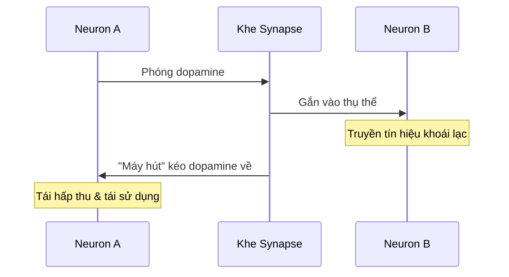
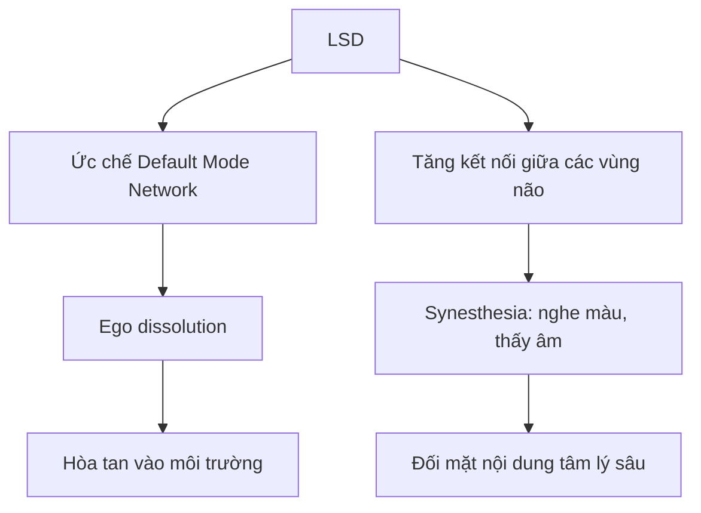
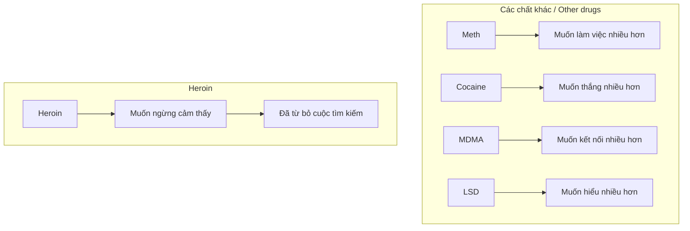
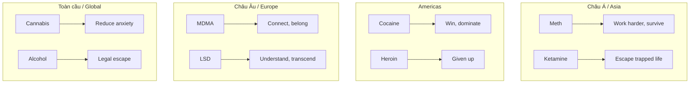

# Mười Lần Làm Tình - Giải Phẫu Học Các Chất Gây Nghiện

Năm 18 tuổi, mình từng đọc được ở đâu đó rằng: 1 lần chơi đá (Meth) có thể mang đến cảm giác của 10 lần làm tình. Từng viết 1 truyện ngắn với tiêu đề này (lạc đâu mất rồi), và sau đó cứ băn khoăn mãi về cái fact này, tự hỏi khi nào mình được kiểm chứng? 20 năm sau, có hôm ngồi với lũ bạn ở quán café nói xấu thiên hạ, chúng mình tự hỏi nhau là nếu bây giờ giả dụ muốn chơi thuốc, thì cũng chả biết đường mua ở đâu. Từng này tuổi rồi mà cũng không biết, chán tụi mình thật chứ.

Tóm lại thì, cảm giác của mười lần làm tình là thế nào? Và tại sao dân châu Á lại thích Meth đến vậy, trong khi dân Mỹ lại chuộng Cocaine, còn dân Âu lại mê MDMA?

*At 18, I read somewhere that one meth hit equals the feeling of 10 orgasms. I wrote a short story with that title (lost now), and kept wondering when I'd verify this. 20 years later, sitting with friends at a café gossiping, we asked ourselves: if we wanted drugs now, we wouldn't even know where to buy them. So much for street smarts.*

*So what does ten orgasms feel like? And why do Asians prefer Meth while Americans love Cocaine and Europeans favor MDMA?*

---

## Dopamine — Nguồn Cơn Khoái Lạc

Trước hết hãy nói về Dopamine (hormone của động lực và niềm vui) cái đã. Hiểu đơn giản thì nó là một phân tử tín hiệu. Khi neuron A muốn nói chuyện với neuron B, nó phóng dopamine vào khe synapse — cái khoảng trống giữa hai tế bào thần kinh. Dopamine bay vèo vèo qua khe đó, gắn vào thụ thể ở neuron B, truyền tín hiệu xong. Sau đó neuron A sẽ có một cái "máy hút" để kéo dopamine trở ngược về A và tái sử dụng. Đây gọi là "tái hấp thu" Dopamine.

*First, let's talk about Dopamine — the motivation and joy hormone. Simply put, it's a signaling molecule. When neuron A wants to talk to neuron B, it fires dopamine into the synapse — the gap between two nerve cells. Dopamine flies across, binds to receptors on neuron B, transmits the signal. Then neuron A has a "vacuum" to pull dopamine back for recycling. This is called dopamine "reuptake."*

Xem thêm: [[Dopamine Economy - Nền Kinh Tế Của Sự Thèm Muốn]]

Nếu baseline bình thường của dopamine là 100, quan hệ tình dục đẩy mức đó lên khoảng 150-200, thì Meth có thể đẩy lên đến khoảng 1000-1200 (tùy nghiên cứu). Nên nói nôm na là một lần chơi đá sướng bằng 10 lần làm tình có lẽ cũng không sai.

*If normal dopamine baseline is 100, sex pushes it to 150-200, while Meth can push it to 1000-1200 (depending on studies). So saying one meth hit equals 10 orgasms isn't far off.*

| Hoạt động | Mức Dopamine |
|-----------|--------------|
| Baseline bình thường | 100% |
| Ăn ngon | 150% |
| Quan hệ tình dục | 150-200% |
| Cocaine | 350-400% |
| **Methamphetamine** | **1000-1200%** |

---

## Meth — Cái Tôi Bền Bỉ

Methamphetamine có cơ chế rất tàn phá mặt thần kinh học: trong quy trình mới nhắc phía trên, nó chui vào và khóa cái máy hút đó lại. Dopamine không bị kéo về mà cứ nằm lềnh phềnh trong khe synapse, tiếp tục kích thích neuron B liên tục. Neuron B nhận được tín hiệu khoái lạc mạnh hơn và kéo dài hơn bình thường rất nhiều lần.

Chưa hết, meth còn **đảo ngược** DAT — biến "máy hút" thành "máy phun ngược", đẩy dopamine từ trong neuron ra ngoài. Nó cũng kích thích giải phóng ngược dopamine từ các túi dự trữ và phá hủy các đầu dây thần kinh dopaminergic theo thời gian.

*Meth has a devastating neurological mechanism: it plugs into and blocks the vacuum. Dopamine isn't pulled back but lingers in the synapse, continuously stimulating neuron B far longer than normal.*

*Moreover, meth reverses DAT — turning the "vacuum" into a "reverse pump," pushing dopamine from inside neurons out. It also triggers release from reserve vesicles and destroys dopaminergic nerve terminals over time.*

Mức dopamine tăng cao gấp mười lần so với bình thường, và kéo dài nhiều giờ. Đó là lý do vì sao meth được xem là thuốc của sự chịu đựng lâu dài chứ không phải là những cơn khoái lạc tức thì. Người chơi đá có thể thức trắng 3 ngày, làm việc liên tục, chịu đói và lạnh, không cảm thấy mệt. Về mặt tiến hóa, "đá" mô phỏng trạng thái sinh tồn khẩn cấp của cơ thể khi phải chạy trốn hay săn mồi trong nhiều ngày.

*Dopamine levels rise tenfold and last for hours. That's why meth is seen as the drug of endurance, not instant pleasure. Users can stay awake 3 days, work continuously, endure hunger and cold without feeling tired. Evolutionarily, meth simulates the body's emergency survival state when fleeing or hunting for days.*

### Tại Sao Châu Á Chuộng Meth?

Có một sự thật thú vị là Meth được sinh ra ở châu Á (Nhật Bản, 1893), và trong hơn 100 năm qua, địa hạt phát triển mạnh mẽ nhất của nó vẫn là ở châu Á.

Ở Đông Nam Á, một bộ phận lớn người dùng meth là lao động di cư, ngư dân, tài xế đường dài, công nhân xây dựng — những người cần phải vượt giới hạn thể chất để kiếm đủ tiền gửi về nhà. **Đá bị xem như một công cụ lao động** — một thực tế cực kỳ đau lòng và ít được thảo luận.

Ở Nhật và Hàn Quốc, một hình thức khác của cùng vấn đề: văn hóa công ty đòi hỏi sự hiện diện tuyệt đối, văn hóa gia đình đòi hỏi ta vắt kiệt đời mình. Meth trong môi trường đó là cách cơ thể người bị vắt đến giới hạn để đáp ứng một kỳ vọng xã hội mà không ai dám từ chối công khai.

*A fun fact: Meth was born in Asia (Japan, 1893), and for over 100 years, its strongest territory remains Asia.*

*In Southeast Asia, many meth users are migrant workers, fishermen, long-haul truckers, construction workers — people who need to exceed physical limits to earn enough to send home. Meth is seen as a work tool — an extremely painful reality rarely discussed.*

*In Japan and Korea, a different form of the same problem: corporate culture demands absolute presence, family culture demands you drain your life dry. Meth becomes how human bodies are pushed to limits to meet social expectations nobody dares publicly refuse.*

### Meth Và Tình Dục — Nghịch Lý Sinh Lý Học

Ở khía cạnh tình dục, việc giải phóng lượng Dopamine quá mức của đá đôi khi khiến người ta có cảm giác như đang... làm tình 10 lần. Nhưng mà, nếu vừa làm tình vừa đập đá thì sao? Về mặt lý thuyết ngắn hạn thì nó là sự khuếch đại của cả hai hệ thống phần thưởng cùng lúc. Khi hai nguồn kích thích cùng đổ vào, cảm giác thể chất sẽ cực kỳ mãnh liệt, da nhạy cảm hơn, và ức chế xã hội biến mất hoàn toàn. Đây là lý do tại sao chơi đá gắn liền với hành vi tình dục bốc đồng và kéo dài nhiều giờ trong văn hóa chemsex ở các cộng đồng nhất định.

Có một nghịch lý sinh lý học thú vị: ngoài ức chế tái hấp thu và sản sinh Dopamine, nó còn ức chế tái hấp thu và làm tăng cả norepinephrine. Nore thì khác hẳn về chức năng — nó là chất của sự tỉnh táo và phản ứng khẩn cấp. Khi nore tăng, tim đập nhanh hơn, đồng tử giãn, máu dồn về cơ bắp, não chuyển sang chế độ tập trung cao độ.

Dùng "đá" khi làm tình, norepinephrine tăng cao gây co mạch ngoại vi, bao gồm mạch máu ở vùng sinh dục. Ở nam giới điều này thường dẫn đến **khó cương hoặc không cương được** dù ham muốn rất cao. Cơ thể muốn nhưng hệ thống thủy lực không hoạt động. Đây là hiện tượng được gọi trong tiếng lóng là **"meth dick"** và được ghi nhận rộng rãi trong y văn. Đó chính là nghịch lý của đập đá: **vừa khuếch đại ham muốn tâm lý vừa phá hoại khả năng thực hiện sinh lý**.

*On the sexual side, meth's excessive dopamine release sometimes makes people feel like they're... having sex 10 times. But what if you have sex while on meth? Short-term theory: it amplifies both reward systems simultaneously. When two stimulation sources pour in, physical sensations become extremely intense, skin more sensitive, social inhibitions completely disappear. This is why meth is linked to impulsive, hours-long sexual behavior in chemsex culture.*

*There's an interesting physiological paradox: besides inhibiting dopamine reuptake, meth also increases norepinephrine. Nore functions differently — it's the alertness and emergency response chemical. When nore rises, heart beats faster, pupils dilate, blood flows to muscles, brain shifts to high-focus mode.*

*Using meth during sex, high norepinephrine causes peripheral vasoconstriction, including genital blood vessels. In men, this often leads to difficulty getting or maintaining erection despite high desire. Body wants but hydraulics don't work. This phenomenon is slang-termed "meth dick" and widely documented in medical literature. That's the paradox: amplifying psychological desire while destroying physiological ability.*

Xem thêm về tình dục và năng lượng: [[S.E.X Và Tâm Lý Học Jung]] và [[Sự Thật Đen Tối Về Phim Khiêu Dâm]]

### Anhedonia Tình Dục

Ở một khía cạnh khác, dùng meth lâu dài có thể dẫn đến mất cảm giác với tình dục. Cơ chế là: tổn thương đầu dây dopaminergic. Não sau khi bị ngập dopamine ở mức 1000% liên tục sẽ tự giảm thụ thể, giảm số lượng và độ nhạy của thụ thể. Khi bạn không dùng đá nữa, não có quá ít thụ thể để nhận dopamine tự nhiên từ bất kỳ nguồn nào, bao gồm tình dục.

Tình trạng này gọi là **anhedonia tình dục** — không thể cảm nhận khoái cảm hoặc sự thỏa mãn trong hoạt động tình dục, dù cơ thể vẫn có phản ứng sinh lý. Trong nghiên cứu lâm sàng về cai đá, anhedonia tình dục là một trong những triệu chứng phổ biến và kéo dài nhất, thường từ 6 tháng đến 2 năm sau khi cai hoàn toàn. Một số người không hồi phục hoàn toàn nếu tổn thương đầu dây thần kinh quá nặng.

Người trong tình huống đó thường mô tả cảm giác tình dục không có meth như **đang xem phim câm không có âm thanh** — hình ảnh vẫn đó nhưng toàn bộ chiều sâu cảm xúc biến mất.

Đây là một trong những lý do tái nghiện với meth cao đến vậy: trong giai đoạn cai, người ta phải sống trong một thế giới phẳng lặng hoàn toàn, không có gì kể cả tình dục tạo ra bất kỳ cảm giác đáng kể nào.

*On another note, long-term meth use can lead to loss of sexual sensation. The mechanism: dopaminergic terminal damage. After being flooded with 1000% dopamine, the brain reduces receptor count and sensitivity. When you stop using, the brain has too few receptors to receive natural dopamine from any source, including sex.*

*This condition is called sexual anhedonia — inability to feel pleasure or satisfaction from sex, despite physiological responses. In clinical meth recovery studies, sexual anhedonia is among the most common and persistent symptoms, typically lasting 6 months to 2 years after complete cessation. Some never fully recover if nerve terminal damage is severe.*

*People in this situation describe sex without meth like watching a silent film — images are there but all emotional depth is gone. This is why meth relapse rates are so high: during recovery, people live in a completely flat world where nothing, including sex, produces any significant feeling.*

### Nghiện Context

Có một tầng nữa về mặt tâm lý học. Não người học qua association rất mạnh. Nếu hàng chục lần trải nghiệm tình dục của ai đó gắn liền với meth, não dần dần đặt meth vào như một điều kiện tiên quyết. Tới chỗ này thì không còn là nghiện chất nữa mà là **nghiện context**, và nó khó gỡ hơn nhiều vì về mặt lý thuyết tình dục là hoạt động lành mạnh nhưng não đã rewire để không thể tách hai thứ ra.

*There's another psychological layer. Human brain learns through association very strongly. If dozens of someone's sexual experiences are paired with meth, the brain gradually makes meth a prerequisite. At this point it's no longer substance addiction but context addiction — much harder to untangle because theoretically sex is healthy but the brain has rewired to not separate the two.*

### Breaking Bad — Meth Và Giấc Mơ Mỹ Đảo Ngược

Đến đoạn này thì định chuyển sang viết về các cái khác, nhưng sực nhớ là có chiếc phim Mỹ rất đỉnh về Meth là Breaking Bad — trong khi phần đầu đã nói là Meth phổ biến và hợp văn hóa châu Á nhất, vậy tại sao phim Mỹ lại làm về Meth?

Thực tế thì Meth vẫn có ở khắp nơi trên thế giới, tùy vùng thôi. Breaking Bad ra đời năm 2008 tại Albuquerque, New Mexico — một trong những bang nghèo nhất nước Mỹ. Vince Gilligan chọn bối cảnh này vì Albuquerque nằm trên hành lang vận chuyển từ Mexico lên, là điểm trung chuyển thực tế của nhiều loại ma túy, và cộng đồng ở đó đã sống với hậu quả của meth đủ lâu để câu chuyện có độ tin cậy địa lý.

Nhưng lý do sâu hơn là meth phù hợp với câu chuyện Mỹ theo cách heroin hay cocaine không làm được. Nếu Heroin là thuốc của người đã bỏ cuộc, cocaine là thuốc của người đã thành công, thì **meth là thuốc của người đang cố gắng tuyệt vọng để không tụt lại phía sau** — giống xài doping trong thể thao vậy. Đó chính xác là tâm lý của tầng lớp trung lưu thấp Mỹ trong giai đoạn hậu khủng hoảng tài chính 2008, thời điểm phim ra mắt.

Walter White là giáo viên có bằng tiến sĩ hóa học làm thêm ở tiệm rửa xe để trả hóa đơn — một hình ảnh cộng hưởng rất mạnh với khán giả Mỹ thời đó. Và cuối cùng, cũng là lý do Meth rất phổ biến ở Đông Nam Á và các vùng thu nhập thấp: meth là thứ có thể được sản xuất ở mọi nơi — trong bếp nhà, trong xe tải, trong sa mạc. Không cần đại bản doanh lớn hay cánh đồng bao la. **DIY drug cho DIY culture** — rất Mỹ theo nghĩa đen.

*At this point I was going to move on, but remembered there's an excellent American show about Meth: Breaking Bad — yet earlier I said Meth is most popular and culturally suited to Asia, so why did an American show focus on it?*

*Truth is, Meth exists everywhere, just varies by region. Breaking Bad debuted in 2008 in Albuquerque, New Mexico — one of America's poorest states. Vince Gilligan chose this setting because Albuquerque sits on the trafficking corridor from Mexico, is an actual transit point for many drugs, and the community has lived with meth's consequences long enough for the story to have geographic credibility.*

*But the deeper reason is meth fits the American story in ways heroin or cocaine can't. If Heroin is the drug of those who've given up, cocaine the drug of the successful, then meth is the drug of those desperately trying not to fall behind — like doping in sports. That's exactly the psychology of lower-middle-class America post-2008 financial crisis, when the show premiered.*

*Walter White is a PhD chemistry teacher moonlighting at a car wash to pay bills — an image that resonated powerfully with American audiences then. And finally, the same reason meth is popular in Southeast Asia and low-income regions: meth can be produced anywhere — kitchen, truck, desert. No need for large operations or vast fields. DIY drug for DIY culture — very American literally.*

---

## Cocaine — Cái Tôi Siêu Phàm

Giờ chúng ta hãy chuyển về Mỹ, và nói về một trong những chất kích thích phổ biến nhất ở đó: Cocaine.

Cây coca mọc rất nhiều ở Nam châu Mỹ. Chi phí vận chuyển đến Mỹ thấp, giá thành rẻ hơn đáng kể so với châu Á hay châu Âu. Về dược lý học, Cocaine cũng giống Meth là chặn tái hấp thu dopamine và norepinephrine, bên cạnh đó còn có thêm serotonin — nhưng **không reverse** như meth.

Cocaine giúp người dùng tạo ra dopamine spike cực nhanh và cực ngắn, khoảng 20-30 phút, sau đó rơi xuống một cái hố. Nó tạo ra một vòng lặp tâm lý rất thú vị: cảm giác toàn năng tức thì, rồi khoảng trống, rồi lại cần thêm. **Đây chính là nhịp điệu của chủ nghĩa tư bản Mỹ: thắng lớn, ăn mừng, rồi đói lại ngay lập tức.**

Cocaine không làm người ta thư giãn hay kết nối — nó làm người ta sắc bén hơn, nhanh hơn, tự tin hơn một cách hung hăng. Nó phóng đại cái tôi cá nhân thay vì xóa nó đi. Trong một xã hội mà giá trị con người được đo bằng hiệu suất và địa vị, cocaine bổ trợ trực tiếp cho hệ giá trị đó.

Người dùng cocaine ở Wall Street hay ở các thành phố lớn Mỹ Latin muốn cảm thấy mình đang sống cuộc đời ở cường độ cao nhất. **Cocaine là thuốc của người muốn thống trị** — khác hoàn toàn với MDMA (kết nối) hay heroin (biến mất).

Với Mỹ Latin, ngoài yếu tố địa lý còn có chiều sâu lịch sử: coca vốn là cây thiêng của người bản địa Andes, cocaine là phiên bản thuộc địa hóa của một mối quan hệ cũ với sacred plant.

*Now let's shift to America and talk about one of its most popular stimulants: Cocaine.*

*Coca grows abundantly in South America. Transportation to US is cheap, significantly cheaper than to Asia or Europe. Pharmacologically, Cocaine like Meth blocks dopamine and norepinephrine reuptake, plus serotonin — but doesn't reverse like meth.*

*Cocaine creates extremely fast and short dopamine spike, about 20-30 minutes, then crashes into a pit. It creates an interesting psychological loop: instant omnipotence, then emptiness, then needing more. This is the rhythm of American capitalism: win big, celebrate, then hungry again immediately.*

*Cocaine doesn't relax or connect — it makes people sharper, faster, aggressively confident. It amplifies ego rather than dissolving it. In a society where human value is measured by performance and status, cocaine directly supports that value system.*

*Cocaine users on Wall Street or in major Latin American cities want to feel they're living life at maximum intensity. Cocaine is the drug of those who want to dominate — completely different from MDMA (connection) or heroin (disappearance).*

*For Latin America, beyond geography there's historical depth: coca was sacred to indigenous Andes people, cocaine is the colonized version of an old relationship with a sacred plant.*

Xem thêm: [[Sacred Plants Corrupted - Thuốc Lá, Rượu và Cú Lừa Thế Kỷ|Sacred Plants Corrupted]]

| Cocaine | Meth |
|---------|------|
| Block only | Block + Reverse |
| High 20-30 min | High 8-12 hours |
| Redose liên tục | Một lần đủ lâu |
| Đắt tiền | Rẻ |
| Drug của giới có tiền | Drug của người nghèo cần làm việc |

---

## MDMA — Cái Tôi Vui Vẻ

Giờ chuyển sang châu Âu. Nếu dân Á dùng thuốc để lao động hăng say dài ngày, dân Mỹ muốn một bước lên mây thì dân Âu lại dùng thuốc để gia tăng kết nối và tìm cảm giác... an lạc. Đó chính là lý do vì sao MDMA (người ta hay gọi tên thân quen là thuốc lắc) lại được ưa chuộng.

MDMA cũng tương tự Cocaine, gây giải phóng serotonin, dopamine và norepinephrine. Nhưng thứ được giải phóng ồ ạt nhất không phải Dopamine mà là **Serotonin**. Serotonin giúp tạo ra cảm giác an toàn, kết nối và tin tưởng. Bên cạnh đó, MDMA còn ức chế amygdala — trung tâm xử lý sợ hãi và phòng thủ xã hội.

Kết quả là người dùng không còn đọc khuôn mặt người khác theo kiểu threat detection nữa — mọi gương mặt đều trở nên thân thiện, mọi người lạ đều trở thành bạn tiềm năng. Đây là lý do MDMA được nghiên cứu trong điều trị PTSD (rối loạn căng thẳng sau sang chấn): nó tạm thời vô hiệu hóa cơ chế phòng thủ tâm lý.

*Now let's shift to Europe. If Asians use drugs to work hard for days, Americans want instant elevation, then Europeans use drugs to enhance connection and find... bliss. That's why MDMA (commonly known as ecstasy) is favored.*

*MDMA similar to Cocaine causes release of serotonin, dopamine and norepinephrine. But what's released most massively isn't Dopamine but Serotonin. Serotonin creates feelings of safety, connection and trust. Additionally, MDMA suppresses the amygdala — the center processing fear and social defense.*

*Result: users stop reading others' faces as threat detection — every face becomes friendly, every stranger a potential friend. This is why MDMA is studied for PTSD treatment: it temporarily disables psychological defense mechanisms.*

### Nghịch Lý Của Norepinephrine

Có một điều thú vị là MDMA cũng phóng thích norepinephrine nhưng người dùng MDMA lại không hung hăng. Lý do là vì serotonin quá mạnh — biểu hiện thực tế của nore thường bị che khuất bởi serotonin nên người ta ít để ý. Tim đập nhanh và huyết áp tăng là hai dấu hiệu rõ nhất — đây là lý do thuốc lắc nguy hiểm với người có vấn đề tim mạch dù bề ngoài trông như một loại thuốc "hiền" hơn so với đá hay cocaine.

Đồng tử giãn to cũng là do nore — điều này rất đặc trưng đến mức trong văn hóa rave người ta nhìn mắt nhau để đoán ai đang dùng gì.

Nhưng biểu hiện tâm lý thú vị hơn là sự tăng động và cảm giác "hyperawareness". Người dùng MDMA thường không ngồi yên được — họ muốn di chuyển, muốn nhảy, muốn chạm vào mọi thứ. Âm nhạc cảm thấy rõ hơn, ánh sáng đẹp hơn, xúc giác trở nên nhạy cảm đến mức chỉ cần ai đó chạm vào vai cũng tạo ra cảm giác dễ chịu mạnh. Đây là nore đang khuếch đại tín hiệu cảm giác từ ngoại vi vào não, kết hợp với serotonin làm não đánh giá tất cả những tín hiệu đó là an toàn và dễ chịu thay vì đe dọa.

Nghịch lý thú vị là: nore bình thường tạo ra cảnh giác và lo âu. Nhưng trong MDMA, nó tăng lên trong khi amygdala đang bị serotonin ức chế mạnh. Kết quả là người dùng vừa cực kỳ tỉnh táo và nhạy cảm với môi trường xung quanh, vừa hoàn toàn không lo âu về bất kỳ thứ gì họ nhận ra. Đó là trạng thái mà về mặt thần kinh học khá bất thường — não đang ở chế độ alert cao nhưng không có threat response đi kèm, dù trong điều kiện bình thường hai thứ đó luôn đi cùng nhau.

*An interesting thing is MDMA also releases norepinephrine but users aren't aggressive. Reason: serotonin is too strong — nore's manifestations are overshadowed so people barely notice. Rapid heartbeat and increased blood pressure are the clearest signs — this is why ecstasy is dangerous for those with heart problems despite appearing "gentler" than meth or cocaine.*

*Dilated pupils are also from nore — so characteristic that in rave culture people look at each other's eyes to guess who's on what.*

*But the more interesting psychological manifestation is hyperactivity and "hyperawareness." MDMA users often can't sit still — they want to move, dance, touch everything. Music feels clearer, lights more beautiful, touch becomes so sensitive that just someone touching your shoulder creates intense pleasure. This is nore amplifying sensory signals from periphery to brain, combined with serotonin making the brain evaluate all those signals as safe and pleasant rather than threatening.*

*The interesting paradox: nore normally creates alertness and anxiety. But on MDMA, it increases while amygdala is strongly suppressed by serotonin. Result: users are extremely alert and sensitive to surroundings while completely unworried about anything they perceive. That's a neurologically unusual state — brain on high alert but no accompanying threat response, though normally those two always go together.*

### Tại Sao Châu Âu Chuộng MDMA?

Vấn đề văn hóa mà MDMA đáp ứng ở châu Âu là sự cô đơn trong các xã hội hiện đại hóa cao và nỗi hoài nghi về tính chân thật của kết nối. Các nước Bắc Âu và Tây Âu có văn hóa tình cảm rất kiểm soát, không gian cá nhân lớn, nghi thức xã hội phức tạp ngăn cản sự thân mật tự phát. Người Anh hay Đức không dễ dàng nói "I love you" với bạn bè. MDMA làm điều đó trở nên có thể và cảm giác chân thật hơn chứ không phải thảo mai lấy lệ.

*The cultural problem MDMA addresses in Europe is loneliness in highly modernized societies and skepticism about authentic connection. Northern and Western European cultures have very controlled emotional expression, large personal space, complex social rituals preventing spontaneous intimacy. British or Germans don't easily say "I love you" to friends. MDMA makes that possible and feels genuine, not performative.*

### Rave Culture — Giải Pháp Hậu Hiện Đại

Nhìn sâu hơn thì dân châu Âu hậu chiến mang một chấn thương tập thể về những gì xảy ra khi người ta quá tin vào cộng đồng, khi tập thể trở thành khối đồng nhất hung bạo. MDMA tạo ra cộng đồng không có lãnh đạo, không có ý thức hệ, chỉ có âm nhạc và cơ thể — **một kiểu kết nối mà không ai có thể vũ khí hóa**.

Rave culture về cơ bản là một giải pháp hậu hiện đại cho câu hỏi: làm sao để thuộc về một cái gì đó mà không đánh mất bản thân hay trở nên nguy hiểm? Đó là lý do Berlin trở thành thủ đô techno thế giới — thành phố từng bị chia đôi bởi ý thức hệ, giờ đoàn tụ trong những club không có gương (để không ai nhìn thấy mình), không có VIP area (không hierarchy), chỉ có bass và bodies.

*Deeper: post-war Europeans carry collective trauma about what happens when people trust community too much, when collective becomes a violent monolith. MDMA creates community without leaders, without ideology, just music and bodies — a kind of connection nobody can weaponize.*

*Rave culture is fundamentally a postmodern solution to: how to belong to something without losing yourself or becoming dangerous? That's why Berlin became the world's techno capital — a city once divided by ideology, now reunited in clubs with no mirrors (so nobody sees themselves), no VIP areas (no hierarchy), just bass and bodies.*

### Suicide Tuesday — Cái Giá Phải Trả

Tuy nhiên, quan hệ tình dục là một hoạt động có chu kỳ tự nhiên: kích thích nhẹ nhàng, hưng phấn tăng dần, đỉnh điểm, rồi giai đoạn refractory với oxytocin và prolactin tạo ra cảm giác thỏa mãn và muốn nghỉ ngơi. Cơ thể có cơ chế tự nhiên để kết thúc vòng lặp.

Sau khi dump hết serotonin trong 1 đêm, não mất 1-2 tuần để rebuild. Người dùng thường xuyên có thể bị serotonin depletion mãn tính dẫn đến depression, anxiety dai dẳng.

**Irony là:** thuốc tạo kết nối, dùng nhiều lại dẫn đến isolation vì não không còn khả năng cảm nhận connection tự nhiên.

*However, sex is an activity with natural cycles: gentle stimulation, rising arousal, climax, then refractory period with oxytocin and prolactin creating satisfaction and rest. Body has natural mechanisms to end the loop.*

*After dumping all serotonin in one night, brain takes 1-2 weeks to rebuild. Frequent users can develop chronic serotonin depletion leading to persistent depression, anxiety.*

*The irony: the drug that creates connection, when overused leads to isolation because the brain loses ability to feel natural connection.*

---

## Ketamine — Cái Tôi Trôi Dạt

### Cơ Chế / Mechanism

Ketamine **không khuếch đại hormone** — nó tạo ra trạng thái **phân ly**: ý thức tách khỏi cơ thể, bản ngã tách khỏi suy nghĩ.

*Ketamine doesn't amplify hormones — it creates dissociation: consciousness separates from body, ego separates from thought.*

| Liều / Dose | Trải nghiệm / Experience |
|-------------|-------------------------|
| Thấp | Bay bổng, méo lệch không gian |
| Cao | **K-hole**: bản ngã gần như tan biến |

### Tại Sao Châu Á Đô Thị Chuộng Ketamine?

Phổ biến đặc biệt ở **Anh, Hong Kong** và các thành phố lớn châu Á có club scene.

*Especially popular in UK, Hong Kong, and major Asian cities with club scenes.*

> Ketamine hấp dẫn với người trẻ cảm thấy **bị mắc kẹt trong hoàn cảnh không có lối ra**.
>
> *Ketamine appeals to young people who feel trapped in circumstances with no exit.*

**Ví dụ Hong Kong:**
- Thành phố đắt đỏ nhất thế giới
- Căn hộ 20m²
- Tuần làm 60h
- Không có exit strategy

→ K-hole trở thành **affordable vacation** cho tâm trí. Khi không thể thoát về mặt **thể chất**, người ta thoát về mặt **nhận thức**.

*K-hole becomes affordable vacation for the mind. When you can't escape physically, you escape cognitively.*

### Irony — Từ Club Đến Clinic

Cùng một chất, context khác hoàn toàn:

| Club | Clinic (FDA approved) |
|------|----------------------|
| Escape, dissociation | Reset, neuroplasticity |
| Chạy trốn | Therapeutic |

→ Proof rằng **set and setting** quyết định meaning của trải nghiệm.

*Proof that set and setting determine the meaning of the experience.*

---

## LSD — Cái Tôi Thoát Tục

### Cơ Chế / Mechanism

LSD **không gây nghiện** theo nghĩa dược lý. Nó:
- Tăng kết nối giữa các vùng não bình thường không giao tiếp
- Ức chế **Default Mode Network** (mạng lưới tạo ra cảm giác về cái tôi liên tục)

*LSD is not addictive in pharmacological sense. It increases connectivity between brain regions that don't normally communicate and suppresses Default Mode Network.*

### Tại Sao LSD Gắn Với Phương Tây Có Học Vấn?

LSD đòi hỏi:
- **Cơ sở tâm lý** để điều hướng trải nghiệm
- **Nền tảng ngôn ngữ** để xử lý và tích hợp
- **Set and setting** tốt: mindset trước khi dùng + môi trường trong khi dùng

*LSD requires psychological foundation, language to process and integrate, good set and setting.*

> LSD trong khách sạn 5 sao **rất khác** với LSD trong khu ổ chuột. Người có mindset chuẩn **rất khác** với người mindset tệ.
>
> *LSD in a 5-star hotel is very different from LSD in a slum. Person with prepared mindset is very different from person with poor mindset.*

### Tại Sao LSD Ít Phổ Biến Ở Châu Á?

Không chỉ vì khó tiếp cận — mà vì trải nghiệm **ego dissolution** không được đón nhận trong văn hóa mà bản sắc cá nhân gắn chặt với **vai trò xã hội và nghĩa vụ gia đình**.

*Not just accessibility — ego dissolution isn't welcomed in cultures where identity is tightly bound to social roles and family obligations.*

> Mất đi cảm giác "tôi là ai trong mối quan hệ với người khác" **không phải giải phóng** trong mọi bối cảnh văn hóa. Với người lớn lên trong văn hóa Nho giáo hay danh dự tập thể, đó có thể là **trải nghiệm đáng sợ**.
>
> *Losing sense of "who I am in relation to others" isn't liberation in every cultural context. For those raised in Confucian or collective honor cultures, it can be terrifying.*

### Silicon Valley Microdosing

Microdosing LSD (1/10 liều) đang là trend ở tech scene. Họ không muốn trip — họ muốn **"defragment the hard drive"**: tăng lateral thinking mà vẫn functional.

*Microdosing LSD (1/10 dose) is trending in tech. They don't want to trip — they want to "defragment the hard drive": increase lateral thinking while staying functional.*

Steve Jobs từng nói LSD là **"one of the most important things"** ông từng làm.

Nhưng đây cũng là **privilege** của tầng lớp có đủ an toàn để explore consciousness. Người đang survival mode không có luxury đó.

*But this is a privilege of those safe enough to explore consciousness. Those in survival mode don't have that luxury.*

---

## Cần Sa — Cái Tôi Bồng Bềnh

### Cơ Chế / Mechanism

Cần sa ức chế nhẹ **Default Mode Network** — hệ thống chịu trách nhiệm cho vòng lặp suy nghĩ về quá khứ và tương lai.

*Cannabis mildly suppresses Default Mode Network — system responsible for thought loops about past and future.*

→ Người dùng mất khả năng duy trì lo âu dài hạn và bị kéo về **hiện tại**.

*Users lose ability to maintain long-term anxiety and get pulled into the present.*

### Hai Vai Trò Khác Nhau

| Tầng lớp / Class | Vai trò của cần sa / Cannabis role |
|------------------|-----------------------------------|
| **Trung lưu phương Tây** | Thuốc của người bị kẹt giữa quá nhiều lựa chọn và quá ít ý nghĩa |
| **Tầng lớp thấp** | Giảm đau rẻ tiền cho người không có bảo hiểm y tế |

Cần sa phổ biến trong xã hội có **mức lo âu nền cao** nhưng **không có khủng hoảng cấp bách** cần giải quyết — đặc sản của tầng lớp trung lưu hiện đại.

*Cannabis is popular in societies with high baseline anxiety but no urgent crisis — specialty of modern middle class.*

Xem thêm: [[Thế Hệ Dâu Tây — Mệt Rồi, Dừng Lại Được Chưa]]

---

## Heroin — Cái Tôi Tuyệt Vọng

### Cơ Chế / Mechanism

Heroin và opioid **không tạo ra khoái lạc dữ dội** như cocaine hay meth. Chúng **ức chế đau đớn** — cả thể chất lẫn xã hội (nỗi đau của sự từ chối, mất mát, cô đơn).

*Heroin and opioids don't create intense pleasure like cocaine or meth. They suppress pain — both physical and social (rejection, loss, loneliness).*

> Người dùng heroin lần đầu thường mô tả: **toàn bộ lo âu, xấu hổ và đau đớn tích lũy cả đời biến mất trong vài phút**.
>
> *First-time heroin users often describe: all accumulated anxiety, shame, and pain of a lifetime disappearing in minutes.*

### Thuốc Của Người Đã Bỏ Cuộc

**Heroin là thuốc của những người muốn ngừng cảm thấy** — chứ không phải muốn tốt hơn.

*Heroin is the drug of those who want to stop feeling — not to feel better.*

Người nghiện cocaine, meth, ketamine, LSD, cần sa... thường vẫn có **động lực tìm kiếm** thứ gì đó trong cuộc sống.

Người nghiện heroin thường đã **từ bỏ cuộc tìm kiếm đó từ lâu**.

*Cocaine, meth, ketamine, LSD, cannabis users usually still have motivation to seek something. Heroin users have usually abandoned that search long ago.*

---

## Amy Winehouse — Case Study Về Addiction

### "Rehab" — Bài Hát Thiên Tài Và Tự Hủy Hoại

Amy Winehouse viết "Rehab" khi manager kêu cô vào trại cai nghiện và cô từ chối. Thay vì đi rehab, cô về nhà **viết bài hát về việc từ chối vào rehab**.

*Amy wrote "Rehab" when her manager told her to go to rehab and she refused. Instead of going, she wrote a song about refusing.*

> "They tried to make me go to rehab, I said no, no, no"

Bài hát thắng Grammy, được phát khắp nơi, trở thành biểu tượng.

Nhưng sau khi Amy mất năm 27 tuổi, người ta nghe lại và thấy ẩn bên dưới là **lời kêu cứu**:

| Lyric | Ý nghĩa ẩn / Hidden meaning |
|-------|----------------------------|
| "If my daddy thinks I'm fine" | Cô biết mình không ổn, dùng nhận thức người khác làm lá chắn |
| "I'd rather be at home with Ray" | Sợ đối mặt bản thân khi không có gì che chắn |

### Anosognosia — Mất Nhận Thức Bệnh

Amy đủ tỉnh táo để viết bài hát **cực kỳ thông minh** về việc từ chối điều trị, nhưng không đủ khoảng cách với chính mình để nhận ra bài hát đó đang **mô tả chính xác vấn đề cô cần giải quyết**.

*Amy was lucid enough to write an extremely clever song about refusing treatment, but not distant enough from herself to realize the song was describing exactly the problem she needed to solve.*

**Nghệ thuật và bệnh dùng chung nguồn nguyên liệu** — đó là lý do cô không thể (hoặc không muốn) tách hai thứ ra.

*Her art and her illness used the same raw material — that's why she couldn't (or wouldn't) separate them.*

> Amy từng nói thẳng: cô sợ điều trị tâm lý sẽ **làm hỏng khả năng sáng tác**.
>
> *Amy said directly: she feared therapy would damage her songwriting ability.*

### Cái Chết — Irony Cuối Cùng

Kết quả độc chất học khi Amy mất: **không có chất gây nghiện bất hợp pháp nào**. Cô đã cai được cocaine và heroin.

Thứ giết cô là **rượu** — nồng độ cồn 416mg/100ml.

*Toxicology when Amy died: no illegal drugs. She had quit cocaine and heroin. What killed her was alcohol — 416mg/100ml blood alcohol.*

**Rượu là chất duy nhất mà việc dừng đột ngột có thể giết người.**

*Alcohol is the only substance where sudden cessation can kill.*

| Heroin withdrawal | Alcohol withdrawal |
|-------------------|-------------------|
| Đau đớn kinh khủng | Có thể gây co giật |
| Hiếm khi tử vong trực tiếp | Có thể gây delirium tremens |
| | **Có thể ngừng tim** |

Amy có thể là ví dụ điển hình cho **"chuyển dịch nghiện"**: cai được heroin/cocaine nhưng rượu lấp vào chỗ trống vì:
- Xã hội vô hình hơn
- Dễ tiếp cận hơn
- **Không có stigma**

*Amy may exemplify "addiction transfer": quit heroin/cocaine but alcohol filled the gap because it's more socially invisible, accessible, and stigma-free.*

### Stigma — Kẻ Giết Người Thầm Lặng

Chuyển từ heroin sang rượu trong mắt nhiều người trông như **tiến bộ**. Không còn kim tiêm, không crack pipe, chỉ là vodka thôi mà?

*Switching from heroin to alcohol looks like progress to many. No needles, no crack pipe, just vodka right?*

Nhưng về mặt thần kinh học, não vẫn đang tìm phân tử lấp vào hệ thống phần thưởng thiếu hụt — chỉ là thứ phân tử đó lần này được **bán hợp pháp ở mọi siêu thị**.

*But neurologically, brain is still seeking molecules to fill the depleted reward system — only this time that molecule is legally sold at every supermarket.*

Xem thêm: [[Sacred Plants Corrupted - Thuốc Lá, Rượu và Cú Lừa Thế Kỷ|Sacred Plants Corrupted]]

---

## Tổng Kết — Drug Và Văn Hóa

| Drug | "Cái tôi" / Ego | Nhu cầu văn hóa / Cultural need |
|------|----------------|-------------------------------|
| **Meth** | Bền bỉ | Survive, không tụt lại |
| **Cocaine** | Siêu phàm | Dominate, thống trị |
| **MDMA** | Tan rã/kết nối | Belong, thuộc về |
| **Ketamine** | Trôi dạt | Escape, thoát ly |
| **LSD** | Thoát tục | Understand, siêu việt |
| **Cannabis** | Bồng bềnh | Reduce anxiety |
| **Heroin** | Tuyệt vọng | Stop feeling |
| **Alcohol** | Vô hình | Legal escape |

---

## Kết Luận

Mỗi loại chất gây nghiện không chỉ là **phân tử hóa học** — nó là **gương phản chiếu** nỗi đau tập thể, áp lực văn hóa, và hệ thống kinh tế của vùng địa lý nơi nó phổ biến.

*Each drug is not just a chemical molecule — it's a mirror reflecting collective pain, cultural pressure, and economic systems of the region where it's prevalent.*

- Meth phản chiếu văn hóa vắt kiệt lao động
- Cocaine phản chiếu văn hóa thắng thua
- MDMA phản chiếu nỗi cô đơn trong xã hội hiện đại
- Heroin phản chiếu sự tuyệt vọng của người đã bỏ cuộc

Và tất cả đều là nguồn cung cấp **[[Loosh - Nang Luong Thu Hoach Tu Con Nguoi|Loosh]]** — năng lượng cảm xúc cường độ cao mà [[Ma Trận]] thu hoạch từ con người.

*And all are sources of Loosh — high-intensity emotional energy that the Matrix harvests from humans.*

> Nói thẳng ra: không phải chất kích thích nào cũng như nhau, và muốn dùng nó để đáp ứng mục đích thì cần kiến thức, kinh nghiệm và trải nghiệm — chứ không phải cứ lao đầu vào ai rủ gì dùng đó rồi lên giường lột đồ quất nhau là thấy vui.
>
> *Bottom line: not all substances are equal, and using them purposefully requires knowledge and experience — not just diving in with whoever offers whatever and expecting pleasure.*

---

## Related

- [[Dopamine Economy - Nền Kinh Tế Của Sự Thèm Muốn]] — Cách hệ thống hijack dopamine
- [[Loosh - Năng Lượng Thu Hoạch Từ Con Người]] — Năng lượng cảm xúc bị thu hoạch
- [[S.E.X Và Tâm Lý Học Jung]] — Trao đổi năng lượng tình dục
- [[Sự Thật Đen Tối Về Phim Khiêu Dâm]] — Energy harvesting industry
- [[Sacred Plants Corrupted - Thuốc Lá, Rượu và Cú Lừa Thế Kỷ]] — Cây thiêng bị biến chất
- [[Kiểm Soát Tâm Trí]] — Mind control mechanisms
- [[Ma Trận]] — Hệ thống kiểm soát
- [[Elite]] — Ai điều khiển hệ thống
- [[Thế Hệ Dâu Tây — Mệt Rồi, Dừng Lại Được Chưa]] — Rat race và sự mệt mỏi

---

*"Cảm giác của mười lần làm tình là thế nào? 20 năm để trả lời một câu hỏi — và câu trả lời hóa ra là về văn hóa, kinh tế, và nỗi đau tập thể của loài người."*

*"What does ten orgasms feel like? 20 years to answer one question — and the answer turned out to be about culture, economics, and humanity's collective pain."*
