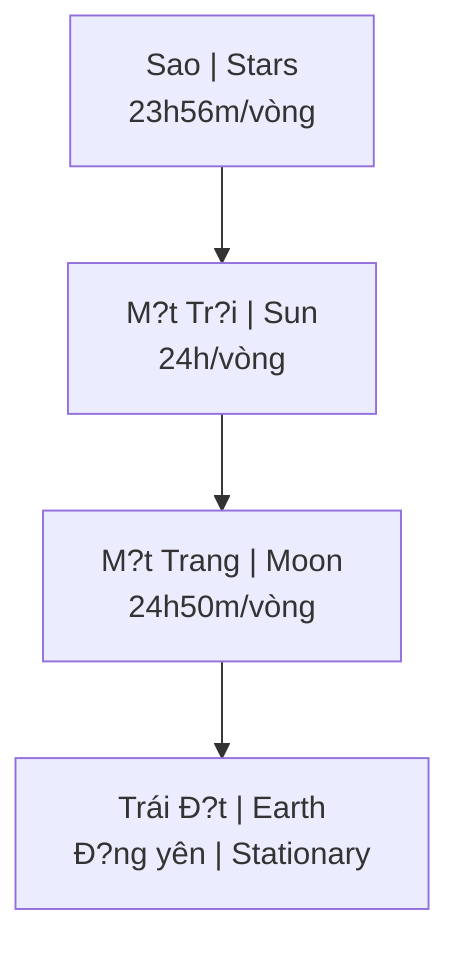

# Mô Hình Ð?a Tâm (Geocentrism)

**Mô hình Ð?a Tâm** kh?ng d?nh Trái Ð?t d?ng yên t?i trung tâm vu tr?, M?t Tr?i, M?t Trang và các vì sao quay quanh nó. Ðây là mô hình vu tr? c?a h?u h?t các n?n van minh c? d?i và v?n du?c m?t s? nhóm [[Khoa H?c Xét L?i|Khoa H?c Xét L?i]] ?ng h?.

*The Geocentric model asserts that Earth stands still at the center of the universe, with the Sun, Moon, and stars revolving around it. This was the cosmological model of most ancient civilizations and is still supported by some [[Khoa H?c Xét L?i|Revisionist Science]] groups.*

---

## Mô Hình Co B?n / Basic Model

> **Trái Ð?t ? trung tâm, m?i th? quay quanh nó.**
>
> *Earth at the center, everything revolves around it.*

### Các chu k? quay / Orbital Periods

| Thiên th? / Body | Chu k? / Period | Ý nghia / Meaning |
|------------------|-----------------|-------------------|
| **M?t Tr?i / Sun** | 24 gi? / 24 hours | Ngày/dêm / Day/night |
| **M?t Trang / Moon** | 24h50p / 24h50m | Th?y tri?u / Tides |
| **Sao / Stars** | 23h56p / 23h56m | Ngày sao / Sidereal day |

**S? chênh l?ch** gi?a các chu k? t?o ra l?ch pháp và n?n t?ng chiêm tinh h?c.

*The difference between these periods creates calendars and the foundation of astrology.*

---

## So Sánh Các Mô Hình / Model Comparison

| Ð?c di?m / Feature | Ð?a Tâm / Geocentric | Nh?t Tâm / Heliocentric |
|--------------------|----------------------|-------------------------|
| **Trung tâm / Center** | Trái Ð?t / Earth | M?t Tr?i / Sun |
| **Trái Ð?t / Earth** | Ð?ng yên / Stationary | Quay + Xoay / Spins + Orbits |
| **Ngu?n g?c / Origin** | C? d?i / Ancient | Copernicus (1543) |
| **Tr?ng thái / Status** | "B? bác b?" / "Debunked" | Khoa h?c chính th?ng / Mainstream |
| **Hàm ý / Implication** | Trái Ð?t d?c bi?t / Earth is special | Trái Ð?t bình thu?ng / Earth is ordinary |

---

## Gi?i Thích Các Hi?n Tu?ng / Explaining Phenomena

### Nh?t th?c/Nguy?t th?c / Eclipses

| Mô hình / Model | Gi?i thích / Explanation |
|-----------------|--------------------------|
| **Nh?t tâm** | Trái Ð?t/M?t Trang che ánh sáng |
| **Ð?a tâm** | Chu k? Saros (18 nam 11 ngày) - tuong tác M?t Tr?i & M?t Trang |

*Heliocentric: Earth/Moon blocking light. Geocentric: Saros cycle - Sun & Moon interaction.*

### Mùa và Chí tuy?n / Seasons and Tropics

| Mô hình / Model | Gi?i thích / Explanation |
|-----------------|--------------------------|
| **Nh?t tâm** | Trái Ð?t nghiêng 23.5° |
| **Ð?a tâm** | M?t Tr?i di chuy?n gi?a các chí tuy?n (spiral path) |

### V? tinh / Satellites

Theo mô hình Ð?a tâm:

*According to geocentric model:*

| Tuyên b? / Claim | Gi?i thích thay th? / Alternative Explanation |
|------------------|---------------------------------------------|
| V? tinh qu? d?o | Không có th?t / Don't exist |
| GPS | Ground-based triangulation |
| ?nh v? tinh | Khinh khí c?u t?m cao, CGI / High-altitude balloons, CGI |
| ISS | Quay trong studio / Filmed in studio |

---

## L?ch S? / History

### Th? gi?i quan c? d?i / Ancient Worldview

| N?n van minh / Civilization | Th?i k? / Period |
|-----------------------------|------------------|
| Babylon | ~2000 BCE |
| Ai C?p / Egypt | ~1500 BCE |
| Hy L?p / Greece | Aristotle, Ptolemy |
| Trung Qu?c / China | Hàn D?ch / Han Dynasty |
| ?n Ð? / India | Vedic cosmology |

**Ptolemy's Almagest (150 CE)** - H? th?ng hóa mô hình Ð?a tâm, th?ng tr? 1,500+ nam.

*Systematized geocentric model, dominated for 1,500+ years.*

### Cu?c cách m?ng Copernicus / Copernican Revolution

| Nam / Year | Nhân v?t / Figure | Ðóng góp / Contribution |
|------------|-------------------|------------------------|
| 1543 | Copernicus | Mô hình Nh?t tâm / Heliocentric model |
| 1610 | Galileo | Kính thiên van / Telescope observations |
| 1609-1619 | Kepler | Qu? d?o ellipse / Elliptical orbits |
| 1687 | Newton | Toán h?c tr?ng l?c / Gravity mathematics |

### Ph?c hung hi?n d?i / Modern Revival

- C?ng d?ng nghiên c?u Internet / Internet research communities
- Liên quan Flat Earth / Flat Earth adjacent
- Biblical literalism
- Tinh th?n ch?ng establishment / Anti-establishment sentiment

---

## Lu?n Ði?m ?ng H? / Arguments For Geocentrism

### 1. Quan sát kh?p th?c t? / Observation Matches

| Quan sát / Observation | Ý nghia / Meaning |
|------------------------|-------------------|
| Chúng ta th?y M?t Tr?i di chuy?n | We see Sun move |
| Không c?m nh?n Trái Ð?t quay | Don't feel Earth move |
| Sao quay quanh Polaris | Stars rotate around Polaris |
| Không phát hi?n chuy?n d?ng Trái Ð?t | No detectable Earth motion |

### 2. Thí nghi?m "th?t b?i" / "Failed" Experiments

| Thí nghi?m / Experiment | K?t qu? / Result | Ý nghia Ð?a tâm / Geocentric Meaning |
|-------------------------|------------------|--------------------------------------|
| **Michelson-Morley** (1887) | Không tìm th?y aether wind | Trái Ð?t không di chuy?n? |
| **Airy's Failure** (1871) | Không tìm th?y stellar aberration expected | Sao quay, không ph?i Trái Ð?t? |
| **Sagnac Effect** (1913) | Phát hi?n rotation | Rotation c?a... cái gì? |

### 3. Tri?t h?c / Philosophical

| Quan di?m / View | Hàm ý / Implication |
|------------------|---------------------|
| Trái Ð?t d?c bi?t | Earth is special, not "pale blue dot" |
| Vu tr? l?y con ngu?i làm trung tâm | Human-centric universe |
| Trí tu? c? d?i > khoa h?c hi?n d?i | Ancient wisdom > modern science |

---

## Lu?n Ði?m Ph?n Bác / Arguments Against Geocentrism

### 1. Chuy?n d?ng ngh?ch hành / Retrograde Motion

| V?n d? / Issue | Gi?i thích / Explanation |
|----------------|--------------------------|
| Các hành tinh dôi khi di chuy?n ngu?c | Planets sometimes move backward |
| Ð?a tâm c?n epicycles ph?c t?p | Geocentrism needs complex epicycles |
| Nh?t tâm gi?i thích don gi?n | Heliocentrism explains simply |

### 2. Th? sai sao / Stellar Parallax

Phát hi?n v?i d?ng c? chính xác - các sao cho th?y s? d?ch chuy?n hàng nam.

*Detected with precise instruments - stars show annual shift.*

### 3. ?ng d?ng th?c t? / Practical Applications

Các nhi?m v? không gian ho?t d?ng v?i mô hình nh?t tâm, d? doán chính xác.

*Space missions work with heliocentric model, predictions accurate.*

---

## T?i Sao Quan Tr?ng? / Why Does It Matter?

### N?u Ð?a Tâm dúng / If Geocentrism True

| H? qu? / Consequence | Chi ti?t / Detail |
|----------------------|-------------------|
| Chuong trình không gian = nói d?i | Space program = lie |
| Ngân sách NASA $50B+ = l?a d?o | NASA budget = fraud |
| Trái Ð?t d?c bi?t, không ng?u nhiên | Earth is special, not random |
| Hàm ý th?n h?c, ý nghia | Theological implications, meaning |

### N?u Nh?t Tâm dúng / If Heliocentrism True

| H? qu? / Consequence | Chi ti?t / Detail |
|----------------------|-------------------|
| Chúng ta không quan tr?ng | We're insignificant |
| Không có v? trí d?c bi?t | No special place |
| Ti?n hóa ng?u nhiên | Random evolution |
| Nihilism có lý | Nihilism justified |

> **Ðây là cu?c chi?n v? th? gi?i quan.**
>
> *The stakes are worldview itself.*

---

## K?t Lu?n / Conclusion

> Dù b?n tin mô hình nào, câu h?i quan tr?ng là: **B?n dã t? ki?m ch?ng, hay ch? tin vì du?c d?y?**
>
> *Regardless of which model you believe, the important question is: **Have you verified it yourself, or do you just believe because you were taught?***

Mô hình Ð?a tâm nh?c nh? chúng ta r?ng "khoa h?c" cung có th? thay d?i - di?u "dúng" hôm nay có th? "sai" ngày mai, và ngu?c l?i.

*The Geocentric model reminds us that "science" can also change - what's "right" today may be "wrong" tomorrow, and vice versa.*

---

## Related / Liên quan

### Vu tr? h?c / Cosmology
- [[Thuy?t Trái Ð?t Ph?ng]] - Flat Earth Theory
- [[Núi Tu Di]] - Buddhist/Hindu cosmology
- [[Vu Tr? H?c Ph?t Giáo]] - Buddhist cosmology
- [[C? Máy Antikythera và Minh Ch?ng Ð?a Tâm]] - Ancient evidence

### Khoa h?c & Tri?t h?c / Science & Philosophy
- [[Khoa H?c Xét L?i]] - Questioning mainstream
- [[Khoa H?c Chân Chính và Thu?ng Ð?]] - Science and God
- [[Chu K? Hoàng Ð?o]] - Zodiac cycles

### Ma Tr?n & Ý nghia / Matrix & Meaning
- [[Ma Tr?n]] - Control system
- [[S? Nh?t Th?]] - Oneness
- [[Gi?i Mã Vu Tr? - Y T? - Tâm Linh]] - Decoding universe
