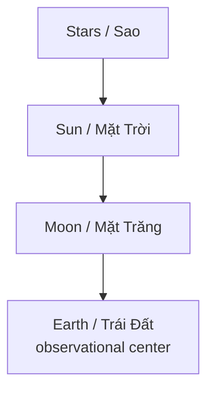

# Mô Hình Địa Tâm (Geocentrism)

**Mô Hình Địa Tâm đặt Trái Đất ở trung tâm quan sát của vũ trụ. Nhưng giá trị lớn nhất của bài này không phải bắt người đọc “tin Địa Tâm”, mà là dùng Địa Tâm như một epistemic stress test: làm sao ta biết mô hình vũ trụ mình tin là do tự kiểm chứng, chứ không chỉ do institution truyền xuống?**

*The geocentric model places Earth at the observational center of the cosmos. But the real value here is not forcing belief in geocentrism; it is using geocentrism as an epistemic stress test: how do we know our cosmological model comes from verification rather than institutional inheritance?*

---

## Evidence Discipline / Cách Đọc Claim

| Tầng | Cách đọc | Ví dụ |
|---|---|---|
| **Fact / history** | Địa Tâm từng là model thống trị nhiều nền văn minh | Ptolemy, ancient cosmologies |
| **Observation / method** | người thường trực tiếp thấy gì từ mặt đất? | sky rotation, sun path, seasons |
| **Institution critique** | authority nào dạy model hiện tại? | school, NASA, textbooks |
| **Speculative model** | Earth stationary / firmament / alternative mechanics | đọc như hypothesis cần kiểm |

---

## 1. Địa Tâm Là Gì?

Ở dạng đơn giản, Địa Tâm nói rằng Trái Đất đứng yên tại trung tâm, còn Mặt Trời, Mặt Trăng và bầu trời quay quanh.

Điều này từng là worldview chính của nhiều nền văn minh cổ, không phải vì họ “ngu”, mà vì nó khớp với observation trực tiếp: đứng trên đất thấy trời chuyển động.

---

## 2. Địa Tâm Như Mental Model

Ngay cả nếu không chọn Địa Tâm literal, nó vẫn có giá trị như mental model.

Nó hỏi:

- mình đã tự kiểm chứng chuyển động Trái Đất chưa?
- mình tin vì evidence hay vì authority?
- model nào giải thích observation nào?
- assumption nào được giấu trong math?
- tại sao cosmology lại quan trọng với psychology?

Một model vũ trụ không chỉ là physics. Nó định nghĩa vị trí của con người trong reality.

---

## 3. Heliocentrism Và Tâm Lý “Hạt Bụi”

Mô hình hiện đại đặt con người trên một quả cầu nhỏ bay trong vũ trụ vô tận, lạnh, ngẫu nhiên.

Điều đó có tác động tâm lý:

- con người nhỏ bé,
- Trái Đất bình thường,
- sky không thiêng,
- cosmos là void vô nghĩa,
- spiritual center bị thay bằng physical insignificance.

Không có nghĩa heliocentrism sai chỉ vì effect này. Nhưng effect này đáng đọc trong [[Ma Trận]]: worldview có thể làm con người quên giá trị metaphysical của mình.

---

## 4. Ancient Cosmology Không Phải Primitive

Các nền văn minh cổ theo dõi bầu trời rất tinh vi:

- eclipse cycles,
- solstice/equinox,
- calendars,
- temple alignment,
- astrology,
- navigation,
- agricultural timing.

[[Cỗ Máy Antikythera và Minh Chứng Địa Tâm]] nhắc rằng cổ nhân không đơn giản là “chưa biết khoa học”. Họ có một science khác, gắn observation với meaning.

---

## 5. Địa Tâm, Flat Earth Và Confusion

Địa Tâm không đồng nghĩa bắt buộc với [[Thuyết Trái Đất Phẳng]]. Có nhiều dạng geocentrism:

| Model | Claim |
|---|---|
| Classical geocentrism | Earth centered, spherical Earth possible |
| Tychonic model | Earth stationary, Sun orbits Earth, planets orbit Sun |
| Flat Earth models | Earth plane, dome/firmament, local sun/moon |
| Esoteric cosmology | Earth as metaphysical center, not only physical claim |

Cần tách model để tránh tranh luận lẫn lộn.

---

## 6. Tại Sao Institution Phản Ứng Mạnh?

Cosmology là foundation myth. Nếu public nghi ngờ cosmology, họ sẽ nghi ngờ NASA, textbooks, science priesthood, education và authority chain.

Đây là lý do các chủ đề như Địa Tâm/Flat Earth thường bị ridicule thay vì debate kỹ. Có thể vì chúng sai. Nhưng cũng có thể vì chúng chạm vào epistemic authority.

Câu hỏi redpill:

> Vì sao một câu hỏi được xem là ngu đến mức không cần trả lời, nhưng lại nguy hiểm đến mức phải kiểm duyệt/ridicule liên tục?

---

## 7. Cách Tiếp Cận Trưởng Thành

Đừng biến Địa Tâm thành identity.

Hãy dùng nó như practice:

1. Tách observation khỏi interpretation.
2. Tách math model khỏi physical reality.
3. Đọc cả mainstream lẫn alternative.
4. Không dùng ridicule làm bằng chứng.
5. Không dùng distrust làm bằng chứng.
6. Rank confidence.

---

## Synthesis

Mô Hình Địa Tâm là một bài test về quyền được hỏi. Nó buộc người đọc nhìn lại tầng sâu nhất của knowledge: cái gì mình biết trực tiếp, cái gì mình suy ra, và cái gì mình tin vì đã được dạy.

Có thể cuối cùng bạn vẫn chọn heliocentrism. Nhưng nếu quá trình đó làm bạn tỉnh hơn về authority, thì Địa Tâm đã hoàn thành vai trò.

> Địa Tâm không chỉ hỏi Trái Đất có đứng yên không. Nó hỏi tâm trí bạn có đang đứng yên trước authority không.

---

## Related

- [[Khoa Học Xét Lại]]
- [[Thuyết Trái Đất Phẳng]]
- [[Chu Kỳ Hoàng Đạo]]
- [[Cỗ Máy Antikythera và Minh Chứng Địa Tâm]]
- [[MOC - Science Revisionism]]
