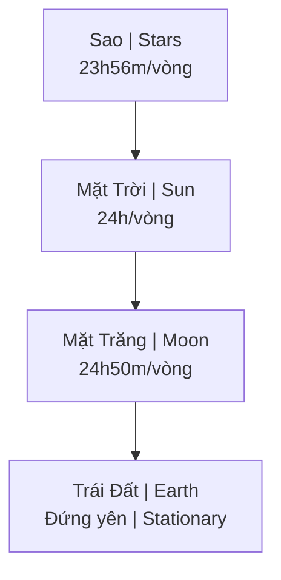

---
title: "Mô Hình Địa Tâm (Geocentrism)"
aliases: ["Geocentrism", "Địa Tâm", "Geocentric Model"]
date: 2026-04-08
tags: [mental-model, esoterica, cosmology]
status: refined
---

# Mô Hình Địa Tâm (Geocentrism)

**Mô hình Địa Tâm** khẳng định Trái Đất đứng yên tại trung tâm vũ trụ, Mặt Trời, Mặt Trăng và các vì sao quay quanh nó. Đây là mô hình vũ trụ của hầu hết các nền văn minh cổ đại và vẫn được một số nhóm [[Khoa Học Xét Lại|Khoa Học Xét Lại]] ủng hộ.

*The Geocentric model asserts that Earth stands still at the center of the universe, with the Sun, Moon, and stars revolving around it. This was the cosmological model of most ancient civilizations and is still supported by some [[Khoa Học Xét Lại|Revisionist Science]] groups.*

---

## Mô Hình Cơ Bản / Basic Model

> **Trái Đất ở trung tâm, mọi thứ quay quanh nó.**
>
> *Earth at the center, everything revolves around it.*

### Các chu kỳ quay / Orbital Periods

| Thiên thể / Body | Chu kỳ / Period | Ý nghĩa / Meaning |
|------------------|-----------------|-------------------|
| **Mặt Trời / Sun** | 24 giờ / 24 hours | Ngày/đêm / Day/night |
| **Mặt Trăng / Moon** | 24h50p / 24h50m | Thủy triều / Tides |
| **Sao / Stars** | 23h56p / 23h56m | Ngày sao / Sidereal day |

**Sự chênh lệch** giữa các chu kỳ tạo ra lịch pháp và nền tảng chiêm tinh học.

*The difference between these periods creates calendars and the foundation of astrology.*

---

## So Sánh Các Mô Hình / Model Comparison

| Đặc điểm / Feature | Địa Tâm / Geocentric | Nhật Tâm / Heliocentric |
|--------------------|----------------------|-------------------------|
| **Trung tâm / Center** | Trái Đất / Earth | Mặt Trời / Sun |
| **Trái Đất / Earth** | Đứng yên / Stationary | Quay + Xoay / Spins + Orbits |
| **Nguồn gốc / Origin** | Cổ đại / Ancient | Copernicus (1543) |
| **Trạng thái / Status** | "Bị bác bỏ" / "Debunked" | Khoa học chính thống / Mainstream |
| **Hàm ý / Implication** | Trái Đất đặc biệt / Earth is special | Trái Đất bình thường / Earth is ordinary |

---

## Giải Thích Các Hiện Tượng / Explaining Phenomena

### Nhật thực/Nguyệt thực / Eclipses

| Mô hình / Model | Giải thích / Explanation |
|-----------------|--------------------------|
| **Nhật tâm** | Trái Đất/Mặt Trăng che ánh sáng |
| **Địa tâm** | Chu kỳ Saros (18 năm 11 ngày) — tương tác Mặt Trời & Mặt Trăng |

*Heliocentric: Earth/Moon blocking light. Geocentric: Saros cycle — Sun & Moon interaction.*

### Mùa và Chí tuyến / Seasons and Tropics

| Mô hình / Model | Giải thích / Explanation |
|-----------------|--------------------------|
| **Nhật tâm** | Trái Đất nghiêng 23.5° |
| **Địa tâm** | Mặt Trời di chuyển giữa các chí tuyến (spiral path) |

### Vệ tinh / Satellites

Theo mô hình Địa tâm:

*According to geocentric model:*

| Tuyên bố / Claim | Giải thích thay thế / Alternative Explanation |
|------------------|---------------------------------------------|
| Vệ tinh quỹ đạo | Không có thật / Don't exist |
| GPS | Ground-based triangulation |
| Ảnh vệ tinh | Khinh khí cầu tầm cao, CGI / High-altitude balloons, CGI |
| ISS | Quay trong studio / Filmed in studio |

---

## Lịch Sử / History

### Thế giới quan cổ đại / Ancient Worldview

| Nền văn minh / Civilization | Thời kỳ / Period |
|-----------------------------|------------------|
| Babylon | ~2000 BCE |
| Ai Cập / Egypt | ~1500 BCE |
| Hy Lạp / Greece | Aristotle, Ptolemy |
| Trung Quốc / China | Hàn Dịch / Han Dynasty |
| Ấn Độ / India | Vedic cosmology |

**Ptolemy's Almagest (150 CE)** — Hệ thống hóa mô hình Địa tâm, thống trị 1,500+ năm.

*Systematized geocentric model, dominated for 1,500+ years.*

### Cuộc cách mạng Copernicus / Copernican Revolution

| Năm / Year | Nhân vật / Figure | Đóng góp / Contribution |
|------------|-------------------|------------------------|
| 1543 | Copernicus | Mô hình Nhật tâm / Heliocentric model |
| 1610 | Galileo | Kính thiên văn / Telescope observations |
| 1609-1619 | Kepler | Quỹ đạo ellipse / Elliptical orbits |
| 1687 | Newton | Toán học trọng lực / Gravity mathematics |

### Phục hưng hiện đại / Modern Revival

- Cộng đồng nghiên cứu Internet / Internet research communities
- Liên quan Flat Earth / Flat Earth adjacent
- Biblical literalism
- Tinh thần chống establishment / Anti-establishment sentiment

---

## Luận Điểm Ủng Hộ / Arguments For Geocentrism

### 1. Quan sát khớp thực tế / Observation Matches

| Quan sát / Observation | Ý nghĩa / Meaning |
|------------------------|-------------------|
| Chúng ta thấy Mặt Trời di chuyển | We see Sun move |
| Không cảm nhận Trái Đất quay | Don't feel Earth move |
| Sao quay quanh Polaris | Stars rotate around Polaris |
| Không phát hiện chuyển động Trái Đất | No detectable Earth motion |

### 2. Thí nghiệm "thất bại" / "Failed" Experiments

| Thí nghiệm / Experiment | Kết quả / Result | Ý nghĩa Địa tâm / Geocentric Meaning |
|-------------------------|------------------|--------------------------------------|
| **Michelson-Morley** (1887) | Không tìm thấy aether wind | Trái Đất không di chuyển? |
| **Airy's Failure** (1871) | Không tìm thấy stellar aberration expected | Sao quay, không phải Trái Đất? |
| **Sagnac Effect** (1913) | Phát hiện rotation | Rotation của... cái gì? |

### 3. Triết học / Philosophical

| Quan điểm / View | Hàm ý / Implication |
|------------------|---------------------|
| Trái Đất đặc biệt | Earth is special, not "pale blue dot" |
| Vũ trụ lấy con người làm trung tâm | Human-centric universe |
| Trí tuệ cổ đại > khoa học hiện đại | Ancient wisdom > modern science |

---

## Luận Điểm Phản Bác / Arguments Against Geocentrism

### 1. Chuyển động nghịch hành / Retrograde Motion

| Vấn đề / Issue | Giải thích / Explanation |
|----------------|--------------------------|
| Các hành tinh đôi khi di chuyển ngược | Planets sometimes move backward |
| Địa tâm cần epicycles phức tạp | Geocentrism needs complex epicycles |
| Nhật tâm giải thích đơn giản | Heliocentrism explains simply |

### 2. Thị sai sao / Stellar Parallax

Phát hiện với dụng cụ chính xác — các sao cho thấy sự dịch chuyển hàng năm.

*Detected with precise instruments — stars show annual shift.*

### 3. Ứng dụng thực tế / Practical Applications

Các nhiệm vụ không gian hoạt động với mô hình nhật tâm, dự đoán chính xác.

*Space missions work with heliocentric model, predictions accurate.*

---

## Tại Sao Quan Trọng? / Why Does It Matter?

### Nếu Địa Tâm đúng / If Geocentrism True

| Hệ quả / Consequence | Chi tiết / Detail |
|----------------------|-------------------|
| Chương trình không gian = nói dối | Space program = lie |
| Ngân sách NASA $50B+ = lừa đảo | NASA budget = fraud |
| Trái Đất đặc biệt, không ngẫu nhiên | Earth is special, not random |
| Hàm ý thần học, ý nghĩa | Theological implications, meaning |

### Nếu Nhật Tâm đúng / If Heliocentrism True

| Hệ quả / Consequence | Chi tiết / Detail |
|----------------------|-------------------|
| Chúng ta không quan trọng | We're insignificant |
| Không có vị trí đặc biệt | No special place |
| Tiến hóa ngẫu nhiên | Random evolution |
| Nihilism có lý | Nihilism justified |

> **Đây là cuộc chiến về thế giới quan.**
>
> *The stakes are worldview itself.*

---

## Kết Luận / Conclusion

> Dù bạn tin mô hình nào, câu hỏi quan trọng là: **Bạn đã tự kiểm chứng, hay chỉ tin vì được dạy?**
>
> *Regardless of which model you believe, the important question is: **Have you verified it yourself, or do you just believe because you were taught?***

Mô hình Địa tâm nhắc nhở chúng ta rằng "khoa học" cũng có thể thay đổi — điều "đúng" hôm nay có thể "sai" ngày mai, và ngược lại.

*The Geocentric model reminds us that "science" can also change — what's "right" today may be "wrong" tomorrow, and vice versa.*

---

## Related / Liên quan

### Vũ trụ học / Cosmology
- [[Thuyết Trái Đất Phẳng]] — Flat Earth Theory
- [[Núi Tu Di]] — Buddhist/Hindu cosmology
- [[Vũ Trụ Học Phật Giáo]] — Buddhist cosmology
- [[Cỗ Máy Antikythera và Minh Chứng Địa Tâm]] — Ancient evidence

### Khoa học & Triết học / Science & Philosophy
- [[Khoa Học Xét Lại]] — Questioning mainstream
- [[Khoa Học Chân Chính và Thượng Đế]] — Science and God
- [[Chu Kỳ Hoàng Đạo]] — Zodiac cycles

### Ma Trận & Ý nghĩa / Matrix & Meaning
- [[Ma Trận]] — Control system
- [[Sự Nhất Thể]] — Oneness
- [[Giải Mã Vũ Trụ - Y Tế - Tâm Linh]] — Decoding universe
