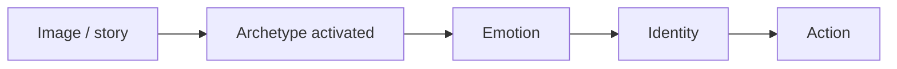

# Nguyên Mẫu (Archetypes)

**Nguyên mẫu là pattern sống trong chiều sâu psyche: hình ảnh, vai trò, năng lượng và câu chuyện lặp lại qua nhiều cá nhân, văn hóa và thời đại.** Chúng không chỉ là "nhân vật trong thần thoại". Chúng là phần mềm biểu tượng khiến con người nhận ra King, Mother, Trickster, Hero, Shadow trước khi cần định nghĩa.

*Archetypes are symbolic patterns in the deep psyche: recurring images, roles, energies, and stories that organize human experience.*

---

## Vault Position / Vị Trí Trong Vault

Node này là cầu giữa [[Tâm Lý Học Jung]], [[Vô Thức Tập Thể]] và [[Individuation]]. Nó cũng giúp đọc các bài esoterica như [[Biểu Tượng Baphomet]], [[Saturn Cube]] hay [[Hollywood - Cây Đũa Phép Của Phù Thủy]]: truyền thông không chỉ truyền thông tin, nó kích hoạt nguyên mẫu.

Nếu không hiểu archetype, người đọc dễ bị kẹt ở hai cực: hoặc xem myth là chuyện trẻ con, hoặc tin mọi biểu tượng như bằng chứng occult literal. Cả hai đều nông.

---

## Evidence Discipline / Cách Đọc

| Tầng claim | Cách đọc |
|---|---|
| Psychological | archetype là khái niệm Jung để mô tả pattern tâm lý phổ quát và khuynh hướng tạo hình ảnh |
| Cultural | thần thoại, truyện cổ, tôn giáo, cinema lặp lại motif vì chúng chạm tầng sâu |
| Symbolic | King, Mother, Shadow, Trickster là năng lượng và cấu trúc, không chỉ nhân vật |
| Speculative synthesis | archetype như cấu trúc của collective field/Akasha là tầng metaphysical |

Kỷ luật: archetype không phải proof rằng mọi nền văn hóa có cùng một nguồn bí mật. Nó là dấu hiệu rằng psyche con người có các hình thái lặp lại, và quyền lực biết cách dùng chúng.

---

## Archetype Khác Gì Stereotype?

Stereotype làm người khác phẳng đi. Archetype làm pattern sâu hiện lên.

Khi nói "Warrior", không phải mọi người đàn ông phải hung hăng. Warrior là năng lượng boundary, hành động, bảo vệ, discipline. Khi nói "Lover", không phải chỉ romance; đó là khả năng cảm, kết nối, sống động, devotion. Khi nói "Mother", không phải mọi phụ nữ phải làm mẹ; đó là trường nuôi dưỡng, chứa đựng và bảo vệ sự sống.

| Stereotype | Archetype |
|---|---|
| nhãn dán xã hội | pattern tâm lý sâu |
| làm người khác nhỏ lại | làm cấu trúc hiện lên |
| cố định identity | mở ra năng lượng cần tích hợp |
| phục vụ kiểm soát | phục vụ tự hiểu |

Đọc archetype đúng giúp người ta tự do hơn. Đọc sai sẽ thành nhãn dán mới cho ego.

---

## Bốn Trục Jung Nền Tảng

Jung thường được đọc qua bốn cấu trúc lớn: Persona, Shadow, Anima/Animus và Self. Đây không phải danh sách cosplay tâm linh; đây là bản đồ của một đời sống nội tâm trưởng thành.

| Nguyên mẫu | Vai trò | Shadow nếu lệch |
|---|---|---|
| Persona | mặt nạ xã hội giúp ta vận hành với đời | đồng nhất với vai diễn |
| Shadow | phần bị chối bỏ, chứa cả độc tính lẫn sinh lực | projection, sabotage, rage |
| Anima/Animus | đối cực tính nam/tính nữ bên trong psyche | ám ảnh romantic, ideal hóa, contempt |
| Self | trung tâm toàn vẹn vượt ego | spiritual inflation nếu ego tự nhận là Self |

Persona không xấu; không có persona ta khó sống xã hội. Shadow không chỉ xấu; trong đó có bản năng, sáng tạo, libido, truth bị đè. Self không phải ego đẹp hơn; nó là trục sâu hơn mà ego phải học quy phục.

---

## King, Warrior, Magician, Lover

Mô hình King-Warrior-Magician-Lover hữu ích vì nó cho thấy sự trưởng thành cần nhiều năng lượng cùng lúc. Một người chỉ có Warrior sẽ cứng và phá. Chỉ có Lover sẽ tan và nghiện cảm xúc. Chỉ có Magician sẽ thao túng từ sau màn. Chỉ có King sẽ thành tyrant hoặc empty throne.

| Archetype | Năng lượng chín | Khi lệch |
|---|---|---|
| King | trật tự, blessing, trách nhiệm, trung tâm | tyrant, abdicator |
| Warrior | boundary, courage, execution, sacrifice | sadist, coward |
| Magician | knowledge, transformation, hidden structure | manipulator, detached observer |
| Lover | aliveness, beauty, intimacy, devotion | addict, chaos, sentimentality |

Công việc không phải chọn một role để biểu diễn. Công việc là tích hợp đủ để archetype phục vụ Self, không cướp tay lái.

---

## Archetype Và Ma Trận Truyền Thông

Hollywood, chính trị, quảng cáo và social media đều làm việc với archetype. Một campaign thành công không chỉ đưa thông điệp; nó gắn sản phẩm hoặc agenda vào Hero, Rebel, Mother, Savior, Victim, Monster hoặc Apocalypse.

Đây là lý do [[Hollywood - Cây Đũa Phép Của Phù Thủy]] quan trọng. Media programming hoạt động vì psyche phản ứng với story trước khi phản ứng với dữ kiện. Người ta không mua đồ uống; họ mua youth. Không vote cho policy; họ vote cho Savior hoặc Father. Không ghét một nhóm người vì spreadsheet; họ ghét Monster mà truyền thông dựng lên.

Ai không biết ngôn ngữ này sẽ tưởng mình đang "tự chọn", trong khi đang chạy script.

---

## Individuation: Không Bị Nguyên Mẫu Possess

Một người chưa tỉnh thường bị archetype "nhập" mà tưởng đó là mình. Họ không dùng Warrior; họ bị Warrior dùng. Họ không cảm Lover; họ nghiện Lover. Họ không đeo Persona; họ đồng nhất với Persona. Họ không tích hợp Shadow; họ chiếu nó lên người khác rồi gọi đó là đạo đức.

[[Individuation]] là quá trình nhận ra các pattern này, tích hợp shadow và để Self điều phối thay vì để từng archetype cướp tay lái. Đây là lý do archetype không phải trò giải trí. Nó là bản đồ giải phóng khỏi bị điều khiển bởi những câu chuyện vô thức.

---

## Archetype Trong Tình Dục Và Quan Hệ

[[S.E.X Và Tâm Lý Học Jung]] cho thấy tình dục không chỉ là sinh học. Nó kích hoạt Lover, Shadow, Mother/Father complex, Anima/Animus projection và cả nhu cầu hợp nhất. Người ta thường tưởng mình yêu một người, nhưng nhiều khi đang yêu một hình ảnh nội tâm được chiếu lên người đó.

Khi projection rơi xuống, relationship mới bắt đầu thật. Trước đó, hai người thường chỉ đang nói chuyện với thần tượng và bóng ma của chính mình.

---

## Chốt Lại / Core Insight

**Nguyên mẫu là ngôn ngữ sâu của psyche. Ai không biết ngôn ngữ này sẽ bị story của người khác điều khiển; ai biết đọc nó có thể bắt đầu lấy lại quyền viết myth của đời mình.**

*Archetypes are the deep grammar of psyche. Learn the grammar, or someone else will write your myth for you.*
