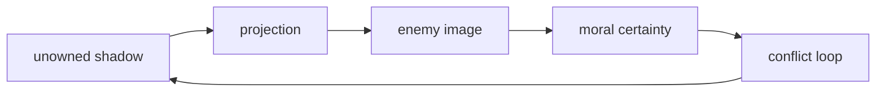

# Nhị Nguyên (Duality)

**Nhị nguyên là cơ chế Một tự phân cực thành hai để tạo trải nghiệm: sáng/tối, nam/nữ, âm/dương, đúng/sai, ta/địch.** Nó không xấu; nó là grammar của cõi vật chất. Cái bẫy bắt đầu khi con người quên field lớn hơn và để hai cực dựng thành nhà tù nhận thức.

*Duality is the One polarizing into two so experience can exist. The trap begins when the poles become a prison.*

---

## Vault Position / Vị Trí Trong Vault

Nếu [[Sự Nhất Thể]] là nền Một và [[Monad]] là tia Một trong mỗi sinh thể, thì nhị nguyên là màn hình chia Một thành hai để linh hồn học qua tương phản. Trong [[Ma Trận]], cùng cơ chế này bị weaponize thành polarization: left/right, nam/nữ, science/spirituality, chính thống/âm mưu, tin/chống.

Đọc bài này trước [[Chia Tách Bởi Nhị Nguyên]] và cùng với [[Tâm bất Biến]].

---

## Claim Discipline / Kỷ Luật Đọc

| Tầng | Cách đọc |
|---|---|
| Fact | media và politics thường dùng binary framing để ép chọn phe |
| Pattern | false dichotomy làm người đọc quên option thứ ba |
| Psychology | shadow bị phóng chiếu sang "phe kia" |
| Metaphysics | duality là lớp phân cực của reality, không phải reality tối hậu |

---

## Âm Dương Không Phải Good vs Evil

Âm dương là cân bằng động. Âm chứa mầm dương, dương chứa mầm âm. Cực thịnh thì chuyển hóa. Đây là nhị nguyên trưởng thành.

Good vs evil kiểu nhị nguyên cứng lại khác: một bên tuyệt đối sạch, bên kia tuyệt đối bẩn. Khi xã hội bị đẩy vào mô hình này, đối thoại chết và nghi lễ săn phù thủy bắt đầu.

| Nhị nguyên trưởng thành | Nhị nguyên bị weaponize |
|---|---|
| hai cực bổ sung | hai phe phải tiêu diệt nhau |
| có chuyển hóa | đóng băng identity |
| thấy mầm của cực kia | projection toàn bộ shadow |
| hướng về balance | hướng về thắng-thua |

---

## False Dichotomy / Lưỡng Nan Giả

Ma trận thích đưa ra hai cửa đã được chuẩn bị sẵn. Bạn tưởng mình chọn tự do, nhưng cả hai cửa đều nằm trong hành lang của hệ thống.

| Câu hỏi bị đóng khung | Câu hỏi thật |
|---|---|
| ủng hộ chiến tranh hay ủng hộ kẻ thù? | ai hưởng lợi từ chiến tranh? |
| tin science hay chống science? | science nào, method nào, institution nào? |
| nam đúng hay nữ đúng? | pattern quan hệ nào đang làm cả hai tổn thương? |
| an toàn hay tự do? | ai định nghĩa an toàn và giữ quyền tắt tự do? |
| left hay right? | điều gì cả hai phe không được phép hỏi? |

---

## Shadow Projection

Theo [[Tâm Lý Học Jung]], thứ mình không chịu thấy trong bản thân thường bị phóng chiếu ra ngoài. Nhị nguyên xã hội sống bằng cơ chế này: mỗi phe nhìn phe kia như hiện thân của toàn bộ bóng tối.

Thoát nhị nguyên không phải "hai bên đều như nhau" một cách lười biếng. Thoát nhị nguyên là nhìn đúng/sai cụ thể mà không để identity bị phe nuốt.

---

## Triadic Thinking / Tư Duy Tam Nguyên

Khi bị ép A vs B, hãy tìm C:

1. Cấp độ cao hơn của vấn đề là gì?
2. Cả hai phe đang giả định điều gì giống nhau?
3. Ai thiết kế câu hỏi?
4. Điều gì bị loại khỏi khung tranh luận?
5. Có synthesis nào giữ phần đúng của cả hai mà bỏ phần độc không?

Tư duy tam nguyên không né conflict. Nó từ chối conflict giả.

---

## Tâm Bất Biến

[[Tâm bất Biến]] là kỹ năng đứng giữa hai cực mà không bị xé đôi. Không phải trung lập đạo đức, mà là không phản ứng từ lập trình. Một người có tâm bất biến có thể chọn hành động rất rõ, nhưng không cần ghét để có năng lượng hành động.

> Khi bạn cần thù hận để biết mình đúng, nhị nguyên đang lái bạn.

---

## Core Insight / Chốt Lại

**Nhị nguyên là công cụ học bài khi ta nhớ Nhất Thể. Nó là nhà tù khi ta quên Nhất Thể và biến một cực thành bản sắc, cực kia thành quỷ.**

*Duality teaches when held inside unity. It imprisons when one pole becomes identity and the other becomes demon.*
