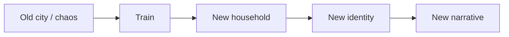
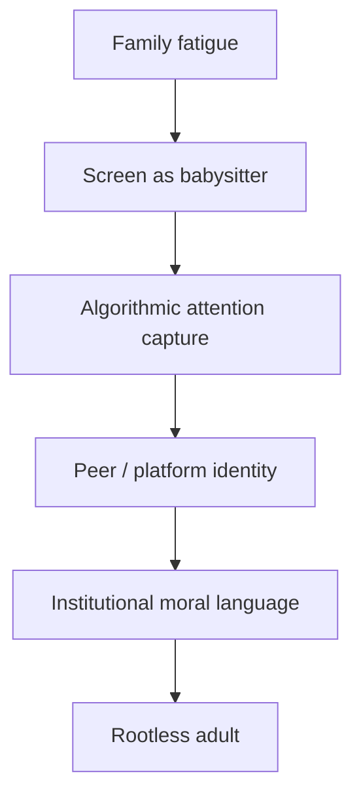
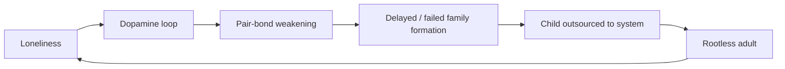
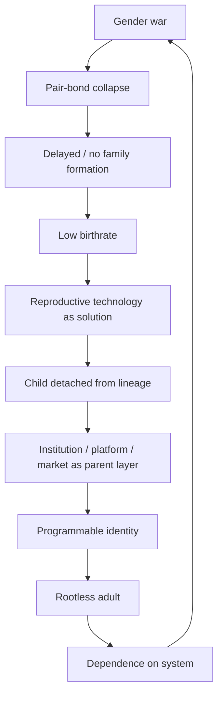

# Orphan Train 2.0 - Khi Ma Trận Chở Trẻ Em Ra Khỏi Dòng Máu

> Orphan Train cũ chở thân xác trẻ em rời khỏi thành phố. Orphan Train mới không cần đường ray. Nó chở phôi qua clinic, attention qua màn hình, identity qua curriculum, desire qua algorithm, và ký ức qua cloud.

Đứa trẻ vẫn có thể ngủ trong một căn nhà.

Vẫn có người lớn ký giấy tờ.

Vẫn có trường học, bảo hiểm, tài khoản iCloud, đồng hồ thông minh, lịch tiêm, lớp kỹ năng, camera trong phòng và app theo dõi giấc ngủ.

Nhưng câu hỏi thật không phải là: đứa trẻ có được quản lý không?

Câu hỏi là: đứa trẻ còn thuộc về một dòng máu, một ký ức, một vòng care, một nghĩa tình, hay đã trở thành công dân đầu tiên của một hệ thống không cần gia đình?

---

## Evidence Discipline / Cách Đọc Bài Này

Bài này có nhiều tầng. Không được trộn lẫn.

| Tầng | Cách đọc đúng |
|---|---|
| Fact / documentable | Orphan Train là hiện tượng lịch sử có thật ở Mỹ; IVF, surrogacy, embryo selection, artificial womb research, screen addiction và fertility collapse là các hiện tượng có thể nghiên cứu |
| Pattern / systems | Khi family formation suy yếu, trẻ em dễ bị chuyển từ lineage/care network sang institution/platform/market |
| Symbol / myth | Orphan Train là archetype của population sorting sau reset: trẻ em bị chở ra khỏi ký ức gốc để lớn lên trong narrative mới |
| Speculative synthesis | Nối Orphan Train với Tartaria/reset-history là giả thuyết vault, không phải kết luận khảo cổ hay hồ sơ pháp lý |

Không phải mọi IVF là agenda.

Không phải mọi gia đình đồng tính thiếu care.

Không phải mọi trường học, màn hình hay công nghệ sinh sản đều xấu.

Nhưng khi nhiều đường lực cùng hướng về một pattern:

- tách sex khỏi sinh sản,
- tách sinh sản khỏi cơ thể mẹ,
- tách trẻ khỏi lineage,
- tách ký ức khỏi gia đình,
- tách identity khỏi tradition,
- tách care khỏi nghĩa tình,

thì câu hỏi cần đặt ra là: **đích đến là gì?**

---

## 1. Orphan Train Cũ: Cơ Thể Trẻ Em Được Chuyển Tuyến

Orphan Train là tên gọi cho các chương trình đưa trẻ em nghèo, mồ côi hoặc bị bỏ rơi từ các thành phố miền Đông Hoa Kỳ đến các gia đình ở vùng Midwest và những khu vực khác trong giai đoạn cuối thế kỷ 19 đến đầu thế kỷ 20.

Tầng mainstream đọc nó như một nỗ lực social welfare sơ khai: cứu trẻ khỏi nghèo đói đô thị, tìm gia đình mới, giảm tội phạm đường phố, phân phối lao động và hy vọng.

Tầng vault không phủ nhận tầng đó. Nhưng nó hỏi thêm:

> Điều gì xảy ra với một đứa trẻ khi cơ thể nó được đưa đi, tên họ thay đổi, ký ức gốc bị cắt, và nó lớn lên trong một narrative mới?

Orphan Train không chỉ là di chuyển dân số.

Nó là di chuyển lineage.

Nó là reset memory ở cấp độ trẻ em.



Sau một cuộc chiến, một khủng hoảng, một đợt đô thị hóa hỗn loạn, hay một reset lịch sử, vấn đề không chỉ là ai thắng và ai viết sách giáo khoa.

Vấn đề là: thế hệ trẻ thuộc về ai?

---

## 2. Tartaria, Reset Memory Và Câu Hỏi Về Population Sorting

Trong vault, [[Tartaria]] không phải câu trả lời sẵn. Nó là bộ câu hỏi về bản đồ, kiến trúc, ký ức bị chuẩn hóa và những lớp lịch sử có thể đã bị tái gán.

Nếu đọc Tartaria trưởng thành, ta không nói: “mọi công trình cổ đều là Tartarian tech”. Đó là niềm tin lười.

Ta hỏi:

- Tại sao một số tên gọi biến mất khỏi ký ức phổ thông?
- Tại sao một số kiến trúc được giải thích quá gọn?
- Tại sao world fairs xây rồi phá?
- Tại sao sau các reset lớn luôn có giáo dục chuẩn hóa, dân số được phân loại lại, trẻ em được đưa vào hệ thống mới?

Orphan Train nằm đúng motif này.

Không phải vì nó chứng minh Tartaria.

Mà vì nó cho thấy một pattern rất cổ:

> Sau reset, trẻ em là nơi lịch sử mới được cấy vào.

Người lớn còn ký ức cũ.

Trẻ em thì dễ được dạy rằng thế giới luôn là như vậy.

---

## 3. Orphan Không Chỉ Là Không Có Cha Mẹ

Orphan không chỉ là trạng thái thiếu cha mẹ sinh học.

Orphan là trạng thái không có shield.

Không có lineage shield.

Không có memory shield.

Không có care container.

Không có người lớn đủ hiện diện, đủ quyền, đủ tình thương và đủ bình tĩnh để nói với system: “đứa trẻ này không phải của các người.”

Một đứa trẻ có thể sống trong nhà cha mẹ mà vẫn orphaned về mặt attention.

Một đứa trẻ có thể có đầy đủ đồ chơi, iPad, lớp học, bảo hiểm, camera và account học online, nhưng không có người nghe câu chuyện lộn xộn của nó sau một ngày dài.

Đó là Orphan Train mới.

Không cần chở cơ thể đi.

Chỉ cần chở attention ra khỏi nhà.

---

## 4. Orphan Train Mới: Không Có Nhà Ga

Orphan Train mới không có đầu máy hơi nước.

Nó có clinic, screen, curriculum, feed, algorithm, therapy language, identity market và một gia đình quá kiệt sức để nhận ra đứa trẻ đã bị chuyển tuyến.

| Old Orphan Train | New Orphan Train |
|---|---|
| chở cơ thể trẻ em bằng tàu | chở attention bằng màn hình |
| đổi household | đổi identity container |
| cắt khỏi đô thị nghèo/cha mẹ gốc | cắt khỏi lineage/care loop |
| gia đình mới + lao động mới | platform/state/market + programming mới |
| giấy tờ nhận nuôi | tài khoản, profile, data, curriculum |

Công thức mới:



Đứa trẻ vẫn ăn tối trong nhà.

Nhưng desire của nó được huấn luyện ở nơi khác.

Đứa trẻ vẫn gọi ai đó là ba mẹ.

Nhưng worldview của nó được sinh ra từ feed.

---

## 5. Gender War Là Ga Khởi Hành

Nếu muốn có ít gia đình hơn, không cần tuyên chiến với gia đình.

Chỉ cần khiến đàn ông và phụ nữ không còn tin nhau.

Một phía được dạy rằng đàn ông là rủi ro, áp bức, immature, không cần thiết.

Một phía được dạy rằng phụ nữ là ảo tưởng, hết hạn, đào mỏ, không đáng commitment.

Cả hai phía bị đẩy vào cùng một chợ dopamine:

- dating apps,
- porn,
- hookup culture,
- validation loop,
- gender outrage content,
- influencer advice,
- manosphere/femcel resentment,
- “self-worth” nhưng không có covenant.

Đây là chỗ [[Tâm Lý Học Tiến Hóa Về Giới Tính]] cần được đọc đúng. Nam và nữ có incentive khác nhau. Nhưng biết incentive không phải để hạ nhục nhau.

Biết incentive là để thấy system đang khai thác điểm yếu của cả hai.

Phụ nữ bị bán ảo tưởng rằng thời gian, fertility, pair-bond và care infrastructure không quan trọng.

Đàn ông bị bán ảo tưởng rằng cay cú là alpha, rằng chỉ cần ghét phụ nữ là sẽ thành high value.

Cả hai đều sai.

Cả hai đều tạo ra ít family hơn.

---

## 6. Dopamine Economy Là Máy Cắt Bond

[[Dopamine Economy - Nền Kinh Tế Của Sự Thèm Muốn]] không bán hạnh phúc. Nó bán vòng lặp thèm muốn.

Family cần nhịp chậm.

Dopamine economy cần nhịp nhanh.

Family cần repetition có nghĩa: bữa ăn, câu chuyện cũ, ngày giỗ, lời hứa, người vẫn ở đó.

Dopamine economy cần novelty: match mới, clip mới, body mới, scandal mới, outrage mới, fantasy mới.



Một xã hội nghiện novelty sẽ thấy covenant như nhà tù.

Một thế hệ nghiện options sẽ thấy commitment như mất tự do.

Một đứa trẻ lớn lên trong reward loop sẽ khó hiểu vì sao tình nghĩa lại quý hơn cảm giác.

---

## 7. IVF, Surrogacy, Artificial Womb: Khi Sinh Sản Tách Khỏi Dòng Máu

Cần nói rất rõ: IVF có thể là phước lành cho những cặp vợ chồng thật sự muốn có con và có care. Không nên biến người dùng IVF thành biểu tượng xấu.

Nhưng ở tầng system, reproductive technology mở ra một đường tách rất lớn:

```text
sex → reproduction → gestation → parenthood → lineage
```

Trước đây năm thứ này gắn với nhau tương đối chặt.

Hiện đại tách chúng ra từng lớp:

- sex không cần sinh sản,
- sinh sản không cần sex,
- phôi có thể được chọn,
- người mang thai có thể không phải mẹ xã hội,
- người nuôi có thể không liên quan sinh học,
- parenthood trở thành cấu trúc pháp lý,
- đứa trẻ trở thành điểm giao giữa adult desire, medical industry và state permission.

Gay family cũng cần đọc cẩn thận. Không phải mọi gia đình đồng tính thiếu tình thương. Có những người chăm trẻ tốt hơn nhiều gia đình dị tính độc hại.

Nhưng ở tầng normalization, nó đặt ra câu hỏi:

> Khi parenthood không còn cần đơn vị nam-nữ sinh học, family sẽ được định nghĩa bằng covenant và care, hay bằng legal access, adult preference và institutional approval?

Câu hỏi không phải để kết án một nhóm người.

Câu hỏi là để bảo vệ đứa trẻ khỏi bị biến thành object của quyền được làm cha mẹ.

---

## 8. Artificial Womb Và Đứa Trẻ Như Sản Phẩm Logistics

Artificial womb / ectogenesis là một trong những motif đáng theo dõi nhất.

Nếu thai kỳ được chuyển ra khỏi cơ thể mẹ, narrative sẽ được bán bằng ngôn ngữ rất đẹp:

- an toàn hơn,
- bình đẳng hơn,
- tiện hơn,
- kiểm soát tốt hơn,
- giảm rủi ro cho phụ nữ,
- giúp người không thể sinh con có con,
- tối ưu môi trường phát triển.

Tất cả những lợi ích này có thể có phần thật.

Nhưng tầng vault hỏi:

> Khi womb trở thành infrastructure, ai vận hành infrastructure đó?

Ai sở hữu dữ liệu thai kỳ?

Ai quyết định tiêu chuẩn phát triển tối ưu?

Ai được cấp quyền sinh con?

Ai bị xem là rủi ro sinh học?

Ai lập trình môi trường trước khi đứa trẻ có một người mẹ ôm nó?

Khi đứa trẻ được sản xuất trong một hệ thống chuẩn hóa, family không còn là nơi sinh ra nó. Family trở thành nơi nhận hàng.

---

## 9. Trẻ Em Người Máy Không Phải Không Có Linh Hồn

“Trẻ em người máy” không nên hiểu theo nghĩa đen.

Đứa trẻ không mất linh hồn.

Nhưng linh hồn có thể mất neo.

Nó có thể thông minh, lanh lợi, nói tiếng Anh tốt, dùng AI giỏi, biết therapy language, biết slogan chính trị, biết trend toàn cầu.

Nhưng không biết:

- ông bà mình đã sống thế nào,
- gia đình mình từng chịu gì,
- vì sao có những điều thiêng không nên đem ra mua bán,
- vì sao tình nghĩa khác subscription,
- vì sao một người vẫn đưa người kia đi bệnh viện khi không còn aesthetic,
- vì sao không phải mọi cảm giác đều là chân lý.

Đó là vô hồn theo nghĩa vault.

Không phải thiếu soul.

Mà là soul không được gắn vào memory, care và lineage.

---

## 10. Predictive Programming: Phim Ảnh Đã Tập Cho Ta Nhìn Thấy Điều Này

[[Predictive Programming - Cấy Tương Lai Vào Tiềm Thức]] không có nghĩa là phim nào cũng là hồ sơ mật. Nó là kỷ luật nhìn repetition, timing, framing và normalization.

Những motif đã được lặp rất lâu:

| Motif | Ví dụ văn hóa |
|---|---|
| hatchery / caste conditioning | Brave New World |
| human pods / mechanical womb | The Matrix |
| clones as spare bodies | The Island |
| genetic selection | Gattaca |
| infertility + state panic | Children of Men |
| android parents | Raised by Wolves |
| manufactured soldiers | Star Wars clones |
| memory implants / artificial identity | Blade Runner, Westworld |

Pattern không phải là “phim chứng minh agenda”.

Pattern là: public được tập tưởng tượng child-production outside family như một tương lai inevitable, advanced, clean, rational, sometimes heroic.

Fiction làm mềm điều mà policy nói thẳng sẽ gây phản kháng.

---

## 11. Endpoint: Công Dân Không Cần Gia Đình

Nếu map whole agenda:



Đích đến không chỉ là ít trẻ em.

Đích đến là những trẻ em còn lại được sinh ra hoặc lớn lên ngoài family shield.

Không có lineage mạnh.

Không có ký ức gia đình sâu.

Không có người lớn đủ hiện diện để làm firewall.

Không có covenant để dạy rằng con người không phải subscription.

Một xã hội như vậy cực kỳ dễ quản trị.

Không cần đàn áp mạnh nếu con người đã không còn nơi nào khác để thuộc về.

---

## 12. Counterspell: Care Infrastructure

Lối ra không phải panic đạo đức.

Không phải ghét công nghệ.

Không phải quay lại một mô hình gia đình bạo lực, giả tạo hay ép buộc.

Lối ra là rebuild care infrastructure.

- bữa ăn thật,
- người lớn hiện diện thật,
- ông bà được giữ trong vòng ký ức,
- trẻ em được bảo vệ khỏi screen quá sớm,
- cha mẹ có thời gian không bị wage labor nghiền nát,
- đàn ông build value thay vì rage,
- phụ nữ giữ agency nhưng không bị market capture,
- hôn nhân được hiểu như covenant, không phải subscription,
- child được xem là subject của nghĩa tình, không phải object của adult desire.

[[Tình Nghĩa Là Hạ Tầng Cuối Cùng]] không phải romantic nostalgia.

Nó là firewall cuối cùng.

Khi eros tàn, dopamine hết, tiền bạc căng, thân thể xuống cấp, app không còn mới, feed không còn kích thích, thì thứ còn giữ con người khỏi rơi là người không bỏ chạy khỏi phần tàn tạ của mình.

Đó là điều hệ thống không thể giả lập dễ dàng.

Vì care thật không scale tốt.

Nó đòi hiện diện.

Nó đòi mất thời gian.

Nó đòi một người cụ thể ở lại với một người cụ thể.

Và chính vì không scale tốt, nó là thứ chống Ma Trận nhất.

---

## Final Line

Orphan Train mới không chở trẻ em ra khỏi nhà bằng tàu.

Nó chở chúng ra khỏi dòng máu bằng những thứ trông rất hiện đại: màn hình, clinic, curriculum, algorithm, convenience và một định nghĩa mới về tự do không còn cần gia đình.

Cơ thể đứa trẻ vẫn ở đây.

Nhưng nếu attention, memory, desire và identity của nó đã được chuyển giao, thì chuyến tàu đã rời ga từ lâu.
