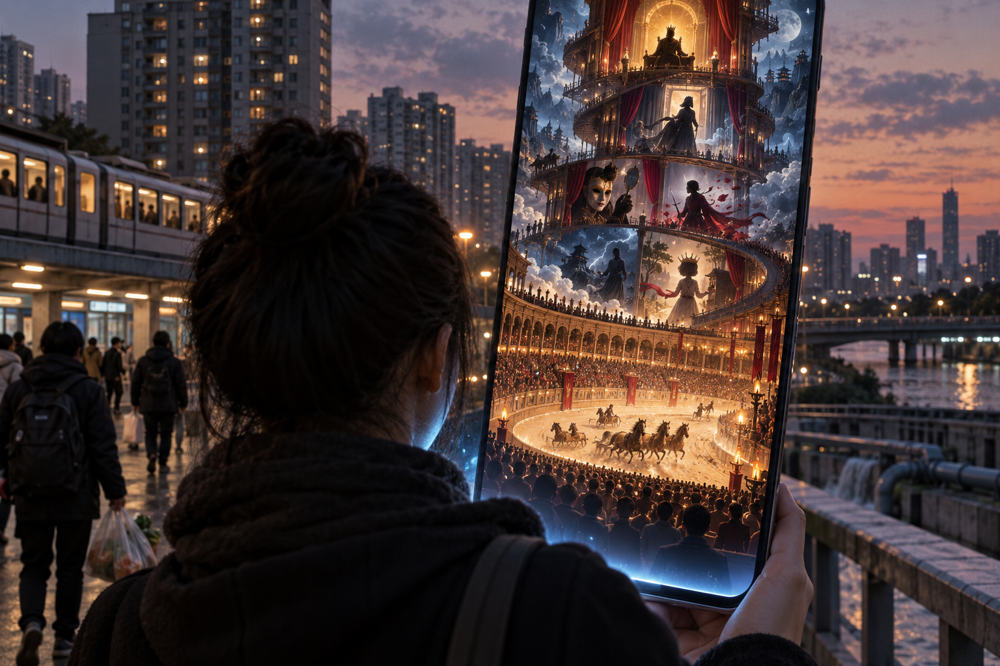

# Panem et Circenses - Khi Đấu Trường Nằm Trong Túi

> Các hình trong bài là minh họa khái niệm do AI tạo, không phải ảnh tư liệu về La Mã hay các hãng phim Trung Quốc.
>
> *The images in this essay are AI-generated conceptual illustrations, not documentary photographs of Rome or Chinese studios.*

**Ngày xưa, một đám đông cùng nhìn về đấu trường. Ngày nay, mỗi người mang theo một đấu trường riêng trong túi. Nó biết ta dừng lại ở đâu, bỏ qua điều gì và câu chuyện nào khiến ta quên thời gian. AI không phát minh ra bánh mì và rạp xiếc. Nó có thể làm rạp xiếc trở nên rẻ hơn, nhanh hơn, vô tận hơn và đủ linh hoạt để phục vụ riêng cho từng ánh mắt.**

*In the ancient world, a crowd looked toward the same arena. Today, each person carries a private arena in a pocket. It learns where we pause, what we skip, and which story makes us lose track of time. AI did not invent bread and circuses. It may make the circus cheaper, faster, endless, and flexible enough to serve every gaze individually.*

Nhưng đây không phải lời buộc tội mọi hình thức giải trí. Một câu chuyện hay có thể giúp con người nghỉ ngơi, hiểu mình, cảm thông với người khác hoặc trở lại đời sống với nhiều sức lực hơn. Câu hỏi không phải liệu ta có nên xem hay không. Câu hỏi là: sau khi màn hình tắt, ta được trả lại cho đời sống, hay càng khó đối diện với nó?

*This is not an indictment of all entertainment. A good story can help us rest, understand ourselves, empathize with others, or return to life with renewed strength. The question is not whether we should watch. The question is whether, when the screen goes dark, we are returned to life—or made less able to face it.*

---

## 1. Juvenal Không Viết Cẩm Nang Cai Trị / Juvenal Did Not Write a Manual for Rulers

Cụm từ *panem et circenses* xuất hiện trong *Satire X* của Juvenal. Trong đoạn văn nổi tiếng, nhà thơ châm biếm một công chúng từng trao quyền chỉ huy, chức vụ và quân đoàn, nhưng nay không còn can dự và chỉ khao khát hai thứ: bánh mì và trò diễn. Trọng tâm của lời phê phán không chỉ là dân chúng thích vui chơi. Nó là sự co rút của tư cách công dân: từ chủ thể từng tham dự vào quyền lực thành khán giả chờ được cung cấp.

*The phrase panem et circenses appears in Juvenal’s Satire X. In the famous passage, the poet mocks a public that once bestowed commands, offices, and legions but now withdraws from civic affairs and longs for only two things: bread and games. The criticism is not merely that people enjoy amusement. It concerns the shrinking of citizenship—from participants in power into spectators waiting to be supplied.*

Không nên biến một câu thơ trào phúng thành bằng chứng rằng La Mã có một kế hoạch thống nhất nhằm cho dân ăn vừa đủ để ngăn nổi loạn. Juvenal không viết sách hướng dẫn cho hoàng đế. Ông viết một lời công kích về ham muốn, danh vọng, quyền lực và sự thất thường của đám đông. “Trò diễn” ở đây cũng rộng hơn những trận đấu đẫm máu tại Colosseum; nó bao gồm các trò hội công cộng, đặc biệt là đua xe ngựa và những sự kiện thu hút toàn thành phố.

*A satirical line should not be turned into proof that Rome maintained a unified policy of feeding people just enough to prevent revolt. Juvenal was not writing an imperial handbook. He was attacking desire, status, power, and the crowd’s volatility. The “games” were also broader than bloody combat in the Colosseum; they included public spectacles, especially chariot races and events capable of absorbing the city’s attention.*

Điều còn sống đến hôm nay là một câu hỏi, không phải một cáo trạng đã hoàn tất: khi đời sống chung trở nên khó hiểu và quyền lực có vẻ xa tầm tay, con người có đổi quyền tham dự lấy cảm giác được xoa dịu không?

*What remains alive today is a question, not a completed indictment: when public life becomes difficult to understand and power feels beyond reach, do people exchange participation for the comfort of being soothed?*

---

## 2. Từ Đấu Trường Chung Đến Dòng Nội Dung Riêng / From a Shared Arena to a Private Feed

Đấu trường cổ đại có một sân khấu chung. Hệ thống đề xuất hiện đại thì khác: mỗi người nhận một dòng nội dung riêng. TikTok công khai rằng mục “Dành cho bạn” xếp hạng video bằng nhiều tín hiệu, trong đó có lượt thích, chia sẻ, bình luận, tài khoản theo dõi, thông tin video và việc người dùng xem hết một video dài. Nền tảng cũng thừa nhận nguy cơ dòng nội dung ngày càng đồng dạng khi hệ thống tối ưu mức độ phù hợp và cá nhân hóa.

*The ancient arena offered a shared stage. Modern recommendation systems work differently: each person receives a private stream. TikTok publicly explains that its For You feed ranks videos through signals including likes, shares, comments, followed accounts, video information, and whether a user finishes a longer video. The platform also acknowledges the risk of an increasingly homogeneous stream when a system optimizes for relevance and personalization.*

Điều này không có nghĩa thuật toán hiểu nỗi đau sâu kín của ta. Nó không cần hiểu. Nó chỉ cần dự đoán hành vi đủ tốt: đoạn phim nào ta xem lại, cảnh nào khiến ta dừng, lúc nào ta vuốt đi và loại cảm xúc nào giữ ta ở lại thêm một phút. Nó đọc dấu vết, không đọc linh hồn.

*This does not mean the algorithm understands our private suffering. It does not need to. It only needs to predict behavior well enough: which video we replay, which scene makes us pause, when we swipe away, and which emotion keeps us for another minute. It reads traces, not souls.*

Khác biệt quan trọng nằm ở quy mô và độ chính xác. La Mã phải triệu tập đám đông vào một địa điểm. Dòng nội dung hiện đại đi theo từng người vào phòng ngủ, bàn ăn và khoảng trống giữa hai công việc. Không còn một chương trình duy nhất cho toàn dân. Có hàng triệu sân khấu nhỏ, mỗi sân khấu liên tục học cách giữ khán giả của nó.

*The crucial difference lies in scale and precision. Rome had to gather the crowd in one place. The modern feed follows each person into the bedroom, the dining table, and the gaps between tasks. There is no longer one program for the whole population. There are millions of small stages, each continuously learning how to retain its audience.*

---

## 3. Ngữ Pháp Của Ước Vọng / The Grammar of Wish Fulfilment

Phim ngắn dọc và truyện “sảng văn” thường vận hành bằng một ngữ pháp rất rõ. Người bị xem thường khám phá thân phận thật. Kẻ thất bại được quay lại quá khứ. Người bất lực nhận một “hệ thống”. Nhân vật bị phản bội tỉnh dậy với ký ức của kiếp trước. Thứ đời sống từ chối trao trong nhiều năm được câu chuyện trao trong vài phút: quyền lực, sự công nhận, cơ hội báo thù và cảm giác số phận cuối cùng đứng về phía mình.

*Vertical microdramas and wish-fulfilment fiction often operate through a clear grammar. The despised character discovers a hidden identity. The failure returns to the past. The powerless person receives a “system.” The betrayed protagonist awakens with memories of a previous life. What ordinary life withholds for years, the story grants within minutes: power, recognition, revenge, and the feeling that destiny has finally taken one’s side.*

Sức hút ấy không chứng minh khán giả ngây thơ. Một người kiệt sức, bị mắc kẹt trong công việc hoặc không nhìn thấy con đường thăng tiến có lý do để tìm đến một thế giới nơi công lý đến nhanh và phẩm giá được phục hồi. Tưởng tượng đôi khi là nơi con người giữ lại một phần mình mà thực tại chưa cho phép sống.

*This attraction does not prove that viewers are naïve. Someone exhausted, trapped in work, or unable to see a path forward has reason to seek a world where justice arrives quickly and dignity is restored. Imagination can preserve a part of the self that reality has not yet allowed to live.*

Vấn đề xuất hiện khi tưởng tượng không còn mở rộng khả năng sống mà chỉ giúp ta chịu đựng vô thời hạn. Giấc mơ từng cho sức mạnh để trở về có thể trở thành nơi trú ẩn khiến việc trở về ngày càng khó. Một cánh cửa thoát hiểm có thể biến thành căn phòng mới nếu ta không còn bước ngược ra ngoài.

*The problem begins when imagination no longer expands the capacity to live but merely helps us endure indefinitely. A dream that once gave us strength to return may become a refuge that makes returning increasingly difficult. An emergency exit can become another room if we stop walking back outside.*

---

## 4. Khi AI Biến Sảng Văn Thành Dây Chuyền / When AI Turns Wish Fulfilment into a Production Line

Thị trường phim ngắn Trung Quốc đã phát triển trước khi làn sóng video tạo sinh trưởng thành. Điều AI thay đổi là chi phí, tốc độ và khả năng thử nghiệm. Một phóng sự của *MIT Technology Review* mô tả những hãng phim ngắn dùng AI cho toàn bộ hoặc phần lớn quy trình: từ hình ảnh nhân vật, cảnh quay, hiệu ứng đến giọng nói. Một số công ty cho biết chu kỳ sản xuất từ vài tháng có thể rút xuống dưới một tháng, còn chi phí tại Bắc Mỹ có thể giảm rất mạnh. Đây là lời kể của doanh nghiệp và ngành nghề, không phải quy luật áp dụng cho mọi dự án, nhưng nó cho thấy hướng dịch chuyển đã thành hoạt động sản xuất thật chứ không còn là bản trình diễn công nghệ.

*China’s microdrama market was already expanding before generative video matured. What AI changes is cost, speed, and the ability to experiment. A MIT Technology Review report describes short-drama companies using AI for all or much of the workflow, including character imagery, scenes, effects, and voices. Some firms say production cycles can shrink from several months to less than one, while North American costs may fall sharply. These are industry claims rather than universal laws, but they show that the shift has become real production activity rather than a mere technology demonstration.*

Cỗ máy này không chỉ sản xuất hình ảnh. Nó sản xuất phép thử. Một mô-típ có thể được tạo nhanh, đưa ra thị trường, đo phản ứng rồi thay bằng biến thể mới. Khi chi phí thất bại giảm, số lượng thí nghiệm tăng. “Trọng sinh báo thù”, “từ nghèo thành giàu”, “kẻ thù thành người yêu” không chỉ là thể loại; chúng trở thành nhãn dữ liệu để quyết định nên sản xuất điều gì tiếp theo.

*This machine produces more than images. It produces experiments. A trope can be generated quickly, released, measured, and replaced by a new variation. When failure becomes cheaper, the number of experiments rises. “Reborn revenge,” “rags to riches,” and “enemies to lovers” are no longer only genres; they become data labels for deciding what to make next.*

Đây là lúc rạp xiếc thay đổi bản chất. Nó không còn chỉ là một chương trình được thiết kế rồi trình chiếu. Nó trở thành hệ thống tiến hóa theo phản ứng của khán giả. Mỗi cú dừng, mỗi tập được mở khóa và mỗi đoạn bị bỏ qua góp phần dạy dây chuyền nội dung cách tạo vòng lặp tiếp theo.

*This is where the circus changes in kind. It is no longer simply a program designed and then displayed. It becomes a system that evolves through audience response. Every pause, every unlocked episode, and every skipped scene helps teach the content pipeline how to build the next loop.*

---

## 5. Nghỉ Ngơi Hay Gây Mê? / Rest or Anaesthesia?

Không thể kết luận rằng mọi video ngắn đều làm con người suy giảm nhận thức. Một tổng quan hệ thống năm 2026 khảo sát 42 nghiên cứu về video ngắn ở trẻ em và thanh niên đã xem cá nhân hóa, cuộn vô hạn và nhịp chuyển nhanh như ba cơ chế cần phân tích riêng. Nhưng toàn bộ nghiên cứu được đưa vào chủ yếu là quan sát và được nhóm tác giả đánh giá ở mức chắc chắn thấp. Các mối liên hệ với sự chú ý, tự kiểm soát hay sức khỏe tinh thần không tự động chứng minh nguyên nhân, càng không thể suy rộng thành kết luận rằng mọi người trưởng thành xem phim ngắn đều trở nên thụ động về chính trị.

*It would be unjustified to conclude that every short video diminishes cognition. A 2026 systematic review of 42 studies on children and young adults examined personalization, infinite scroll, and rapid pacing as distinct delivery mechanisms. Yet the included research was largely observational and rated as low certainty by the reviewers. Associations with attention, self-regulation, or mental health do not automatically establish causation, much less prove that all adult viewers become politically passive.*

Ngược lại, giải trí phù hợp có thể hỗ trợ hồi phục. Một nghiên cứu theo dõi hai nhóm người trong năm ngày cho thấy những đoạn phim hài hoặc truyền cảm hứng ngắn có thể làm giảm căng thẳng cảm nhận thông qua niềm vui, hy vọng và cảm giác mình có khả năng ứng phó. Một đoạn phim ngắn không nhất thiết là thuốc mê. Đôi lúc nó là một nhịp thở.

*Conversely, appropriate entertainment can support recovery. A study following two samples over five days found that brief humorous or inspiring media could reduce perceived stress through amusement, hope, and coping efficacy. A short video is not necessarily an anaesthetic. Sometimes it is a breath.*

Sự khác biệt không nằm hoàn toàn ở độ dài. Nghỉ ngơi giúp ta trở lại đời sống. Gây mê giúp ta trì hoãn việc trở lại. Nghỉ ngơi có điểm dừng. Gây mê cần liều tiếp theo. Nghỉ ngơi phục hồi khả năng lựa chọn; gây mê làm ta sợ khoảng lặng nơi một lựa chọn thật phải được đưa ra.

*The difference is not determined entirely by duration. Rest helps us return to life. Anaesthesia postpones the return. Rest has a stopping point. Anaesthesia demands another dose. Rest restores the ability to choose; anaesthesia makes us fear the silence in which a real choice must be made.*

---

## 6. Không Cần Một Hoàng Đế Đứng Sau Mọi Màn Hình / No Emperor Is Required Behind Every Screen

Không cần giả định có một nhóm bí mật ngồi trên đỉnh kim tự tháp viết từng kịch bản để giải thích hiện tượng này. Nền tảng cần thời gian xem. Nhà sản xuất cần tỷ lệ giữ chân và doanh thu mở khóa. Hệ thống quảng cáo cần khả năng dự đoán. Người xem cần giải trí, sự công nhận hoặc một khoảng cách tạm thời khỏi áp lực. Mỗi bên theo đuổi lợi ích gần nhất của mình; toàn bộ hệ thống có thể tạo ra một kết quả mà không ai một mình thiết kế trọn vẹn.

*We do not need to imagine a secret group at the top of a pyramid scripting every story. Platforms want viewing time. Producers want retention and unlock revenue. Advertising systems want predictability. Viewers want amusement, recognition, or temporary distance from pressure. Each participant pursues the nearest incentive; the whole system can produce an outcome that no single actor designed in full.*

Điều đó không làm hệ thống vô tội. Một cỗ máy không cần ác ý để gây hại. Nếu doanh thu tăng khi người dùng khó dừng lại, những thiết kế kéo dài phiên xem sẽ được tưởng thưởng. Nếu mô-típ đơn giản tạo nhiều lượt mở khóa hơn câu chuyện đòi hỏi kiên nhẫn, thị trường sẽ sản xuất thêm mô-típ đơn giản. Quyền lực nằm trong cách phần thưởng được phân phối, không chỉ trong ý định của một cá nhân.

*This does not make the system innocent. A machine does not require malice to cause harm. If revenue rises when users struggle to stop, designs that prolong sessions will be rewarded. If simple tropes generate more paid unlocks than stories requiring patience, the market will produce more simple tropes. Power resides in how rewards are distributed, not only in the intention of an individual.*

Đây là phiên bản hiện đại đáng sợ hơn của “bánh mì và trò diễn”: không ai cần ra lệnh cho toàn bộ rạp xiếc. Chỉ cần mọi mắt xích đều được trả công khi buổi diễn kéo dài.

*This is the more unsettling modern version of “bread and games”: no one needs to command the entire circus. It is enough for every link in the chain to be rewarded when the show continues.*

---

## 7. Điều Bị Mua Không Chỉ Là Thời Gian / What Is Purchased Is More Than Time

Nói nền tảng “mua thời gian” của người dùng vẫn chưa đủ. Thời gian chỉ là đơn vị dễ đo. Thứ sâu hơn là khả năng duy trì chú ý với những vấn đề không cho phần thưởng ngay: tiền nhà, giá thực phẩm, chất lượng nước, điều kiện lao động, sức khỏe, trách nhiệm công dân và những mối quan hệ không thể sửa bằng một cú vuốt.

*To say that platforms “purchase time” from users is still incomplete. Time is merely the easiest unit to measure. The deeper stake is the ability to sustain attention toward problems that offer no immediate reward: housing costs, food prices, water quality, working conditions, health, civic responsibility, and relationships that cannot be repaired with a swipe.*

Nhưng ta cũng không nên tuyên bố giải trí là nguyên nhân khiến mọi vấn đề ấy bị bỏ quên. Giá nhà không tăng vì một người xem phim trọng sinh. Một chính sách không thoát khỏi giám sát chỉ vì ai đó xem video hài. Luận điểm thận trọng hơn là: chú ý có giới hạn, và những hệ thống cạnh tranh thành công để chiếm lấy chú ý sẽ làm phần còn lại của đời sống khó nhận được thời gian tinh thần cần thiết.

*Nor should we claim that entertainment causes every public problem to be ignored. Housing prices do not rise because one person watches a rebirth drama. A policy does not escape scrutiny merely because someone watches comedy. The more careful claim is that attention is finite, and systems that compete successfully to capture it leave the rest of life with less of the mental time it requires.*

Tự do vì thế không chỉ là quyền chọn nội dung. Nó còn là khả năng không chọn gì trong một lúc; khả năng giữ một câu hỏi đủ lâu để nó trở nên khó chịu; khả năng phân biệt điều đang giúp mình hồi phục với điều đang làm mình quên rằng cần phải thay đổi.

*Freedom, then, is not only the right to choose content. It is also the capacity to choose nothing for a while; to hold a question long enough for it to become uncomfortable; and to distinguish what is helping us recover from what is helping us forget that something must change.*

---

## 8. Lối Ra Không Phải Đập Vỡ Màn Hình / The Exit Is Not to Smash the Screen

Lối ra không phải khinh thường người xem, xóa mọi ứng dụng hay biến việc đọc sách dài thành một huy hiệu đạo đức mới. Một người có thể xem phim ngắn và vẫn giữ được đời sống phong phú. Một người khác có thể đọc sách dày chỉ để chạy trốn khỏi gia đình, cơ thể hoặc công việc của mình. Hình thức không tự quyết định tự do; mối quan hệ của ta với hình thức mới quyết định.

*The exit is not to despise viewers, delete every app, or turn long-form reading into a new badge of moral superiority. One person may watch microdramas and still maintain a rich life. Another may read difficult books only to escape family, body, or work. Form alone does not determine freedom; our relationship to form does.*

Có thể bắt đầu bằng những kiểm tra nhỏ. Sau khi xem, ta thấy được hồi phục hay chỉ muốn xem tiếp? Ta chủ động chọn câu chuyện, hay mở màn hình vì không chịu nổi một phút trống? Nội dung giúp ta hiểu nỗi đau, hay chỉ lặp lại một ảo tưởng khiến đời thật càng nhạt? Thời gian được “tiết kiệm” nhờ AI cuối cùng trở về với ai và được dùng cho điều gì?

*We can begin with small tests. After watching, do we feel restored, or merely compelled to continue? Did we choose the story, or open the screen because one empty minute felt unbearable? Does the content help us understand pain, or repeat a fantasy that makes ordinary life appear increasingly colourless? When AI “saves” time, to whom does that time return, and what is it used for?*

Ngày xưa, đế quốc phải dựng một đấu trường để tập trung đám đông. Ngày nay, đấu trường không cần tường đá. Nó chỉ cần một màn hình, một hệ thống đề xuất và một dòng nội dung không có cảnh cuối.

*The ancient empire needed an arena to gather the crowd. The modern arena requires no stone walls. It needs only a screen, a recommendation system, and a stream without a final scene.*

**Panem et circenses. Bánh mì vẫn cần thiết. Giải trí vẫn có thể đẹp. Nhưng một công dân không thể sống mãi như khán giả của chính đời mình.**

*Panem et circenses. Bread remains necessary. Entertainment can still be beautiful. But a citizen cannot live forever as a spectator of their own life.*

---

## Cách Đọc Bài Này / How to Read This Essay

Bài viết giữ bốn tầng riêng biệt. Tầng sự kiện gồm văn bản của Juvenal, cơ chế đề xuất được nền tảng công bố, tổng quan nghiên cứu về video ngắn và hoạt động sản xuất phim ngắn bằng AI. Tầng hệ thống gồm các động lực về thời gian xem, tỷ lệ giữ chân và doanh thu. Tầng biểu tượng đọc điện thoại như đấu trường cá nhân hóa. Tầng tổng hợp suy đoán đặt câu hỏi liệu giải trí có thể trở thành một hình thức gây mê nhận thức. Tầng cuối là một cách đọc, không phải bằng chứng cho một âm mưu thống nhất.

*This essay keeps four layers separate. The factual layer includes Juvenal’s text, platform-documented recommendation mechanics, a systematic review of short-form video, and real AI microdrama production. The systems layer concerns incentives around viewing time, retention, and revenue. The symbolic layer reads the phone as a personalized arena. The speculative synthesis asks whether entertainment can become a form of cognitive anaesthesia. That final layer is an interpretive lens, not proof of a unified conspiracy.*

## Nguồn Chính / Key Sources

1. Juvenal, *Satire X* — [Wikisource](https://en.wikisource.org/wiki/Juvenal_and_Persius/The_Satires_of_Juvenal/Satire_10)
2. TikTok Newsroom, *How TikTok recommends videos for you* — [TikTok](https://newsroom.tiktok.com/en-us/how-tiktok-recommends-videos-for-you)
3. *Taming the endless scroll? Short-form videos, digital routines and neurocognitive outcomes in youth* — [European Child & Adolescent Psychiatry](https://link.springer.com/article/10.1007/s00787-026-03083-7)
4. *How Chinese short dramas became AI content machines* — [MIT Technology Review](https://www.technologyreview.com/2026/05/15/1137326/chinese-short-dramas-ai/)
5. *Can a Video a Day Keep Stress Away? A Test of Media Prescriptions* — [Health Communication](https://www.tandfonline.com/doi/full/10.1080/10410236.2022.2134700)
