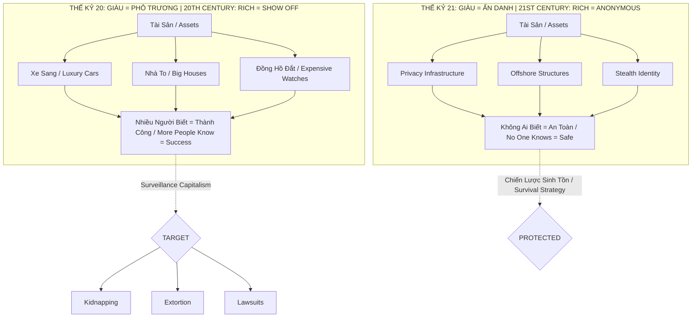
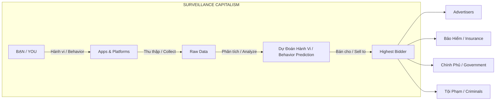
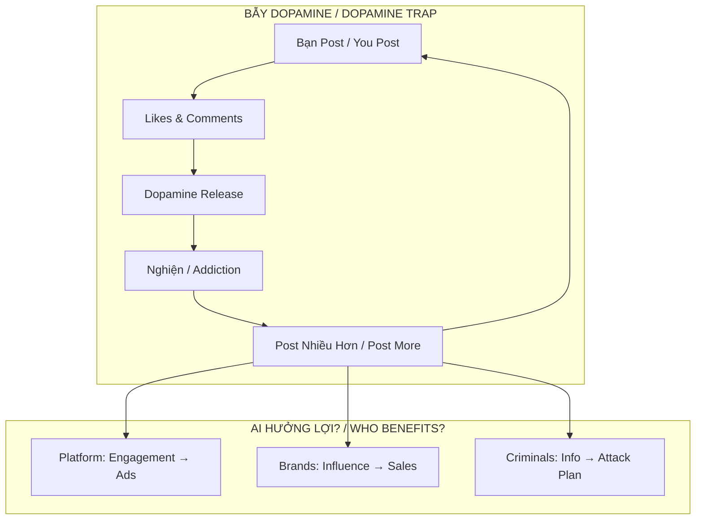
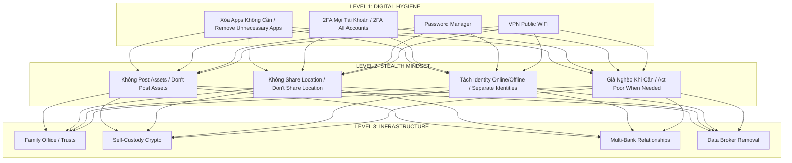

# Privacy Is The New Wealth

> *"Người giàu thật sự không xuất hiện trên Forbes. Họ trả tiền để biến mất."*
> *"The truly rich don't appear on Forbes. They pay to disappear."*

Bài viết trình bày một triết lý về sự giàu có trong thế kỷ 21, nơi **privacy** (sự riêng tư) đã trở thành thước đo quyền lực thực sự thay vì phô trương tài sản. Trong thời đại surveillance capitalism, khả năng "biến mất" trở thành luxury goods đắt nhất.

*This article presents a philosophy about wealth in the 21st century, where privacy has become the true measure of power instead of displaying assets. In the age of surveillance capitalism, the ability to "disappear" becomes the most expensive luxury good.*

---

## Tổng Quan / Overview

---

## The Great Inversion: Từ "Flex" Đến "Hide" / From "Flex" To "Hide"

### Sự Đảo Ngược Định Nghĩa Giàu Có / The Inversion of Wealth Definition

| Thế kỷ 20 / 20th Century | Thế kỷ 21 / 21st Century |
|--------------------------|--------------------------|
| Giàu = Phô trương / Rich = Show off | Giàu = Ẩn danh / Rich = Anonymous |
| Xe sang, nhà to, đồng hồ / Cars, mansions, watches | Privacy infrastructure |
| Càng nhiều người biết = Thành công / More people know = Success | Càng ít người biết = An toàn / Fewer people know = Safe |
| Wealth = Status symbols | Wealth = Ability to disappear |

### Tại Sao Đảo Ngược? / Why The Inversion?

Sự đảo ngược này không phải ngẫu nhiên. Nó là hệ quả tất yếu của một thế giới nơi:

*This inversion is not random. It's the inevitable consequence of a world where:*

- **Thông tin là vũ khí / Information is a weapon**
- **Attention là currency / Attention is currency**
- **Visibility là vulnerability / Visibility is vulnerability**

---

## Data Is The New Oil — Nhưng BẠN Là Giếng Dầu / But YOU Are The Oil Well

### Surveillance Capitalism

Thuật ngữ của Shoshana Zuboff mô tả hệ thống nơi hành vi con người được khai thác như tài nguyên thô.

*Shoshana Zuboff's term describing a system where human behavior is extracted like raw resources.*

> *"We have been cajoled into spying on ourselves."* — Boston Review

### Công Thức Tài Sản Mới / The New Wealth Formula

| Tầng lớp / Class | Vai trò / Role |
|------------------|----------------|
| Người nghèo / Poor | BẠN là sản phẩm (data bị bán) / YOU are the product (data sold) |
| Tầng lớp trung / Middle class | BẠN là mục tiêu (ads, scams) / YOU are the target |
| Người giàu / Rich | BẠN là bí mật (trả tiền để biến mất) / YOU are a secret (pay to disappear) |

### Bạn Là Sản Phẩm / You Are The Product

| Bạn nghĩ... / You think... | Thực tế là... / Reality is... |
|----------------------------|-------------------------------|
| Facebook miễn phí / Facebook is free | Bạn trả bằng data / You pay with data |
| Google giúp bạn tìm kiếm / Google helps you search | Google đang tìm kiếm bạn / Google is searching you |
| App fitness theo dõi sức khỏe / Fitness app tracks health | Công ty bảo hiểm biết bạn ốm trước cả bạn / Insurance knows you're sick before you do |

---

## Stealth Wealth: Tâm Lý Học Của Sự Ẩn Danh / Psychology of Anonymity

### 1. Tránh Trở Thành Mục Tiêu / Avoiding Becoming a Target

Billionaires là targets cho / Billionaires are targets for:
- **Kidnapping** — Vụ đồng sáng lập Ledger (Pháp) 2025 / Ledger co-founder case (France) 2025
- **Extortion** — Virtual kidnapping schemes nhắm vào executives / targeting executives
- **Home invasions** — Crypto influencers ở Bỉ, Houston / in Belgium, Houston
- **Lawsuits** — Người biết bạn giàu sẽ đòi nhiều hơn / Those who know you're rich will demand more

> **"Wrench attacks"** — Tội phạm dùng bạo lực tra tấn để ép nạn nhân giao private keys. Một nhà đầu tư Ý bị giữ 17 ngày (2025).
>
> *Criminals using violence and torture to force victims to hand over private keys. An Italian investor was held for 17 days (2025).*

### 2. Digital Footprint = Attack Vector

Mỗi lần bạn post: / Every time you post:

| Post | Attack vector |
|------|---------------|
| Nhà mới / New house | Địa chỉ / Address |
| Đồng hồ đắt tiền / Expensive watch | Xác nhận tài sản / Asset confirmation |
| Check-in nhà hàng sang / Luxury restaurant check-in | Lịch trình di chuyển / Movement schedule |
| Vacation photos | Nhà đang trống / House is empty |

### 3. Old Money vs New Money

| New Money | Old Money |
|-----------|-----------|
| Ồn ào vì cần validation / Loud because needs validation | Im lặng vì không cần chứng minh / Silent because no need to prove |
| Xuất hiện trên Forbes = achievement | Xuất hiện trên Forbes = vulgar |
| Flex to prove | Hide to protect |

> *"You don't know who the real rich are. That is how private they can be."*

---

## The Cost of Privacy: Infrastructure Của Sự Vô Hình / Infrastructure of Invisibility

Privacy đã trở thành **luxury goods** với giá cả tương xứng.

*Privacy has become a luxury good with corresponding price tags.*

| Service | Chi phí ước tính / Estimated Cost |
|---------|-----------------------------------|
| Family Office | $1M+/năm / $1M+/year |
| Private Banking (Singapore, Swiss) | $100K+ minimum |
| Trust structures, Offshore entities | $50K+ setup |
| Personal security team | $500K-2M/năm / $500K-2M/year |
| Digital privacy consultant | $10K-50K |
| Secure comms, burner phones | Vài nghìn $/năm / A few thousand $/year |

### Tools Của Người Giàu / Tools of the Wealthy

1. **Multiple phone numbers** — Business / Family / Burner
2. **Assistants as shields** — Không bao giờ trực tiếp liên lạc / Never direct contact
3. **LLCs và Trusts** — Bất động sản, xe, yacht không gắn tên / Real estate, cars, yachts not in their name
4. **Anonymous donations** — Từ thiện không cần credit / Charity without credit
5. **Data broker removal** — Xóa thông tin khỏi internet / Remove info from internet

---

## The Attention Economy Trap / Bẫy Kinh Tế Sự Chú Ý

### Dopamine Loop

Social media được thiết kế để:

*Social media is designed to:*

- Kích hoạt dopamine qua likes, comments / Trigger dopamine through likes, comments
- Tạo nghiện với variable reward schedules / Create addiction with variable reward schedules
- Exploit bản năng cần được xã hội công nhận / Exploit the need for social recognition

### Information Asymmetry / Bất Đối Xứng Thông Tin

| Câu hỏi / Question | Trả lời / Answer |
|--------------------|------------------|
| Bạn biết gì về người theo dõi bạn? / What do you know about your followers? | Gần như 0 / Almost nothing |
| Họ biết gì về bạn? / What do they know about you? | Gần như mọi thứ / Almost everything |

Trong bất kỳ cuộc chơi nào, **người có nhiều thông tin hơn sẽ thắng**.

*In any game, the one with more information wins.*

---

## Survival Package: Tư Duy Quản Trị Rủi Ro / Risk Management Mindset

### Self-Custody vs Exchange

| Exchange | Self-Custody |
|----------|--------------|
| KYC — họ biết bạn là ai / they know who you are | Anonymous |
| Hackable | Bạn kiểm soát / You control |
| Có thể bị đóng băng / Can be frozen | Không ai chặn được / No one can stop |
| 3rd party risk | Chỉ có bạn là risk / Only you are the risk |

### Digital Hygiene Checklist

- [ ] Audit browser extensions — Vector phổ biến nhất cho theft / Most common theft vector
- [ ] Separate browsers — Financial ≠ General browsing
- [ ] Hardware wallets — Highest tier peace of mind
- [ ] Offline signing + backup internet — Transact khi local down / when local is down
- [ ] Multi-sig — Không một điểm thất bại đơn lẻ / No single point of failure

---

## Practical Takeaways / Bài Học Thực Tiễn

### Level 1: Basic Digital Hygiene
- Xóa apps không cần thiết / Remove unnecessary apps
- Review permissions
- 2FA tất cả tài khoản quan trọng / 2FA all important accounts
- Password manager
- VPN cho public WiFi / VPN for public WiFi

### Level 2: Stealth Wealth Mindset
- Không post assets lên social media / Don't post assets on social media
- Không share location real-time / Don't share real-time location
- Tách biệt identity online và offline / Separate online and offline identity
- Giả nghèo khi không cần thiết / Act poor when appropriate
- Từ thiện anonymous / Anonymous charity

### Level 3: Infrastructure
- Family office / Trust structures
- Self-custody crypto
- Multiple banking relationships
- Personal security assessment
- Data broker removal services

---

## Core Insight / Insight Cốt Lõi

> *"Việc bạn làm được 10 tỉ đầu tiên trong đời, hay mới mua con Porsche — xác suất cao là đã có người làm được từ mấy chục năm trước, và có những ultra-rich kids sinh ra đã có sẵn.*
>
> *Nên khi làm được tiền, tốt nhất là giấu như mèo giấu cứt, giả điên giả khùng."*

> *"Making your first 10 billion, or buying a Porsche — chances are someone did it decades ago, and some ultra-rich kids were born with it.*
>
> *So when you make money, best to hide it like a cat hides its shit, play dumb."*

Không phải vì khiêm tốn. Mà vì **chiến lược sinh tồn**.

*Not because of humility. But because of **survival strategy**.*

---

## The New Status Symbol / Biểu Tượng Địa Vị Mới

- **Cũ / Old:** Porsche, Rolex, Penthouse
- **Mới / New:** Không ai biết bạn ở đâu, làm gì, có gì / No one knows where you are, what you do, what you have

> *"Privacy is the ultimate flex mà không ai thấy được cái flex đó."*
> *"Privacy is the ultimate flex that no one can see."*

---

## Related

- [[Mental Model]] — Framework tư duy / Thinking framework
- [[Tư Duy Lũy Thừa]] — Tích lũy âm thầm, bùng nổ đột ngột / Silent accumulation, sudden explosion
- [[Thông Minh vs Trí Tuệ]] — Biết khi nào nên im lặng / Know when to stay silent
- [[Ma Trận]] — Hệ thống kiểm soát qua data / Control system through data

---

## Sources

- Shoshana Zuboff — *The Age of Surveillance Capitalism*
- Financial Samurai — *The Rise of Stealth Wealth*
- Crisis24 — *Crypto Kidnappings Report 2025*
- NBC News — *How armed gangs are hunting crypto high rollers*
