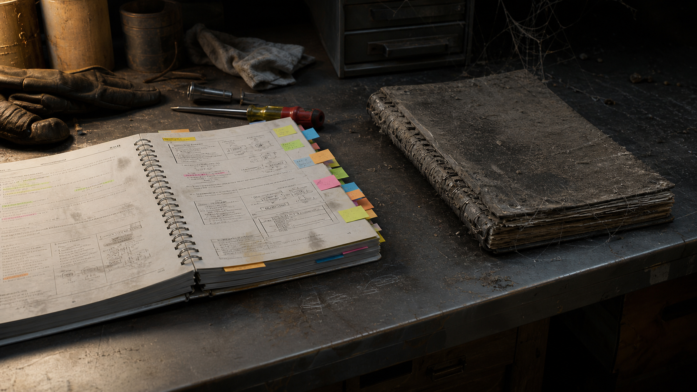
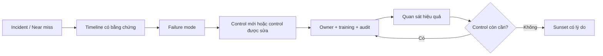

# Quy Trình Là Ký Ức Được Mua Bằng Máu

**Quy trình tốt không phải giấy tờ hành chính. Nó là ký ức của một hệ thống đã được nén thành hành động: một lỗi từng xảy ra, một hóa đơn từng được trả, một người từng bị thương, một khách hàng từng bỏ đi. Người đến sau chỉ thấy thêm một bước. Họ không thấy cái giá đã mua bước đó.**

*Good procedures are not administrative paperwork. They are a system's memory compressed into action: a failure that happened, a bill that was paid, a person who was injured, a customer who walked away. The next operator sees only one extra step. They do not see the price that purchased it.*

---

## Vault Position / Vị Trí Trong Vault

Bài này mở rộng [[Mental Model]] từ bản đồ trong đầu cá nhân sang **bộ nhớ vận hành của tập thể**. Một tổ chức cũng có thể học, quên, tự lừa mình và lặp lại trauma như con người. SOP, checklist, runbook, tiêu chuẩn kỹ thuật và bước kiểm tra là cách tập thể đưa bài học ra khỏi trí nhớ mong manh của từng cá nhân.

Nó nối với [[Tư Duy Lũy Thừa]] vì lỗi nhỏ không được sửa cũng compound. Nó nối với [[Abilene Paradox - Nghịch Lý Đồng Thuận Giả]] vì nhiều nhóm biết một shortcut nguy hiểm nhưng vẫn im lặng khi “người năng động” thúc cả phòng làm nhanh. Và nó phải đứng cạnh [[Source Discipline - Kỷ Luật Nguồn Và Bằng Chứng]]: một câu chuyện mạnh không cho phép ta gán mọi cải cách hay mọi chênh lệch chi phí cho một nguyên nhân duy nhất.

*This note treats procedures as collective cognition. It is not a defense of bureaucracy. It is a model for asking which memories deserve preservation, which rules have lost their mechanism, and what evidence is required before deleting a safeguard.*

---

## Từ Khóa Cần Hiểu

**Institutional memory — ký ức tổ chức** là tri thức không chỉ nằm trong đầu một người mà được lưu trong cấu trúc: tài liệu, thiết kế, quyền hạn, checklist, mã nguồn, cách bàn giao và thói quen phản ứng.

**Standard Operating Procedure — SOP** là quy trình thao tác chuẩn. SOP tốt không chỉ nói *làm gì* mà còn phải cho người đọc hiểu *rủi ro nào đang được kiểm soát*.

**Near miss — sự cố suýt xảy ra** là lần hệ thống thoát nạn nhờ may mắn hoặc một lớp bảo vệ cuối cùng. Nếu chỉ học từ tai nạn thật, tổ chức đang đợi máu mới chịu cập nhật.

**Normalization of deviance — bình thường hóa sai lệch** là khi một shortcut được lặp nhiều lần không gây hậu quả, rồi dần được coi là an toàn. Chín lần thoát nạn được dùng làm bằng chứng rằng lần thứ mười cũng sẽ ổn.

**Technical debt — nợ kỹ thuật** không chỉ có trong phần mềm. Mọi quyết định “làm trước, ghép sau” đều vay thời gian hiện tại bằng chi phí và độ cứng của tương lai.

---

## Shin-Okubo: Ba Giây Và Một Hóa Đơn Không Thể Hoàn Tiền

Tối 26 tháng 1 năm 2001 tại ga Shin-Okubo trên tuyến Yamanote ở Tokyo, một người đàn ông rơi xuống đường ray. Lee Su-hyon, sinh viên Hàn Quốc 26 tuổi, và Shiro Sekine, nhiếp ảnh gia Nhật 47 tuổi, xuống đường ray để cứu. Cả ba bị đoàn tàu đâm và thiệt mạng. Các tường thuật đương thời của *The Japan Times* và *Los Angeles Times* xác nhận lõi sự kiện này.

Có một temptation rất hiện đại khi xem nhân viên nhà ga dùng sào gắp một chiếc điện thoại: “Tàu đã dừng rồi. Nhảy xuống ba giây là xong.” Ba giây đó chỉ đúng khi ta đóng băng reality: không trượt chân, không hiểu nhầm tín hiệu, không có tàu khác, không có hệ thống tự động, không có người thứ hai vô tình khởi động lại chuỗi vận hành.

Procedure tồn tại để bảo vệ con người khỏi **những biến số họ không nhìn thấy**, không chỉ khỏi thứ đang nằm trước mắt.

Nhưng phải giữ claim discipline. Tai nạn Shin-Okubo trở thành biểu tượng mạnh của an toàn sân ga và được tưởng niệm lâu dài; tuy vậy, không nên tuyên bố mọi nút dừng khẩn cấp, cửa chắn sân ga hay mọi rule dùng dụng cụ gắp trên toàn Nhật đều được sinh ra duy nhất từ đêm đó nếu không có tài liệu quy định cụ thể. Một tai nạn có thể là catalyst. Một hệ thống an toàn thường được xây từ nhiều tai nạn, near miss, tiêu chuẩn và thay đổi công nghệ chồng lên nhau.

> Điều đúng không phải “mọi quy tắc ở ga Nhật đều do ba người này chết”. Điều đúng là: mỗi lớp bảo vệ nghiêm túc đều có một genealogy của failure phía sau nó.

---

## SOP Là Tài Sản Vô Hình

Khi mua một dây chuyền, người mua không chỉ trả tiền cho kim loại. Họ trả cho bản vẽ, tolerance, lịch bảo trì, lỗi thường gặp, ngưỡng dừng máy, cách đào tạo, danh sách vật tư thay thế và những điều “đừng bao giờ làm” mà nhà sản xuất đã học trong nhiều năm.

Máy móc có thể đo lại. Kinh nghiệm vận hành bền bỉ khó tháo ra bằng thước kẹp. Đó là lý do tài liệu chuyển giao, know-how và trade secret thường đi kèm phạm vi sử dụng, điều khoản bảo mật và chi phí riêng. Giá trị không nằm ở số trang giấy; nó nằm ở số failure mà người mua không phải tự tái hiện.

Bảng cân đối kế toán thường nhìn thấy nhà xưởng, thiết bị và tiền mặt rõ hơn institutional memory. Nhưng khi một chuyên gia chủ chốt nghỉ việc, một đội vận hành bị giải tán hoặc một công ty được mua lại, giá trị vô hình đó lập tức lộ diện. Hệ thống vẫn có tài sản vật lý nhưng mất khả năng vận hành nó an toàn.

*The machine is visible capital. The runbook is compressed survival. One can be depreciated on a schedule; the other reveals its value only when it is missing.*

---

## Long Thành: Chi Phí Của Việc Ghép Sau

Long Thành là case study tốt về **design debt**, nhưng chỉ khi dùng nó cẩn thận.

Giai đoạn một của sân bay được đặt mục tiêu khai thác thương mại vào cuối năm 2026. Trong khi đó, các phương án kết nối đường sắt và metro vẫn tiếp tục được điều chỉnh để ghép nhiều tuyến vào hệ thống sân bay. Báo cáo về tuyến Thủ Thiêm–Long Thành thay đổi theo thời điểm và phạm vi: chiều dài, số ga, tỷ lệ đi ngầm và tổng mức đầu tư có thể khác nhau đáng kể giữa các phương án. Các con số khoảng 85.000 tỷ và gần 175.000 tỷ không nên được đặt cạnh nhau rồi kết luận toàn bộ chênh lệch là “giá của việc quên một nhà ga”. Chúng có thể khác scope, năm giá, tiêu chuẩn kỹ thuật và cấu hình tuyến.

Điều documentable hơn là nguyên tắc: **hạ tầng được tích hợp từ concept stage luôn có nhiều option hơn hạ tầng phải retrofit sau khi geometry chính đã đóng băng**. Khi footprint nhà ga, cao độ, móng, luồng hành khách và quỹ đất đã định hình, mỗi kết nối mới phải thương lượng với một reality cứng hơn.

Kansai International Airport mở năm 1994 với kết nối đường sắt được tích hợp ngay từ đầu qua Sky Gate Bridge. Điều này không chứng minh Nhật “khôn vì văn hóa” còn Việt Nam “dở vì con người”. Nhật có vốn, thể chế, thời gian và điều kiện địa lý riêng. Nhưng case Kansai minh họa một systems principle: kết nối được quyết định trong bản thiết kế gốc khác về chất so với kết nối được ghép vào sau.

> Không phải mọi đồng chi phí tăng thêm đều là hóa đơn của một dòng checklist bị thiếu. Nhưng một dòng checklist đúng, đặt đủ sớm, có thể giữ lại hàng chục option mà concrete về sau sẽ khóa mất.

---

## Chín Lần Làm Tắt Không Sao

Shortcut nguy hiểm nhất không phải shortcut gây tai nạn ngay. Nó là shortcut **thành công đủ nhiều lần để trở thành văn hóa**.

Một bước kiểm tra bị bỏ qua. Không có chuyện gì xảy ra. Tuần sau lại bỏ. Vẫn ổn. Người tuân thủ bị gọi là chậm, người làm tắt được gọi là linh hoạt. Sau chín lần, tổ chức không còn nghĩ mình đang đánh cược. Nó nghĩ mình vừa tìm ra một cải tiến quy trình.

Nhưng absence of failure không đồng nghĩa presence of safety. Có thể lớp bảo vệ khác đang cứu hệ thống. Có thể môi trường chưa chạm đúng tổ hợp xấu. Có thể rủi ro tích lũy chưa vượt ngưỡng. [[Tư Duy Lũy Thừa]] nhắc rằng cả năng lực lẫn sai lệch đều compound âm thầm trước khi biểu hiện phi tuyến.

Đây cũng là một phiên bản vận hành của [[Abilene Paradox - Nghịch Lý Đồng Thuận Giả]]. Nhiều người có thể thấy shortcut không ổn nhưng không ai muốn làm “người máy móc” cản khách hàng. Im lặng được đọc thành đồng thuận. Tốc độ được thưởng ngay; rủi ro được gửi hóa đơn cho tương lai.

*The shortcut receives immediate credit. The future incident receives distributed blame. That asymmetry is an incentive, not an accident.*

---

## Nhưng Không Phải Mọi Quy Trình Đều Thiêng Liêng

Tôn trọng institutional memory không có nghĩa biến SOP thành kinh thánh. Có quy trình là ký ức sống. Cũng có quy trình là xác chết của một hệ thống không còn tồn tại.

Một rule có thể lỗi thời vì công nghệ đã thay đổi, rủi ro đã được loại bỏ ở tầng thiết kế, hoặc control khác hiệu quả hơn. Một bước cũng có thể tồn tại chỉ vì politics: thêm chữ ký để chia trách nhiệm, thêm meeting để không ai sở hữu quyết định, thêm báo cáo để tạo cảm giác kiểm soát.

[[Thông Minh vs Trí Tuệ]] nằm đúng ở đây. Thông minh có thể phá luật nhanh để chứng minh mình linh hoạt. Thông minh cũng có thể viện quy trình để né accountability. Trí tuệ hỏi mechanism:

1. Rule này được sinh ra từ incident, near miss hoặc requirement nào?
2. Nó đang chặn failure mode cụ thể nào?
3. Control hiện tại còn hiệu lực không?
4. Có lớp bảo vệ mới nào thay thế tốt hơn không?
5. Nếu xóa, tín hiệu nào sẽ báo sớm rằng quyết định sai?
6. Ai sở hữu rollback nếu hậu quả xuất hiện?

Một quy trình khỏe phải có **owner, rationale, version và sunset/review condition**. Nếu không ai biết vì sao rule tồn tại, hệ thống đã giữ được chữ nhưng làm mất ký ức.

> Đừng xóa một dòng vì nó phiền. Cũng đừng giữ một dòng chỉ vì nó cũ. Hãy truy genealogy của nó.

---

## Cách Biến Failure Thành Tài Sản

Tổ chức trưởng thành không chỉ viết post-mortem. Nó hoàn tất một vòng chuyển hóa:

**Một: ghi timeline trước khi kể chuyện.** Ai làm gì, hệ thống thấy gì, tín hiệu nào bị bỏ qua. Không bắt đầu bằng “ai có lỗi”.

**Hai: tách active error khỏi latent condition.** Người bấm nhầm là active error. UI gây hiểu nhầm, ca trực thiếu người, cảnh báo bị noise và quyền hạn mơ hồ là latent conditions.

**Ba: ưu tiên control ở tầng thiết kế.** Một barrier vật lý, interlock hay validation tự động thường mạnh hơn lời nhắc “hãy cẩn thận”. Training cần thiết, nhưng không nên là lớp duy nhất.

**Bốn: ghi rationale ngay cạnh rule.** Người mới phải biết bước này bảo vệ điều gì. Hiểu mechanism tạo compliance trưởng thành hơn học thuộc bằng sợ hãi.

**Năm: học từ near miss.** Đợi tai nạn mới sửa là mua bài học ở mức giá cao nhất.

**Sáu: review và sunset có kiểm soát.** Rule hết giá trị nên được bỏ bằng evidence, không bằng impatience.

Đây là lúc procedure trở thành một [[Mental Model]] có feedback thay vì một nghi thức hành chính.

---

## Hóa Đơn Được Trả Bởi Người Không Có Mặt Trong Phòng

Nhân viên mới mở handbook và thấy ba mươi trang phiền phức. Họ không thấy hợp đồng mất trắng đã tạo ra bước kiểm tra credit. Không thấy lô hàng bị thu hồi đã tạo ra double verification. Không thấy kỹ sư nghỉ việc sau một đêm production sập đã tạo ra runbook rollback.

Họ nhận một tài sản mà không trả tiền. Vì không thấy hóa đơn, họ tưởng nó miễn phí. Mà thứ bị tưởng là miễn phí thường bị vứt đầu tiên.

Nhưng người quản lý cũng có trách nhiệm. Nếu tổ chức chỉ nói “cứ làm theo vì quy định là vậy”, nó đang đòi compliance mà không truyền memory. Rule mất story, mất mechanism, mất owner rồi trở thành bureaucracy thật. Khi đó shortcut culture không chỉ là lỗi của người trẻ; nó là triệu chứng của một hệ thống đã thất bại trong việc bàn giao lý do.

*The new operator inherits the rule. Leadership must also transfer the memory that gives the rule meaning.*

---

## Kết / The Real Red Pill

Quy trình không đối lập với linh hoạt. **Quy trình tốt bảo tồn option để con người có thể linh hoạt mà không đặt cược mù.** Nó cho biết đâu là vùng được phép ứng biến, đâu là barrier không được bước qua, và điều kiện nào buộc hệ thống dừng lại.

Red pill không phải “người Nhật kỷ luật, người Việt tùy tiện”. Đó là cultural essentialism rẻ tiền. Red pill sâu hơn là: mọi hệ thống đều có thể học hoặc quên. Hệ thống học khi failure được chuyển thành memory, memory thành control, control thành hành vi, rồi control tiếp tục được review bằng evidence. Hệ thống quên khi người đến sau chỉ thấy thủ tục mà không thấy genealogy của cái giá.

Trước khi cắt một bước cho nhanh, hãy hỏi:

> Dòng này đang bảo vệ điều gì? Ai đã mua nó? Và nếu tôi xóa nó, ai sẽ nhận hóa đơn tiếp theo?

*Before deleting a step, ask what it protects, who paid for it, and who will receive the next invoice if the memory is wrongfully erased.*

---

## Evidence Discipline / Kỷ Luật Nguồn

- **Fact/documentable:** tai nạn Shin-Okubo, danh tính và tuổi của Lee Su-hyon và Shiro Sekine; lịch khai thác Long Thành; các phương án rail integration; Kansai mở với rail access tích hợp.
- **Pattern/systems reading:** procedure như institutional memory; retrofit làm mất option; shortcut thành văn hóa qua normalization of deviance.
- **Symbol:** cuốn sổ tay là nghĩa trang của những failure đã được nén thành chữ; “hóa đơn” là hình ảnh cho chi phí bị người đến sau quên mất.
- **Synthesis:** một tổ chức có chủ quyền không thờ quy trình và cũng không khinh quy trình. Nó giữ genealogy, đo hiệu quả và chỉ xóa control bằng evidence.

### Nguồn chính

1. *The Japan Times*, “Two killed by train in rescue effort,” 28/01/2001.
2. *Los Angeles Times*, coverage of Lee Su-hyon and the Shin-Okubo rescue, 30/01/2001.
3. Government News, “Long Thanh International Airport set for commercial launch by late 2026.”
4. *VnExpress International*, reporting on rail/metro integration planning for Long Thành.
5. Kansai Airports, official KIX history and infrastructure information.

---

## Related

- [[Mental Model]] — model là lens; procedure là model được operationalize.
- [[Tư Duy Lũy Thừa]] — năng lực và sai lệch đều compound.
- [[Abilene Paradox - Nghịch Lý Đồng Thuận Giả]] — im lặng biến shortcut thành consensus giả.
- [[Source Discipline - Kỷ Luật Nguồn Và Bằng Chứng]] — câu chuyện mạnh không được phép causal overclaim.
- [[Thông Minh vs Trí Tuệ]] — biết lúc nào tuân thủ, lúc nào sửa và lúc nào dừng.
- [[Ma Trận]] — default setting của hệ thống chỉ nguy hiểm khi không còn ai nhớ vì sao nó tồn tại.
