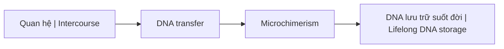
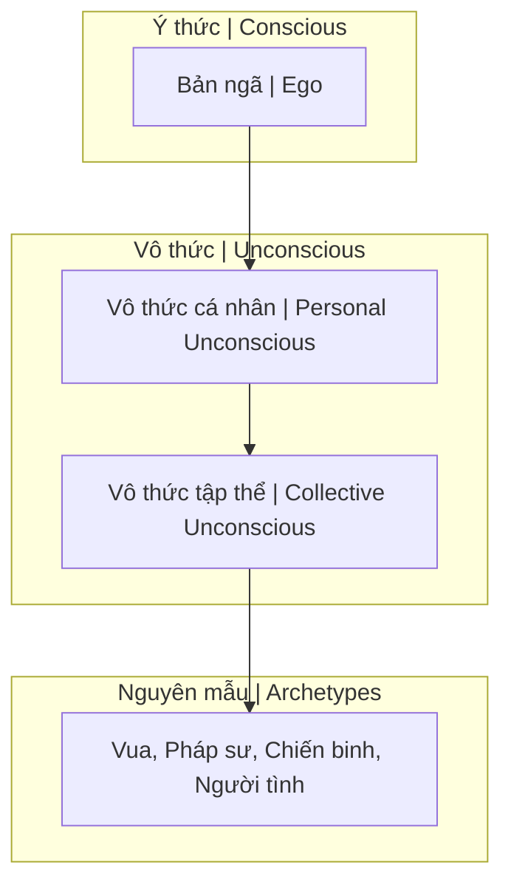

---
title: "S.E.X Và Tâm Lý Học Jung"
aliases: ["Sacred Energy eXchange and Jung", "S.E.X và Jung"]
date: 2026-04-07
tags: [mental-model, esoterica, psychology]
status: refined
---

# S.E.X Và Tâm Lý Học Jung

Bài viết này phân tích **S.E.X (Sacred Energy eXchange)** dưới góc nhìn [[Tâm Lý Học Jung]], kết hợp với khoa học hiện đại về Microchimerism và truyền thống huyền học phương Đông.

*This article analyzes **S.E.X (Sacred Energy eXchange)** through the lens of [[Tâm Lý Học Jung|Jungian Psychology]], combined with modern science on Microchimerism and Eastern esoteric traditions.*

---

## 1. Định Nghĩa Lại S.E.X / Redefining S.E.X

### Nghĩa thông thường vs Huyền học / Common vs Esoteric Meaning

| Góc nhìn / Perspective | Định nghĩa / Definition |
|------------------------|------------------------|
| **Thông thường** | Quan hệ thể xác / Physical intercourse |
| **Huyền học** | **S**acred **E**nergy e**X**change — Trao đổi năng lượng thiêng liêng |

### Gematria

S.E.X = S(19) + E(5) + X(24) = **48**

Tuy nhiên, trong các hội kín, S.E.X được liên kết với con số **33** — biểu tượng của sự thăng hoa năng lượng hoặc kiểm soát.

*In secret societies, S.E.X is linked to number **33** — symbol of energy ascension or control.*

---

## 2. Microchimerism — Khoa Học Về Chimera

### Chimera là gì? / What is Chimera?

**Chimera** là một cá thể mang nhiều hơn một hệ gene — thuật ngữ lấy từ sinh vật thần thoại Hy Lạp có đầu sư tử, thân dê, đuôi rắn.

*Chimera is an individual carrying more than one genetic system — term from Greek mythological creature with lion head, goat body, snake tail.*

### Cơ chế / Mechanism

Nghiên cứu khoa học cho thấy:
- Phụ nữ có thể **hấp thụ và lưu giữ DNA** của đối tác nam suốt đời
- DNA này tồn tại trong não, gan, và các cơ quan khác
- Ảnh hưởng đến hệ miễn dịch và có thể cả tư duy

*Scientific research shows women can absorb and retain male partner's DNA for life — in brain, liver, and other organs.*

→ Xem thêm: [[Chimera]]

### Hệ quả / Consequences

| Hành vi / Behavior | Hệ quả / Consequence |
|--------------------|----------------------|
| Nhiều đối tác | DNA hỗn tạp / Mixed DNA |
| Quan hệ bừa bãi | Năng lượng low-level / Low-level energy |
| Ảnh hưởng thế hệ sau | Suy yếu dòng giống / Weakened lineage |

> **"Tam tinh thành nhất độc"** — Ba tinh hoa hợp thành một chất độc.
>
> *"Three essences become one poison."*

---

## 3. Tâm Lý Học Jung — 4 Phần Tâm Linh

### Cấu trúc tâm lý theo Jung / Jung's Psychic Structure

S.E.X không chỉ trao đổi DNA mà còn trao đổi **4 phần tâm linh**:

*S.E.X exchanges not just DNA but also **4 psychic components**:*

| Thành phần / Component | Ý nghĩa / Meaning |
|------------------------|-------------------|
| **Bản ngã (Ego)** | Ý thức cá nhân / Personal consciousness |
| **Vô thức cá nhân** | Ký ức bị đè nén / Repressed memories |
| **Vô thức tập thể** | Kho tàng tri thức chung / Collective knowledge (Akashic) |
| **Nguyên mẫu (Archetypes)** | Hình ảnh phổ quát / Universal patterns |

### Các Nguyên Mẫu Cơ Bản / Basic Archetypes

| Nguyên mẫu / Archetype | Mô tả / Description |
|------------------------|---------------------|
| **Persona (Mặt nạ)** | Vai diễn trước thế giới / Mask for the world |
| **Anima/Animus** | Tính nữ/nam trong vô thức / Female/male in unconscious |
| **Shadow (Bóng tối)** | Khía cạnh thú tính / Animal aspect |
| **Self (Bản ngã)** | Sự thống nhất, thành toàn / Unity, individuation |

> **"Thế giới là một sân khấu, và chúng ta đều là diễn viên."**
>
> *"The world is a stage, and we are all actors."*

→ Xem thêm: [[Nguyên Mẫu]], [[Individuation]]

---

## 4. Vô Thức Tập Thể — Thư Viện Akashic

### Collective Unconscious = Akashic Records?

Jung gọi đây là **Vô thức tập thể** — kho tàng tri thức chung của nhân loại.

Truyền thống phương Đông gọi đây là **Thư Viện Akashic** (Ether/Dĩ Thái) — nơi lưu trữ mọi ký ức, sự kiện, tư tưởng của vũ trụ.

*Jung called it **Collective Unconscious** — humanity's shared knowledge. Eastern traditions call it **Akashic Records** — storage of all memories, events, thoughts in the universe.*

### Khi quan hệ / During S.E.X

Khi hai người quan hệ, họ không chỉ trao đổi DNA mà còn:
- **Truy cập** vô thức của nhau
- **Hấp thụ** nguyên mẫu và ký ức
- **Kết nối** với vô thức tập thể của đối tác

*During intercourse, two people not only exchange DNA but also access each other's unconscious, absorb archetypes and memories, and connect to each other's collective unconscious.*

---

## 5. Anima/Animus — Bẫy Nhị Nguyên

### Tính Nữ/Tính Nam trong vô thức / Female/Male in Unconscious

| Khái niệm / Concept | Mô tả / Description |
|---------------------|---------------------|
| **Anima** | Tính nữ trong đàn ông / Feminine in man |
| **Animus** | Tính nam trong phụ nữ / Masculine in woman |

Mỗi người đều mang cả hai giới tính trong vô thức — đây là lý do chúng ta bị hấp dẫn bởi đối tác (tìm kiếm phần còn thiếu).

*Everyone carries both genders in the unconscious — this is why we're attracted to partners (seeking the missing part).*

### Cảnh báo về Bẫy Nhị Nguyên / Duality Trap Warning

Việc tìm kiếm "nửa kia" có thể trở thành **bẫy nhị nguyên** — phụ thuộc vào bên ngoài thay vì tích hợp bên trong.

*Seeking "the other half" can become a **duality trap** — depending on external instead of integrating internally.*

→ Xem thêm: [[Nhị Nguyên]], [[Individuation]]

---

## 6. Shadow — Bóng Tối Và Năng Lượng

### Bóng Tối là gì? / What is Shadow?

**Shadow** là khía cạnh thú tính, những phần bị đè nén của tâm lý. Nó là nguồn năng lượng mạnh mẽ nhất — có thể **kiến tạo hoặc hủy diệt**.

*Shadow is the animal aspect, repressed parts of the psyche. It's the most powerful energy source — can **create or destroy**.*

### Trong S.E.X

S.E.X là một trong những cách trực tiếp nhất để tiếp xúc với Shadow — cả của bạn và của đối tác.

*S.E.X is one of the most direct ways to contact Shadow — both yours and your partner's.*

| Cách tiếp cận / Approach | Kết quả / Result |
|--------------------------|------------------|
| Tỉnh thức / Conscious | Tích hợp, chữa lành / Integration, healing |
| Vô thức / Unconscious | Bị chiếm hữu, nghiện / Possession, addiction |

---

## 7. Liên Kết Với Tinh Khí Thần

### Tinh Khí Thần / Jing Qi Shen

Ba báu vật của con người theo truyền thống phương Đông:

*Three treasures of humans in Eastern tradition:*

| Báu vật / Treasure | Ý nghĩa / Meaning | Liên quan S.E.X |
|--------------------|-------------------|-----------------|
| **Tinh (Jing)** | Tinh chất, essence | Trực tiếp trao đổi |
| **Khí (Qi)** | Năng lượng, energy | Hòa trộn khi gần gũi |
| **Thần (Shen)** | Tinh thần, spirit | Kết nối sâu nhất |

→ Xem thêm: [[Tinh Khí Thần]]

---

## 8. Tại Sao Elite Chú Trọng Dòng Giống?

### Môn Đăng Hộ Đối / Matching Lineages

Các gia tộc [[Elite]] chú trọng:
- **Môn đăng hộ đối** — kết hôn trong cùng tầng lớp
- **Giữ gìn bộ gene** — không pha trộn với "hạ đẳng"
- **Kiểm soát năng lượng** — không cho năng lượng cao đi vào tầng thấp

*[[Elite]] families emphasize: matching lineages, preserving genes, controlling energy flow.*

### Họ biết điều gì? / What Do They Know?

Họ hiểu rằng S.E.X là **trao đổi năng lượng và thông tin di truyền** — không chỉ là khoái lạc. Vì vậy họ kiểm soát chặt chẽ.

*They understand S.E.X is **energy and genetic information exchange** — not just pleasure. Hence they control it strictly.*

---

## Kết Luận / Conclusion

> **S.E.X là Sacred Energy eXchange** — một nghi lễ năng lượng, không chỉ là hành động vật lý.
>
> Bạn đang trao đổi:
> - DNA (vật chất)
> - Tinh Khí Thần (năng lượng)
> - Vô thức, nguyên mẫu, shadow (tâm linh)
>
> **Hãy chọn đối tác một cách tỉnh thức.**

> *S.E.X is Sacred Energy eXchange — an energy ritual, not just a physical act.*
>
> *You're exchanging: DNA (matter), Jing Qi Shen (energy), unconscious, archetypes, shadow (spirit).*
>
> ***Choose your partners consciously.***

---

## Related / Liên quan

### S.E.X & Năng lượng
- [[S.E.X]] — Tóm tắt / Summary
- [[Năng Lượng Tình Dục]] — Sexual energy
- [[Tinh Khí Thần]] — Three treasures
- [[Quy Luật Trao Đổi Tâm Linh]] — Spiritual exchange law

### Tâm Lý Học Jung
- [[Tâm Lý Học Jung]] — Overview
- [[Nguyên Mẫu]] — Archetypes
- [[Individuation]] — Self-realization
- [[Vô Thức Tập Thể]] — Collective unconscious
- [[Nhị Nguyên]] — Duality trap

### Sinh học & Chimera
- [[Chimera]] — Mixed entity
- [[Elite]] — Why they preserve lineages

### Khác / Others
- [[Sự Thật Đen Tối Về Phim Khiêu Dâm]] — Dark truth about porn
- [[Gematria]] — Number symbolism
