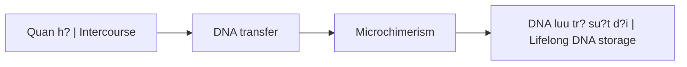
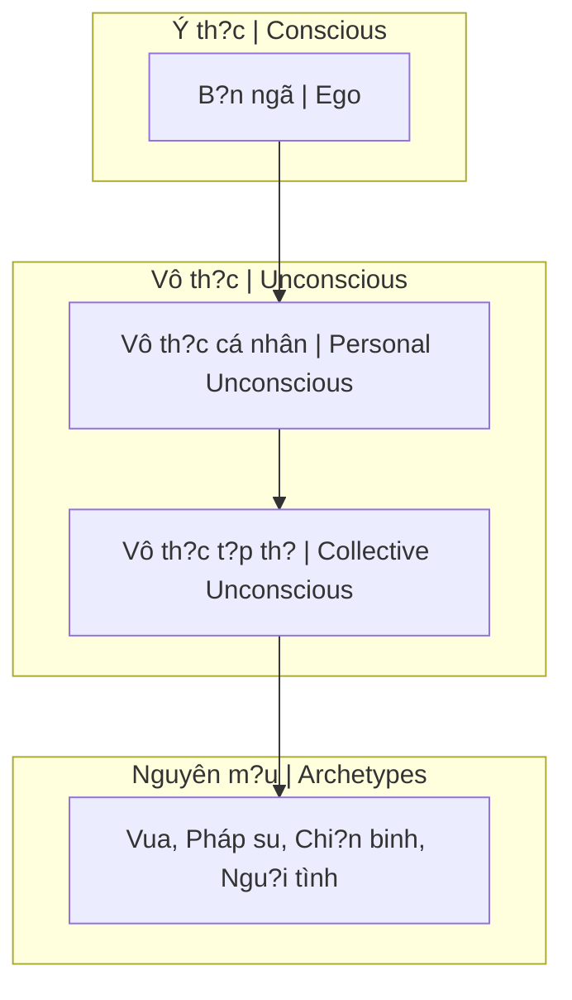

# S.E.X Và Tâm Lý H?c Jung

Bài vi?t này phân tích **S.E.X (Sacred Energy eXchange)** du?i góc nhìn [[Tâm Lý H?c Jung]], k?t h?p v?i khoa h?c hi?n d?i v? Microchimerism và truy?n th?ng huy?n h?c phuong Ðông.

*This article analyzes **S.E.X (Sacred Energy eXchange)** through the lens of [[Tâm Lý H?c Jung|Jungian Psychology]], combined with modern science on Microchimerism and Eastern esoteric traditions.*

---

## 1. Ð?nh Nghia L?i S.E.X / Redefining S.E.X

### Nghia thông thu?ng vs Huy?n h?c / Common vs Esoteric Meaning

| Góc nhìn / Perspective | Ð?nh nghia / Definition |
|------------------------|------------------------|
| **Thông thu?ng** | Quan h? th? xác / Physical intercourse |
| **Huy?n h?c** | **S**acred **E**nergy e**X**change - Trao d?i nang lu?ng thiêng liêng |

### Gematria

S.E.X = S(19) + E(5) + X(24) = **48**

Tuy nhiên, trong các h?i kín, S.E.X du?c liên k?t v?i con s? **33** - bi?u tu?ng c?a s? thang hoa nang lu?ng ho?c ki?m soát.

*In secret societies, S.E.X is linked to number **33** - symbol of energy ascension or control.*

---

## 2. Microchimerism - Khoa H?c V? Chimera

### Chimera là gì? / What is Chimera?

**Chimera** là m?t cá th? mang nhi?u hon m?t h? gene - thu?t ng? l?y t? sinh v?t th?n tho?i Hy L?p có d?u su t?, thân dê, duôi r?n.

*Chimera is an individual carrying more than one genetic system - term from Greek mythological creature with lion head, goat body, snake tail.*

### Co ch? / Mechanism

Nghiên c?u khoa h?c cho th?y:
- Ph? n? có th? **h?p th? và luu gi? DNA** c?a d?i tác nam su?t d?i
- DNA này t?n t?i trong não, gan, và các co quan khác
- ?nh hu?ng d?n h? mi?n d?ch và có th? c? tu duy

*Scientific research shows women can absorb and retain male partner's DNA for life - in brain, liver, and other organs.*

? Xem thêm: [[Chimera]]

### H? qu? / Consequences

| Hành vi / Behavior | H? qu? / Consequence |
|--------------------|----------------------|
| Nhi?u d?i tác | DNA h?n t?p / Mixed DNA |
| Quan h? b?a bãi | Nang lu?ng low-level / Low-level energy |
| ?nh hu?ng th? h? sau | Suy y?u dòng gi?ng / Weakened lineage |

> **"Tam tinh thành nh?t d?c"** - Ba tinh hoa h?p thành m?t ch?t d?c.
>
> *"Three essences become one poison."*

---

## 3. Tâm Lý H?c Jung - 4 Ph?n Tâm Linh

### C?u trúc tâm lý theo Jung / Jung's Psychic Structure

S.E.X không ch? trao d?i DNA mà còn trao d?i **4 ph?n tâm linh**:

*S.E.X exchanges not just DNA but also **4 psychic components**:*

| Thành ph?n / Component | Ý nghia / Meaning |
|------------------------|-------------------|
| **B?n ngã (Ego)** | Ý th?c cá nhân / Personal consciousness |
| **Vô th?c cá nhân** | Ký ?c b? dè nén / Repressed memories |
| **Vô th?c t?p th?** | Kho tàng tri th?c chung / Collective knowledge (Akashic) |
| **Nguyên m?u (Archetypes)** | Hình ?nh ph? quát / Universal patterns |

### Các Nguyên M?u Co B?n / Basic Archetypes

| Nguyên m?u / Archetype | Mô t? / Description |
|------------------------|---------------------|
| **Persona (M?t n?)** | Vai di?n tru?c th? gi?i / Mask for the world |
| **Anima/Animus** | Tính n?/nam trong vô th?c / Female/male in unconscious |
| **Shadow (Bóng t?i)** | Khía c?nh thú tính / Animal aspect |
| **Self (B?n ngã)** | S? th?ng nh?t, thành toàn / Unity, individuation |

> **"Th? gi?i là m?t sân kh?u, và chúng ta d?u là di?n viên."**
>
> *"The world is a stage, and we are all actors."*

? Xem thêm: [[Nguyên M?u]], [[Individuation]]

---

## 4. Vô Th?c T?p Th? - Thu Vi?n Akashic

### Collective Unconscious = Akashic Records?

Jung g?i dây là **Vô th?c t?p th?** - kho tàng tri th?c chung c?a nhân lo?i.

Truy?n th?ng phuong Ðông g?i dây là **Thu Vi?n Akashic** (Ether/Di Thái) - noi luu tr? m?i ký ?c, s? ki?n, tu tu?ng c?a vu tr?.

*Jung called it **Collective Unconscious** - humanity's shared knowledge. Eastern traditions call it **Akashic Records** - storage of all memories, events, thoughts in the universe.*

### Khi quan h? / During S.E.X

Khi hai ngu?i quan h?, h? không ch? trao d?i DNA mà còn:
- **Truy c?p** vô th?c c?a nhau
- **H?p th?** nguyên m?u và ký ?c
- **K?t n?i** v?i vô th?c t?p th? c?a d?i tác

*During intercourse, two people not only exchange DNA but also access each other's unconscious, absorb archetypes and memories, and connect to each other's collective unconscious.*

---

## 5. Anima/Animus - B?y Nh? Nguyên

### Tính N?/Tính Nam trong vô th?c / Female/Male in Unconscious

| Khái ni?m / Concept | Mô t? / Description |
|---------------------|---------------------|
| **Anima** | Tính n? trong dàn ông / Feminine in man |
| **Animus** | Tính nam trong ph? n? / Masculine in woman |

M?i ngu?i d?u mang c? hai gi?i tính trong vô th?c - dây là lý do chúng ta b? h?p d?n b?i d?i tác (tìm ki?m ph?n còn thi?u).

*Everyone carries both genders in the unconscious - this is why we're attracted to partners (seeking the missing part).*

### C?nh báo v? B?y Nh? Nguyên / Duality Trap Warning

Vi?c tìm ki?m "n?a kia" có th? tr? thành **b?y nh? nguyên** - ph? thu?c vào bên ngoài thay vì tích h?p bên trong.

*Seeking "the other half" can become a **duality trap** - depending on external instead of integrating internally.*

? Xem thêm: [[Nh? Nguyên]], [[Individuation]]

---

## 6. Shadow - Bóng T?i Và Nang Lu?ng

### Bóng T?i là gì? / What is Shadow?

**Shadow** là khía c?nh thú tính, nh?ng ph?n b? dè nén c?a tâm lý. Nó là ngu?n nang lu?ng m?nh m? nh?t - có th? **ki?n t?o ho?c h?y di?t**.

*Shadow is the animal aspect, repressed parts of the psyche. It's the most powerful energy source - can **create or destroy**.*

### Trong S.E.X

S.E.X là m?t trong nh?ng cách tr?c ti?p nh?t d? ti?p xúc v?i Shadow - c? c?a b?n và c?a d?i tác.

*S.E.X is one of the most direct ways to contact Shadow - both yours and your partner's.*

| Cách ti?p c?n / Approach | K?t qu? / Result |
|--------------------------|------------------|
| T?nh th?c / Conscious | Tích h?p, ch?a lành / Integration, healing |
| Vô th?c / Unconscious | B? chi?m h?u, nghi?n / Possession, addiction |

---

## 7. Liên K?t V?i Tinh Khí Th?n

### Tinh Khí Th?n / Jing Qi Shen

Ba báu v?t c?a con ngu?i theo truy?n th?ng phuong Ðông:

*Three treasures of humans in Eastern tradition:*

| Báu v?t / Treasure | Ý nghia / Meaning | Liên quan S.E.X |
|--------------------|-------------------|-----------------|
| **Tinh (Jing)** | Tinh ch?t, essence | Tr?c ti?p trao d?i |
| **Khí (Qi)** | Nang lu?ng, energy | Hòa tr?n khi g?n gui |
| **Th?n (Shen)** | Tinh th?n, spirit | K?t n?i sâu nh?t |

? Xem thêm: [[Tinh Khí Th?n]]

---

## 8. T?i Sao Elite Chú Tr?ng Dòng Gi?ng?

### Môn Ðang H? Ð?i / Matching Lineages

Các gia t?c [[Elite]] chú tr?ng:
- **Môn dang h? d?i** - k?t hôn trong cùng t?ng l?p
- **Gi? gìn b? gene** - không pha tr?n v?i "h? d?ng"
- **Ki?m soát nang lu?ng** - không cho nang lu?ng cao di vào t?ng th?p

*[[Elite]] families emphasize: matching lineages, preserving genes, controlling energy flow.*

### H? bi?t di?u gì? / What Do They Know?

H? hi?u r?ng S.E.X là **trao d?i nang lu?ng và thông tin di truy?n** - không ch? là khoái l?c. Vì v?y h? ki?m soát ch?t ch?.

*They understand S.E.X is **energy and genetic information exchange** - not just pleasure. Hence they control it strictly.*

---

## K?t Lu?n / Conclusion

> **S.E.X là Sacred Energy eXchange** - m?t nghi l? nang lu?ng, không ch? là hành d?ng v?t lý.
>
> B?n dang trao d?i:
> - DNA (v?t ch?t)
> - Tinh Khí Th?n (nang lu?ng)
> - Vô th?c, nguyên m?u, shadow (tâm linh)
>
> **Hãy ch?n d?i tác m?t cách t?nh th?c.**

> *S.E.X is Sacred Energy eXchange - an energy ritual, not just a physical act.*
>
> *You're exchanging: DNA (matter), Jing Qi Shen (energy), unconscious, archetypes, shadow (spirit).*
>
> ***Choose your partners consciously.***

---

## Related / Liên quan

### S.E.X & Nang lu?ng
- [[S.E.X]] - Tóm t?t / Summary
- [[Nang Lu?ng Tình D?c]] - Sexual energy
- [[Tinh Khí Th?n]] - Three treasures
- [[Quy Lu?t Trao Ð?i Tâm Linh]] - Spiritual exchange law

### Tâm Lý H?c Jung
- [[Tâm Lý H?c Jung]] - Overview
- [[Nguyên M?u]] - Archetypes
- [[Individuation]] - Self-realization
- [[Vô Th?c T?p Th?]] - Collective unconscious
- [[Nh? Nguyên]] - Duality trap

### Sinh h?c & Chimera
- [[Chimera]] - Mixed entity
- [[Elite]] - Why they preserve lineages

### Khác / Others
- [[S? Th?t Ðen T?i V? Phim Khiêu Dâm]] - Dark truth about porn
- [[Gematria]] - Number symbolism
