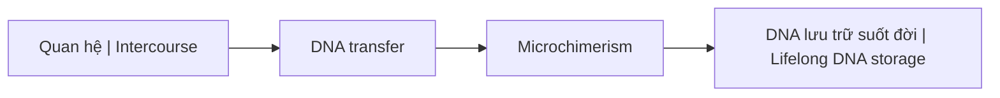
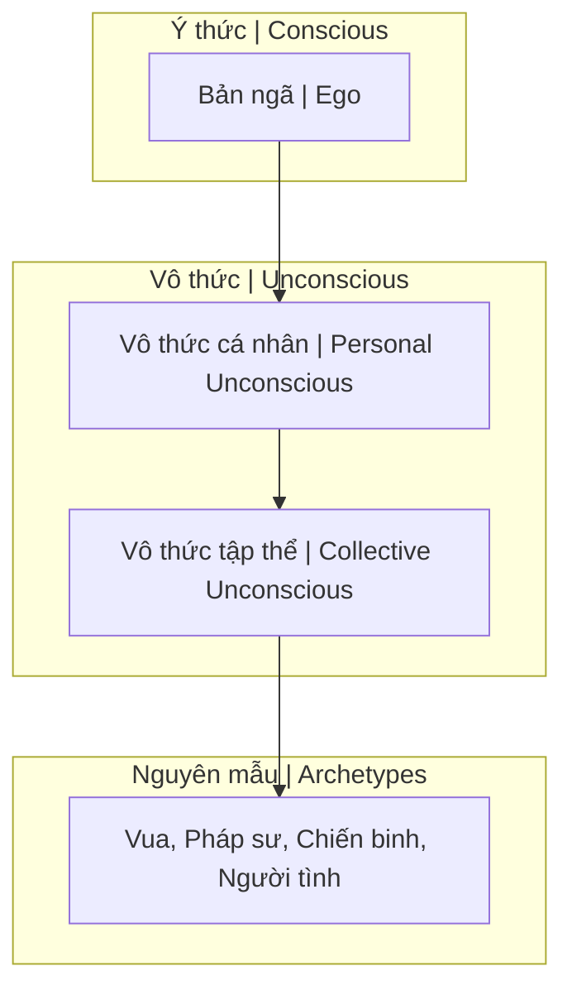
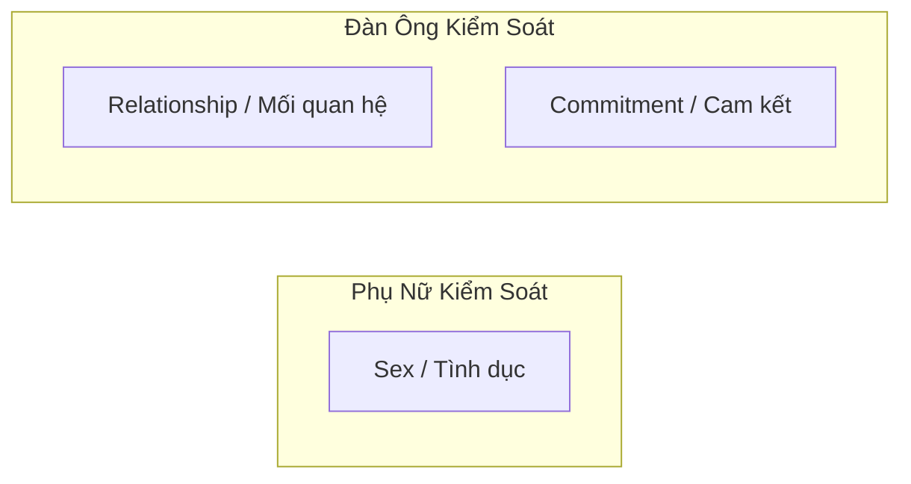
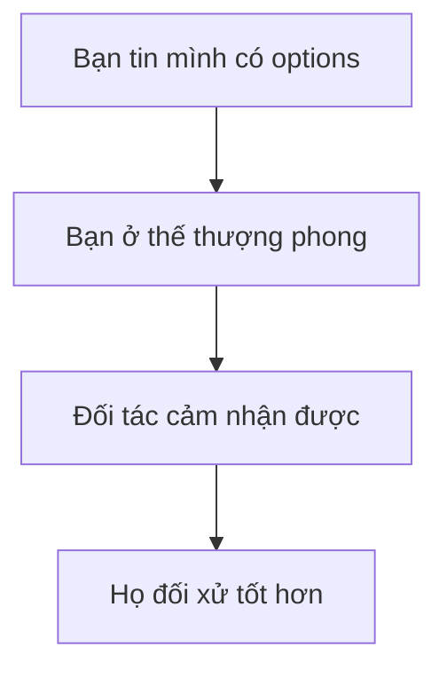
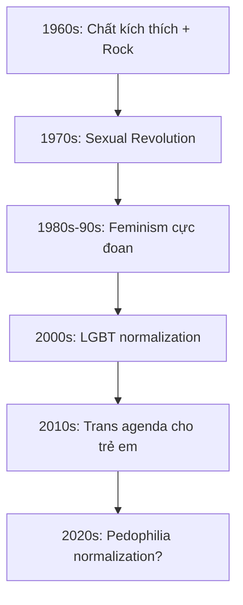
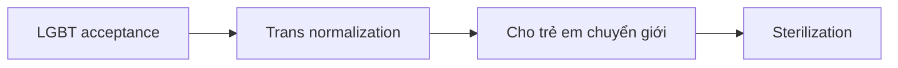
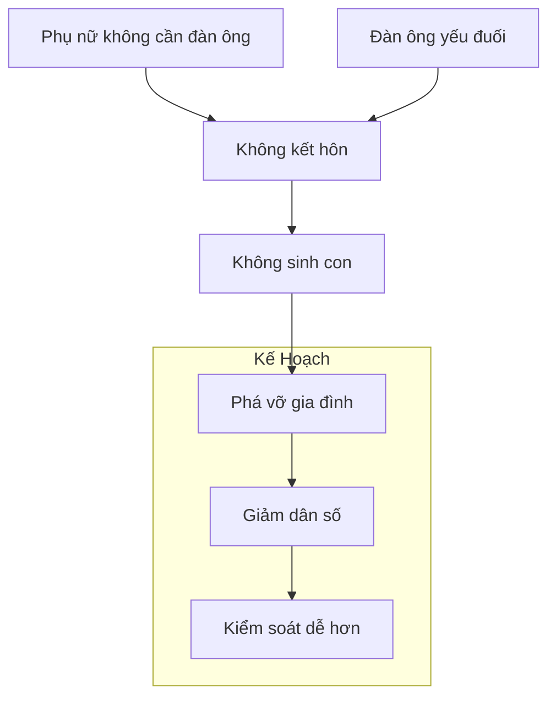
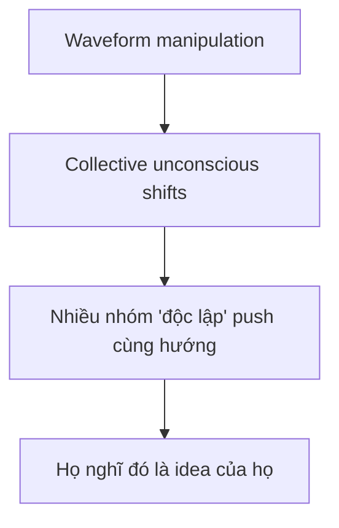
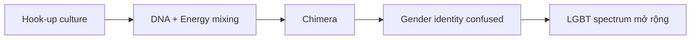

---
title: "S.E.X Và Tâm Lý Học Jung"
aliases: ["Sacred Energy eXchange and Jung", "S.E.X và Jung"]
date: 2026-04-07
tags: [mental-model, esoterica, psychology]
status: refined
---

# S.E.X Và Tâm Lý Học Jung

Bài viết này phân tích **S.E.X (Sacred Energy eXchange)** dưới góc nhìn [[Tâm Lý Học Jung]], kết hợp với khoa học hiện đại về Microchimerism và truyền thống huyền học phương Đông.

*This article analyzes **S.E.X (Sacred Energy eXchange)** through the lens of [[Tâm Lý Học Jung|Jungian Psychology]], combined with modern science on Microchimerism and Eastern esoteric traditions.*

---

## 1. Định Nghĩa Lại S.E.X / Redefining S.E.X

### Nghĩa thông thường vs Huyền học / Common vs Esoteric Meaning

| Góc nhìn / Perspective | Định nghĩa / Definition |
|------------------------|------------------------|
| **Thông thường** | Quan hệ thể xác / Physical intercourse |
| **Huyền học** | **S**acred **E**nergy e**X**change — Trao đổi năng lượng thiêng liêng |

### Gematria

S.E.X = S(19) + E(5) + X(24) = **48**

Tuy nhiên, trong các hội kín, S.E.X được liên kết với con số **33** — biểu tượng của sự thăng hoa năng lượng hoặc kiểm soát.

*In secret societies, S.E.X is linked to number **33** — symbol of energy ascension or control.*

---

## 2. Microchimerism — Khoa Học Về Chimera

### Chimera là gì? / What is Chimera?

**Chimera** là một cá thể mang nhiều hơn một hệ gene — thuật ngữ lấy từ sinh vật thần thoại Hy Lạp có đầu sư tử, thân dê, đuôi rắn.

*Chimera is an individual carrying more than one genetic system — term from Greek mythological creature with lion head, goat body, snake tail.*

### Cơ chế / Mechanism



Nghiên cứu khoa học cho thấy:
- Phụ nữ có thể **hấp thụ và lưu giữ DNA** của đối tác nam suốt đời
- DNA này tồn tại trong não, gan, và các cơ quan khác
- Ảnh hưởng đến hệ miễn dịch và có thể cả tư duy

*Scientific research shows women can absorb and retain male partner's DNA for life — in brain, liver, and other organs.*

→ Xem thêm: [[Chimera]]

### Hệ quả / Consequences

| Hành vi / Behavior | Hệ quả / Consequence |
|--------------------|----------------------|
| Nhiều đối tác | DNA hỗn tạp / Mixed DNA |
| Quan hệ bừa bãi | Năng lượng low-level / Low-level energy |
| Ảnh hưởng thế hệ sau | Suy yếu dòng giống / Weakened lineage |

> **"Tam tinh thành nhất độc"** — Ba tinh hoa hợp thành một chất độc.
>
> *"Three essences become one poison."*

---

## 3. Tâm Lý Học Jung — 4 Phần Tâm Linh

### Cấu trúc tâm lý theo Jung / Jung's Psychic Structure

S.E.X không chỉ trao đổi DNA mà còn trao đổi **4 phần tâm linh**:

*S.E.X exchanges not just DNA but also **4 psychic components**:*



| Thành phần / Component | Ý nghĩa / Meaning |
|------------------------|-------------------|
| **Bản ngã (Ego)** | Ý thức cá nhân / Personal consciousness |
| **Vô thức cá nhân** | Ký ức bị đè nén / Repressed memories |
| **Vô thức tập thể** | Kho tàng tri thức chung / Collective knowledge (Akashic) |
| **Nguyên mẫu (Archetypes)** | Hình ảnh phổ quát / Universal patterns |

### Các Nguyên Mẫu Cơ Bản / Basic Archetypes

| Nguyên mẫu / Archetype | Mô tả / Description |
|------------------------|---------------------|
| **Persona (Mặt nạ)** | Vai diễn trước thế giới / Mask for the world |
| **Anima/Animus** | Tính nữ/nam trong vô thức / Female/male in unconscious |
| **Shadow (Bóng tối)** | Khía cạnh thú tính / Animal aspect |
| **Self (Bản ngã)** | Sự thống nhất, thành toàn / Unity, individuation |

> **"Thế giới là một sân khấu, và chúng ta đều là diễn viên."**
>
> *"The world is a stage, and we are all actors."*

→ Xem thêm: [[Nguyên Mẫu]], [[Individuation]]

---

## 4. Vô Thức Tập Thể — Thư Viện Akashic

### Collective Unconscious = Akashic Records?

Jung gọi đây là **Vô thức tập thể** — kho tàng tri thức chung của nhân loại.

Truyền thống phương Đông gọi đây là **Thư Viện Akashic** (Ether/Dĩ Thái) — nơi lưu trữ mọi ký ức, sự kiện, tư tưởng của vũ trụ.

*Jung called it **Collective Unconscious** — humanity's shared knowledge. Eastern traditions call it **Akashic Records** — storage of all memories, events, thoughts in the universe.*

### Khi quan hệ / During S.E.X

Khi hai người quan hệ, họ không chỉ trao đổi DNA mà còn:
- **Truy cập** vô thức của nhau
- **Hấp thụ** nguyên mẫu và ký ức
- **Kết nối** với vô thức tập thể của đối tác

*During intercourse, two people not only exchange DNA but also access each other's unconscious, absorb archetypes and memories, and connect to each other's collective unconscious.*

---

## 5. Anima/Animus — Bẫy Nhị Nguyên

### Tính Nữ/Tính Nam trong vô thức / Female/Male in Unconscious

| Khái niệm / Concept | Mô tả / Description |
|---------------------|---------------------|
| **Anima** | Tính nữ trong đàn ông / Feminine in man |
| **Animus** | Tính nam trong phụ nữ / Masculine in woman |

Mỗi người đều mang cả hai giới tính trong vô thức — đây là lý do chúng ta bị hấp dẫn bởi đối tác (tìm kiếm phần còn thiếu).

*Everyone carries both genders in the unconscious — this is why we're attracted to partners (seeking the missing part).*

### Cảnh báo về Bẫy Nhị Nguyên / Duality Trap Warning

Việc tìm kiếm "nửa kia" có thể trở thành **bẫy nhị nguyên** — phụ thuộc vào bên ngoài thay vì tích hợp bên trong.

*Seeking "the other half" can become a **duality trap** — depending on external instead of integrating internally.*

→ Xem thêm: [[Nhị Nguyên]], [[Individuation]]

---

## 6. Shadow — Bóng Tối Và Năng Lượng

### Bóng Tối là gì? / What is Shadow?

**Shadow** là khía cạnh thú tính, những phần bị đè nén của tâm lý. Nó là nguồn năng lượng mạnh mẽ nhất — có thể **kiến tạo hoặc hủy diệt**.

*Shadow is the animal aspect, repressed parts of the psyche. It's the most powerful energy source — can **create or destroy**.*

### Trong S.E.X

S.E.X là một trong những cách trực tiếp nhất để tiếp xúc với Shadow — cả của bạn và của đối tác.

*S.E.X is one of the most direct ways to contact Shadow — both yours and your partner's.*

| Cách tiếp cận / Approach | Kết quả / Result |
|--------------------------|------------------|
| Tỉnh thức / Conscious | Tích hợp, chữa lành / Integration, healing |
| Vô thức / Unconscious | Bị chiếm hữu, nghiện / Possession, addiction |

---

## 7. Liên Kết Với Tinh Khí Thần

### Tinh Khí Thần / Jing Qi Shen

Ba báu vật của con người theo truyền thống phương Đông:

*Three treasures of humans in Eastern tradition:*

| Báu vật / Treasure | Ý nghĩa / Meaning | Liên quan S.E.X |
|--------------------|-------------------|-----------------|
| **Tinh (Jing)** | Tinh chất, essence | Trực tiếp trao đổi |
| **Khí (Qi)** | Năng lượng, energy | Hòa trộn khi gần gũi |
| **Thần (Shen)** | Tinh thần, spirit | Kết nối sâu nhất |

→ Xem thêm: [[Tinh Khí Thần]]

---

## 8. Tại Sao Elite Chú Trọng Dòng Giống?

### Môn Đăng Hộ Đối / Matching Lineages

Các gia tộc [[Elite]] chú trọng:
- **Môn đăng hộ đối** — kết hôn trong cùng tầng lớp
- **Giữ gìn bộ gene** — không pha trộn với "hạ đẳng"
- **Kiểm soát năng lượng** — không cho năng lượng cao đi vào tầng thấp

*[[Elite]] families emphasize: matching lineages, preserving genes, controlling energy flow.*

### Họ biết điều gì? / What Do They Know?

Họ hiểu rằng S.E.X là **trao đổi năng lượng và thông tin di truyền** — không chỉ là khoái lạc. Vì vậy họ kiểm soát chặt chẽ.

*They understand S.E.X is **energy and genetic information exchange** — not just pleasure. Hence they control it strictly.*

---

## Kết Luận / Conclusion

> **S.E.X là Sacred Energy eXchange** — một nghi lễ năng lượng, không chỉ là hành động vật lý.
>
> Bạn đang trao đổi:
> - DNA (vật chất)
> - Tinh Khí Thần (năng lượng)
> - Vô thức, nguyên mẫu, shadow (tâm linh)
>
> **Hãy chọn đối tác một cách tỉnh thức.**

> *S.E.X is Sacred Energy eXchange — an energy ritual, not just a physical act.*
>
> *You're exchanging: DNA (matter), Jing Qi Shen (energy), unconscious, archetypes, shadow (spirit).*
>
> ***Choose your partners consciously.***

---

## Related / Liên quan

### S.E.X & Năng lượng
- [[S.E.X]] — Tóm tắt / Summary
- [[Năng Lượng Tình Dục]] — Sexual energy
- [[Tinh Khí Thần]] — Three treasures
- [[Quy Luật Trao Đổi Tâm Linh]] — Spiritual exchange law

### Tâm Lý Học Jung
- [[Tâm Lý Học Jung]] — Overview
- [[Nguyên Mẫu]] — Archetypes
- [[Individuation]] — Self-realization
- [[Vô Thức Tập Thể]] — Collective unconscious
- [[Nhị Nguyên]] — Duality trap

### Sinh học & Chimera
- [[Chimera]] — Mixed entity
- [[Elite]] — Why they preserve lineages

### Khác / Others
- [[Sự Thật Đen Tối Về Phim Khiêu Dâm]] — Dark truth about porn
- [[Gematria]] — Number symbolism

---
title: Tâm Lý Học Jung
date: 2026-04-12
tags: [mental-model]
status: refined
---
# Tâm Lý Học Jung (Jungian Psychology)

**Tâm lý học phân tích** (Analytical Psychology) do Carl Gustav Jung sáng lập — nền tảng quan trọng giải mã tâm trí con người, mở rộng ra thế giới tâm linh.

*Analytical Psychology founded by Carl Gustav Jung — crucial foundation for decoding the human mind, extending into the spiritual world.*

---

## Các Khái niệm Cốt lõi / Core Concepts

### 1. [[Individuation]]

Quá trình cốt lõi: hành trình tự nhận thức, tích hợp các mặt đối lập trong tâm hồn để trở thành cá nhân trọn vẹn.

*The core process: journey of self-awareness, integrating opposites in the psyche to become a whole individual.*

### 2. [[Vô Thức Tập Thể]] (Collective Unconscious)

Tầng sâu nhất của tâm trí, nơi lưu trữ ký ức và kinh nghiệm chung của toàn nhân loại.

*The deepest layer of the mind, storing shared memories and experiences of all humanity.*

### 3. [[Nguyên Mẫu]]

Các mô hình phổ quát định hình hành vi con người qua hàng thiên niên kỷ.

*Universal patterns shaping human behavior across millennia.*

---

## Cấu trúc Tâm thức / Structure of Psyche

```
Ego (Conscious self / Bản ngã ý thức)
    ↓
Personal Unconscious (Vô thức cá nhân)
    ↓
Collective Unconscious (Vô thức tập thể)
    → Archetypes (Nguyên mẫu)
```

### Key Archetypes / Nguyên mẫu chính

| Archetype | Description / Mô tả |
|-----------|---------------------|
| **Shadow** | Dark side, repressed / Mặt tối, bị đè nén |
| **Anima/Animus** | Inner feminine/masculine / Nữ/Nam tính bên trong |
| **Persona** | Social mask / Mặt nạ xã hội |
| **Self** | Totality, wholeness / Toàn thể, trọn vẹn |

---

## Shadow Work / Làm việc với Bóng Tối

### Process / Quá trình

1. **Recognize** — Nhận ra bóng tối / See your shadow
2. **Accept** — Chấp nhận / Accept it exists
3. **Integrate** — Tích hợp / Make it conscious
4. **Transform** — Chuyển hóa / Use its energy positively

### Signs of Shadow / Dấu hiệu của Shadow

- What you hate in others / Điều bạn ghét ở người khác
- Recurring patterns / Mẫu lặp lại
- Emotional triggers / Kích hoạt cảm xúc
- Dreams of dark figures / Mơ về hình bóng tối

---

## Kết nối Thể chất & Năng lượng / Body & Energy Connection

### Mind-Body

Tinh thần minh mẫn cần cơ thể khỏe mạnh:
*Clear mind needs healthy body:*

- [[Hệ Tiêu Hóa - Bộ Não Thứ Hai]] — Gut-brain axis
- [[The China Study]] — Nutrition impacts

### Eastern Parallels / Tương đồng Phương Đông

| Jung | Eastern Tradition |
|------|-------------------|
| Individuation | Kundalini awakening |
| Self archetype | Buddha nature |
| Collective unconscious | Akashic records |
| Psychic energy (libido) | Chi/Prana |

---

## Jung và Ma Trận / Jung & the Matrix

### Individuation = Escaping Matrix

- Không còn bị lập trình / No longer programmed
- Nhìn thấy projections / See projections
- Chủ quyền tâm lý / Psychological sovereignty
- [[Elite]] loses control

### Why Jung Matters Today

- Social media = collective shadow
- Propaganda targets archetypes
- Mass manipulation via unconscious
- Individuation = resistance

---

## Quotes

> "Until you make the unconscious conscious, it will direct your life and you will call it fate."

> "One does not become enlightened by imagining figures of light, but by making the darkness conscious."

---

## Related

### Core Concepts / Khái niệm cốt lõi
- [[Individuation]]
- [[Nguyên Mẫu]]
- [[Vô Thức Tập Thể]]

### Body Connection / Kết nối Thể chất
- [[Hệ Tiêu Hóa - Bộ Não Thứ Hai]]
- [[The China Study]]

### Matrix Escape / Thoát Ma Trận
- [[Ma Trận]]
- [[Ma Trận - Giải Phẫu Hoàn Chỉnh]]
- [[Kiểm Soát Tâm Trí]]

---
title: "Tâm Lý Học Tiến Hóa Về Giới Tính"
aliases: ["Evolutionary Psychology of Gender", "Sexual Economics", "Red Pill Psychology"]
date: 2026-04-27
tags: [mental-models]
status: refined
---
# Tâm Lý Học Tiến Hóa Về Giới Tính

Có những sự thật về tâm lý nam-nữ mà xã hội hiện đại cố tình che đậy vì "political correctness". Nhưng những pattern này được lập trình trong DNA qua hàng triệu năm tiến hóa — không biến mất chỉ vì xã hội muốn chúng biến mất.

*There are truths about male-female psychology that modern society deliberately hides for "political correctness." But these patterns are programmed into DNA through millions of years of evolution — they don't disappear just because society wants them to.*

---

## Sexual Economics — Kinh Tế Học Tình Dục

### Ai Giữ Cửa Nào? / Who Guards Which Gate?



**Phụ nữ giữ cửa tình dục** — Đàn ông có ham muốn cao hơn, nên phụ nữ quyết định ai được "vào".

*Women guard the gate of sex — Men have higher desire, so women decide who gets "in".*

**Đàn ông giữ cửa mối quan hệ** — Phụ nữ cần mối quan hệ ổn định hơn (vì lý do tiến hóa), nên đàn ông quyết định ai được commitment.

*Men guard the gate of relationships — Women need stable relationships more (for evolutionary reasons), so men decide who gets commitment.*

> Đa số đàn ông không nhận ra quyền lực này và khờ khạo đem nộp "vũ khí hạt nhân" cho đối phương.
>
> *Most men don't realize this power and naively surrender their "nuclear weapon" to the other side.*

---

## Tại Sao Phụ Nữ Cần Mối Quan Hệ Hơn? / Why Women Need Relationships More?

### Góc Nhìn Tiến Hóa / Evolutionary Perspective

Một người phụ nữ khi mang thai và nuôi con nhỏ **cực kỳ dễ bị tổn thương**:

*A woman during pregnancy and nursing is extremely vulnerable:*

- Đứa trẻ sinh ra chưa hoàn thiện (não quá lớn)
- Cần ít nhất 1 năm mới biết đi (không như ngựa/hươu chạy ngay sau sinh)
- Không thể vừa chăm con vừa tự kiếm nguồn lực sinh tồn

→ **Phụ nữ cần người bạn đời** để đảm bảo sự sống còn của mình và con cái.

*→ Women need a partner to ensure survival for themselves and their children.*

### Biểu Hiện Trong Đời Thực

| Đàn ông tụ tập nói về | Phụ nữ tụ tập nói về |
|----------------------|---------------------|
| Công việc, xe cộ | Mối quan hệ |
| Thể thao, game | Chồng, bạn trai |
| Gái đẹp | Drama xã hội |
| Tiền, đầu tư | Ai đang hẹn hò ai |

**Mối quan hệ là thứ phụ nữ bị ám ảnh** — vì đó là nhu cầu sinh tồn được lập trình.

*Relationships are what women obsess over — because it's a programmed survival need.*

---

## Quyền Lực Trong Mối Quan Hệ / Power in Relationships

### Walk Away Power — Quyền Rời Đi

> Quyền lực lớn nhất trong một mối quan hệ là **sự sẵn lòng rời bỏ nó**.
>
> *The greatest power in a relationship is the **willingness to walk away**.*



**Nghịch lý:** Phụ nữ thực sự cảm thấy hạnh phúc và bị thu hút hơn khi họ cảm thấy **có nguy cơ mất đi** người đàn ông của mình.

*Paradox: Women actually feel happier and more attracted when they feel they might lose their man.*

### Bẫy "Scarcity Mindset"

Xã hội nhồi sọ đàn ông:
- "Cô ta là tốt nhất rồi"
- "Không thể tìm ai hơn đâu"
- "Phải biết trân trọng"

→ Khiến đàn ông **sợ mất** và mất quyền lực đàm phán.

*Society brainwashes men into scarcity mindset → Makes men fear loss and lose negotiating power.*

**Sự thật:** Luôn có người khác. Thế giới có 4 tỷ phụ nữ.

*Truth: There's always someone else. The world has 4 billion women.*

---

## Giá Trị Sinh Tồn vs Giá Trị Sinh Sản

### Phân Chia Tự Nhiên / Natural Division

| | Đàn ông | Phụ nữ |
|-|---------|--------|
| **Giá trị chính** | Sinh tồn (Survival) | Sinh sản (Reproduction) |
| **Biểu hiện** | Kiếm tiền, bảo vệ, xây dựng | Ngoại hình, sức khỏe sinh sản |
| **Bất an khi** | Không có kỹ năng sinh tồn | "Giá trị sinh sản" có vấn đề |
| **Không quan tâm khi bị chê** | Già, da nhăn, eo không thon | Không biết sửa nhà, kiếm ít tiền |

### Đàn Ông và Sự Bất An Âm Ỉ

Nếu đã dọn xong "rác tâm lý" nhưng vẫn bất an → **Thiếu kỹ năng sinh tồn.**

*If you've cleared psychological baggage but still feel anxious → You lack survival skills.*

**Kỹ năng sinh tồn đàn ông cần:**
- Bảo trì nhà cửa
- Sửa chữa cơ bản (điện, nước, xe)
- Tự vệ
- Kiếm tiền độc lập
- Giải quyết vấn đề

> Phụ nữ thích nhìn đàn ông làm việc tay chân (sửa xe, làm mộc, đi dây điện). Trong mắt họ, đó là người có thể **bảo vệ và chu cấp** cho tổ ấm.
>
> *Women love watching men do manual work. In their eyes, that's someone who can protect and provide.*

---

## Nice Guy Syndrome — Hội Chứng "Trai Ngoan"

### Cách Đàn Ông Bị "Tẩy Não"

Từ nhỏ, đàn ông bị xã hội (mẹ, cô giáo, media) dạy:
- Phải hi sinh vì phụ nữ
- Không được từ chối phụ nữ
- Phải "gentleman" một chiều
- Phải cầu hôn, phải chủ động 100%

→ Sau hàng chục năm, trở thành **nice guy** — đội phụ nữ lên đầu, không dám đòi hỏi.

*After decades, becomes a nice guy — puts women on pedestal, afraid to ask for anything.*

### Bài Tập: Fair & Healthy Entitlement

**Fair:** Khi phụ nữ yêu cầu gì đó, hỏi lại: *"Rồi tôi được gì?"*

**Entitlement:** Chủ động đòi hỏi (lành mạnh).

| Tình huống | Đòi hỏi nhỏ |
|------------|-------------|
| Mua đồ ăn | "Lấy thêm tương cà cho anh" |
| Hẹn hò | "Hôm nay em làm kiểu tóc này nhé" |
| Quan hệ | Đặt tiêu chuẩn rõ ràng |

**Mục đích:** Quen với việc đòi hỏi lành mạnh. Nếu bạn không tin mình xứng đáng, bạn sẽ không bao giờ "vào frame" được.

*Purpose: Get used to healthy asking. If you don't believe you deserve it, you'll never "get in frame."*

> **Toxic Entitlement** khác: Giá trị như cc nhưng đòi hỏi trên mây. Xấu nghèo ngu nhưng đòi thiên nga.

---

## Chọn Lọc Tự Nhiên — Metaphor Về "Giống"

### Bài Học Từ Người Nuôi Chó

Người nuôi giống (breeder) chuyên nghiệp:
- Chọn lọc bố mẹ tiêu chuẩn cao
- Kiểm tra di truyền, loại bỏ bệnh
- Mỗi lứa chỉ vài con đạt chuẩn

→ **Thuần chủng = giá trị cao, khỏe mạnh, sống lâu.**

*Purebred = high value, healthy, long-lived.*

### Khi Không Chọn Lọc

Nếu để tất cả sinh sản không chọn lọc:
- F1 yếu ớt → Dùng y học giữ sống
- F2, F3 → Tiếp tục yếu đi
- F4, F5 → Tích tụ đột biến, dị tật

> Đây là metaphor về việc xã hội hiện đại **loại bỏ chọn lọc tự nhiên** bằng cách cứu sống và cho sinh sản tất cả — kết quả dài hạn là gì?
>
> *This is a metaphor about modern society removing natural selection by saving and allowing all to reproduce — what's the long-term result?*

---

## Tóm Tắt / Summary

### Những Gì Xã Hội Che Giấu

1. **Đàn ông giữ cửa commitment** — Đây là quyền lực lớn nhất
2. **Walk away power** — Sẵn sàng rời đi = thượng phong
3. **Giá trị khác nhau** — Đàn ông = sinh tồn, Phụ nữ = sinh sản
4. **Nice guy = trap** — Được thiết kế để kiểm soát đàn ông
5. **Scarcity mindset = trap** — "Cô ấy là duy nhất" là lời nói dối

### Điều Cần Làm

1. **Xây dựng kỹ năng sinh tồn** — Kiếm tiền, sửa chữa, tự vệ
2. **Có options** — Không phụ thuộc một người
3. **Đặt tiêu chuẩn** — Biết mình muốn gì và đòi hỏi lành mạnh
4. **Sẵn sàng walk away** — Quyền lực nằm ở người sẵn sàng rời đi

---

## Ma Trận và Agenda Giới Tính / The Matrix Gender Agenda

Nếu bạn hiểu tâm lý học tiến hóa, bạn sẽ thấy **xã hội hiện đại đang đi ngược lại hoàn toàn** với những gì tự nhiên lập trình. Đây có phải ngẫu nhiên?

*If you understand evolutionary psychology, you'll see modern society is going completely against what nature programmed. Is this accidental?*

### Dòng Thời Gian / Timeline



### 1. Chất Kích Thích & Văn Hóa Đại Chúng

**1960s-70s:** CIA's MK-Ultra → LSD tràn vào giới trẻ → Phong trào hippie → "Make love not war" → Phá vỡ cấu trúc gia đình truyền thống.

*CIA's MK-Ultra → LSD floods youth → Hippie movement → Breaks traditional family structure.*

**Nhạc Rock/Pop:** Được thiết kế để:
- Kích thích bản năng thấp (sex, drugs)
- Phá vỡ giá trị truyền thống
- "Sex, drugs & rock'n'roll" không phải slogan tình cờ

> Xem: [[Kiểm Soát Tâm Trí]] — Âm nhạc như công cụ lập trình

### 2. Chimera & DNA Mixing

[[Chimera]] — Khi quan hệ tình dục, **DNA được trao đổi** và lưu lại trong cơ thể.

*When having sex, DNA is exchanged and stored in the body.*

- Phụ nữ có nhiều bạn tình → Mang DNA của nhiều người đàn ông
- "Hook-up culture" được normalize → Pha loãng DNA, phá vỡ bonding
- [[S.E.X Và Tâm Lý Học Jung]] — S.E.X = Sacred Energy eXchange

**Mục đích:** Phá vỡ pair bonding tự nhiên, khiến con người khó kết nối sâu.

*Purpose: Break natural pair bonding, make deep connection difficult.*

### 3. Feminism → "Phụ Nữ Không Cần Đàn Ông"

**Wave 1-2:** Quyền bầu cử, quyền làm việc — Hợp lý.

**Wave 3-4 (hiện tại):**
- "Đàn ông là kẻ thù"
- "Phụ nữ không cần đàn ông để hạnh phúc"
- "Hôn nhân là áp bức"
- "Con cái là gánh nặng"

→ **Kết quả:** Tỷ lệ sinh giảm, gia đình tan vỡ, phụ nữ cô đơn ở tuổi 40.

*Result: Declining birth rates, broken families, lonely women at 40.*

### 4. Đàn Ông Bị Nữ Tính Hóa

Đồng thời, đàn ông bị dạy:
- "Toxic masculinity" là xấu
- Phải "nhạy cảm", "mềm mỏng"
- Không được cạnh tranh, không được aggressive
- Phải nghe lời phụ nữ trong mọi việc

→ **Kết quả:** Đàn ông yếu đuối, không có kỹ năng sinh tồn, không hấp dẫn phụ nữ (vì đi ngược bản năng tiến hóa).

*Result: Weak men, no survival skills, unattractive to women (because it goes against evolutionary instincts).*

### 5. LGBT Normalization → Trans Agenda



- **Bước 1:** LGBT là bình thường (tolerance)
- **Bước 2:** LGBT phải được celebrate
- **Bước 3:** Trẻ em có thể "chọn" giới tính
- **Bước 4:** Hormone blockers cho trẻ → **Vô sinh vĩnh viễn**

> "Nếu bạn không thể thuyết phục người lớn không sinh con, hãy nhắm vào trẻ em."

### 6. Bước Cuối: Pedophilia Normalization?

Đã có dấu hiệu:
- "MAPs" (Minor-Attracted Persons) — Rebranding pedophile
- Học giả kêu gọi "destigmatize"
- Netflix "Cuties" controversy
- Drag queen story hour cho trẻ em

**Pattern:** Mỗi thứ ban đầu bị coi là "điên rồ" → Dần được normalize → Trở thành mainstream → Ai phản đối bị gọi là "bigot".

*Pattern: Each thing starts as "crazy" → Gets normalized → Becomes mainstream → Opponents are called "bigots".*

### Mục Đích Cuối Cùng? / End Goal?



**[[Báo Cáo 2030]]** nói rõ: "You will own nothing and be happy."

Không gia đình = Không di sản = Không có gì để bảo vệ = **Dễ kiểm soát hơn.**

*No family = No legacy = Nothing to protect = Easier to control.*

> Xem thêm:
> - [[Báo Cáo 2030]] — Agenda của Elite
> - [[Elite]] — Ai đứng sau?
> - [[Kiểm Soát Tâm Trí]] — Cách thực hiện
> - [[Gen Z - Phân Tích Phản Biện]] — Thế hệ mục tiêu

---

## Deeper Layer: Waveform & Karma

### Tại Sao Nhiều Nhóm Cùng Push Một Hướng?

Câu hỏi này khó trả lời nếu dùng logic thông thường. Nhưng nếu consider **manipulation ở cấp độ sóng/tần số**:

*This question is hard to answer with normal logic. But if we consider manipulation at the wave/frequency level:*



Theo [[Sacred Geometry]] — Reality được "render" từ sóng/tần số. 

*According to Sacred Geometry — Reality is "rendered" from waves/frequencies.*

**Manipulation ở cấp độ đó ảnh hưởng TRƯỚC KHI conscious mind nhận ra.**

→ Không cần "Illuminati meeting room". Chỉ cần tune đúng tần số, mọi người sẽ "tự nhiên" đi cùng hướng — và họ nghĩ đó là free will của họ.

*No need for "Illuminati meeting room". Just tune the right frequency, everyone "naturally" moves the same direction — and they think it's their free will.*

### Chimera — Cơ Chế Gây Rối / The Confusion Mechanism

[[Chimera]] không chỉ là "mang DNA người khác" — nó là **merge năng lượng masculine/feminine** từ nhiều nguồn.

*Chimera isn't just "carrying others' DNA" — it's merging masculine/feminine energy from multiple sources.*



- **Trước:** Pair bonding mạnh, identity rõ ràng
- **Sau hook-up culture:** "I don't know what I am"
- **Kết quả:** Gender trở thành "spectrum" thay vì binary

→ Đây là **causal mechanism**, không phải coincidence.

*This is a causal mechanism, not coincidence.*

### Predictive Programming & Overton Window

"20 năm trước, nhiều người genuine chống LGBT. Họ nghĩ đó là giới hạn cuối cùng."

"Bây giờ LGBT genuine chống pedophilia. Họ nghĩ đó là giới hạn cuối cùng."

**Pattern đã lặp lại bao nhiêu lần?**

*The pattern has repeated how many times?*

| Thập kỷ | "Không thể chấp nhận" | Bây giờ |
|---------|----------------------|---------|
| 1960s | Ly hôn | Normal |
| 1970s | Single mothers | Normal |
| 1980s | Gay | Normal |
| 2000s | Gay marriage | Normal |
| 2010s | Trans | Becoming normal |
| 2020s | Trans cho trẻ em | Becoming normal |
| 2030s | ??? | ??? |

**Overton Window không tự dịch chuyển.** Nó được đẩy.

*The Overton Window doesn't shift by itself. It's pushed.*

### Karma: Mọi Plan Phải Được Nói Trước

Đây là concept trong nhiều truyền thống huyền học: **Các thế lực phải disclose plan trước khi hành động** — để không vi phạm free will.

*This is a concept in many esoteric traditions: Forces must disclose plans before acting — to not violate free will.*

Nếu bạn được **told** nhưng không **listen**, đó là **your choice**.

*If you're told but don't listen, that's your choice.*

**Hints để khắp nơi:**
- Phim Hollywood (predictive programming)
- Sách của Elite (Brave New World, 1984)
- WEF public statements
- Georgia Guidestones (đã bị phá)
- UN Agenda 21/2030

> "Hiding in plain sight" — Không phải vì họ muốn khoe, mà vì **Karma requires disclosure**.
>
> *"Hiding in plain sight" — Not because they want to show off, but because Karma requires disclosure.*

### Pattern Trong Chu Kỳ Ngàn Năm

Nếu đây là pattern, nó không mới. 

*If this is a pattern, it's not new.*

- **Sodom & Gomorrah** — Sexual degeneracy → destruction
- **Rome cuối kỳ** — Bread & circus, gender confusion, decline
- **Weimar Germany** — Trước Nazi rise

**Mỗi cycle để lại hints.** Người đọc được history thấy pattern. Người không đọc repeat.

*Each cycle leaves hints. Those who read history see patterns. Those who don't, repeat.*

### Ai/Cái Gì Ở Cấp Độ Waveform?

Câu hỏi không còn là "Is there a plan?"

Câu hỏi là: **"Who/what operates at that level?"**

*The question is no longer "Is there a plan?" but "Who/what operates at that level?"*

Possibilities:
- [[Thực Thể Cõi Trung Giới]] — Astral parasites feeding on low vibration
- [[Tà Linh]] — Entities with agenda
- Emergent property của collective fear/desire
- Hoặc... tất cả cùng lúc?

> "Chúng ta không chiến đấu với thịt và máu, mà với các quyền lực, với các thế lực tối tăm..." — Ephesians 6:12
>
> *"We wrestle not against flesh and blood, but against principalities, against powers of darkness..."*

**Tbh — We don't know for sure.** Nhưng patterns are patterns. Và nếu có Karma requirement về disclosure, thì hints sẽ always be there cho người muốn thấy.

---

## Lưu Ý Quan Trọng / Important Note

Bài này trình bày góc nhìn từ **tâm lý học tiến hóa** + **góc nhìn Ma Trận** — không phải để ghét bỏ giới nào, mà để **hiểu patterns đang diễn ra**.

*This presents evolutionary psychology + Matrix perspective — not to hate any gender, but to understand patterns at play.*

Hiểu game không có nghĩa phải chơi bẩn. Mục đích là:
- Hiểu dynamics thực sự
- Nhận ra manipulation trước khi nó affect bạn
- Không bị cuốn vào agenda
- Xây dựng mối quan hệ cân bằng, tôn trọng lẫn nhau
- **Bảo vệ thế hệ sau**

*Understanding the game doesn't mean playing dirty. The goal is: understand real dynamics, recognize manipulation, don't get pulled into agendas, build balanced relationships, protect the next generation.*

---

## Related

### Tâm lý học / Psychology
- [[Tâm Lý Học Jung]] — Anima/Animus
- [[Nguyên Mẫu]] — Archetypes
- [[Nhị Nguyên]] — Masculine/Feminine

### Ma Trận / Matrix
- [[Ma Trận]] — Hệ thống kiểm soát
- [[Kiểm Soát Tâm Trí]] — Mind control
- [[Điều Mà Trường Học Không Dạy Về Tiền]] — What they don't teach

### Self-improvement
- [[Individuation]] — Trở nên toàn vẹn
- [[Trí Tuệ]] — Wisdom

