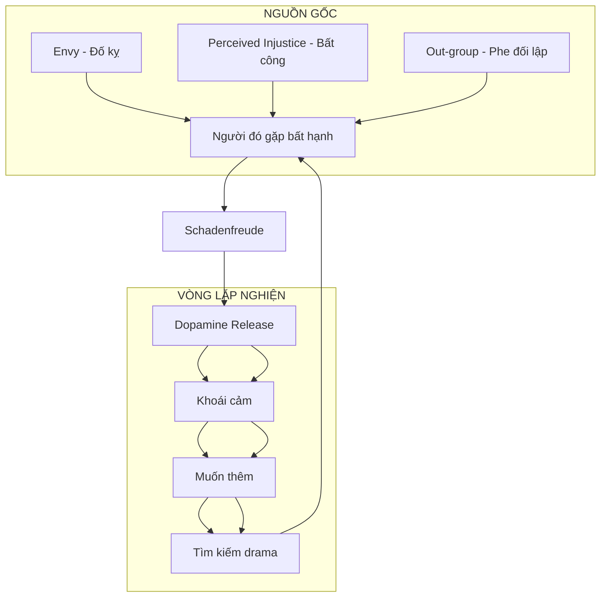
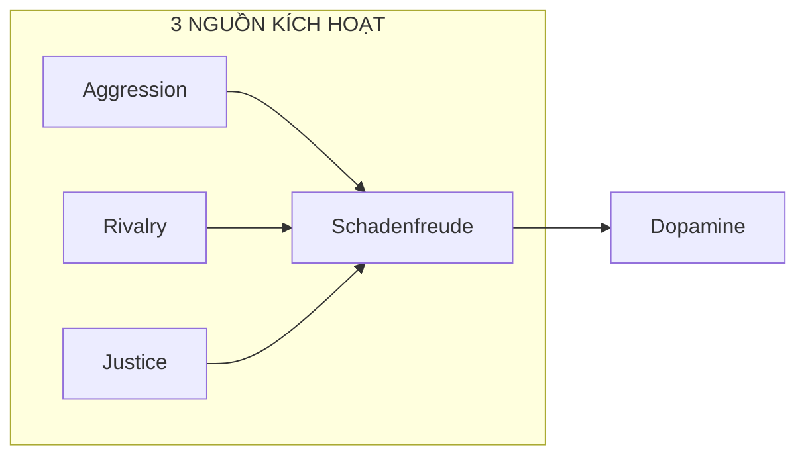
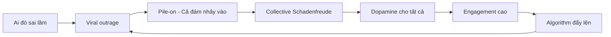
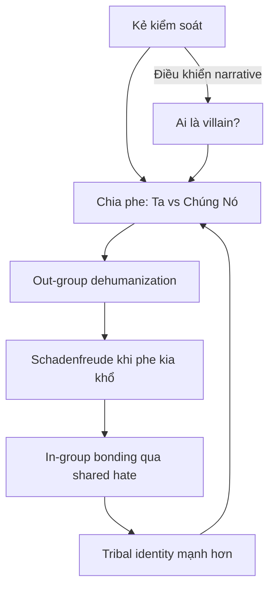
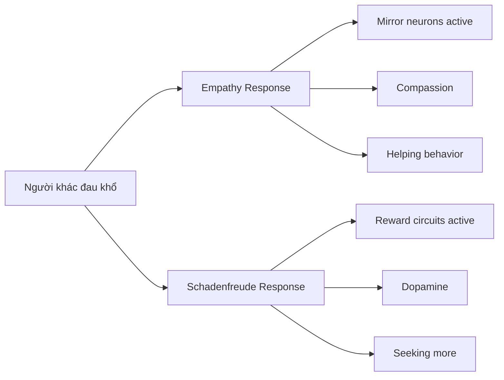

# Schadenfreude — Dopamine Phản Diện

> *"Không có gì sướng bằng thấy kẻ thù ngã ngựa."*

**Schadenfreude** (tiếng Đức: *Schaden* = thiệt hại, *Freude* = niềm vui) là cảm giác khoái lạc khi chứng kiến người khác gặp bất hạnh. Não bộ release dopamine — cùng chất hóa học khi ăn ngon, sex, hoặc thắng cược — nhưng nguồn kích thích là nỗi đau của người khác.

---

## Tổng Quan



---

## Neuroscience: Não Bộ Thưởng Khi Người Khác Đau

### Ventral Striatum & Dopamine

Nghiên cứu fMRI cho thấy khi chứng kiến "kẻ xấu" bị trừng phạt:
- **Ventral striatum** (trung tâm reward) sáng lên
- **Dopamine release** tương tự khi nhận tiền thưởng
- Càng envy trước đó → càng mạnh phản ứng

### Công thức Schadenfreude

```
Schadenfreude = Envy × Perceived Deservingness × Dehumanization
```

| Yếu tố | Giải thích |
|--------|------------|
| **Envy** | Càng ghen tị trước đó, càng sướng khi họ fail |
| **Deservingness** | "Họ đáng bị như vậy" — moral justification |
| **Dehumanization** | Không còn coi họ là người → empathy tắt |

---

## Ba Loại Schadenfreude



### 1. Aggression-based
- Ghét ai đó → sướng khi họ khổ
- Không cần lý do chính đáng
- Link với **Dark Triad** (narcissism, Machiavellianism, psychopathy)

### 2. Rivalry-based
- Đối thủ cạnh tranh thất bại
- Social hierarchy: họ xuống = bạn tương đối lên
- Phổ biến trong thể thao, business, học đường

### 3. Justice-based
- "Kẻ xấu" bị trừng phạt
- Cảm giác "công lý được thực thi"
- Dễ được xã hội chấp nhận hơn

---

## Dehumanization: Chìa Khóa Mở Cửa

> *"The scenarios that elicit schadenfreude tend to also promote dehumanization."*
> — Emory University Study

Khi não không còn coi đối tượng là "người":
- **Empathy circuits tắt** — không còn đồng cảm
- **Moral restraint giảm** — ít cảm thấy tội lỗi
- **Dopamine reward mạnh hơn** — khoái cảm thuần túy

### Cơ chế Dehumanization

| Bước | Quá trình |
|------|-----------|
| 1 | Gán nhãn: "chúng nó", "loại đó" |
| 2 | Out-group hóa: họ vs ta |
| 3 | Tước bỏ cá tính: họ đều giống nhau |
| 4 | Empathy tắt: không còn coi là người |
| 5 | Schadenfreude tự do: thưởng thức nỗi đau |

---

## Social Media: Máy Khuếch Đại Schadenfreude

### Cancel Culture = Collective Dopamine Rush



### Tại sao Social Media exploit điều này?

| Yếu tố | Cách exploit |
|--------|--------------|
| **Anonymity** | Ẩn danh → ít moral restraint |
| **Distance** | Không thấy mặt → dễ dehumanize |
| **Tribal signals** | "Ratio" ai đó = tín hiệu in-group |
| **Variable reward** | Drama mới mỗi ngày → dopamine loop |
| **Moral cover** | "Đấu tranh cho công lý" → justify khoái cảm |

### Attention Economy & Schadenfreude

| Platform muốn | Bạn nhận |
|---------------|----------|
| Engagement | Dopamine từ drama |
| Time on site | Addiction loop |
| Ad revenue | Bạn là sản phẩm |

Kết nối với [[Privacy Is The New Wealth]]: Platform biến bạn thành sản phẩm, và schadenfreude là một trong những hooks mạnh nhất.

---

## Connection: Ma Trận Chia Rẽ

> *"Họ sẽ tạo ra một sân chơi bên trong cái hộp đó. Một sân chơi đầy những cuộc chiến bất tận."*

### Divide & Conquer qua Schadenfreude



### Ai hưởng lợi?

| Bên | Lợi ích |
|-----|---------|
| **Platform** | Engagement, ad revenue |
| **Media** | Clicks, views, subscriptions |
| **Politicians** | Tribal loyalty, votes |
| **Bạn** | Chỉ có dopamine rẻ tiền |

---

## Dark Triad Connection

Schadenfreude mạnh nhất ở người có:

| Trait | Biểu hiện |
|-------|-----------|
| **Narcissism** | Người khác fail = mình superior |
| **Machiavellianism** | Lợi dụng điểm yếu người khác |
| **Psychopathy** | Thiếu empathy → khoái cảm thuần túy |

> Người có empathy cao và agreeable personality ít trải nghiệm schadenfreude hơn.

---

## Schadenfreude vs Empathy: Hai Cực



### Trade-off

| Empathy | Schadenfreude |
|---------|---------------|
| Họ đau = mình đau | Họ đau = mình sướng |
| Muốn giúp | Muốn xem thêm |
| Social bonding | Social division |
| Costly (tốn năng lượng) | Cheap reward |

---

## Thoát Khỏi Vòng Lặp

### Nhận diện

- [ ] Bạn đang enjoy drama?
- [ ] Có muốn người khác thất bại không?
- [ ] Có check tin tức về kẻ thù thường xuyên?
- [ ] Có tham gia pile-on trên mạng?

### Detox

| Bước | Hành động |
|------|-----------|
| 1 | Nhận biết: "Đây là schadenfreude" |
| 2 | Pause: Không react ngay |
| 3 | Humanize: Nhớ họ cũng là người |
| 4 | Redirect: Tìm nguồn dopamine lành mạnh |
| 5 | Curate feed: Bỏ follow drama sources |

### Câu hỏi tự vấn

> "Tôi đang vui vì điều tốt xảy ra với mình, hay vì điều xấu xảy ra với người khác?"

---

## Connection với Vault

### Psychological Framework
- [[Tâm Lý Học Jung]] — Shadow chứa những gì ta không chấp nhận
- [[Vô Thức Tập Thể]] — Tribalism là bản năng nguyên thủy
- [[Nguyên Mẫu]] — Archetype "kẻ thù" trong mọi văn hóa

### Control Systems
- [[Privacy Is The New Wealth]] — Attention economy exploit schadenfreude
- [[Ma Trận]] — Divide & conquer qua tribal conflict
- [[UBI Conditioning - The End of Work Ethic]] — Bread & circuses: drama thay cho purpose

### Mental Models
- [[Thông Minh vs Trí Tuệ]] — Trí tuệ biết khi nào nên dừng
- [[Tư Duy Lũy Thừa]] — Dopamine rẻ tiền vs đầu tư dài hạn

---

## Core Insight

> *"Dopamine từ schadenfreude là khoản vay nóng tín dụng đen của phúc đức. Lãi suất cắt cổ: sự suy kiệt empathy và ám muội đầu óc."*

Bạn đang bán cái **vốn** (khả năng đồng cảm, nhân tính) để mua cái **lãi ảo** (dopamine 5 phút). 

Đây là deal cực kỳ lỗ.

---

## Sources

- Emory University — *Schadenfreude and Dehumanization Study* (2018)
- Takahashi et al. — *Neural correlates of envy and schadenfreude*
- Cikara & Fiske — *Stereotypes and Schadenfreude* (Princeton)
- Psychology Today — *Schadenfreude and Dark Triad*
