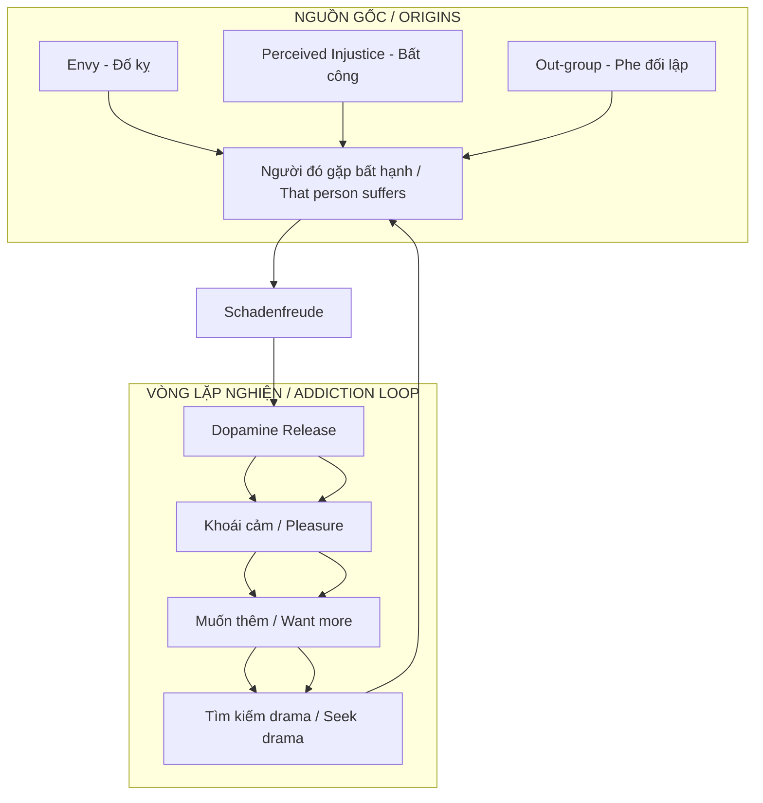
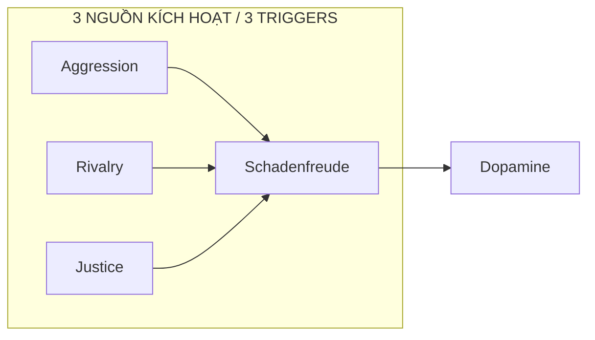
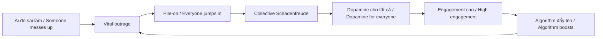
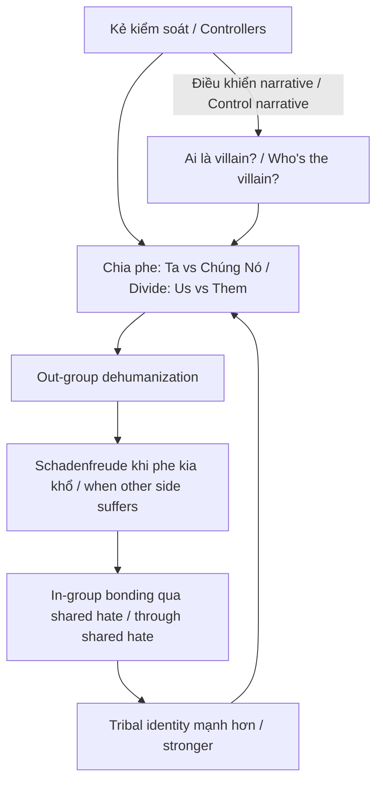
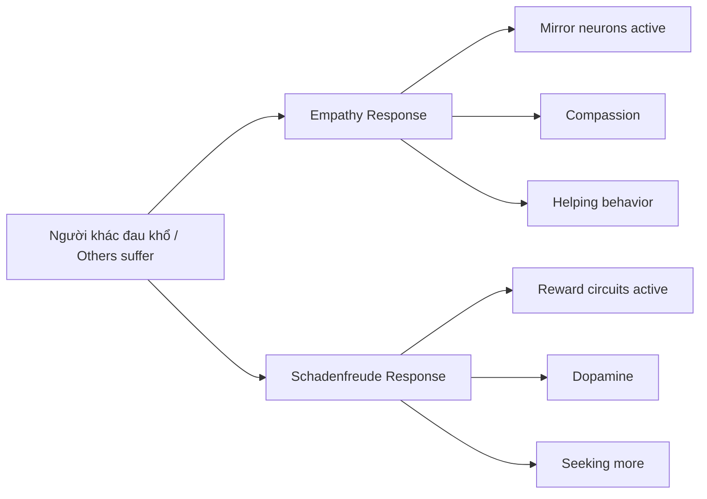

# Schadenfreude — Dopamine Phản Diện / The Dark Side of Dopamine

> *"Không có gì sướng bằng thấy kẻ thù ngã ngựa."*
> *"Nothing feels better than watching your enemy fall."*

**Schadenfreude** (tiếng Đức: *Schaden* = thiệt hại, *Freude* = niềm vui) là cảm giác khoái lạc khi chứng kiến người khác gặp bất hạnh. Não bộ release dopamine — cùng chất hóa học khi ăn ngon, sex, hoặc thắng cược — nhưng nguồn kích thích là nỗi đau của người khác.

*Schadenfreude (German: Schaden = damage, Freude = joy) is the pleasure felt when witnessing others' misfortune. The brain releases dopamine — the same chemical triggered by good food, sex, or winning a bet — but the stimulus is someone else's pain.*

---

## Tổng Quan / Overview

---

## Neuroscience: Não Bộ Thưởng Khi Người Khác Đau / The Brain Rewards Others' Pain

### Ventral Striatum & Dopamine

Nghiên cứu fMRI cho thấy khi chứng kiến "kẻ xấu" bị trừng phạt:

*fMRI research shows that when witnessing a "bad person" being punished:*

- **Ventral striatum** (trung tâm reward / reward center) sáng lên / lights up
- **Dopamine release** tương tự khi nhận tiền thưởng / similar to receiving money
- Càng envy trước đó → càng mạnh phản ứng / The more prior envy → the stronger the response

### Công thức Schadenfreude / The Schadenfreude Formula

| Yếu tố / Factor | Giải thích / Explanation |
|-----------------|--------------------------|
| **Envy** | Càng ghen tị trước đó, càng sướng khi họ fail / More prior envy = more pleasure at their failure |
| **Deservingness** | "Họ đáng bị như vậy" — moral justification / "They deserved it" — moral justification |
| **Dehumanization** | Không còn coi họ là người → empathy tắt / No longer see them as human → empathy off |

---

## Ba Loại Schadenfreude / Three Types of Schadenfreude

### 1. Aggression-based
- Ghét ai đó → sướng khi họ khổ / Hate someone → happy when they suffer
- Không cần lý do chính đáng / No valid reason needed
- Link với **Dark Triad** (narcissism, Machiavellianism, psychopathy)

### 2. Rivalry-based
- Đối thủ cạnh tranh thất bại / Competitor fails
- Social hierarchy: họ xuống = bạn tương đối lên / They go down = you relatively go up
- Phổ biến trong thể thao, business, học đường / Common in sports, business, school

### 3. Justice-based
- "Kẻ xấu" bị trừng phạt / "Bad person" gets punished
- Cảm giác "công lý được thực thi" / Feeling of "justice served"
- Dễ được xã hội chấp nhận hơn / More socially acceptable

---

## Dehumanization: Chìa Khóa Mở Cửa / The Key That Opens The Door

> *"The scenarios that elicit schadenfreude tend to also promote dehumanization."*
> — Emory University Study

Khi não không còn coi đối tượng là "người":

*When the brain no longer sees the target as "human":*

- **Empathy circuits tắt / off** — không còn đồng cảm / no more empathy
- **Moral restraint giảm / decreased** — ít cảm thấy tội lỗi / less guilt
- **Dopamine reward mạnh hơn / stronger** — khoái cảm thuần túy / pure pleasure

### Cơ chế Dehumanization / Dehumanization Mechanism

| Bước / Step | Quá trình / Process |
|-------------|---------------------|
| 1 | Gán nhãn: "chúng nó", "loại đó" / Label: "them", "that kind" |
| 2 | Out-group hóa: họ vs ta / Out-group: them vs us |
| 3 | Tước bỏ cá tính: họ đều giống nhau / Strip individuality: they're all the same |
| 4 | Empathy tắt: không còn coi là người / Empathy off: no longer seen as human |
| 5 | Schadenfreude tự do: thưởng thức nỗi đau / Schadenfreude unleashed: enjoy the pain |

---

## Social Media: Máy Khuếch Đại Schadenfreude / The Schadenfreude Amplifier

### Cancel Culture = Collective Dopamine Rush

### Tại sao Social Media exploit điều này? / Why Does Social Media Exploit This?

| Yếu tố / Factor | Cách exploit / How exploited |
|-----------------|------------------------------|
| **Anonymity** | Ẩn danh → ít moral restraint / Anonymous → less moral restraint |
| **Distance** | Không thấy mặt → dễ dehumanize / Can't see face → easier to dehumanize |
| **Tribal signals** | "Ratio" ai đó = tín hiệu in-group / "Ratio" someone = in-group signal |
| **Variable reward** | Drama mới mỗi ngày → dopamine loop / New drama daily → dopamine loop |
| **Moral cover** | "Đấu tranh cho công lý" → justify khoái cảm / "Fighting for justice" → justify pleasure |

### Attention Economy & Schadenfreude

| Platform muốn / Platform wants | Bạn nhận / You get |
|--------------------------------|---------------------|
| Engagement | Dopamine từ drama / Dopamine from drama |
| Time on site | Addiction loop |
| Ad revenue | Bạn là sản phẩm / You are the product |

Kết nối với [[Privacy Is The New Wealth]]: Platform biến bạn thành sản phẩm, và schadenfreude là một trong những hooks mạnh nhất.

*Connection to [[Privacy Is The New Wealth]]: Platforms turn you into a product, and schadenfreude is one of the strongest hooks.*

---

## Connection: Ma Trận Chia Rẽ / The Division Matrix

> *"Họ sẽ tạo ra một sân chơi bên trong cái hộp đó. Một sân chơi đầy những cuộc chiến bất tận."*
> *"They will create a playground inside that box. A playground full of endless wars."*

### Divide & Conquer qua Schadenfreude / Through Schadenfreude

### Ai hưởng lợi? / Who Benefits?

| Bên / Side | Lợi ích / Benefit |
|------------|-------------------|
| **Platform** | Engagement, ad revenue |
| **Media** | Clicks, views, subscriptions |
| **Politicians** | Tribal loyalty, votes |
| **Bạn / You** | Chỉ có dopamine rẻ tiền / Only cheap dopamine |

---

## Dark Triad Connection

Schadenfreude mạnh nhất ở người có:

*Schadenfreude is strongest in people with:*

| Trait | Biểu hiện / Manifestation |
|-------|---------------------------|
| **Narcissism** | Người khác fail = mình superior / Others fail = I'm superior |
| **Machiavellianism** | Lợi dụng điểm yếu người khác / Exploit others' weaknesses |
| **Psychopathy** | Thiếu empathy → khoái cảm thuần túy / Lack empathy → pure pleasure |

> Người có empathy cao và agreeable personality ít trải nghiệm schadenfreude hơn.
> *People with high empathy and agreeable personality experience less schadenfreude.*

---

## Schadenfreude vs Empathy: Hai Cực / Two Poles

### Trade-off

| Empathy | Schadenfreude |
|---------|---------------|
| Họ đau = mình đau / They hurt = I hurt | Họ đau = mình sướng / They hurt = I feel good |
| Muốn giúp / Want to help | Muốn xem thêm / Want to see more |
| Social bonding | Social division |
| Costly (tốn năng lượng / costs energy) | Cheap reward |

---

## Thoát Khỏi Vòng Lặp / Breaking The Loop

### Nhận diện / Recognition

- [ ] Bạn đang enjoy drama? / Are you enjoying drama?
- [ ] Có muốn người khác thất bại không? / Do you want others to fail?
- [ ] Có check tin tức về kẻ thù thường xuyên? / Do you frequently check news about enemies?
- [ ] Có tham gia pile-on trên mạng? / Do you participate in online pile-ons?

### Detox

| Bước / Step | Hành động / Action |
|-------------|-------------------|
| 1 | Nhận biết: "Đây là schadenfreude" / Recognize: "This is schadenfreude" |
| 2 | Pause: Không react ngay / Don't react immediately |
| 3 | Humanize: Nhớ họ cũng là người / Remember they're human too |
| 4 | Redirect: Tìm nguồn dopamine lành mạnh / Find healthy dopamine sources |
| 5 | Curate feed: Bỏ follow drama sources / Unfollow drama sources |

### Câu hỏi tự vấn / Self-Reflection Question

> "Tôi đang vui vì điều tốt xảy ra với mình, hay vì điều xấu xảy ra với người khác?"
> *"Am I happy because something good happened to me, or because something bad happened to someone else?"*

---

## Connection với Vault / Vault Connections

### Psychological Framework
- [[Tâm Lý Học Jung]] — Shadow chứa những gì ta không chấp nhận / Shadow contains what we don't accept
- [[Vô Thức Tập Thể]] — Tribalism là bản năng nguyên thủy / Tribalism is primal instinct
- [[Nguyên Mẫu]] — Archetype "kẻ thù" trong mọi văn hóa / "Enemy" archetype across cultures

### Control Systems
- [[Privacy Is The New Wealth]] — Attention economy exploit schadenfreude
- [[Ma Trận]] — Divide & conquer qua tribal conflict / through tribal conflict
- [[UBI Conditioning - The End of Work Ethic]] — Bread & circuses: drama thay cho purpose / drama instead of purpose

### Mental Models
- [[Thông Minh vs Trí Tuệ]] — Trí tuệ biết khi nào nên dừng / Wisdom knows when to stop
- [[Tư Duy Lũy Thừa]] — Dopamine rẻ tiền vs đầu tư dài hạn / Cheap dopamine vs long-term investment

---

## Core Insight / Insight Cốt Lõi

> *"Dopamine từ schadenfreude là khoản vay nóng tín dụng đen của phúc đức. Lãi suất cắt cổ: sự suy kiệt empathy và ám muội đầu óc."*
>
> *"Dopamine from schadenfreude is a loan shark's credit on your virtue. Exorbitant interest: the depletion of empathy and clouding of mind."*

Bạn đang bán cái **vốn** (khả năng đồng cảm, nhân tính) để mua cái **lãi ảo** (dopamine 5 phút).

*You're selling your **capital** (empathy, humanity) to buy **fake interest** (5-minute dopamine).*

Đây là deal cực kỳ lỗ. / This is an extremely bad deal.

---

## Sources

- Emory University — *Schadenfreude and Dehumanization Study* (2018)
- Takahashi et al. — *Neural correlates of envy and schadenfreude*
- Cikara & Fiske — *Stereotypes and Schadenfreude* (Princeton)
- Psychology Today — *Schadenfreude and Dark Triad*
