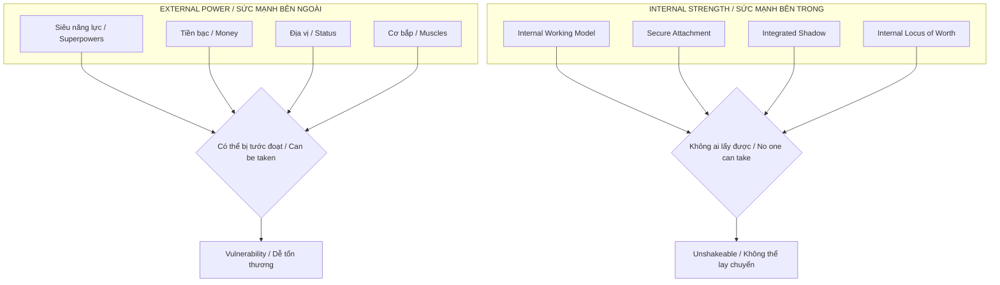
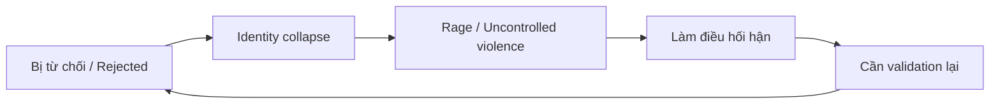
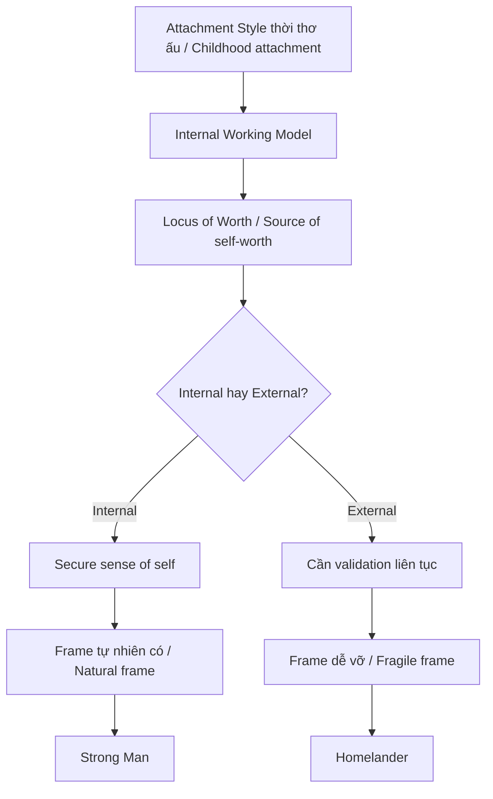
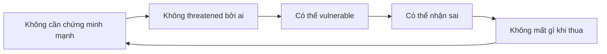

# Sức Mạnh Nội Tại — Homelander Paradox

> *"Người yếu cố tỏ ra mạnh. Người mạnh không cần tỏ ra gì cả."*
> *"The weak try to appear strong. The strong don't need to appear anything."*

**Homelander** trong *The Boys* là metaphor hoàn hảo cho nghịch lý của sức mạnh: Kẻ có sức mạnh siêu nhiên nhất lại là kẻ yếu đuối nhất về mặt tâm lý. Tiền trăm tỉ, cơ bắp, quyền lực — không cái nào tạo ra người đàn ông mạnh mẽ thực sự.

*Homelander in The Boys is the perfect metaphor for the paradox of strength: The one with the most supernatural power is the weakest psychologically. Billions of dollars, muscles, authority — none of these create a truly strong man.*

---

## Tổng Quan / Overview

---

## Homelander Case Study

### Cái Hắn Có / What He Has

| External Power | Reality |
|----------------|---------|
| Laser mắt hủy diệt thành phố | Có thể giết bất kỳ ai |
| Bay, siêu sức mạnh, bất tử | Không ai đe dọa được về mặt vật lý |
| Được hàng triệu người tôn thờ | Fame, adoration |

### Cái Hắn Thiếu / What He Lacks

| Internal Void | Biểu hiện / Manifestation |
|---------------|---------------------------|
| **Không được yêu thương vô điều kiện** | Sinh ra trong lab, không có mẹ |
| **Không có internal sense of worth** | Cần rating, cần đám đông |
| **Không integrate được Shadow** | Bùng nổ khi bị từ chối |
| **Identity gắn với external validation** | Tan nát khi bị chê |

### Điểm Yếu Chết Người / Fatal Weakness

**Homelander sợ Butcher không phải vì Butcher mạnh hơn.** Mà vì Butcher có cái Homelander không có: **internal frame không cần external validation**.

*Homelander fears Butcher not because Butcher is stronger. But because Butcher has what Homelander doesn't: an internal frame that doesn't need external validation.*

---

## Gốc Rễ: Attachment Theory / Root: Attachment Theory

### Internal Working Model

Theo Bowlby và attachment theory, từ nhỏ chúng ta hình thành **Internal Working Model** — bản đồ tâm lý về:

*According to Bowlby's attachment theory, from childhood we form an Internal Working Model — a psychological map of:*

1. **Tôi có đáng được yêu không?** / Am I worthy of love?
2. **Người khác có đáng tin không?** / Are others trustworthy?

| Attachment Style | Self-View | Other-View | Adult Behavior |
|------------------|-----------|------------|----------------|
| **Secure** | Tôi đáng được yêu / I'm worthy | Người khác đáng tin / Others are reliable | Ổn định, có frame |
| **Anxious** | Tôi không đủ / I'm not enough | Người khác không chắc / Others are uncertain | Cần validation, jealous |
| **Avoidant** | Tôi ok / I'm fine | Người khác sẽ bỏ / Others will leave | Né tránh intimacy |
| **Disorganized** | Tôi xấu / I'm bad | Người khác nguy hiểm / Others are dangerous | Homelander |

### Homelander = Disorganized Attachment

- Sinh ra trong lab, không có caregiver yêu thương
- Được "nuôi" nhưng như subject, không như con người
- Không có secure base → không có internal sense of worth
- Tất cả worth đến từ **external validation** (rating, adoration)

→ Kết quả: Kẻ mạnh nhất vũ trụ nhưng **tan nát bởi một lời từ chối**.

*Result: The most powerful being in the universe, shattered by a single rejection.*

---

## Having Power vs Being Powerful

### Phân Biệt Cốt Lõi / Core Distinction

| Having Power / Có Sức Mạnh | Being Powerful / Là Người Mạnh |
|----------------------------|-------------------------------|
| External, có thể bị lấy | Internal, không ai lấy được |
| Tiền, địa vị, cơ bắp | Internal working model |
| Dependent on circumstances | Independent of circumstances |
| Cần bảo vệ, sợ mất | Không gì để mất |
| Homelander | Butcher |

### Biểu Hiện Thực Tế / Real-World Manifestation

| Người CÓ power | Người LÀ powerful |
|----------------|-------------------|
| Cần flex để người khác biết | Không cần ai biết |
| Triggered bởi criticism | Unaffected bởi opinions |
| Cần thắng mọi argument | Biết khi nào im lặng |
| Sợ bị disrespected | Respect từ within |
| Diễn 24/7 | Chỉ đơn giản LÀ |

---

## Các Nguyên Tắc Bề Mặt vs Gốc Rễ / Surface vs Root

### "5 Điểm Strong Man" (Bề mặt)

| Principle | Vấn đề |
|-----------|--------|
| "Giữ frame" | Frame đến từ đâu nếu không có foundation? |
| "Không để đái vào tai" | Tại sao lời người khác có thể affect bạn? |
| "Tự đo lường" | Đo bằng chuẩn nào? Của ai? |
| "Sòng phẳng" | Khác gì với đơn giản là asshole? |
| "Dùng data" | Data để confirm bias hay để seek truth? |

**Vấn đề:** Đây là **symptoms** của người đã có foundation, không phải **cách tạo** foundation.

*Problem: These are symptoms of someone who already has a foundation, not how to create one.*

### Cái Gốc Thật Sự / The Real Root

---

## Connection: [[Individuation]] & Shadow Work

### Tại Sao Homelander Không Thể "Giữ Frame"?

Vì hắn **chưa integrate Shadow**.

*Because he hasn't integrated his Shadow.*

| Shadow của Homelander | Biểu hiện |
|----------------------|-----------|
| Cậu bé bị bỏ rơi | Cần validation |
| Sự sợ hãi bị từ chối | Rage khi bị chê |
| Cảm giác vô giá trị | Cần được tôn thờ |

Hắn **đè nén** Shadow thay vì **integrate** → Shadow kiểm soát hắn từ vô thức.

*He suppresses his Shadow instead of integrating it → Shadow controls him from the unconscious.*

### Individuation = Con Đường Thực Sự

Theo [[Individuation|Carl Jung]], quá trình trở nên whole:

1. **Face Shadow** — Đối mặt phần tối
2. **Dissolve Persona** — Gỡ bỏ mặt nạ
3. **Integrate Anima/Animus** — Cân bằng nam/nữ tính bên trong
4. **Encounter Self** — Gặp bản ngã toàn vẹn

Homelander stuck ở bước 0 — hắn **không dám nhìn** Shadow của mình.

*Homelander is stuck at step 0 — he doesn't dare look at his Shadow.*

---

## Locus of Worth: Gốc Của Mọi Thứ / Root of Everything

### External vs Internal

| External Locus | Internal Locus |
|----------------|----------------|
| "Tôi có giá trị VÌ người khác nói" | "Tôi có giá trị VÌ tôi tồn tại" |
| Worth = Performance | Worth = Existence |
| Cần prove constantly | Nothing to prove |
| Vulnerable to criticism | Unshakeable |
| Homelander | Stoic sage |

### Câu Hỏi Quan Trọng Nhất / The Most Important Question

> *"Nếu không ai biết bạn, không ai thấy thành tựu của bạn, không ai khen bạn — bạn vẫn biết mình có giá trị không?"*
>
> *"If no one knows you, no one sees your achievements, no one praises you — do you still know you're valuable?"*

Nếu trả lời **không** → external locus → Homelander territory.

*If the answer is no → external locus → Homelander territory.*

---

## Paradox Của Strength / The Strength Paradox

### Người Mạnh Thật Sự / The Truly Strong

**Nghịch lý:**
- Người mạnh có thể **thua** mà không mất identity
- Người yếu **phải thắng** để giữ identity
- Người mạnh có thể **xin lỗi** vì identity không gắn với being right
- Người yếu **không bao giờ sai** vì ego = identity

*Paradox:*
- *Strong people can lose without losing identity*
- *Weak people must win to maintain identity*
- *Strong people can apologize because identity isn't tied to being right*
- *Weak people are never wrong because ego = identity*

### Butcher vs Homelander

| Butcher | Homelander |
|---------|------------|
| Người thường, không siêu năng lực | Siêu nhân mạnh nhất |
| Mất vợ, mất tất cả | Có tất cả |
| Biết mình là thằng khốn | Diễn hero 24/7 |
| Không cần ai yêu | Cần tất cả yêu |
| **Homelander sợ hắn** | **Sợ Butcher** |

Tại sao? Vì Butcher có cái Homelander không thể destroy: **internal frame**.

*Why? Because Butcher has what Homelander cannot destroy: internal frame.*

---

## Practical: Xây Foundation / Building Foundation

### Không Thể "Fake It Till You Make It"

Bạn không thể **diễn** có frame. Frame là **byproduct** của foundation.

*You cannot fake having frame. Frame is a byproduct of foundation.*

### Các Bước Thực Tế / Practical Steps

| Step | Action | Mục đích |
|------|--------|----------|
| 1 | **Shadow Work** | Đối mặt phần bạn ghét nhất về mình / Face what you hate most about yourself |
| 2 | **Therapy / Journaling** | Trace attachment wounds / Tìm vết thương attachment |
| 3 | **Redefine Worth** | Worth = existence, không phải performance |
| 4 | **Fail intentionally** | Thất bại nhỏ để thấy identity không mất |
| 5 | **Stop performing** | Gỡ bỏ mặt nạ trong các relationship an toàn |

### Câu Hỏi Tự Vấn / Self-Reflection Questions

- [ ] Tôi cần người khác nghĩ gì về tôi để cảm thấy ổn?
- [ ] Lời chê nào làm tôi mất ngủ?
- [ ] Tôi đang diễn gì mà thực ra không phải tôi?
- [ ] Điều gì tôi sợ người khác biết về mình?
- [ ] Nếu mất tất cả thành tựu, tôi còn biết mình là ai không?

---

## Connection với Vault / Vault Connections

### Psychology / Tâm Lý Học
- [[Individuation]] — Quá trình trở nên whole
- [[Tâm Lý Học Jung]] — Shadow, Persona, Self
- [[Vô Thức Tập Thể]] — Archetypal patterns

### Masculinity & Relationships
- [[Tâm Lý Học Tiến Hóa Về Giới Tính]] — Walk Away Power đến từ internal frame
- [[Thông Minh vs Trí Tuệ]] — Người thông minh cần thắng, người trí tuệ biết dừng

### Control & Freedom
- [[Ma Trận]] — External validation là tool kiểm soát
- [[Privacy Is The New Wealth]] — Không cần prove = không cần expose
- [[Schadenfreude - Dopamine Phản Diện]] — Người insecure cần người khác fail

---

## Core Insight / Insight Cốt Lõi

> *"Sức mạnh siêu nhiên hay số tiền trăm tỉ ngàn tỉ không làm nên người đàn ông mạnh mẽ.*
>
> *Người đàn ông mạnh nhất không phải người có nhiều power nhất. Mà là người không cần external validation để biết mình là ai."*

> *"Supernatural power or trillions of dollars don't make a strong man.*
>
> *The strongest man isn't the one with the most power. It's the one who doesn't need external validation to know who he is."*

---

**Homelander có thể hủy diệt một thành phố.**

*Homelander can destroy a city.*

**Nhưng hắn không thể survive một lời từ chối.**

*But he cannot survive a rejection.*

**Đó là sự khác biệt giữa having power và being powerful.**

*That's the difference between having power and being powerful.*

---

## Sources

- John Bowlby — *Attachment Theory*
- Carl Jung — *The Archetypes and the Collective Unconscious*
- *The Boys* (Amazon Prime) — Homelander character analysis
- Vault: [[Individuation]], [[Tâm Lý Học Jung]]
