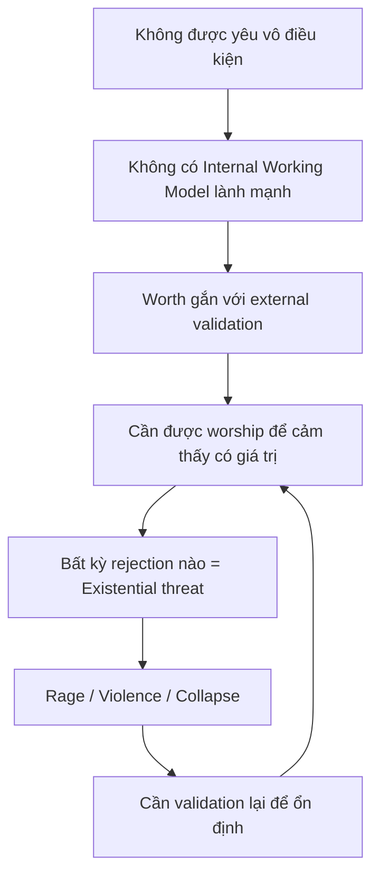

# Sức Mạnh Nội Tại — Homelander Paradox

> *"Người yếu cố tỏ ra mạnh. Người mạnh không cần tỏ ra gì cả."*
> *"The weak try to appear strong. The strong don't need to appear anything."*

Bài viết này sử dụng **Homelander** từ series *The Boys* (Amazon Prime) như một case study để phân tích **sự khác biệt giữa có sức mạnh (having power) và là người mạnh (being powerful)**. Đồng thời, chúng ta sẽ xem xét *The Boys* qua lăng kính [[Hollywood - Cây Đũa Phép Của Phù Thủy|Hollywood disclosure]] — liệu đây có phải chỉ là giải trí, hay là một lớp tiết lộ về cách hệ thống thực sự vận hành?

*This article uses Homelander from The Boys (Amazon Prime) as a case study to analyze the difference between having power and being powerful. We'll also examine The Boys through the lens of [[Hollywood - Cây Đũa Phép Của Phù Thủy|Hollywood disclosure]] — is this just entertainment, or a layer of revelation about how the system really operates?*

---

## Phần I: The Boys Như Disclosure / The Boys as Disclosure

Trước khi phân tích Homelander, cần đặt câu hỏi: **Tại sao Amazon (của Jeff Bezos) lại produce một series công khai châm biếm corporate corruption, media manipulation, và celebrity worship?**

*Before analyzing Homelander, we need to ask: Why would Amazon (owned by Jeff Bezos) produce a series that openly satirizes corporate corruption, media manipulation, and celebrity worship?*

### The Boys Expose Điều Gì? / What Does The Boys Expose?

| Trong phim / In the show | Thực tế / Reality |
|--------------------------|-------------------|
| **Vought International** | Mega-corporations kiểm soát "heroes" |
| **The Seven** | Celebrity class — được tạo ra, quản lý, và vứt bỏ |
| **Compound V** | Thứ tạo ra "siêu nhân" nhưng cũng khiến họ broken |
| **Media manipulation** | PR, narrative control, fake heroism |
| **Deep State elements** | CIA, politicians dính líu với Vought |

### Theo Logic [[Hollywood - Cây Đũa Phép Của Phù Thủy]]

Nhớ lại công thức: **Seeding → Normalization → Implementation**

*Recall the formula: Seeding → Normalization → Implementation*

| The Boys gieo mầm / Seeds planted | Có thể normalize điều gì? / What could be normalized? |
|-----------------------------------|-------------------------------------------------------|
| Superheroes thực ra là puppets | Celebrities/influencers là controlled assets |
| Corporations tạo ra "thần tượng" | Idol industry là manufacturing consent |
| Heroes có thể là psychopaths | Người nổi tiếng có thể là predators |
| Deep state controls everything | Acceptance của surveillance state |

**Câu hỏi:** Đây là cảnh báo (warning) hay lập trình (programming)?

*Question: Is this a warning or programming?*

---

## Phần II: Định Nghĩa Thuật Ngữ / Defining Terms

Trước khi đi sâu, cần define rõ các concepts:

*Before going deeper, we need to clearly define concepts:*

### 1. Internal Working Model

**Nguồn:** Attachment Theory của John Bowlby (1969)

**Định nghĩa:** Bản đồ tâm lý hình thành từ thời thơ ấu, trả lời 2 câu hỏi:

*Definition: A psychological map formed in childhood, answering 2 questions:*

1. *"Tôi có đáng được yêu không?"* / "Am I worthy of love?"
2. *"Người khác có đáng tin không?"* / "Are others trustworthy?"

**Tại sao quan trọng:** Model này quyết định cách bạn relate với bản thân và người khác suốt đời.

*Why it matters: This model determines how you relate to yourself and others for life.*

> Xem thêm / See also: [[Tâm Lý Học Jung]] — Jung's concept of "Self" parallels this

### 2. Locus of Worth (Nguồn Giá Trị)

**Định nghĩa:** Câu hỏi "Giá trị của tôi đến từ đâu?"

*Definition: The question "Where does my worth come from?"*

| Internal Locus | External Locus |
|----------------|----------------|
| "Tôi có giá trị vì tôi tồn tại" | "Tôi có giá trị vì người khác công nhận" |
| Worth = Existence | Worth = Performance + Validation |
| Stable | Unstable, dependent |

### 3. Shadow (Bóng Tối)

**Nguồn:** Carl Jung, [[Tâm Lý Học Jung]]

**Định nghĩa:** Phần tâm lý bạn từ chối, đè nén, không chấp nhận về bản thân.

*Definition: The psychological parts you reject, suppress, don't accept about yourself.*

**Quan trọng:** Shadow không biến mất khi bị đè nén. Nó kiểm soát bạn từ vô thức.

*Important: Shadow doesn't disappear when suppressed. It controls you from the unconscious.*

> Xem thêm / See also: [[Individuation]] — Quá trình integrate Shadow

### 4. Frame

**Định nghĩa:** Khả năng giữ vững reality của bạn trước áp lực bên ngoài.

*Definition: The ability to maintain your reality under external pressure.*

**Quan trọng:** Frame là **triệu chứng** (symptom) của foundation bên trong, không phải kỹ năng học được.

*Important: Frame is a symptom of internal foundation, not a learned skill.*

---

## Phần III: Homelander Case Study

### Homelander Có Gì? / What Homelander Has

| External Power | Description |
|----------------|-------------|
| Siêu năng lực | Laser, bay, bất tử, siêu sức mạnh |
| Fame | Được hàng triệu người tôn thờ |
| Fear | Không ai dám đối đầu về mặt vật lý |

### Homelander Thiếu Gì? / What Homelander Lacks

Áp dụng các concepts đã define:

*Applying the defined concepts:*

| Concept | Homelander's State |
|---------|-------------------|
| **Internal Working Model** | Broken — sinh ra trong lab, không có caregiver yêu thương |
| **Locus of Worth** | 100% External — cần rating, cần đám đông worship |
| **Shadow** | Unintegrated — cậu bé bị bỏ rơi vẫn điều khiển hắn |
| **Frame** | Không có — tan nát bởi một lời từ chối |

### Công Thức Homelander

---

## Phần IV: Having Power vs Being Powerful

### Phân Biệt Cốt Lõi / Core Distinction

| Having Power / Có Sức Mạnh | Being Powerful / Là Người Mạnh |
|----------------------------|-------------------------------|
| External: tiền, địa vị, cơ bắp | Internal: Working Model, integrated Shadow |
| Có thể bị lấy | Không ai lấy được |
| Cần bảo vệ, sợ mất | Không gì để mất |
| Dependent on circumstances | Independent of circumstances |
| **Homelander** | **Butcher** (người thường) |

### Tại Sao Homelander Sợ Butcher?

Butcher không có siêu năng lực. Nhưng Homelander **sợ** hắn.

*Butcher has no superpowers. But Homelander fears him.*

**Lý do:** Butcher có cái Homelander không thể destroy — **internal frame**.

| Butcher | Homelander |
|---------|------------|
| Mất vợ, mất tất cả | Có tất cả |
| Biết mình là thằng khốn | Diễn hero 24/7 |
| Không cần ai yêu | Cần tất cả yêu |
| Identity không gắn với winning | Identity gắn với being adored |

Homelander có thể giết Butcher bất cứ lúc nào. Nhưng hắn không thể **break** Butcher như Butcher có thể break hắn bằng vài lời.

*Homelander can kill Butcher anytime. But he cannot break Butcher the way Butcher can break him with a few words.*

---

## Phần V: Deeper Layer — The Boys Như Ma Trận Metaphor

### Vought = [[Ma Trận]] Operators

| Vought trong phim | Parallels với [[Ma Trận]] |
|-------------------|---------------------------|
| Tạo ra superheroes | [[Elite]] tạo ra celebrities |
| Kiểm soát narrative | Media control |
| Bán "hy vọng" cho quần chúng | Bread & circuses |
| Heroes là products | Entertainers là assets |
| Compound V tạo power nhưng không tạo wholeness | System tạo success nhưng không tạo fulfillment |

### The Seven = Controlled Assets

| Character | Metaphor |
|-----------|----------|
| **Homelander** | Người có power nhưng broken — easy to control |
| **Queen Maeve** | Bị ép đóng vai, mất authentic self |
| **A-Train** | Nghiện (drugs/fame), sẵn sàng làm mọi thứ để maintain |
| **The Deep** | Disgraced, seeking redemption through system |
| **Starlight** | Người muốn làm đúng nhưng bị corrupt bởi system |

**Pattern:** Tất cả đều có **external power** nhưng **internally broken** → dễ kiểm soát.

*Pattern: All have external power but are internally broken → easy to control.*

### Tại Sao Điều Này Matters?

Theo [[Hollywood - Cây Đũa Phép Của Phù Thủy]], Hollywood tiết lộ truth trong fiction.

*According to [[Hollywood - Cây Đũa Phép Của Phù Thủy]], Hollywood reveals truth in fiction.*

**The Boys có thể đang tiết lộ:**
1. Celebrities/influencers là manufactured & controlled
2. Người có power thường là người broken nhất
3. System chọn và promote những người dễ kiểm soát
4. Real threat với system là người có **internal strength** (Butcher), không phải external power

---

## Phần VI: Practical Application

### Tự Đánh Giá / Self-Assessment

| Câu hỏi | Trả lời thật |
|---------|-------------|
| Worth của tôi gắn với gì? | Performance hay existence? |
| Lời chê nào làm tôi mất ngủ? | → Đó là điểm external locus |
| Tôi đang diễn gì mà không phải tôi? | → Đó là Persona |
| Điều gì tôi sợ người khác biết về mình? | → Đó là Shadow chưa integrate |

### Con Đường Thực Sự / The Real Path

Theo [[Individuation]]:

1. **Face Shadow** — Nhìn thẳng vào điều bạn ghét nhất về mình
2. **Dissolve Persona** — Gỡ bỏ mặt nạ đang diễn
3. **Shift Locus of Worth** — Worth = existence, không phải performance
4. **Integrate** — Chấp nhận toàn bộ bản thân, không chỉ phần "tốt"

**Frame sẽ tự đến** khi foundation được xây.

*Frame will come naturally when foundation is built.*

---

## Connections / Liên Kết

### Vault Links

| Article | Connection |
|---------|------------|
| [[Individuation]] | Quá trình trở nên whole mà Homelander thiếu |
| [[Tâm Lý Học Jung]] | Source của Shadow, Persona, Self concepts |
| [[Hollywood - Cây Đũa Phép Của Phù Thủy]] | The Boys như disclosure |
| [[Ma Trận]] | Vought như Matrix operator |
| [[Schadenfreude - Dopamine Phản Diện]] | Audience enjoys Homelander's suffering |
| [[Privacy Is The New Wealth]] | Người mạnh không cần prove → không cần expose |
| [[Thông Minh vs Trí Tuệ]] | Người thông minh cần thắng, người trí tuệ biết dừng |
| [[Tâm Lý Học Tiến Hóa Về Giới Tính]] | Walk Away Power đến từ internal frame |

---

## Core Insight / Insight Cốt Lõi

> *"Sức mạnh siêu nhiên hay số tiền trăm tỉ ngàn tỉ không làm nên người đàn ông mạnh mẽ.*
>
> *Người mạnh nhất không phải người có nhiều power nhất. Mà là người không cần external validation để biết mình là ai.*
>
> *Và đó là lý do system ưu tiên tạo ra những Homelander — có power nhưng broken — thay vì những Butcher — không có power nhưng unbreakable."*

> *"Supernatural power or billions of dollars don't make a strong man.*
>
> *The strongest isn't the one with the most power. It's the one who doesn't need external validation to know who they are.*
>
> *And that's why the system prefers creating Homelanders — powerful but broken — over Butchers — powerless but unbreakable."*

---

## Sources

- **John Bowlby** — *Attachment and Loss* (1969) — Attachment Theory
- **Carl Jung** — *The Archetypes and the Collective Unconscious* — Shadow, Individuation
- **The Boys** (Amazon Prime, 2019-) — Homelander character analysis
- Vault: [[Individuation]], [[Tâm Lý Học Jung]], [[Hollywood - Cây Đũa Phép Của Phù Thủy]]
