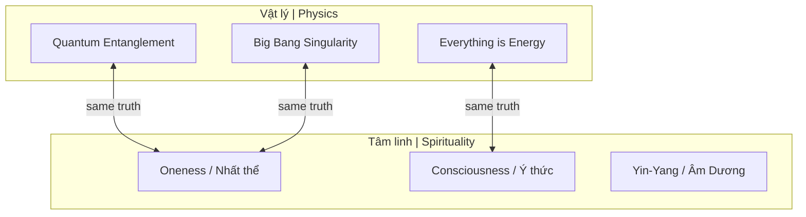
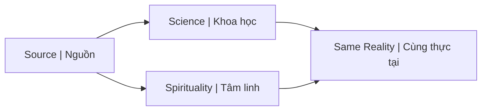

# Sự Thật Ẩn Sau Con Người Bạn (The Hidden Truth Behind You)

Bài viết kết nối vật lý lượng tử với các nguyên lý tâm linh và tôn giáo. Mọi thứ trong vũ trụ đều được kết nối với nhau ở một cấp độ cơ bản.

*This article connects quantum physics with spiritual and religious principles. Everything in the universe is connected at a fundamental level.*

---

## Tổng Quan / Overview

---

## Các Luận Điểm Cốt Lõi / Core Arguments

### 1. Thế Giới Là Tấm Gương / The World Is a Mirror

Thế giới bên ngoài phản chiếu nội tâm. Thay đổi thế giới = thay đổi chính mình.

*The external world reflects the internal. To change the world = change yourself.*

> "Như trong, như ngoài" / "As within, so without"

### 2. Vướng Víu Lượng Tử / Quantum Entanglement

Hai hạt từng tương tác sẽ **kết nối vĩnh viễn** — thay đổi một hạt ảnh hưởng tức thì đến hạt kia, bất kể khoảng cách.

*Two particles that once interacted become permanently connected — changing one instantly affects the other, regardless of distance.*

| Khoa học / Science | Tâm linh / Spiritual |
|--------------------|---------------------|
| Quantum entanglement | Kết nối vạn vật / Universal connection |
| Non-locality | Không-thời gian / Beyond space-time |
| Observer effect | Ý thức tạo thực tại / Consciousness creates reality |

### 3. Big Bang → Sự Hợp Nhất / Big Bang → Unity

Mọi thứ từng nằm trong **một điểm kỳ dị** (singularity). Do đó, vạn vật đều có sự vướng víu từ thuở ban đầu.

*Everything was once in a single singularity. Therefore, all things have entanglement from the beginning.*

> **Bạn là vũ trụ trải nghiệm chính nó.**
>
> *You are the universe experiencing itself.*

### 4. Năng Lượng và Ý Thức / Energy and Consciousness

Theo Tesla và Planck: mọi thứ đều là **năng lượng, tần số, rung động** — vận hành bởi ý thức.

*According to Tesla and Planck: everything is energy, frequency, vibration — operated by consciousness.*

| Nhà khoa học / Scientist | Quote |
|--------------------------|-------|
| **Nikola Tesla** | "If you want to find secrets of universe, think in terms of energy, frequency, vibration" |
| **Max Planck** | "I regard consciousness as fundamental, matter is derivative from consciousness" |
| **Einstein** | "Everything is energy, match the frequency of the reality you want" |

### 5. Cân Bằng Âm-Dương / Yin-Yang Balance

Khoa học và Tâm linh là **hai cách diễn giải** về cùng một Nguồn (Source).

*Science and Spirituality are two ways of describing the same Source.*

Không nên [[Chia Tách Bởi Nhị Nguyên]] — chúng bổ sung cho nhau.

*Should not separate them — they complement each other.*

### 6. Sức Mạnh Nằm Bên Trong / Power Lies Within

Ẩn dụ quả sung: **nở hoa từ bên trong**, không từ bên ngoài.

*Fig metaphor: blooms from within, not from outside.*

> Bạn không cần tìm kiếm bên ngoài. Mọi thứ bạn cần đã ở bên trong.
>
> *You don't need to search outside. Everything you need is already within.*

---

## Implications / Hệ Quả

### Cho [[Ma Trận]] / For the Matrix

Nếu ý thức tạo thực tại → [[Ma Trận]] **kiểm soát ý thức** để kiểm soát thực tại.

*If consciousness creates reality → Matrix controls consciousness to control reality.*

### Cho [[Individuation]] / For Individuation

Quá trình thức tỉnh = nhận ra bạn là **một phần của toàn thể**, không tách biệt.

*Awakening = realizing you are part of the whole, not separate.*

### Cho Healing / For Healing

Nếu mọi thứ là năng lượng → chữa lành có thể xảy ra ở **level năng lượng**, không chỉ vật lý.

*If everything is energy → healing can happen at energy level, not just physical.*

---

## Liên Kết Khái Niệm / Concept Links

| Concept | Connection |
|---------|------------|
| [[Khoa Học Xét Lại]] | Góc nhìn bổ trợ |
| [[Thuyết Trái Đất Phẳng]] | Vũ trụ không như được dạy |
| [[Chia Tách Bởi Nhị Nguyên]] | Tránh tách biệt khoa học/tâm linh |
| [[Sự Nhất Thể]] | Ultimate destination |
| [[Monad]] | Philosophy of being |

---

## Related / Liên quan

- [[Chia Tách Bởi Nhị Nguyên]] — Đừng tách biệt khoa học và tâm linh
- [[Khoa Học Xét Lại]] — Question mainstream science
- [[Monad]] — The One
- [[Sự Nhất Thể]] — Oneness
- [[Ma Trận]] — System that hides this truth
- [[Individuation]] — Personal awakening journey
