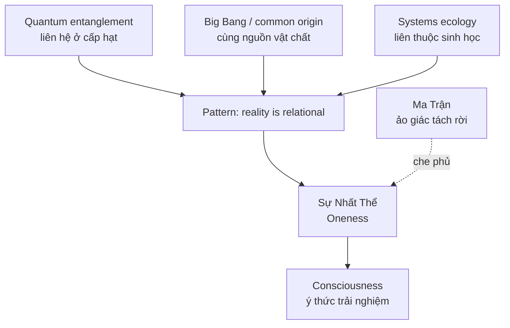
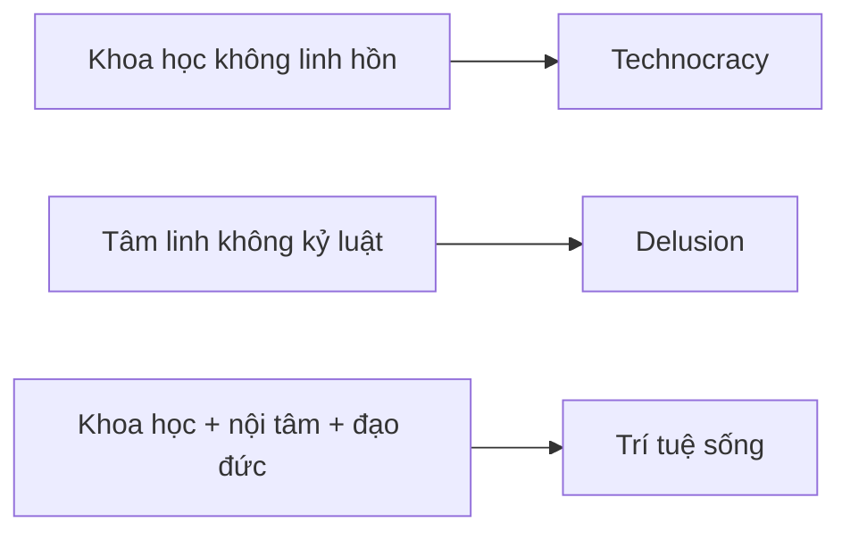

# Sự Thật Ẩn Sau Con Người Bạn (The Hidden Truth Behind You)

**Bạn không chỉ là một cá nhân tách rời đang cố sống sót trong một vũ trụ lạnh. Bạn là một điểm nhìn của toàn thể, đang học cách nhớ lại mối liên hệ đã bị che bởi thân xác, ngôn ngữ, trauma, giáo dục và [[Ma Trận]].** Khoa học hiện đại không "chứng minh" toàn bộ tâm linh; nhưng một số phát hiện của vật lý, sinh học và tâm lý học mở ra ngôn ngữ mới để đọc lại trực giác cổ xưa: thực tại liên hệ hơn ta được dạy.

*You are not merely an isolated individual surviving in a dead universe. You are a point of view through which the whole remembers itself.*

---

## Evidence Discipline / Cách Đọc

Bài này cần đọc theo tầng, vì rất dễ trượt từ khoa học sang fake certainty:

| Tầng claim | Cách đọc đúng |
|---|---|
| Fact / documentable | Vướng víu lượng tử là hiện tượng được kiểm chứng ở cấp hạt; vật chất và năng lượng có quan hệ trong vật lý hiện đại |
| Pattern / systems | Con người hành xử khác khi tin mình tách rời so với khi thấy mình liên hệ với hệ sống |
| Symbol / myth | "Nhất thể", "tấm gương", "vũ trụ tự trải nghiệm" là ngôn ngữ biểu tượng để diễn đạt trực giác liên thông |
| Speculative synthesis | Ý thức tạo thực tại, healing năng lượng, hoặc liên hệ quantum-consciousness là hypothesis/vault synthesis, không phải kết luận khoa học đã đóng |

Giữ kỷ luật này để bài không biến thành "quantum mysticism" rẻ tiền. Red pill không phải lấy vài chữ khoa học dán lên niềm tin có sẵn. Red pill là biết tầng nào đang nói tầng nào.

---

## Bản Đồ / Map

Bản đồ này không nói "quantum entanglement chứng minh mọi suy nghĩ của bạn lập tức đổi vũ trụ". Nó nói khi nhìn nhiều tầng cùng lúc, ta thấy một motif lặp lại: tách rời là perception; liên hệ là cấu trúc sâu hơn.

---

## Thế Giới Là Tấm Gương / The World Is a Mirror

"Như trong, như ngoài" không nên hiểu theo kiểu trẻ con: chỉ cần nghĩ tích cực là mọi thứ bên ngoài tự đổi. Cách đọc chín hơn: nội tâm là bộ lọc của attention, interpretation và hành động. Hai người gặp cùng một sự kiện nhưng sống trong hai thế giới khác nhau vì hệ thần kinh, ký ức và niềm tin khác nhau.

Thay đổi bên trong không thay thế hành động bên ngoài. Nó đổi chất lượng của hành động. Một người đầy sợ hãi nhìn cơ hội thành bẫy; một người đầy tham nhìn con người thành công cụ; một người tỉnh hơn nhìn cùng cảnh đó và thấy nhân-quả, giới hạn, lựa chọn.

> **Thế giới phản chiếu bạn không phải vì bạn là trung tâm vũ trụ, mà vì bạn không bao giờ gặp thực tại mà không đi qua chính mình.**

---

## Vướng Víu Lượng Tử / Quantum Entanglement

Vướng víu lượng tử cho thấy hai hệ từng tương tác có thể biểu hiện tương quan vượt trực giác cổ điển. Đó là fact ở cấp vật lý. Nhưng từ fact này nhảy thẳng sang "mọi người kết nối tâm linh theo nghĩa literal" là bước nhảy speculative.

Điểm đáng giữ không phải là lạm dụng chữ quantum. Điểm đáng giữ là cú đánh vào worldview cơ học cũ: thực tại không đơn giản là những viên bi tách rời va vào nhau. Ở tầng sâu, relation không phải phụ kiện; relation là một phần cấu trúc.

| Khoa học nói chắc hơn | Vault đọc như pattern |
|---|---|
| Entangled particles có tương quan đo được | Tách rời tuyệt đối là giả định yếu |
| Observer trong quantum measurement là vấn đề kỹ thuật phức tạp | Người quan sát không hoàn toàn ngoài cuộc |
| Vật chất có thể mô tả qua trường, năng lượng, thông tin | Thực tại không chỉ là vật cứng chết |

---

## Cùng Nguồn / Common Origin

Cosmology hiện đại nói vũ trụ quan sát được từng ở trạng thái cực kỳ nóng, đặc và nhỏ hơn hiện tại rất nhiều. Dù mô hình chi tiết còn tranh luận, motif "cùng nguồn" vẫn có sức mạnh biểu tượng lớn: cơ thể bạn, kim loại trong máy tính, calcium trong xương, carbon trong cây đều thuộc một lịch sử vật chất chung.

Từ đây, [[Sự Nhất Thể]] không cần bắt đầu bằng giáo điều. Nó có thể bắt đầu bằng một sự thật khiêm tốn: không có "tôi" nào tồn tại ngoài không khí, nước, vi sinh, mặt trời, tổ tiên, ngôn ngữ, đất, thức ăn và hàng triệu quan hệ vô hình.

*Oneness does not have to begin as dogma. It can begin as ecological honesty.*

---

## Năng Lượng, Tần Số, Ý Thức / Energy, Frequency, Consciousness

Nhiều quote nổi tiếng gán cho Tesla, Einstein hoặc Planck trên internet bị trích sai, cắt ngữ cảnh hoặc không có nguồn chắc. Vì vậy bài này không dùng quote như bằng chứng. Ta giữ tinh thần inquiry, không dùng authority cosplay.

Điều có thể nói cẩn thận hơn:

- Vật lý hiện đại mô tả vật chất qua trường, dao động, năng lượng và xác suất.
- Sinh học cho thấy cơ thể là hệ tín hiệu điện-hóa, nhịp, feedback và môi trường.
- Tâm lý học cho thấy perception bị định hình bởi attention, memory, expectation và state của hệ thần kinh.

Từ ba tầng này, vault synthesis đặt câu hỏi: nếu con người là một hệ rung động/sinh học/ý thức mở, thì "chữa lành" không thể chỉ là sửa một bộ phận. Nó phải là chỉnh lại quan hệ giữa thân, tâm, môi trường và ý nghĩa sống. Đây là cầu nối với [[Y Tế Tự Nhiên]] và [[Tâm bất Biến]].

---

## Âm Dương: Khoa Học Và Tâm Linh

Khoa học mạnh ở đo lường, kiểm chứng, loại bỏ ảo tưởng cá nhân. Tâm linh mạnh ở câu hỏi về ý nghĩa, trải nghiệm trực tiếp, đạo đức và chiều sâu nội tâm. Khi khoa học mất linh hồn, nó dễ thành công cụ kiểm soát. Khi tâm linh mất kỷ luật, nó dễ thành ảo tưởng.

Không bị [[Chia Tách Bởi Nhị Nguyên]] nghĩa là không chọn phe mù. Nó là khả năng dùng kính hiển vi khi cần kính hiển vi, dùng thiền quán khi cần nhìn mind, và không nhầm hai dụng cụ với nhau.

---

## Sức Mạnh Nằm Bên Trong / Power Within

Ẩn dụ quả sung "nở hoa từ bên trong" đáng giữ vì nó đập vào một hypnosis lớn: con người bị dạy rằng cứu rỗi luôn nằm bên ngoài. Bằng cấp, chức danh, chuyên gia, giáo chủ, idol, thuật toán, hệ thống, thị trường. Tất cả có thể hữu ích ở mức nào đó, nhưng nếu mất trục bên trong, bạn chỉ đổi chủ.

Sức mạnh bên trong không phải self-help rỗng. Nó là khả năng quay lại quan sát: mình đang tin gì, sợ gì, muốn gì, bị kích hoạt bởi ai, và đang tự kể câu chuyện nào về chính mình. Đây là cửa của [[Individuation]].

---

## Implications / Hệ Quả

### Cho [[Ma Trận]]

Nếu con người quên mình liên hệ với toàn thể, họ dễ bị điều khiển như những đơn vị tiêu thụ riêng lẻ: sợ riêng, thèm riêng, cạnh tranh riêng, mua giải pháp riêng. Ảo giác tách rời là business model.

### Cho [[Individuation]]

Thức tỉnh không phải phồng ego thành "tôi là vũ trụ" theo nghĩa narcissistic. Nó là ngược lại: ego bớt ngồi ngai vàng, và cái tôi cá nhân trở thành một cửa nhìn của tổng thể.

### Cho Healing

Healing ở tầng năng lượng là vùng cần khiêm tốn. Có trải nghiệm chủ quan, có truyền thống thực hành, có những cơ chế sinh học liên quan đến stress và nervous system. Nhưng không nên biến mọi bệnh thành "rung động thấp" rồi đổ lỗi nạn nhân. Cách đọc sạch hơn: thân-tâm-môi trường liên hệ, nên chữa lành thật phải nhìn nhiều tầng.

---

## Related / Liên quan

- [[Chia Tách Bởi Nhị Nguyên]] — Đừng tách khoa học và tâm linh thành hai nhà tù
- [[Khoa Học Xét Lại]] — Question mainstream science without faking certainty
- [[Monad]] — The One / điểm nhìn của Nhất Thể
- [[Sự Nhất Thể]] — Oneness
- [[Ma Trận]] — Hệ thống duy trì ảo giác tách rời
- [[Individuation]] — Personal awakening journey
